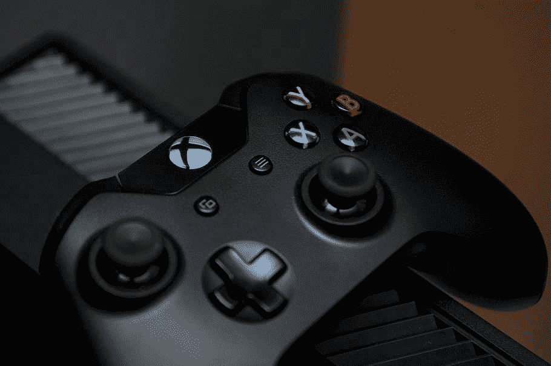
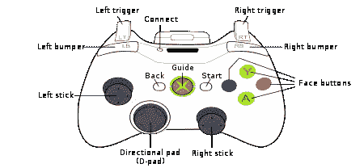
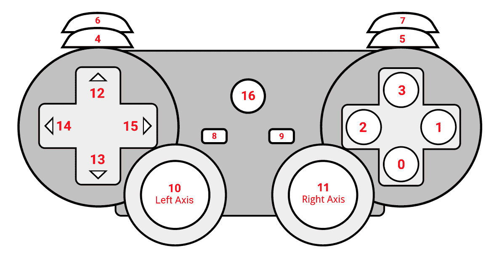

# 用游戏手柄浏览网页

> 原文：<https://medium.com/analytics-vidhya/browsing-the-web-with-a-gamepad-6016918562c5?source=collection_archive---------19----------------------->

你是游戏狂吗？如果是，您是否想过使用游戏控制器而不是鼠标和键盘来浏览 PC？让我们看看，你是如何做到的！

# **开场白**

所以我在禁闭期间感到无聊，无意中发现了一个奇怪的挑战。挑战就是在三十分钟内不碰键盘和鼠标的情况下使用我的笔记本电脑。

有一些 ***键盘快捷键*** 在一开始帮了我，像 Ctrl+Tab，Ctrl+Shift+Tab，F6，F5，F11，Ctrl + +，Ctrl + —等等。还有其他特殊的热键来帮助管理 Chrome 实例，比如 Ctrl+T 来打开一个新标签页，Ctrl+Shift+T 来打开上次关闭的 Chrome 实例等等。

# 我在浏览时遇到的问题

那么**选择**链接呢？多次点击 Tab 键让我找到了我想要的链接。但这是一项繁琐的任务。曾经有过这样的情况，我多次点击 tab 键到达页面中间，现在移动到页面顶部需要多次 Shift+Tab。

假设，你在亚马逊购物，收到了来自脸书的通知，或者你想更改 Youtube 上播放的歌曲，获得通知或浏览标签将是一项关键任务。有一次，我想从网页上给我的朋友发送一张图片，但是接触到图片，然后选择右键选项来复制图片是一项困难的任务。基本上，我在不用鼠标上网时遇到的主要问题是，使用**右键**选项和**使用 Tab 键导航**到特定链接！

# 没有鼠标导航的困难让我想到了像游戏控制器这样的替代品，以一种简单的方式在计算机中导航。



# 深入了解游戏控制器的功能



几乎所有游戏控制器都包含**6**14 轴，这些轴产生范围从-1 到 1 的**模拟值。其他**按钮**和**帽子**产生{-1，0，1}** 中的**离散值。**

对于轴，模拟值可以用来模拟鼠标指针，因为模拟值将有助于定义指针移动的程度。因此第一轴可用于指针控制，第二轴可用于控制滚动特征。这些按钮可以用来实现任何功能，如左击或右击等。

***说话便宜，给我看代码***

好的，我使用 Python 来实现这个想法，但是由 JavaScript 驱动的[游戏手柄 API](https://developer.mozilla.org/en-US/docs/Web/API/Gamepad_API) 也可以用于同样的目的。

使用的 API:[pygame](https://pypi.org/project/pygame/)， [pyautogui](https://pypi.org/project/PyAutoGUI/)

将轴映射到指针的代码

```
**for** i **in** range(axes):
axis = joystick.get_axis(i) 
xx=0 
yy=0 
**if** i==0:
 #xx and yy are variables to scale up axis value
 xx=axis*1366
 yy=axis*768 
 #movement of pointer in X and Y direction
 pyautogui.moveRel(xx/10,0,duration=1)
 pyautogui.moveRel(0,yy/10,duration=1)
```

现在，我们将第二个轴连接到滚动功能。

```
**for** i **in** range(axes):
**if** i==3:
 #horizontal scroll of 2 units in right side
 pyautogui.hscroll((2))
**elif** i==4:
 #vertical scroll of 2 units in upper direction
 pyautogui.scroll(-(2))
```

现在来看按钮，它们可以映射到用户选择的任何功能。

触发按钮可用于分配左键和右键点击。

```
**for** i **in** range(axes):
**if** i==4:
 pyautogui.click()
**elif** i==5:
 pyautogui.click(button=”right”)
```

还有其他各种各样的功能可以添加到按钮上，比如从语音输入中键入文本。一个这样的例子可以是

```
r = sr.Recognizer() 
**with** sr.Microphone() **as** source:
print(“Say something!”)
audio = r.listen(source)
**try**:
 pyautogui.write(r.recognize_sphinx(audio)) **except** sr.UnknownValueError:
 print(“Sphinx could not understand audio”)
**except** sr.RequestError **as** e:
 print(“Sphinx error; {0}”.format(e))
```



```
╔═══════════╦═══════════════════════════╦══════════════════════════╗
║  Keys     ║      Functionality        ║ Analogous Keyboard Keys  ║
╠═══════════╬═══════════════════════════╬══════════════════════════╣
║  Axis 10  ║  Movement of mouse Pointer║           None           ║
║  Axis 11  ║  Scroll Wheel Feature     ║          Up/Down         ║
║   Home    ║  Opens a new Chrome Tab   ║         Ctrl + T         ║
║   Key 8   ║   Text to Speech Query    ║           None           ║
║Key 4,Key 5║   Left and Right Click    ║           None           ║
║ Axis 6,7  ║ Swipe through Chrome Tabs ║        Ctrl + Tab        ║         ╚═══════════╩═══════════════════════════╩══════════════════════════╝
```

***有兴趣看试玩！去吧！！***

该条的执行情况

***有兴趣尝试一下吗？你可以在这里*** ***找到一个演示代码*** [***。***](https://github.com/abhi211199/gamepad_navigator)

喜欢这篇文章，通过鼓掌和写评论来表达你的爱。😀