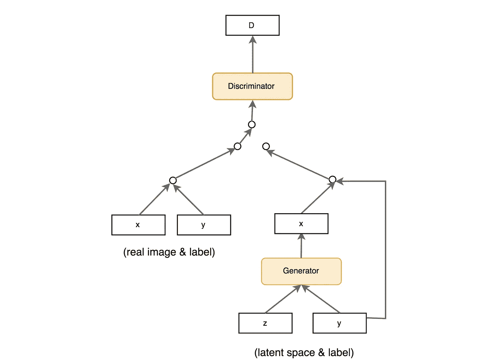
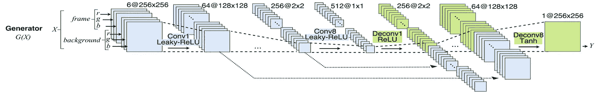
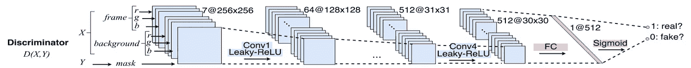
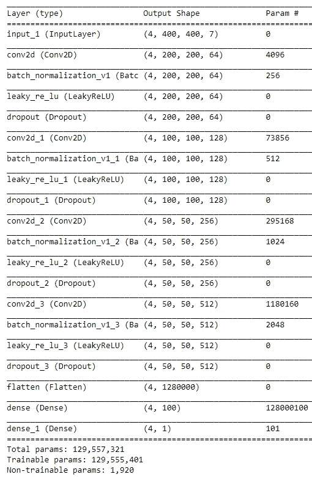
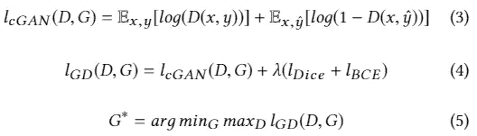
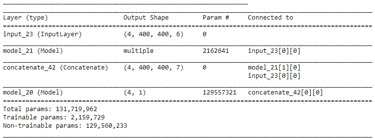
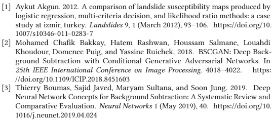

# BScGAN(用于背景扣除的条件 GAN)

> 原文：<https://medium.com/analytics-vidhya/bscgan-conditional-gan-for-background-subtraction-21fa152825db?source=collection_archive---------12----------------------->

BScGAN [2]是一种条件生成对抗网络(cGAN)，专门用于使用背景和前景图像生成分割掩模[3]，并且优于其他背景减法。图 1 显示了一个典型的 cGAN 模型的架构。我们试图使用辅助信息(如类标签或来自其他模态的数据)来控制输出，而不是仅仅将潜在空间提供给生成器模型。我们可以通过将 y(图 1)馈入发生器和鉴频器来执行调理。稍后，我们将看到 cGAN 的架构是如何针对背景减除任务进行修改的。

**图 1:**cGAN 模型的架构

# **发电机**

**图 2:** 发电机的架构

我们使用前景和背景图像作为生成器的输入，而不是使用噪声作为这个 cGAN 网络的输入。图 2 显示了发生器的示意图(带有带跳线连接的 U 形网络)。

香草 UNET 架构最初是为了生物医学图像分割。主要概念是首先通过卷积运算(扩展阶段)压缩图像，然后通过上采样(压缩阶段)对张量进行“解卷积”。上采样张量应该理想地包含语义的正确分割。此外，扩展阶段通过一系列上卷积和连接将特征和空间信息与收缩路径中的高分辨率特征相结合(以避免信息丢失)。对于发生器，输入形状被改变以适应 6 个通道，即 3 个前景通道和 3 个背景通道(图 2)。

根据 BScGAN [2]的原始架构，编码器由 8 个卷积层组成。第一层使用 7 × 7 卷积生成 64 幅特征图。第 8 层生成 512 幅 1 × 1 大小的特征地图。它们的权重是随机初始化的。此外，中间的六个卷积层是用 ResNet-101 模型的权重初始化的六个 ResNet 块。在所有的编码器层中，使用泄漏-ReLU 非线性。

解码器架构以与编码器架构相同的方式构造，并且包括 8 个去卷积(例如，转置卷积)层，但是具有相反的层排序，并且下采样层被上采样层代替。解码器层的权重被随机初始化。所有去卷积层都使用 ReLU 函数，除了第 8 个 1 × 1 去卷积层使用 Tanh 激活来产生最终的前景对象二进制蒙版。

以下代码显示了如何使用 Vanilla U-Net 作为生成器架构对网络的生成器部分进行编码(该模型的架构与原始论文中提出的架构不同)。

发电机架构

# 鉴别器

鉴别器有七个输入通道，由前景图像、背景图像和遮罩组成。前景和背景被馈送到鉴别器，该鉴别器具有地面真相掩模和交替批次中生成的掩模。

鉴别器的体系结构

同样，根据原始论文，鉴别器网络由 4 个卷积和下采样层组成(图 2)。第一层生成 64 个要素地图。此外，第 4 层生成 512 个 30 × 30 大小的特征地图。所有卷积都是 3 × 3 空间滤波器，跨距参数值为 2。它们的权重被随机初始化，并且它们使用 leakyReLU 函数作为激活。最后一个卷积层之后是一个全连接(FC)层。该 FC 层被应用于将特征映射转换成一维向量，并遵循 Sigmoid 函数。

上面的代码显示了如何对网络的鉴别器部分进行编码。鉴别器的架构如下所示。

**图 4:** 鉴别器的架构

# GAN 网络

最初，BScGAN 使用 MSE 作为内容损失(放在生成器前面)。然而，对于生成器，我们用骰子损失来代替 MSE，因为它更好地处理了类不平衡。cGAN(生成器 G 和鉴别器 D)模型中使用的对抗性损失在以下等式中定义。对抗训练期间 G (l_GD)的损失函数在等式 4 中公式化，其中值λ是 15。鉴别器试图最小化 l_GD，而发生器的任务是最大化 l_GD(等式 5)。当鉴别器和发生器的损失函数变得相对稳定时，训练停止。在测试期间，生成器用于使用输入对创建分段掩码

上面给出了 cGAN 网络的代码。模型总结如下。

# **参考文献**

