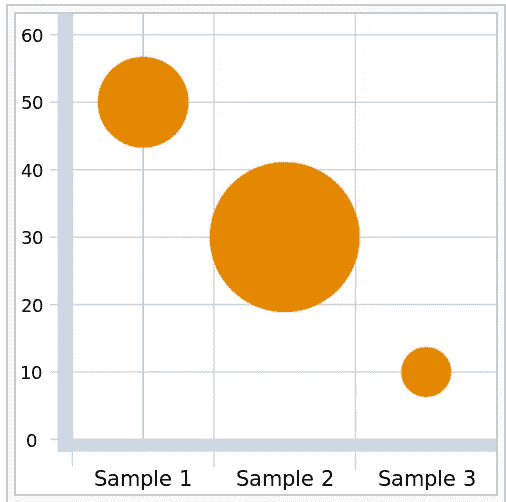
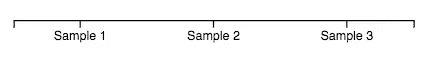
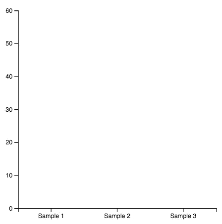
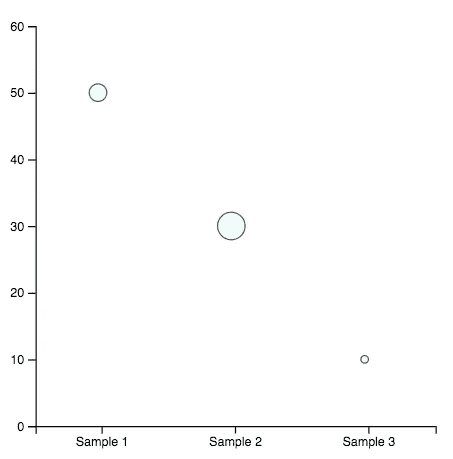

# D3js 中的气泡图

> 原文：<https://medium.com/analytics-vidhya/bubble-chart-d3js-c1dfc01bae86?source=collection_archive---------9----------------------->

用 d3 v6 理解图表


D3js 有时是人类可读的，但是在某些情况下，你会看到一个你想要创建的图表，或者只是从其他地方复制

在本帖中，我们将看到一个基本气泡图的教程，可能会对你有所帮助。老实说，这也是我自己的教程。在过去的几年里，我做了十张泡泡图，每次都是从零开始。

## 介绍

第一个问题，什么是气泡图…

> *具有可变点尺寸的散点图*

来自[https://www.data-to-viz.com/](https://www.data-to-viz.com/),这是一个令人惊奇的、奇妙的、令人敬畏的资源，如果你是从 DataViz 开始的话，你应该看一看

气泡图是什么样子的



来自维基百科，一个气泡图显示了三个变量之间的关系。

## 版本 6

为什么是 6？

此时是 d3 的最新稳定版本。对我来说，它更紧凑，你有更多的功能在它的核心，更容易加载它的模块…

我还是给你留了在不同环境下安装的链接

[https://github.com/d3/d3#installing](https://github.com/d3/d3#installing)

但是，我喜欢 npm，所以如果你和我一样…

```
$ npm i d3
```

然后，在你加载你的 js

`index.js`

```
import * as d3 from "d3";
```

## 资料组

我们将创建类似的东西，现在想象你有一个类似的数据集

```
const dataset = [
{ type: "Sample 1", value: 50, radius: 7 },
{ type: "Sample 2", value: 30, radius: 11 },
{ type: "Sample 3", value: 10, radius: 3 }
];
```

但是，首先在 d3 中有几个操作数据实用函数

d3 .计算最小值和最大值的范围

```
**d3.extent**(dataset, d => d.value) ==> *[10, 50]*
```

然而，我们的 Y 轴从 0 开始，所以我们只能使用 d3.max 函数，并以 60 结束。

```
**d3.max**(dataset, d => d.value) + 10 ==> *60*
```

此外，我们需要一个包含所有顺序值的数组，这样我们就可以使用 es6 的 map 函数或 d3 的 mapping 来提取名称。

```
dataset.**map**(d => d.type) ==> *["Sample 1", "Sample 2", "Sample 3"]*d3.map(dataset, d => d.type).keys() ==> *["Sample 1", "Sample 2", "Sample 3"]*
```

正如你所看到的，d3 有一些对数组非常有用的原生函数。

## 挽救（saving 的简写）

它总是一样的，创建一个有边距的框架，内容的宽度和高度，正确地翻译它以视觉/显示正确等等…

`index.html`

```
<div id="**viz**"></div>
```

`index.js`

```
const **margin** = { top: 40, right: 150, bottom: 60, left: 30 },
**width** = 500 - margin.left - margin.right,
**height** = 420 - margin.top - margin.bottom;const svg = d3
.select("**#viz**")
.append("**svg**")
.attr("width", width + margin.left + margin.right)
.attr("height", height + margin.top + margin.bottom)
.append("g")
.attr("transform", "translate(" + margin.left + "," + margin.top + ")");
```

## 轴和刻度

对于 X 轴，我们必须创建和缩放沿轴均匀分布的离散值

`index.js`

```
const types = dataset.map(d => d.type); ==> *["Sample 1", "Sample 2", "Sample 3"]*// Add X scaleconst x = d3
.**scaleBand**()
.domain(types)
.range([0, width]);// Add X axissvg
.append("g")
.attr("transform", "translate(0," + height + ")")
.call(d3.**axisBottom**(x));
```

此时，你可能会奇怪我为什么用 scaleBand 而不是 scaleOrdinal？？？

> `scaleOrdinal`将离散值(由数组指定)映射到离散值(也由数组指定)

和

> `In scaleBand`域被指定为一个值数组(每个带一个值),范围被自动分割成 *n 个*带，计算它们的位置和宽度。

因此，基本上使用 scaleBand，我们指定的内容更少，我们可以自动完成部分工作



我们用下面的代码创建的 X 轴和 X 刻度

为了了解规模，另一个惊人的资源是

【https://www.d3indepth.com/scales/ 号

对于 Y 轴，我们创建一个从 0 到最大值的线性标度

`index.js`

```
const yMax = d3.max(dataset, d => d.value) + 10 ==> *60*// Add Y scaleconst y = d3
.**scaleLinear**()
.domain([0, yMax])
.range([height, 0]);// Add Y axissvg.append("g").call(d3.**axisLeft**(y));
```



我们用下面的代码创建的轴和刻度

## 气泡

对于气泡，我们使用数据集中的半径值来创建圆，并用其类型和值来定位它们。通常情况下，使用自定义的半径比例和彩色气泡，事情会更复杂。

`index.js`

```
// Add bubblessvg
.append("g")
.selectAll("bubble")
.data(dataset)
.enter()
.append("circle")
.attr("**cx**", d => x(d.type) + 50)
.attr("**cy**", d => y(d.value))
.attr("**r**", d => d.radius)
.style("fill", "lightcyan")
.style("opacity", "0.7")
.attr("stroke", "black");
```

## 结果



这是我们的基本气泡图

## 密码

[](https://github.com/ackuser/d3js-bubble-chart) [## ackuser/d3js 气泡图

### 由斯塔克布里兹·⚡️.创作在 GitHub 上创建一个帐户，为 ackuser/d3js 气泡图的开发做出贡献。

github.com](https://github.com/ackuser/d3js-bubble-chart) 

## 结论

你可以玩它，改变很多东西，定制颜色，轴等。

如果你从 dataviz 和 d3js 开始，试着深入理解你做的每一件事。开始时这是一项艰巨的任务，但是有大量的资源，一步一步来，你可以做令人惊奇的事情。

感谢阅读。