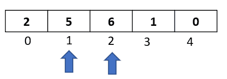
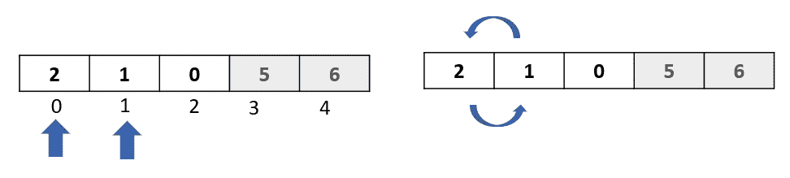
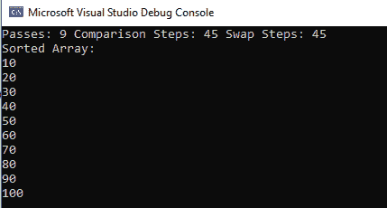

# 冒泡排序:实现和分析

> 原文：<https://medium.com/analytics-vidhya/bubble-sort-implementation-and-analysis-557998f63096?source=collection_archive---------13----------------------->

排序是编码的生命线。我们几乎总是希望事情按照自然的顺序进行。项目列表的字母顺序更容易理解。按照日期顺序查看你的银行交易历史，会更好分析。

今天，我们有高级的、易于读写的编程语言，它们通常有内置的排序功能。例如，在 C#中，你只需要调用数组。Sort()方法，C#会为您完成剩下的工作。

但是理解幕后发生的事情会让你成为一个更好的程序员。您可以分析数据排序的快慢，以及该算法对应用程序的影响。

在本文中，我们将研究最基本的排序算法——冒泡排序。它有一个有趣的名字，很容易理解。我们将首先学习什么是冒泡排序，并分析算法的复杂性。然后我们用 C#写一些代码。我们还将尝试在布尔变量的帮助下提高代码的性能。

**冒泡排序—定义**

从冒泡排序到排序算法就像学习 A-B-C-D 来理解英语一样！让我们跳到例子中，一步一步地学习算法。考虑以下数字数组:

从数组中的前两个元素开始，比较它们。如果第一个元素大于第二个元素，则交换元素。

*对比:*

*互换:*

继续下面的两个元素。像我们在上一步中所做的那样再次比较和交换:

*比较:*

因为这两个元素已经排序，所以我们不交换并继续下两个元素

*比较:*

*互换:*

最后，比较并交换最后两个元素:

*比较:*

*互换:*

我们一直工作到最后一个索引。现在我们的阵列看起来像这样:

我将在这里暂停一下，指出**这只是数组的一次传递。**我们从索引 0 到索引 4，一路上进行比较和交换，这一遍的结果是数组(6)中最高的元素在最后一个位置。换句话说，**我们将*最高的元素*冒泡到最后一个位置**——因此得名，冒泡排序。

正如您可能已经猜到的那样，算法不会就此停止，因为在第一遍之后，我们刚刚将一个元素放到了正确的位置，而我们仍然将前四个元素放在了错误的位置。

因此，我们又做了一遍，但是这次我们从索引 0 到索引 3(因为我们的最后一个元素已经被排序了)。让我们把最后一个元素灰掉，让事情更清楚。现在我们已经掌握了比较和交换是如何工作的，让我们快速浏览第二遍:

经过这一步后，我们现在已经将数组中第二高的元素放到了正确的位置:

我们已经减少了 2 遍，但是我们的数组仍然没有排序。让我们再做一遍，但这次只到索引 2，因为最后两个元素已经排序:

第三遍过后，我们的第三高元素就位了:

我们还有一关要走，因为前两个元素还没有排序。第四遍将只有一次比较和交换操作:

在这一步之后，我们有了排序后的数组:

**分析和复杂性**

让我们在这里停下来，记下一路上发生的一些事情:

1.  我们的数组中有 5 个元素，我们能够通过 4 次对数组进行排序。这意味着对于 N 个元素，冒泡排序将遍历数组 N-1 次。
2.  每经过一次，我们能够排序 1 个元素。从这个角度来看，我们可以再次得出结论，对于 N 个元素的数组，我们需要 N-1 次数组遍历。
3.  在第一步中，我们做了 4 次比较。在第二步中，我们进行了 3 次比较。在第三步中，我们做了两次比较。在第 4 阶段，我们做了 1 次比较。因此，对于 N 个元素的数组，冒泡排序将进行(N-1) + (N-2) + (N-3) +……+ 1 次比较。在我们 5 个元素的例子中，我们做了 4+3+2+1 = 10 次比较。
4.  在传递 1 中，我们进行了 3 次交换，在传递 2 中，我们进行了 2 次交换，在传递 3 中，我们进行了 1 次交换，在传递 4 中，我们再次进行了 1 次交换。这相当于 3+2+1+1 = 7 次交换。
5.  总之，为了对我们的 5 个元素的数组进行排序，我们进行了 4 次传递+ 10 次比较+ 7 次交换=或者总共 21 个步骤或操作。我们也可以说总步数接近于(5) ( *5 的平方)*。
6.  最坏的情况是我们将数组按逆序排序(降序)。在这种情况下，我们将对每个比较进行交换。在上面的例子中，如果所有的元素都是降序排列的，那么为了对数组进行排序，我们将进行 4 次遍历+ 10 次比较+ 10 次交换，总共 24 次操作。(再次几乎等于 5)

如果你遵循并理解了我们刚才做的所有 6 个步骤，那么你就解决了冒泡排序的复杂性！对于具有 N 个元素的数组，冒泡排序将需要接近 N 个步骤来对数组进行完全排序。换句话说，冒泡排序的复杂度是 O(N)或 N 的平方阶。这意味着如果我们有一个 6 个元素的数组，冒泡排序将需要接近 36 步，10 个元素 100 步，20 个元素 400 步。您可能已经猜到，当我们有大量数据时，冒泡排序并不是一个很好的选择。但是通过学习冒泡排序，通过理解为什么它会随着数据的增加而变得低效，我们可以开发出更好更快的算法！

**实现**

下面是 C#中冒泡排序的实现:

*   *sortedIndex* 被初始化为指向数组的最后一个元素。每经过一次，我们将把 sortedIndex 减 1
*   *Pass* 变量将跟踪数组的传递次数，以便对数组进行完全排序
*   *ComparisonSteps* 变量将跟踪我们进行比较的次数
*   *互换步骤*变量将跟踪我们进行的互换数量
*   而(sortedIndex > 0)表示数组的每次传递。
*   for 循环在一次传递中涵盖了所有的比较和交换

如您所见，我们在代码中初始化了一个由 10 个元素组成的数组，该数组是降序排列的。这种情况代表了最坏的情况。运行上面的代码，我们得到以下结果:

该算法经过 9 次通过、45 个比较步骤和 45 个交换步骤，总共得到 99 个步骤，接近 10。因此给出了算法复杂性的一个很好的例子。

**稍微好一点的实现**

我们之前所做的实现将进行 N-1 遍，并且沿途比较每两个元素。现在考虑一种情况，数组的一些元素已经排序。例如:

这里，最后三个元素已经排序，但是根据算法，我们仍然需要比较所有的元素。

我们可以稍微改进我们算法的实现，首先检查我们是否已经有了一个排序的数组。我们将声明一个布尔变量“sorted ”,它将被设置为 false。在 1 次传递中，如果我们进行交换，我们将变量设置为 true。现在，如果我们完成了传递，但是我们没有进行任何交换(因为所有的元素都已经排序了)，布尔变量“sorted”仍然会被设置为 false。这将表明数组已经排序，我们可以安全地结束算法。

我们修改后的代码如下:

在数组[1，0，2，5，6]上运行上述代码时，我们得到以下输出:

请注意，我们只进行了 1 次传递和 1 次交换步骤！！这都是因为我们沿途检查了数组的其余部分是否已排序，并在不再需要遍历每个元素时退出了 while 循环。

**总结**

在本文中，我们深入了解了冒泡排序算法。这是一个简单的排序算法，它比较数组中的每个元素，每次都将较大的元素向右移动。

冒泡排序的复杂度是 O(N)，我们做了深入的分析并实现了代码来理解这一点。冒泡排序可能不是对大量数据进行排序的好算法。

*特征图像:*[*https://www.pexels.com/@padrinan*](https://www.pexels.com/@padrinan)