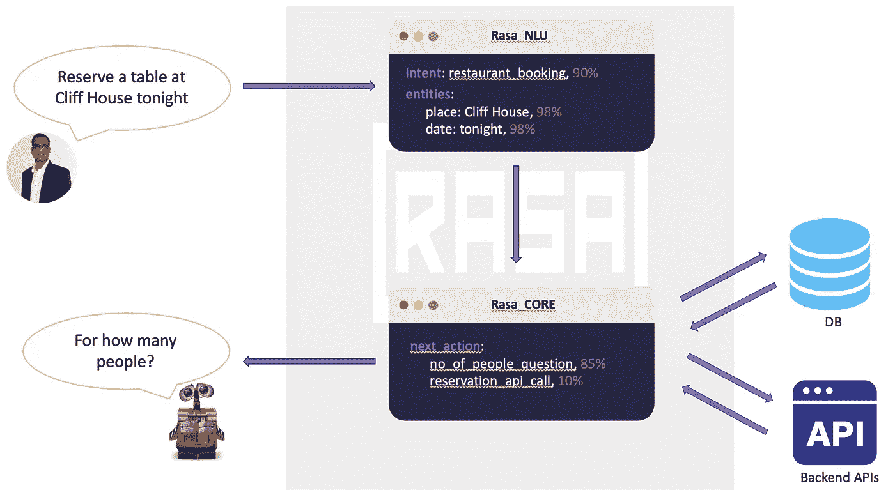
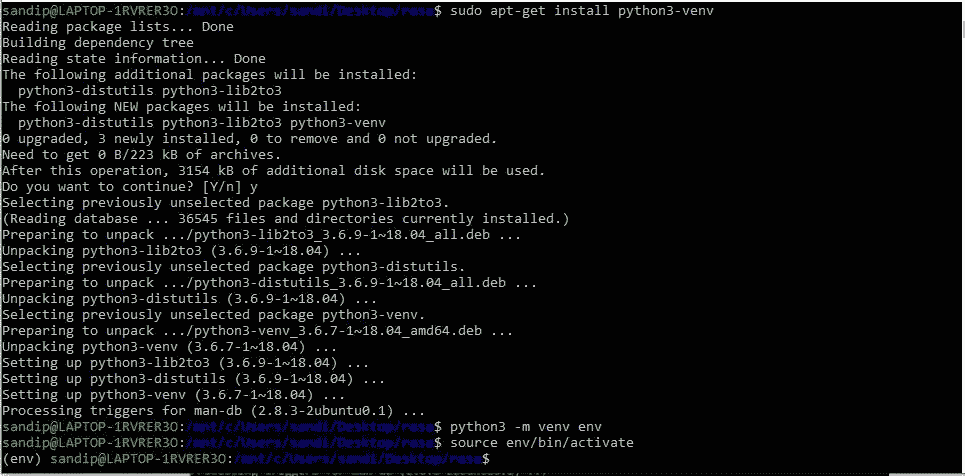
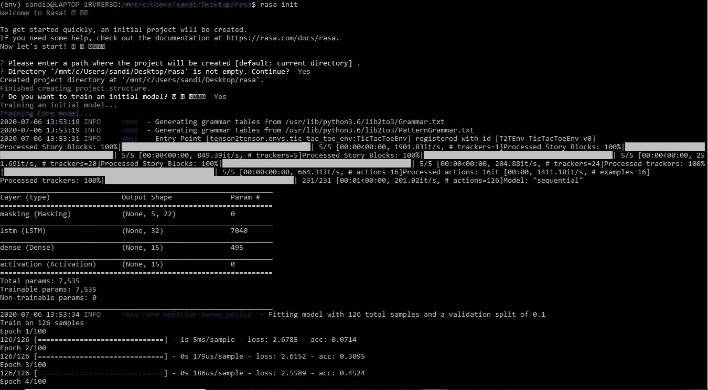
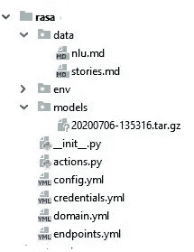
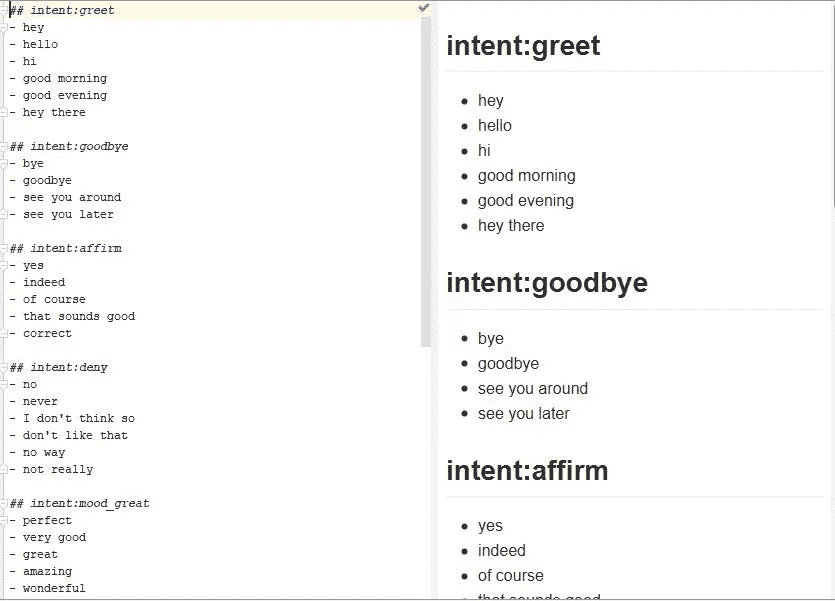
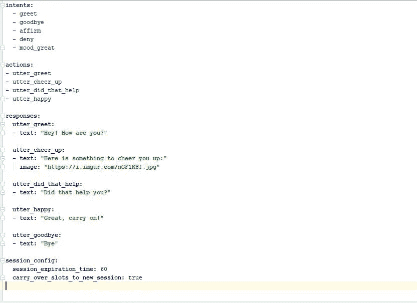
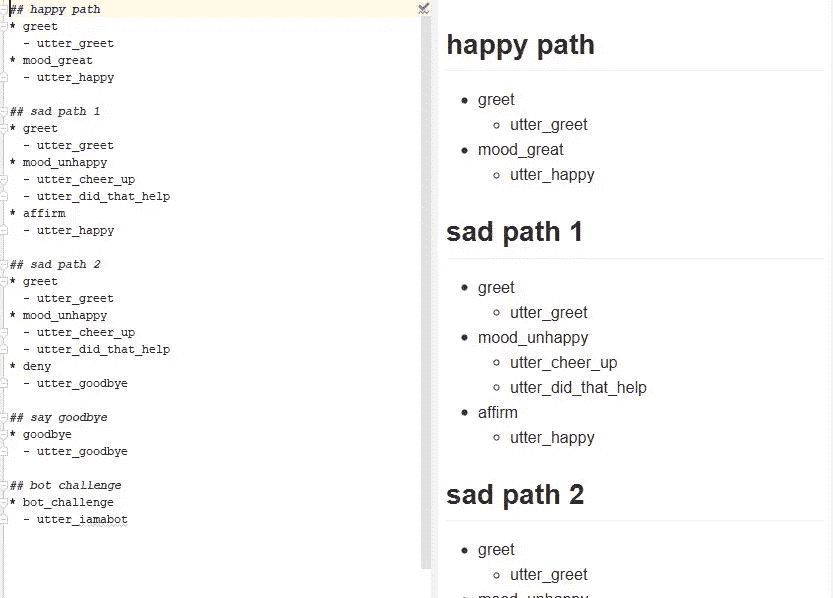
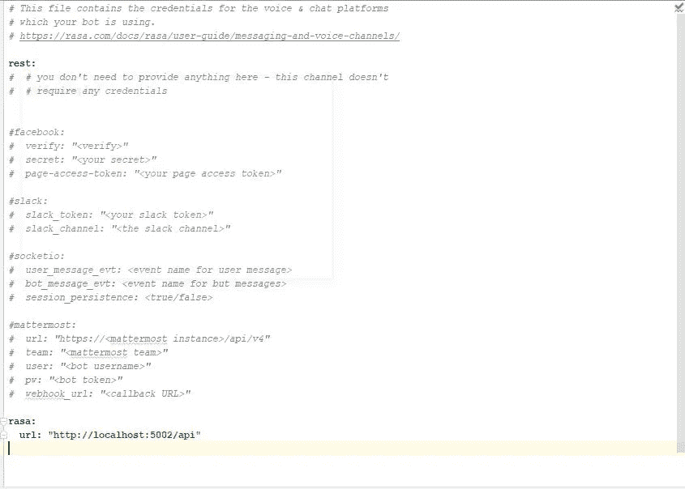
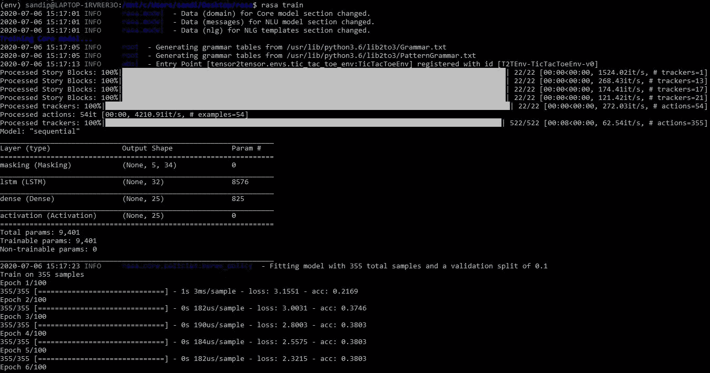
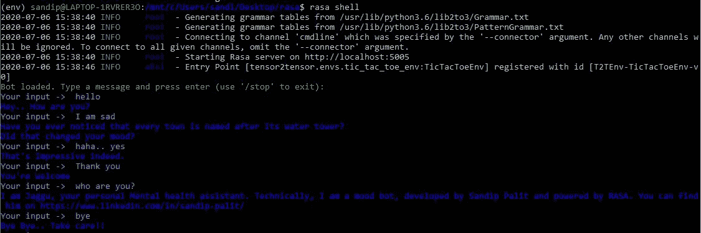

# 使用 Rasa 构建聊天机器人

> 原文：<https://medium.com/analytics-vidhya/build-a-chatbot-using-rasa-78406306aa0c?source=collection_archive---------12----------------------->

Rasa 是一个开源的机器学习框架，用于自动化基于文本和语音的对话。构建上下文助手&聊天机器人来帮助客户是很难的。Rasa 为高效、灵活、专有的上下文助手提供了必要的基础设施&工具。有了 Rasa，所有开发人员都可以创建更好的基于文本和语音的助手。

Rasa 开源包括

*   [NLU](https://rasa.com/docs/rasa/nlu/about/) :确定用户想要什么，并捕捉关键的上下文信息
*   [核心](https://rasa.com/docs/rasa/core/about/):根据对话历史选择下一个最佳回应或行动
*   [通道](https://rasa.com/docs/rasa/user-guide/messaging-and-voice-channels/)和[集成](https://rasa.com/docs/rasa/core/actions/#custom-actions/):将助手连接到用户和后端系统

[Rasa X](https://rasa.com/docs/rasa-x/) 是一个工具集，可以帮助你利用对话来改善你的助手。



# 现在，让我们深入编码。

> 好吧，如果你对编码一无所知，你仍然可以做到。要有耐心！！

## 步骤 1:创建并激活虚拟环境

在安装 Rasa 之前，强烈建议使用虚拟环境，以保持安装整洁并集中在一个地方。

```
cd <your project directory>
sudo apt-get install python3-venv
python3 -m venv env
source env/bin/activate
```



## 步骤 2:安装 Rasa

**如果你有 TensorFlow 错误**，那么使用这些来安装插件。

```
pip install --upgrade pip
pip3 install --upgrade tensorflow-addons rasa
```

要安装 Rasa，请使用以下命令。我用过 rasa 1 . 5 . 0 版。

```
pip install rasapip install rasa_nlu
pip install rasa_nlu[spacy]
python -m spacy download en_core_web_md
python -m spacy link en_core_web_md en –force
```

这需要一些时间来完成。确保没有相关性错误。

## 步骤 3:初始化 rasa

```
rasa init
```



100 个时代后，你会得到一个提示，说“你想在命令行上与训练有素的助手说话吗？”。请选择“否”。

←初始化后，目录结构应该如下所示。

## 第四步:定制你的模型

要定制你的模型，你需要修改这些文件。
nlu . MD
stories . MD
domain . yml
credentials . yml

要修改文件，您需要了解这些术语。

*   意图:用户说什么。Rasa 使用意图的概念来描述应该如何对用户消息进行分类。
*   **响应:**机器人如何回复查询。如果您希望您的机器人响应用户消息，您需要管理机器人的响应。
*   **Story:** 它是用户和人工智能助手之间的对话的表示，被转换成特定的格式，其中用户输入被表示为相应的意图，而助手的响应被表示为相应的动作名称。

# nlu.md



在 nlu.md 文件中，我们保存意图。Rasa 使用这个概念来描述用户将如何与机器人交互。你必须提到触发特定意图的不同方式。比如嘿，你好，嗨，等等。所有这些都会触发问候意图。

# domain.yml



在 domain.yml 中，我们保存响应和动作(初始模型没有任何动作)。Rasa 使用这个概念来描述机器人将如何响应用户。

# stories.md



最后在 stories.md 中，我们将描述对话的流程。你不需要提到每一条可能的路径。Rasa 将根据置信度值选择最合适的路径。

# credentials.yml



如果你想在 messenger 和 slack 等各种应用程序上部署机器人，那么就为该应用程序创建一个开发者帐户。然后将令牌保存在 credentials.yml 中。

您还可以研究其他文件，如 config.yml，并根据需要进行更改，

## 第五步:训练你的新模型

在所有的修改之后，是时候训练你的新模型了。

```
rasa train
```



## 步骤 6:测试你的机器人

让我们向新的聊天机器人问好。现在你可以将它部署在各种应用程序上，也可以在你的终端中运行。要在您的 Linux 终端上运行它，

```
rasa shell
```



# 是时候开发你的新聊天机器人了..
快乐学习！！

如有任何疑问，请通过 [LinkedIn](https://www.linkedin.com/in/sandip-palit/) 联系我