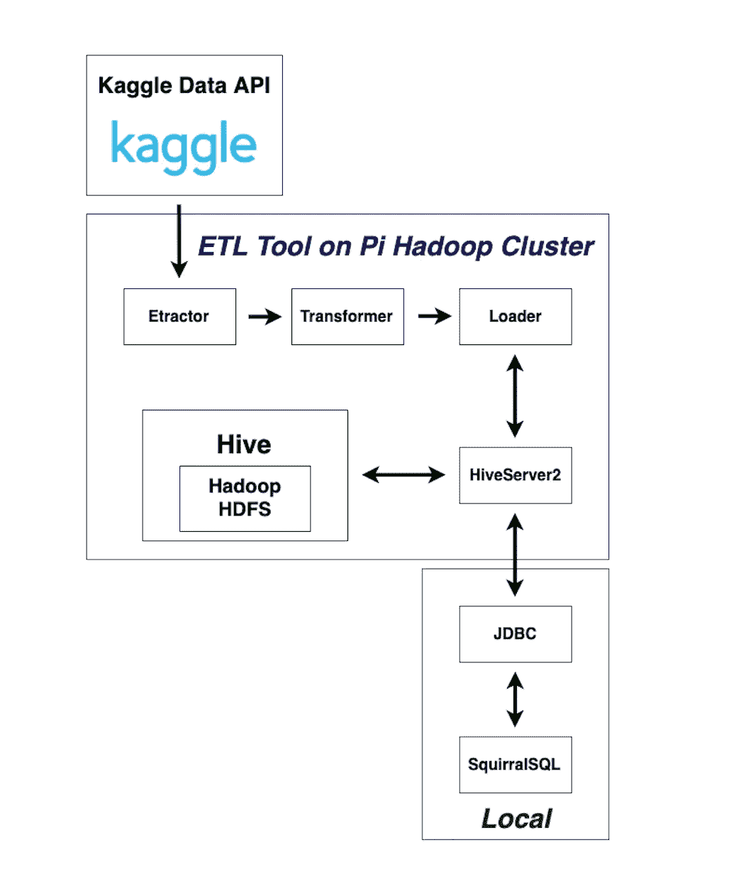
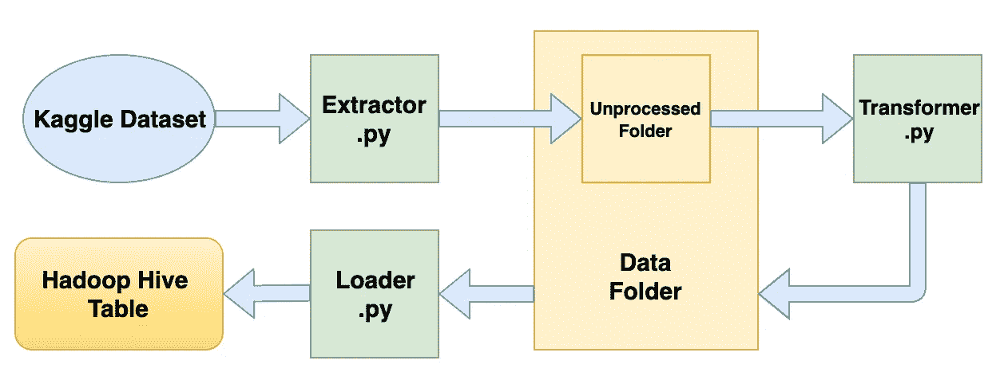
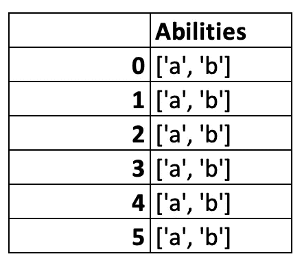

# 在我的 Raspberry Pi Hadoop 集群上用 Kaggle API 构建数据 ETL 工具

> 原文：<https://medium.com/analytics-vidhya/build-a-data-etl-tool-with-kaggle-api-on-my-raspberry-pi-hadoop-cluster-db4ed1e9883d?source=collection_archive---------19----------------------->

# 介绍

有了我和我的同学林振之前构建的树莓派 Hadoop 集群，我们决定做一些有趣的事情。在我们想到的所有选项中，最终的决定是用 Kaggle API 实现制作一个数据 ETL(提取、转换和加载)服务工具。构建这个的最大动机是，我们希望从数据工程师领域学习更多，并且拥有一个有用的工具，可以轻松地从 Kaggle 提取、转换和加载数据。考虑到我们的下一步是通过构建辅助项目进入数据科学领域，我们希望这个工具真的非常有用。

# 我们的 Kaggle 数据 ETL 工具的结构:



我们的 Kaggle 数据 ETL 工具结构图

# 1.蜂巢装置

为了 Hive SQL 的易用性和特性，我们决定在我们的 Hadoop 集群上安装 Hive。关于蜂巢的安装，我们简单的按照[这篇文章](http://nicholaspropes.com/files/documents/2016-09-05-Raspberry-Pi-Hadoop-Setup-v1-%281%29.pdf?fbclid=IwAR0bNr39ccY3ib-yJ-38MVvY7IGMHmdDAg-VkkLUjnFEBAZ3_OO-A6135fw)的说明。然而，在安装过程中，有一件事我们想提出来。

***从德比切换到马里亚布***

切换 DB 引擎有几个原因。在阅读了[这篇关于 Derby 和 MariaDB 的比较的文章](https://db-engines.com/en/system/Derby%3BMariaDB)之后，为了工具的未来发展，我们决定改用 MariaDB。我们只需按照本文中[的说明来完成翻译。](https://howtoraspberrypi.com/mariadb-raspbian-raspberry-pi/)

# 2.数据流图

这个数据流程图展示了 Kaggle 数据集如何流经我们的 ETL 工具。我将首先简要地向您介绍这个过程，进一步的细节将在下面的段落中提供。我们创建了三个 python 文件来负责处理数据集。

首先，我们将使用实现 Kaggle API 的 extractor.py 从 Kaggle 中提取数据集，并将其存储到未处理的数据文件夹中。第二，未处理的数据将由 transformer.py 处理，并转换成我们想要的格式。在这个阶段之后，处理过的数据将被存储在数据文件夹中。最后，我们将使用 loader.py 将处理后的数据作为表加载到 hadoop 集群中。



# 3.带 Kaggle API 的提取器

***Kaggle API***

在构建提取器之前，我们首先按照 [Kaggle 官方 Githu](https://github.com/Kaggle/kaggle-api) b 的指示实现 Kaggle API。

***提取器***

对于提取器，我们实现了 Kaggle API 并构建了这个命令行界面，人们可以简单地输入 Kaggle 数据集名称并获得所需的数据集。

```
import click
import kaggle
from models.Kaggle_driver import Kaggle_Api@click.command()
@click.option("--name", prompt="Kaggle Dataset Name", help="Kaggle dataset name.")
@click.option("--dir", default="../data/unprocessed", help="The specify the storage directory.")
def fetch_dataset(name, dir):
    *"""Fetch kaggle data to specific directory"""* try:
        api = Kaggle_Api()
        api.download_dataset(name, dir)
    except:
        print("An Error occurred! Please check dataset name and exist of the directory that you want to store") if __name__ == '__main__':
    fetch_dataset()
```

# 4.变压器

对于转换器，我们有数百种方法来设计模型，将脏数据集转换为干净的数据集，可以轻松地放入 Hadoop 集群，并在未来轻松进行分析。我们仍然决定将它构建成一个命令行界面。对于启动程序，我们只是构建了一个函数，可以检查每一列的值，并用“-”替换“，”号。我将在稍后的加载器部分解释为什么我们决定从转换器的这个特定函数开始。

```
import pandas as pd
import click @click.command()
@click.option("--name", prompt="CSV Name", help="Type Your CSV Name.")
@click.option("--dir", default="../data", help="The specify the storage directory.")
def CommaTransform (name, dir):
    df = pd.read_csv(f"{dir}/unprocessed/{name}")
    Col_list = df.columns
    for col in Col_list:
        df[col] = df[col].astype(str)
        df[col] = df[col].replace({',': '-'}, regex=True)

    df.to_csv(f"{dir}/{name}", index=None) if __name__ == '__main__':
    CommaTransform()
```

# 5.装货设备

最后，我们构建了这个加载器命令行接口，让用户可以轻松地将处理后的数据集作为 Hive 表上传到 Hadoop 集群中。用户只需要输入表名(“Hive 表名”)、CSV 文件名(“数据集名”)和 CSV 目录(“CSV 文件路径”)的值，加载器就可以完成这项工作。在整个过程中，我们遇到了一些困难，我们想在这里提出来，并解释我们实施的解决方案。

**熊猫和蜂巢的数据类型的不同命名系统**

当我们试图将数据集作为 Hive 表上传到 Hadoop 时，我们意识到了这个命名问题。我们解决这个问题的方法是创建一个 json 文件，用字典数据结构将 pandas 和 Hive 之间的对应名称配对，并使用下面显示的***pandas _ to _ Hive _ dtype _ converter***函数来完成任务。

```
{
    "object" : "STRING",
    "int64" : "BIGINT",
    "float64" : "DOUBLE",
    "bool": "BOOLEAN",
    "datetime64" : "DATE",
    "timedelta[ns]" : "STRING",
    "category" : "STRING"
}
```

**创建 Hive 表时用“，”分隔列的混乱**

因为我们使用的 Hive sql 命令行，当我们试图创建一个表时，Hive 系统会生成列，并在 CSV 文件中用“，”分隔每一列。但是，如果在一个单独的列中有包含" "的值，这个简单的 Hive sql 命令行可能会导致严重的问题。hive 系统会错误地将这些值视为单独的列，而它们应该放在 Hive 表的同一列中。我们在变形金刚部分解决了这个问题，我相信你已经看过了。



图片显示了创建配置单元表时可能会引起混淆的列类型

```
import json
import click
import os
import pandas as pdfrom preprocess.get_csv_summary import Csv_summerizer
from pyhive import hivedef get_config():
    if os.environ['HOME'] == '/home/pi':
        # read config json file
        with open('conf/config_prod.json', 'r') as myfile:
            data = myfile.read()
    else:
        # read config json file
        with open('conf/config_dev.json', 'r') as myfile:
            data = myfile.read()

    return json.loads(data)def pandas_to_hive_dtype_converter(pandas_dtype):
    *""" Convert pandas datatype to hive sql datatype """* with open('conf/pd_to_hive_dtype_map.json', 'r') as myfile:
        dtype_map = myfile.read() converter = json.loads(dtype_map) return converter[pandas_dtype]@click.command()
@click.option("--table_name", prompt="Hive table name", help="Specify the destination Hive table that you want to import csv")
@click.option("--csv_name", prompt="Csv name", help="The specify the storage directory.")
@click.option("--csv_dir", default="Hive_ETL/data/", help="The CSV file source directory.")
def load_csv_to_hive(table_name, csv_name, csv_dir):
    config = get_config() '''' 
        convert csv information to hive sql syntax
    '''
    # get csv summary to form sql command
    csv_info = Csv_summerizer(f"{config['data_folder']}{csv_name}")
    name_dtype_dic = csv_info.get_columns_datatype() hive_table_column_type_query = ''
    for column_name, dtype in name_dtype_dic.items():
        hive_table_column_type_query = hive_table_column_type_query + '`' + column_name + '`' + ' ' + pandas_to_hive_dtype_converter(dtype) + ', ' hive_table_column_type_query = hive_table_column_type_query[:-2] #*TODO: change way to fix first row (column name) import to hive problem* csv_df = pd.read_csv(f"../data/{csv_name}")
    csv_df.to_csv(f"../data/{csv_name}", header=False, index=False) ''' 
        connect to hive with pyhive
    '''
    conn = hive.Connection(host=config['host_name'], 
                            port=config['port'], username=config['user'], 
                            password=config['password'], 
                            database=config['database'],
                            auth='CUSTOM')
    cur = conn.cursor()
    cur.execute(f"CREATE TABLE IF NOT EXISTS {table_name} ({hive_table_column_type_query}) row format delimited fields terminated by ','")
    cur.execute(f"LOAD DATA LOCAL INPATH '{csv_dir}{csv_name}' OVERWRITE INTO TABLE {table_name}")
    print('data loaded')
    cur.execute(f"select * from {table_name}")
    result = cur.fetchall()
    print(result) if __name__ == '__main__':
    load_csv_to_hive()
```

# 6.演示视频

我们使用 SQuirrel SQL 来管理我们的 Hive 数据库。下面是从提取数据到加载数据为 Hive 表的整个过程的视频演示。

Kaggle ETL 工具视频演示

# 结论

最终，我们成功地构建了 Kaggle 数据 ETL 工具的第一个版本。这个过程非常具有挑战性；然而，我们确实从学习这个新东西中获得了很多乐趣，并使它成为一个有用的工具。然而，我们对这个工具有更多的期待，并将在未来继续改进它。希望你们喜欢阅读这篇文章，并获得一些见解！