# 使用 Weka 在几分钟内建立一个决策树(不需要编码！)

> 原文：<https://medium.com/analytics-vidhya/build-a-decision-tree-in-minutes-using-weka-no-coding-required-d884e72e0c16?source=collection_archive---------16----------------------->

*   了解如何使用 Weka 构建决策树模型
*   本教程非常适合机器学习和决策树的新手，以及那些对编码不熟悉的人

# 介绍

> 障碍越大，克服它就越光荣
> 
> *——莫里哀*

对于来自非技术背景的人来说，机器学习可能会令人生畏。所有的机器学习工作似乎都需要对 Python(或 R)有健康的理解。

那么非程序员如何获得编码经验呢？这不是小菜一碟！

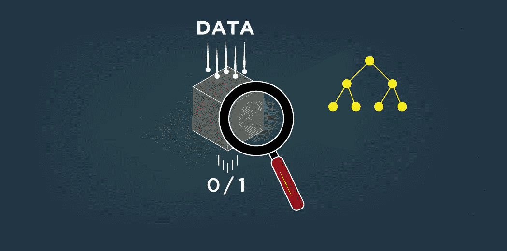

这里有一个好消息——有[大量的工具让我们无需编码就能执行机器学习任务。您可以在一个漂亮的图形界面中轻松地从头开始构建像决策树这样的算法。那不是梦吗？这些工具，如 Weka，主要帮助我们处理两件事:](https://www.analyticsvidhya.com/blog/2018/05/19-data-science-tools-for-people-dont-understand-coding/?utm_source=blog&utm_medium=decision-tree-weka-no-coding)

*   快速建立一个机器学习模型，比如决策树，并了解算法的执行情况。稍后可以对其进行修改和构建
*   这是向客户/你的领导团队展示你在做什么的理想方式

本文将向您展示在没有任何编程知识的情况下，如何在 Weka 中使用决策树解决分类和回归问题！

*但是如果你热衷于接触编程和机器学习，我建议你参加以下精心策划的课程:*

# 目录

*   机器学习中的分类与回归
*   理解决策树
*   探索 Weka 中的数据集
*   Weka 中决策树的分类
*   Weka 中的决策树参数
*   在 Weka 中可视化决策树
*   在 Weka 中使用决策树进行回归

# 机器学习中的分类与回归

我先快速总结一下在[机器学习](https://courses.analyticsvidhya.com/courses/applied-machine-learning-beginner-to-professional)的背景下什么是分类和回归。在深入研究决策树之前，了解这些概念非常重要。

一个**分类** **问题**是关于教你的机器学习模型如何将一个数据值归类到多个类中的一个。它通过学习每一类的特征来做到这一点。例如，为了预测图像是猫还是狗，模型根据训练数据学习狗和猫的特征。

一个**回归** **问题**是关于教你的机器学习模型如何预测一个连续量的未来值。它通过学习过去受不同变量影响的数量模式来做到这一点。例如，试图预测公司未来股价的模型就是一个回归问题。

你可以在我们的 [DataHack 平台](http://datahack.analyticsvidhya.com/?utm_source=blog&utm_medium=decision-tree-weka-no-coding)上找到大量的这两个问题。

现在，让我们学习一种解决这两个问题的算法——决策树！

# 理解决策树

**决策树**也被称为**分类和回归树(CART)** 它们通过学习导致决策的 if/else 问题的答案来工作。这些问题形成了树状结构，因而得名。

例如，假设我们想预测一个人是否会点餐。为此，我们可以设想以下决策树:

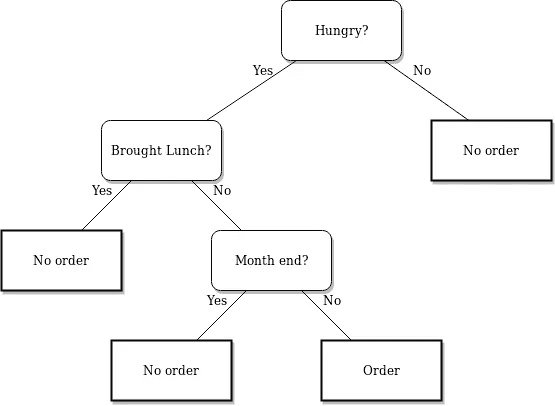

树中的每个节点代表一个从数据集中存在的要素派生的问题。基于这些问题对数据集进行分割，直到达到树的最大深度。最后一个节点不提问，但表示该值属于哪个类。

> 决策树中最顶端的节点称为**根节点**
> 
> *最底层的节点称为* ***叶节点***
> 
> 被分成子节点的节点被称为 ***父节点。*** 子节点称为 ***子节点***

如果您想详细了解决策树，我建议您浏览以下资源:

*   [决策树入门(免费课程)](https://courses.analyticsvidhya.com/courses/getting-started-with-decision-trees?utm_source=blog&utm_medium=decision-tree-weka-no-coding)
*   [基于树的算法:从头开始的完整教程](https://www.analyticsvidhya.com/blog/2016/04/tree-based-algorithms-complete-tutorial-scratch-in-python/?utm_source=blog&utm_medium=decision-tree-weka-no-coding)

# 什么是 Weka？为什么要用 Weka 进行机器学习？

> ***“Weka****是一款免费开源软件，内置了一系列机器学习算法，您可以通过图形用户界面访问！”*

**WEKA** 代表**怀卡托知识分析环境**，由新西兰怀卡托大学开发。

Weka 有多个内置函数，用于实现从线性回归到神经网络的广泛的机器学习算法。这使您只需点击一个按钮，就可以在数据集上部署最复杂的算法！不仅如此，Weka 对访问 Python 和 R 的一些最常见的机器学习库算法给予了支持！

使用 Weka，您可以对数据进行预处理、分类、聚类，甚至可视化数据！这可以在不同格式的数据文件上实现，比如 ARFF、CSV、C4.5 和 JSON。Weka 甚至允许您向数据集添加过滤器，通过过滤器您可以规范化数据、标准化数据、在名义值和数值之间交换特性等等！

我可以继续讲述 Weka 的神奇之处，但是就本文的范围而言，让我们通过创建一个决策树来尝试探索 Weka。现在开始从他们的官方网站下载 Weka 吧！

# 探索 Weka 中的数据集

我将从 [UCI 机器学习库](https://archive.ics.uci.edu/ml/datasets/Breast+Cancer+Wisconsin+(Diagnostic))获取乳腺癌数据集。我建议你在前进之前阅读一下这个问题。

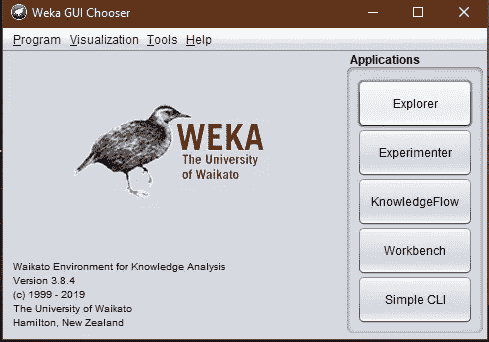

让我们首先在 Weka 中加载数据集。为此，请遵循以下步骤:

1.  打开 Weka GUI
2.  选择**【探索者】**选项。
3.  选择**“打开文件”**并选择您的数据集。

您的 Weka 窗口现在应该如下所示:

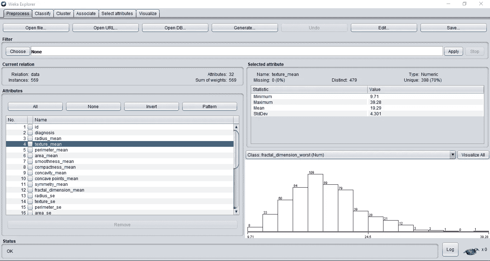

您可以在左侧查看数据集中的所有要素。Weka 会自动为您的要素创建地块，您在浏览要素时会注意到这一点。

如果您点击**“全部可视化”**按钮，您甚至可以一起查看所有图。

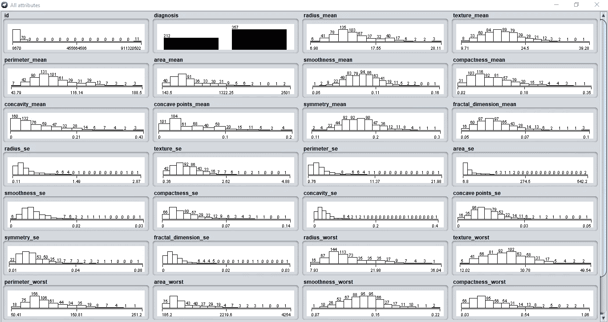

现在让我们训练我们的分类模型！

# Weka 中决策树的分类

在 Weka 中实现决策树非常简单。只需完成以下步骤:

1.  点击顶部的**“分类”**标签
2.  点击**“选择”**按钮
3.  从下拉列表中选择**“trees”**，这将打开所有的树算法
4.  最后，选择**决策树**

> ***“约简误差剪枝树(RepTree)*** *是一个快速决策树学习器，它使用* ***信息增益*** *作为分裂准则来构建决策/回归树，并使用约简误差剪枝算法进行剪枝。”*

你可以在这篇[研究论文](https://www.researchgate.net/publication/294086112_A_Reduced_Error_Pruning_Technique_for_Improving_Accuracy_of_Decision_Tree_Learning)中了解减少错误修剪技术。

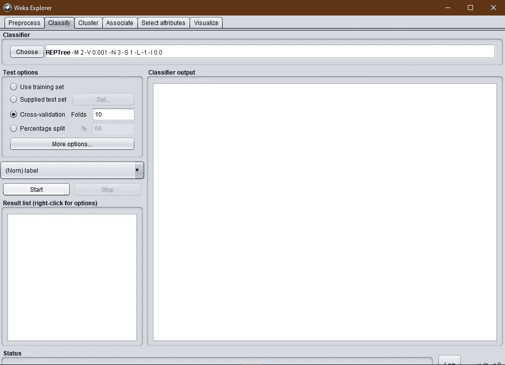

> “决策树根据所有可用变量拆分节点，然后选择导致最相似子节点的拆分。”
> 
> [信息增益](https://www.analyticsvidhya.com/blog/2016/04/tree-based-algorithms-complete-tutorial-scratch-in-python/#three?utm_source=blog&utm_medium=decision-tree-weka-no-coding)用于计算样本在分割时的同质性。

您可以从**“开始”**按钮正上方的下拉菜单中选择您的目标功能。如果不这样做，WEKA 会自动选择最后一个特征作为目标。

**"Percentage split"** 指定您希望保留多少数据用于训练分类器。其余的数据在测试阶段用于计算模型的准确性。

**“交叉验证折叠”**指定您希望分类器迭代训练数据的次数。但是请记住，每次训练数据都是从总数据中随机选择的。然而，训练数据的大小将保持与**“百分比分割”**指定的相同。

> *您使用的交叉验证折叠数越多，您的模型就越好。这使得模型在随机选择的数据上训练，这使得它更健壮。*

最后，按下**“开始”**按钮，分级机就可以大显身手了！

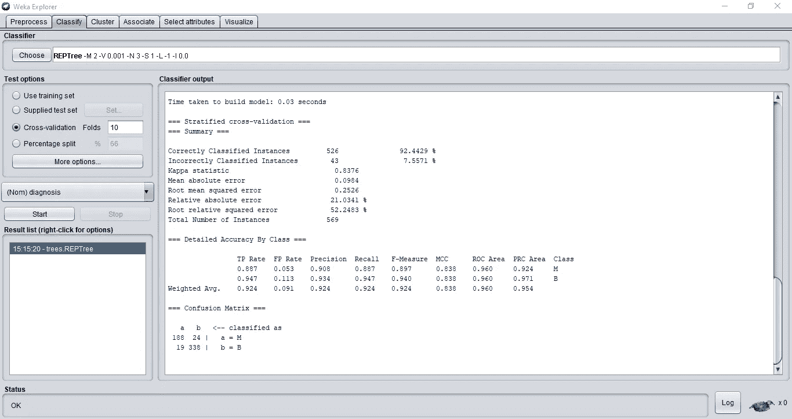

我们的分类器获得了 92.4%的准确率。Weka 甚至为您打印了**混淆矩阵**，其中给出了不同的指标。你可以在这里详细学习关于混淆矩阵和其他指标的[。](https://www.analyticsvidhya.com/blog/2019/08/11-important-model-evaluation-error-metrics/?utm_source=blog&utm_medium=decision-tree-weka-no-coding)

# Weka 中的决策树参数

决策树有很多参数。我们可以调整这些来提高我们模型的整体性能。这就是决策树的工作知识真正发挥重要作用的地方。

您可以通过点击顶部的决策树算法来访问这些参数:

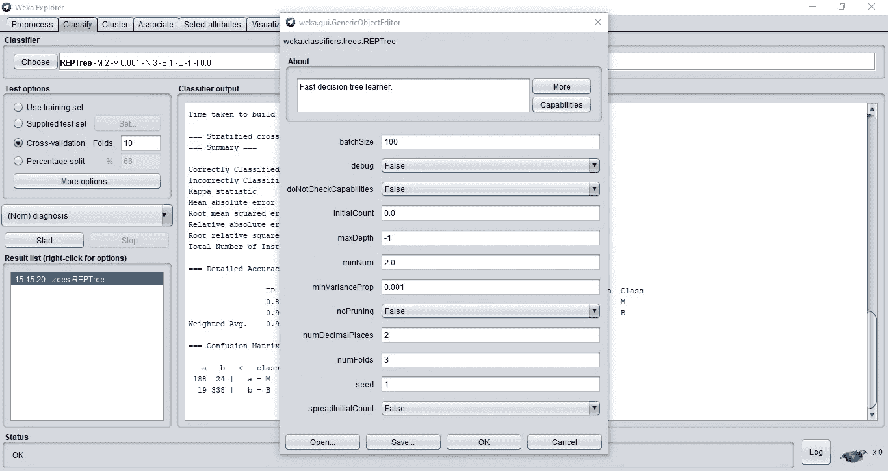

先简单说一下主要参数:

*   ***max depth****——它决定了你的决策树的最大深度。默认情况下，它是-1，这意味着算法将自动控制深度。但是您可以手动调整该值以获得最佳的数据结果*
*   **-剪枝是指在不包含太多信息的叶子节点上自动削减。这使得决策树简单且易于解释**
*   *****numFolds*** -指定数量的折叠数据将用于修剪决策树。其余的将用于发展规则**
*   *****minNum*** —每个叶的最小实例数。如果没有提到，树将继续分裂，直到所有的叶节点只有一个相关的类**

**您始终可以尝试这些参数的不同值，以获得数据集的最佳精度。**

# **在 Weka 中可视化您的决策树**

**Weka 甚至允许您轻松地可视化基于数据集构建的决策树:**

1.  **转到**“结果列表”**部分，右键单击您训练好的算法**
2.  **选择**“可视化树”**选项**

**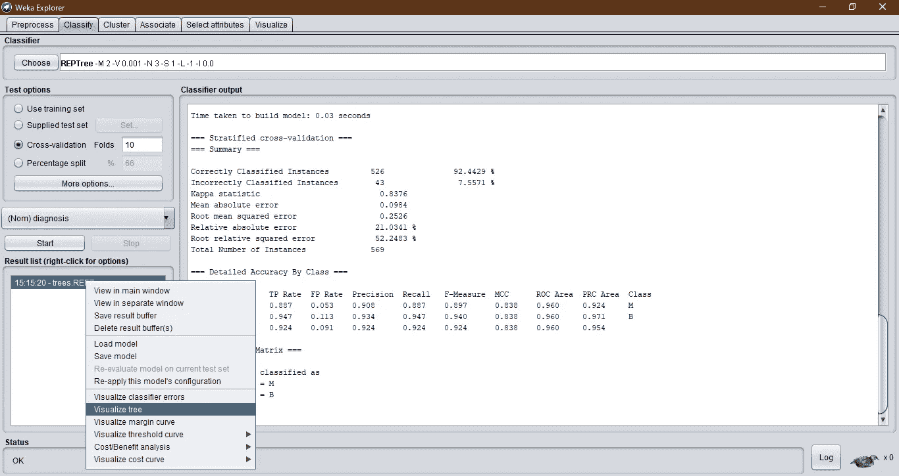**

**您的决策树将如下所示:**

**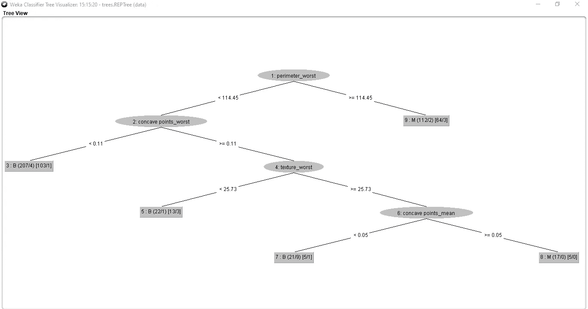**

**解释这些价值观可能有点吓人，但是一旦你掌握了窍门，它实际上是非常容易的。**

**连接结点的线上的值表示基于父结点要素中的值的分割标准**

**在叶节点中:**

*   **括号前的值表示分类值**
*   **第一个括号中的第一个值是该叶中训练集的实例总数。第二个值是该叶中错误分类的实例数量**
*   **第二个括号中的第一个值是该叶中修剪集的实例总数。第二个值是该叶中错误分类的实例数量**

# **在 Weka 中使用决策树进行回归**

**就像我之前说的，决策树是如此的多才多艺，它们可以处理分类问题，也可以处理回归问题。为此，我将使用来自 [Analytics Vidhya 的 DataHack 平台](https://datahack.analyticsvidhya.com/contest/all/?utm_source=blog&utm_medium=decision-tree-weka-no-coding)的“[预测 upvots](https://datahack.analyticsvidhya.com/contest/enigma-codefest-machine-learning-1/?utm_source=blog&utm_medium=decision-tree-weka-no-coding)的数量”问题。**

**在这里，我们需要预测一个用户在问答平台上提出的一个问题的评分。**

**像往常一样，我们将从加载数据文件开始。但是这一次，对于数据集中的每个用户，数据还包含一个*“ID”*列。这在预测中没有用。因此，我们将通过选择列名下面的**“Remove”**选项来删除该列:**

**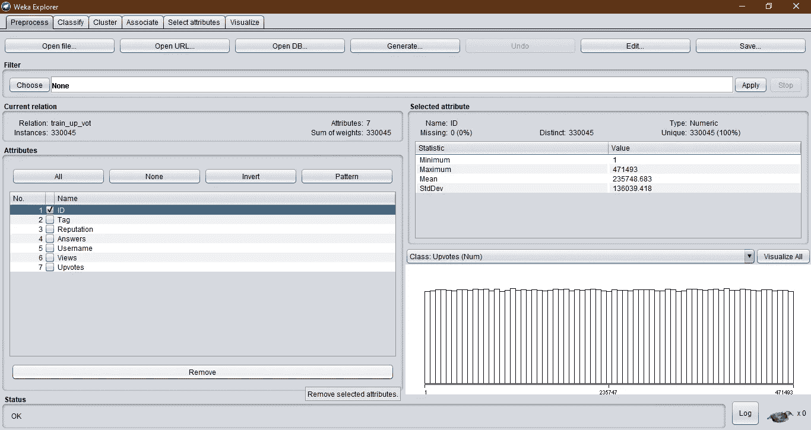**

**我们可以对数据集进行预测，就像我们对乳腺癌问题进行预测一样。 **RepTree** 会自动检测回归问题:**

**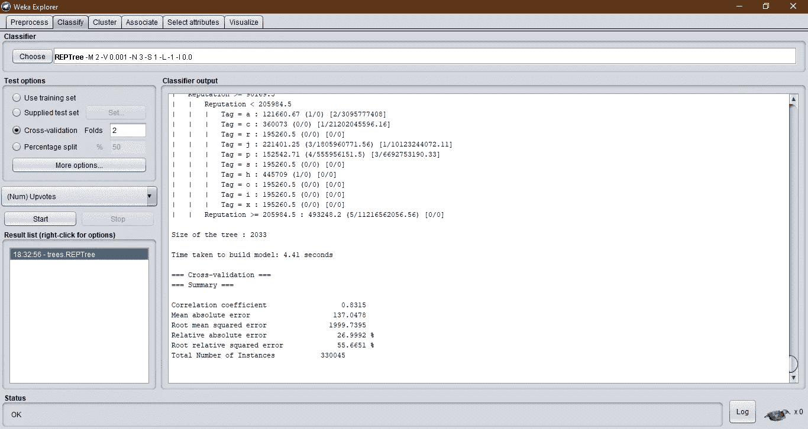**

**黑客马拉松中提供的评估标准是 RMSE 分数。我们可以看到，在没有任何特征工程的情况下，该模型具有非常差的 RMSE。这就是你要介入的地方——继续，实验并提升最终模型！**

# **结束注释**

**就这样，你不用做任何编程就创建了一个决策树模型！这将对你掌握机器学习模型的工作大有帮助。**

**如果你想学习和探索机器学习的编程部分，我强烈建议你浏览一下 [Analytics Vidhya](https://courses.analyticsvidhya.com/collections/?utm_source=blog&utm_medium=decision-tree-weka-no-coding) 网站上这些精心策划的课程:**

*   **[面向数据科学的 Python](https://courses.analyticsvidhya.com/courses/introduction-to-data-science?utm_source=blog&utm_medium=decision-tree-weka-no-coding)**
*   **[2020 年成为数据科学家的全面学习途径](https://courses.analyticsvidhya.com/courses/a-comprehensive-learning-path-to-become-a-data-scientist-in-2020?utm_source=blog&utm_medium=decision-tree-weka-no-coding)**
*   **[决策树入门](https://courses.analyticsvidhya.com/courses/getting-started-with-decision-trees?utm_source=blog&utm_medium=decision-tree-weka-no-coding)**

**你也可以在分析 Vidhya 的 Android 应用上阅读这篇文章**

***原载于 2020 年 3 月 10 日 https://www.analyticsvidhya.com***。****