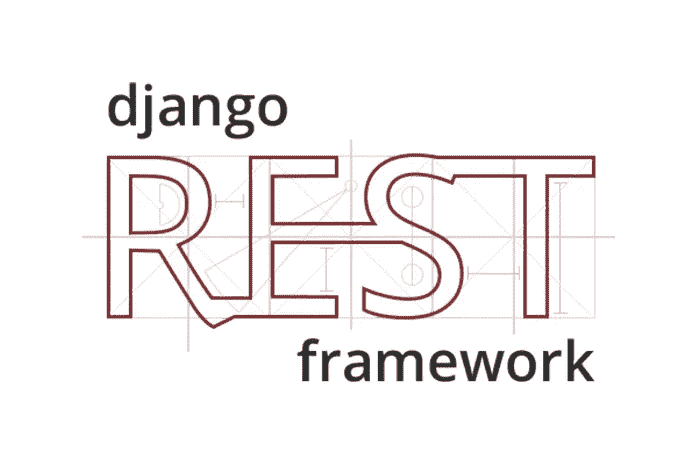

# 构建一个 Django RESTful API

> 原文：<https://medium.com/analytics-vidhya/build-a-django-restful-api-b7f4633d01bc?source=collection_archive---------14----------------------->



# 部分概述

*   设置。
*   创建 django 项目和应用程序。
*   模型和数据库。
*   对数据的访问。
*   结论。

我们将一起为“待办事项”应用程序构建后端。我们编写并部署一个 RESTful API 服务。API 允许您创建、读取、更新和删除(CRUD)任务。任务存储在数据库中，我们使用 Django ORM(对象关系映射)来处理数据库管理。

# 第 1 部分—设置

创建一个 Python 3 虚拟环境。

```
$ mkdir todoapp
$ cd todoapp
$ python3 -m venv .venv
$ source .venv/bin/activate
```

安装依赖项。

```
(.venv)$ pip install djangorestframework django
```

DRF(Django REST 框架)是一个创建 RESTful CRUD APIs 并提供有用特性的框架。

# 第 2 部分—创建 Django 项目和应用程序

```
$ django-admin startproject todo_app
```

在 project 中创建应用程序。

```
$ cd todo_app
$ django-admin startapp todo
```

让我们将`rest_framework`和 todo 添加到项目的`settings.py`中的`INSTALL_APPS`列表中。

```
todoapp/todo_app/settings.pyINSTALLED_APPS = [
    'django.contrib.admin',
    'django.contrib.auth',
    'django.contrib.contenttypes',
    'django.contrib.sessions',
    'django.contrib.messages',
    'django.contrib.staticfiles',
    'rest_framework',
    'todo',
]
```

# 第 3 部分—模型和数据库

默认情况下，Django 使用 SQLite 数据库管理系统。

`todo_app/todo/models.py:`

```
from django.db import modelsclass Task(models.Model):
    STATES = (('todo', 'To Do'), ('in progress', 'In Progress'), ('done', 'Done'))
    title = models.CharField(max_length=255, blank=False, unique=True)
    description = models.TextField()
    status = models.CharField(max_length=4, choices=STATES, default='todo')
```

现在创建数据库迁移脚本，Django 用它来更新数据库。

```
python manage.py makemigrations
```

然后，您可以将迁移应用到数据库。

```
python manage.py migrate
```

# 第 4 节—数据访问

## 第 4.1 节—创建序列化程序

序列化器用于将 JSON 或其他内容类型反序列化为模型中定义的数据结构。

让我们通过在项目`todo_app/todo/serializers.py:`中创建一个新文件来添加我们的 TaskSerializer 对象

```
from rest_framework.serializers import ModelSerializer
from todo.models import Task class TaskSerializer(ModelSerializer):
    class Meta:
        model = Task
        fields = '__all__'
```

我们使用来自 DRF 的通用 ModelSerializer，用对应于我们的任务模型的字段自动创建一个序列化程序。

## 第 4.2 节—创建视图

ModelViewSet 在数据模型上提供了以下操作:列出、检索、创建、更新、部分更新和销毁。

让我们将我们的观点添加到`todo_app/todo/views.py`:

```
from rest_framework.viewsets import ModelViewSetfrom .models import Task
from .serializers import TaskSerializerclass TaskViewSet(ModelViewSet):
    queryset = Task.objects.all()
    serializer_class = TaskSerializer
```

## 第 4.3 节—创建路由器

DRF `DefaultRouter`负责将动作映射到 HTTP 方法和 URL。将以下内容添加到`todo_app/urls.py:`

```
from django.conf.urls import include, url
from django.contrib import adminfrom rest_framework.routers import DefaultRouter
from todo.views import TaskViewSetrouter = DefaultRouter()
router.register(r'todo', TaskViewSet)urlpatterns = [
    url(r'admin/', admin.site.urls),
    url(r'^api/', include((router.urls, 'todo'))),
]
```

我们将所有路由器 URL 映射到/api 端点。DRF 负责映射 URL 和 HTTP 方法(列表、检索、创建、更新、销毁)。

## 第 4.4 节—运行应用程序

```
python manage.py runserver
```

*   现在，我们可以通过以下 URL 访问该应用程序:`[http://127.0.0.1:8000/api/](http://127.0.0.1:8000/api/)`
*   使用以下 URL 列出或创建任务:`[http://127.0.0.1:8000/api/todo](http://127.0.0.1:8000/api/todo)`
*   使用此 URL 更新/删除现有任务:`[http://127.0.0.1:8000/api/todo/1](http://127.0.0.1:8000/api/todo/1)`

# 第 5 节—结论

在本文中，您已经学习了如何使用 Django REST 框架创建一个基本的 RESTful API。