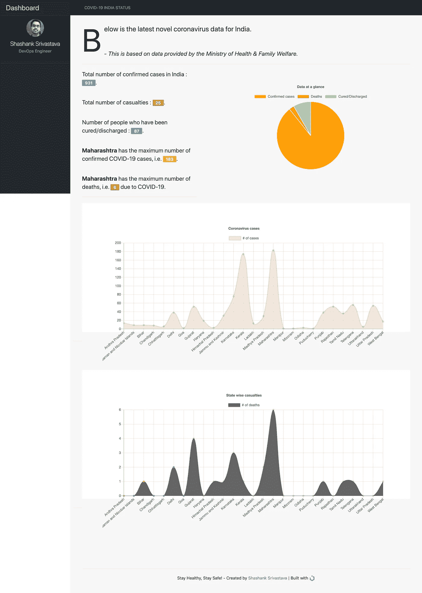

# 通过抓取网站构建 Flask web 应用程序，并使用 Chart.js 显示数据

> 原文：<https://medium.com/analytics-vidhya/build-a-flask-web-app-by-scraping-a-website-display-the-data-using-chart-js-bd0c97397967?source=collection_archive---------8----------------------->

我如何使用 Flask 用 Python 创建了一个 web 应用程序，该应用程序抓取[卫生部&家庭福利](https://www.mohfw.gov.in/)网站，并显示印度各州冠状病毒的统计数据。


在 [Unsplash](https://unsplash.com/?utm_source=unsplash&utm_medium=referral&utm_content=creditCopyText) 上[视觉效果](https://unsplash.com/@visuals?utm_source=unsplash&utm_medium=referral&utm_content=creditCopyText)拍摄的照片

# 介绍

由于整个世界都受到冠状病毒的控制，让我们自己了解最新的统计数据是相当重要的。考虑到这一点，我决定使用 **Python，Flask & Chart.js** 构建一个网络应用程序，它将从卫生部&家庭福利网站&提取数据，并以丰富多彩的交互式图表形式显示这些信息。在这篇文章中，我将向你展示我是如何构建这个应用程序的。

您可以从我的 GitHub 库中获取完整的代码。

[](https://github.com/shashank-ssriva/India-COVID-19-Stats) [## 沙尚-斯里瓦/印度-新冠肺炎-统计

### 在 GitHub 上创建一个帐户，为 shasha NK-ss Riva/India-新冠肺炎-Stats 的发展做出贡献。

github.com](https://github.com/shashank-ssriva/India-COVID-19-Stats) 

我已经 Dockerised &然后部署到 Heroku 的应用程序。请访问下面的 URL 查看实时应用程序。

## [https://india-covid-stats.herokuapp.com/](https://india-covid-stats.herokuapp.com/#)

> 在我接下来的文章中，我将向你展示如何在 Heroku 上建立一个 Flask web 应用程序并部署它。

# 使用的工具/技术

1.  **Python**3 . 7 . 6——Web-app 的后端。
2.  **BeautifulSoup** —从网站上抓取信息。
3.  Python 的网络开发框架
4.  **Chart.js** —将信息显示为漂亮、丰富多彩的交互式图表。

# 网络应用截图

下面是完成后的 web 应用程序的样子(*这是一个全屏截图*)。如上所述，你可以在[https://india-covid-stats.herokuapp.com/](https://india-covid-stats.herokuapp.com/)观看应用直播。这些图表是交互式的&您可以将光标悬停在图表上以获取更多信息。



[https://india-covid-stats.herokuapp.com/](https://india-covid-stats.herokuapp.com/)

# 项目结构

由于这是一个 Flask 项目，我们需要为我们的应用程序维护一个特定的目录结构。下面是项目框架。

我正在*排除*非重要文件&目录。

```
root@shashank-mbp /U/a/D/CoronaVirus-Status-India# ls -lh
-rw-r--r--   1 root  staff   2.6K Mar 29 11:42 app.py
-rw-r--r--   1 root  staff   121B Mar 27 19:12 requirements.txt
drwxr-xr-x   5 root  staff   160B Mar 27 09:26 static
drwxr-xr-x   3 root  staff    96B Mar 28 22:52 templatesroot@shashank-mbp /U/a/D/CoronaVirus-Status-India# tree static templates
static
├── css
│   ├── dashboard.css
│   ├── uikit-rtl.css
│   ├── uikit-rtl.min.css
│   ├── uikit.css
│   └── uikit.min.css
├── img
│   └── shashank-srivastava.jpeg
└── js
    ├── chartScripts.js
    ├── uikit-icons.js
    ├── uikit-icons.min.js
    ├── uikit.js
    └── uikit.min.js
templates
└── index.html
```

# 执行的步骤

## **1。安装了**所需的 Python 模块

为此，我用下面的内容&创建了一个`requirements.txt`文件，并用`pip`执行它。

```
pytest
flake8
python-dateutil
coverage
bs4
click
coverage
Flask
itsdangerous
Jinja2
MarkupSafe
requests
Werkzeug
selenium
```

`pip`在行动。

```
root@shashank-mbp /U/a/D/CoronaVirus-Status-India# pip install -r requirements.txt
```

## 2.**刮过**卫生部&家庭福利的网站获取数据。

然后，我创建了各种 Python 列表来获取我需要的值。为此，我创建了一个名为`app.py`的文件。

```
[@app](http://twitter.com/app).route('/', methods=['POST', 'GET'])
def main():
    def extract_contents(row): return [x.text.replace('\n', '') for x in row]
    URL = '[https://www.mohfw.gov.in/'](https://www.mohfw.gov.in/')
    response = requests.get(URL).content
    soup = BeautifulSoup(response, 'html.parser')
    table = soup.find('div', {'id': 'cases'})
    state_wise_stats = []
    all_rows = table.find_all('tr')
    for row in all_rows:
        stat = extract_contents(row.find_all('td'))
        if stat:
            if len(stat) == 5:
                # last row
                stat = ['', *stat]
                state_wise_stats.append(stat)
            elif len(stat) == 6:
                state_wise_stats.append(stat)
```

> 由于这篇文章不是向你展示代码是如何工作的，我将跳过这一部分。我在这里的目的是告诉我如何写网络应用程序。您可以检查代码，看看我是如何获得要在图表中使用的值的。

## 3.**使用 Chart.js 创建了**图表

Chart.js 是一个很棒的图表库，它有漂亮的图表，而且创建起来没有什么困难。

一旦我提取了所有的值，比如印度确诊的冠状病毒病例数，我就在我的 T4 页面中用这些值绘制了图表。

下面是一个如何使用 Chart.js 创建饼图的例子。

```
<!-- panel -->
    <div class="uk-width-1-1">
    <div class="uk-card-body">
    <div class="chart-container">
     <canvas id="pie-chart" width="1200" height="600" style="display: block; height: 300px; width: 600px;"></canvas>
     <script>
     var chartData = {
      labels: ['Confirmed cases', 'Deaths', 'Cured/Discharged'],
       datasets: [{
        label: 'Pie chart',
        data: [{{ total_cases }}, {{ total_casualties }}, {{ num_people_cured }}],
         spanGaps: false,
         backgroundColor: ['orange', 'red', '#90EE90' ],
        }]
       }
       // get chart canvas
       var ctx = document.getElementById("pie-chart").getContext("2d");
       // create the chart using the chart canvas
       var myChart = new Chart(ctx, {
        type: 'pie',
        data: chartData,
        options: {
         title: {
          display: true,
          text: 'Data at a glance',
         }
        }
       });
       </script>
      </div>
     </div>

   </div>
<!-- /panel -->
```

## 4.把这些放在一起。

一旦我的代码准备好了，我只需要执行下面的命令来启动我的 web 应用程序。请去我的 GitHub 库获取完整的代码。

```
root@shashank-mbp /U/a/D/CoronaVirus-Status-India# python3 app.py
 * Running on [http://0.0.0.0:5002/](http://0.0.0.0:5002/) (Press CTRL+C to quit)
```

这标志着这篇文章的结束。我希望它能增长见识。