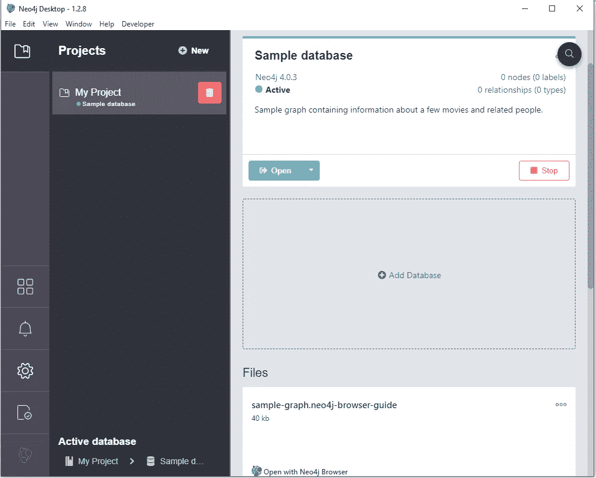
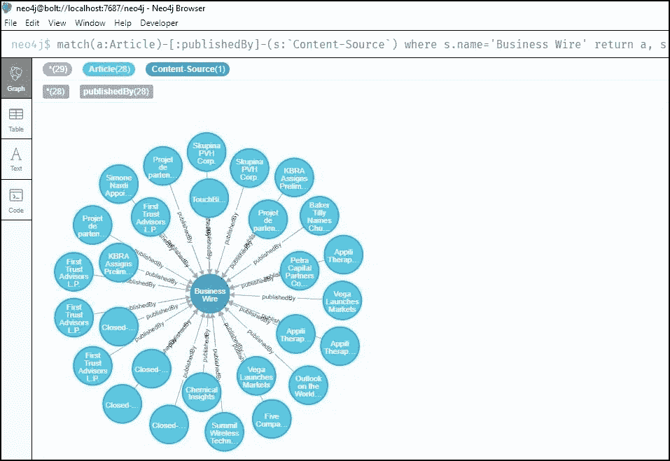
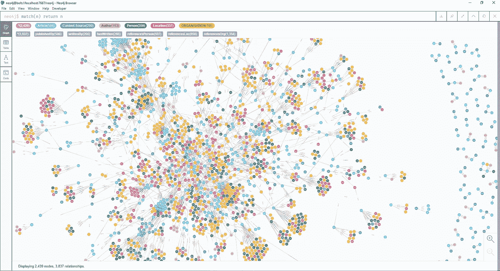

# 使用 Neo4J 构建知识图表

> 原文：<https://medium.com/analytics-vidhya/build-a-knowledge-graph-using-neo4j-eb7490799f4b?source=collection_archive---------1----------------------->

在过去十年左右的时间里，知识图表一直在偷偷进入我们的日常生活，无论是通过语音助手(如 Alexa、Siri 或谷歌助手)、直观的搜索结果，还是亚马逊上的个性化购物体验。我们每天都在与知识图表互动。

然而，知识图表和底层图表数据库仍然是一个谜，我们大多数人甚至没有意识到我们对技术的依赖程度——或者更糟糕的是，我们是如何期望我们现在如此依赖的某种质量和标准的。

一些组织已经在使用这项技术来保持领先地位。此外，在所有类型的行业中都有知识图表和图表数据库的用例，从银行、汽车行业、石油和天然气到零售、制药、媒体等。

# 什么是知识图？

知识图只不过是底层数据的图形表示，它将数据中的实体建模为节点，并将这些实体之间的关系建模为节点之间的边/链接。

它可以帮助我们了解大规模数据中的联系，无论是结构化数据还是非结构化数据。

考虑电影知识图的以下示例:


来源:[https://www . ka ggle . com/ferdzso/knowledge-graph-analysis-with-node 2 vec](https://www.kaggle.com/ferdzso/knowledge-graph-analysis-with-node2vec)

# 使用 Neo4J 的 Python

这里我们将使用 ***Py2neo、*** 一个客户端库，以及用于从 [Python](https://www.python.org/) 应用程序内部和命令行使用 [Neo4j](https://neo4j.com/) 的工具包。

我们将有一个简单的用例，构建一个包含新闻文章、文章来源、作者等的知识图。出于获取数据的目的，我们将使用 [event registry](https://eventregistry.org/) ，这是一个 API，提供了全球新闻文章和事件的集合。

现在让我们深入研究代码，我们可以一路谈论其中的复杂性。

步骤 1)导入库

py2neo 库将帮助我们编写 python 命令来插入、更新和查询 neo4j 图形数据库

# 获取新闻文章

这些将成为我们知识图表的输入。

我们使用 event-registry 收集新闻文章的原因是，它为我们提供了完整的文章文本，没有任何 HTML 标签，因此我们不需要解析任何内容。此外，它为我们提供了其他文章元数据，如文章来源、作者、情感、语言等。

一旦我们在[https://eventregistry.org/](https://eventregistry.org/)(创建一个免费账户)上注册，我们就会得到一个 API 密匙，这个密匙必须在 POST 请求的正文中发送，以便检索文章。

# 配置 Neo4J

从 https://neo4j.com/download/[下载 Neo4J 桌面版并安装在你的机器上。完成后，您应该会看到如下内容:](https://neo4j.com/download/)



点击“添加数据库”->“创建一个本地图形”->更改“图形”的名称，如果你想，并设置一个密码。

单击 Start 按钮激活数据库，然后打开 Neo4J 浏览器查看数据。

# 加载数据

下面的代码演示了如何在 Neo4J 中输入数据。

我们遵循以下步骤:

*   检查是否添加了新闻来源，
*   如果是，那么我们只需从图形数据库中检索节点
*   否则，我们创建一个新节点，给它分配一个惟一的 id。
*   一旦有了节点，我们就在文章节点和新闻源节点之间创建了一个关系
*   将关系存储到 neo4j

你可以在这个 [Github 库](https://github.com/doshi-jay/Knowledge-Graph)中找到完整的代码

# 形象化

一旦我们在图形数据库中加载了所有相关信息，我们就可以使用内置的 Neo4J 浏览器来可视化数据。

为此，我们可以使用 [cypher](https://neo4j.com/developer/cypher-query-language/) ，cypher 非常类似于 SQL，充当知识图的接口。

假设我想查看《商业资讯》撰写的所有文章，那么我们将执行以下查询:

```
MATCH(a: Article)-[:publishedBy]-(s:`Content-Source`) 
WHERE s.name=’Business Wire’
RETURN a, s
```



让我们想象一切！这是与 586 篇文章相关的数据。



“人”、“组织”和“位置”节点使用某种形式的自然语言处理来识别实体。

# 总结

正如我们所见，neo4j 通过与 Python、Java 等语言的集成，使得加载数据变得相当简单。，开发一个自动化的管道将信息输入其中也很容易。