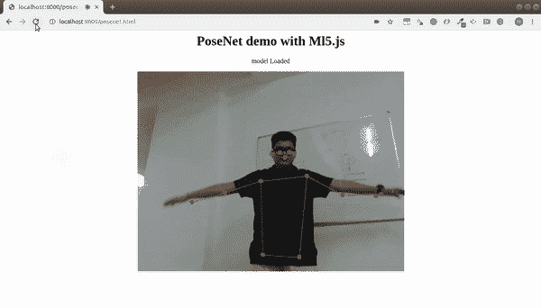

# 使用 TensorFlow.js 和 Python 在浏览器中构建机器学习模型

> 原文：<https://medium.com/analytics-vidhya/build-a-machine-learning-model-in-your-browser-using-tensorflow-js-and-python-a27f7f6b93d4?source=collection_archive---------1----------------------->


# 为什么要用 TensorFlow.js？

我将用一种独特的方法来回答这个问题。我不会深入研究 TensorFlow.js 的理论方面，也不会列出为什么它是一个如此不可思议的工具。让我们构建一个应用程序，在 5 分钟内使用您的网络摄像头对图像进行分类。没错——我们将直接进入代码！

最棒的是，你不需要安装任何东西就能做到这一点！只需要一个文本编辑器和一个网络浏览器就足够了。下面的视频展示了我们将要构建的应用程序:


多酷啊。我在浏览器中花了几分钟就完成了。

# 使用网络摄像头在浏览器中构建图像分类模型

打开你选择的文本编辑器，创建一个文件【index.html 。将以下代码保存在该文件中:

接下来，创建另一个文件 **index.js** ，并在其中写入以下代码:

保存这两个文件，并在谷歌 Chrome 或 Mozilla Firefox 等浏览器中打开你的**index.html**文件。就是这样！您现在已经创建了一个应用程序，可以在浏览器中使用您的网络摄像头对图像进行实时分类！


**本例中需要注意的要点:**

*   在上面的例子中，我们使用了一个名为 [MobileNet](https://ai.googleblog.com/2017/06/mobilenets-open-source-models-for.html) 的预训练图像分类模型
*   我们使用 [ml5.js](https://ml5js.org/) ，一个构建在 TensorFlow.js 之上的库，将 MobileNet 模型加载到我们的浏览器中，并对视频提要执行推理
*   我们还利用了 [P5.js](https://p5js.org/) 库来处理视频提要并在视频上显示标签

> 我喜欢我们不需要在机器上安装任何东西的事实。这个例子应该适用于任何现代系统，不管是 Linux、Windows 还是 MAC OS——这就是使用 JavaScript 在 web 上构建模型的强大之处。

现在，让我们看看 TensorFlow.js 提供的强大功能，以及如何利用它们在浏览器中部署机器学习模型。

# TensorFlow.js 的功能

> *TensorFlow.js 是一个用 JavaScript 开发和训练 ML 模型的库，部署在浏览器或 Node.js 上*

TensorFlow.js 提供了大量可以利用和使用的功能:

*   如果 ML 模型是用网络语言编写的，那么部署 ML 模型会更容易。
*   因为所有主流浏览器都支持 JavaScript，所以你可以无处不在地使用它。对你的用户来说也是如此。
*   TensorFlow.js 是一个**客户端库**这减轻了任何与数据的**隐私**相关的担忧。
*   在你的客户机上运行实时推理会让你的应用程序更具**交互性**。


# 浏览器中的机器学习

TensorFlow.js 提供了两种训练模型的方法(与 TensorFlow 非常相似):

*   第一种方法是使用**核心 API** 使用低级张量运算来定义你的模型
*   第二种方法是使用**层 API** 定义一个模型，类似于 **Keras**

让我们通过几个例子来理解这两种方法。毕竟，学习一个概念的最好方法是把它付诸实践！

**首先，设置你的 HTML 文件:**

在你的计算机中创建一个新的**index.html**文件，并在其中写入以下代码:

我们已经创建了一个基本的 HTML 页面，并从云 URL 加载了 Tensorflow.js(第 7 行)。

**关于安装 TensorFlow.js (deeplearn.js)的说明**

> *既然 TensorFlow.js 是为浏览器做的，那么安装使用 TensorFlow.js 最简单的方法就是根本不安装。* ***你可以简单地从你的 HTML 中的一个 URL 加载它。***

您只需将下面一行添加到 HTML 文件中:

```
<script src="https://cdn.jsdelivr.net/npm/@tensorflow/tfjs@1.0.0/dist/tf.min.js"></script>
```

搞定了。这真的是直截了当。

# 核心 API:使用张量

> *核心 API 与* [*TensorFlow 核心*](https://www.tensorflow.org/guide/low_level_intro) *非常相似，我们可以使用低级张量运算和线性代数来定义模型。*

如果我们想要构建定制模型或者想要从头构建神经网络，这是非常有用的。让我们举一个在浏览器中使用张量的例子。

首先在你的*index.html*文件中的 **<脚本></脚本>** 标签之间添加以下代码:

```
const a = tf.tensor([1, 2, 3, 4]); 
const b = tf.tensor([10, 20, 30, 40]); 
const y = a.add(b); // equivalent to tf.add(a, b) 
const z = a.mul(b); 
y.print();
z.print();
```

**<脚本>** 标签基本上表示 JavaScript。我们在这些标签之间写的任何东西都将作为 JavaScript 代码执行。下面是你的*index.html*现在的样子:

在上面的代码中，我们正在对两个张量 *a* 和 *b* 执行基本的加法和乘法运算，并在浏览器中打印结果。现在，转到您的终端，打开您的项目文件夹，使用下面的命令启动一个 Python 服务器:

```
python3 -m http.server
```

然后转到您的浏览器，打开以下地址:

```
[http://localhost:8000/](http://localhost:8000/)
```

一旦你看到一个写着“Tensorflow.js Core API”的页面，使用按键 **Ctrl+Shift+I** 打开**控制台**。这应该可以在 Chrome 和 Firefox 上运行。我们在控制台中得到上述操作的输出:


如果你想更深入地了解 Core API，那么我推荐你浏览官方的 [CoreAPI 文档](https://www.tensorflow.org/js/guide/tensors_operations)。

# Layers API:构建类似 Keras 的模型

Layers API 与 Python 中的 Keras 非常相似。就像 Keras 一样，您可以使用**顺序**和**功能**方法创建一个模型。

让我们通过一个例子更仔细地看看顺序方法。我们将根据这些数据点训练一个回归模型:


这里 X 和 Y 是线性关系——每个 Y 对应 X + i(其中 I 为 0，1，2，3…n+1)。让我们在这个数据集上训练一个基本的回归模型。您可以在您的*index.html*文件中的 **<脚本></脚本>** 标签之间编写以下代码:

眼尖的人一定注意到了上面的语法与用 Python 构建顺序模型的 Keras 语法非常相似。当我们回到浏览器**控制台**时，我们将得到预测。


我们的简单回归模型预测 **7.556** ，与 **8** 的预期值非常接近。这是一个基本的例子，但我们可以清楚地看到，在我们的浏览器中直接建立机器学习模型是多么容易和有用。

> *TensorFlow.js 能够在浏览器中构建机器学习和深度学习模型。如果在模型训练期间您的系统中有 GPU，它还会自动利用 GPU 的能力。*

这里有几个使用 TensorFlow.js **训练的深度学习模型的例子，你可以在**[**tfjs-examples repository**](https://github.com/tensorflow/tfjs-examples)**中探索这些例子。**

# 利用谷歌的预训练模型:PoseNet

TensorFlow.js 提供了大量来自谷歌的[预训练模型](https://www.analyticsvidhya.com/blog/2018/07/top-10-pretrained-models-get-started-deep-learning-part-1-computer-vision/?utm_source=blog&utm_medium=build-machine-learning-model-in-your-browser-tensorflow-js-deeplearn-js)。预训练模型的优势在于我们可以开箱即用。

您可以在此查看可用的预培训模型:

```
[https://www.tensorflow.org/js/models](https://www.tensorflow.org/js/models)
```

*在本文中我们将与*[](https://www.tensorflow.org/lite/models/pose_estimation/overview)**一起工作。**

# *PoseNet 是如何工作的？*

*需要明确的是，姿势估计是*而不是*关于识别图像中的人。**该算法只是简单地估计关键身体关节的位置。***

*检测到的关键点以“Part”和“ID”为索引，置信度在 0.0 到 1.0 之间(1.0 为最高。*

*以下是 PoseNet 输出类型的一个示例:*

**

*不可思议吧。！*

*让我们回到波塞尼特。创建一个新文件**index.html**并添加以下代码:*

*这将创建一个基本的 HTML 网页并加载必要的文件:*

*   *ml5.js 和 p5.js 是通过它们的官方 URL 加载的*
*   *js 是一个文件，我们将在其中编写使用 posenet 的代码*

*现在，我们将编写使用 PoseNet 的 JavaScript 代码。在与*index.html*相同的文件夹中创建一个新文件 **posenet.js** 。*

*让我们从第一步开始。*

***第一步:加载 PoseNet 模型并从网络摄像头捕捉视频***

*我们将使用 ml5.js 加载 PoseNet。同时，p5.js 使我们能够使用几行代码从网络摄像头捕捉视频:*

*在上面的代码块中需要注意的最重要的事情是:*

*   ***createCapture(视频):**这是一个 p5.js 函数，用于通过网络摄像头捕捉视频来创建视频元素。*
*   ***ml5.poseNet(video，modelRead)** :我们使用 ml5.js 来加载 poseNet 模式。通过传入**视频，**我们告诉模型处理视频输入。*
*   ***poseNet.on()** :每当检测到一个新的姿态时，执行该功能。*
*   ***modelReady():** 当 PoseNet 完成加载后，我们调用这个函数来显示模型的状态。*

***第二步:检测身体关节的关键点***

*下一步是检测姿态。你可能已经注意到，在上一步中，我们通过调用 **poseNet.on()** 将每个检测到的姿势保存在 **poses** 变量中。该功能在后台持续运行。每当发现一个新姿势时，它会以下列格式给出身体关节的位置:*

**

*   ***‘得分’是指模型的置信度***
*   ***‘部位’表示检测到的身体关节/关键点***
*   ***“位置”包含被检测零件的 x 和 y 位置***

***第三步:显示检测到的身体关节***

*我们不必为这部分编写代码，因为它是自动生成的。*

*我们知道检测到的身体关节及其 x 和 y 位置。现在，我们只需要将它们绘制在视频上，以显示检测到的身体关节。*

*我们将使用 20% ( *关键点得分*0.2)置信度得分的**阈值**，以便得出关键点。下面是执行此操作的代码:*

***第四步:画出估计的身体骨架***

*除了关键点或身体关节，PoseNet 还检测身体的估计骨架。我们可以使用 **poses** 变量来绘制骨架:*

*在这里，我们循环检测骨架并创建连接关键点的线条。代码也相当简单。*

*现在，最后一步是反复调用 **drawSkeleton()** 和 **drawKeypoints()** 函数以及我们从网络摄像头捕捉的视频提要。我们可以使用 p5.js 的 **draw()** 函数来实现，该函数在 **setup()** 之后被直接调用，并重复执行:*

*接下来，进入您的终端窗口，进入您的项目文件夹，并启动一个 Python 服务器:*

```
*python3 -m http.server*
```

*然后转到您的浏览器，打开以下地址:*

```
*[http://localhost:8000/](http://localhost:8000/)*
```

**

*瞧啊。你的 PoseNet 应该很好地检测你的身体姿势(如果你正确地遵循了所有的步骤)。这是我的模型的样子:*

# *结束注释*

*你可以看到我为什么喜欢 TensorFlow.js。它显示了通过将机器学习引入浏览器来使其更容易访问的许多承诺。*

**本文所有代码* [*均可在 Github*](https://github.com/mohdsanadzakirizvi/pose-detection-webcam) *上获得。**

**原载于 2019 年 6 月 14 日*[*https://www.analyticsvidhya.com*](https://www.analyticsvidhya.com/blog/2019/06/build-machine-learning-model-in-your-browser-tensorflow-js-deeplearn-js/)*。**