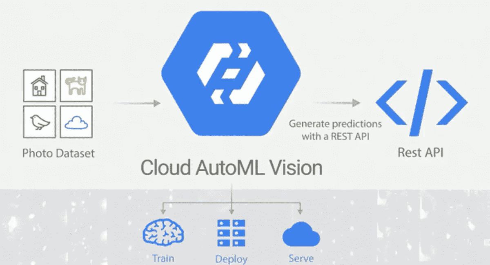

# 使用 Google AutoML 在云上构建机器学习模型

> 原文：<https://medium.com/analytics-vidhya/build-a-machine-learning-model-on-cloud-using-google-automl-7bd3836f0a3d?source=collection_archive---------7----------------------->

图片来自 zdnet.com

使用谷歌云构建、训练和部署机器学习模型的指南。

机器学习(ML)是最新的技术进步，有助于在可扩展的水平上驱动流程。运行这些复杂过程的模型可以简单地理解为试图从给定的数据集学习并预测值的数学方程。