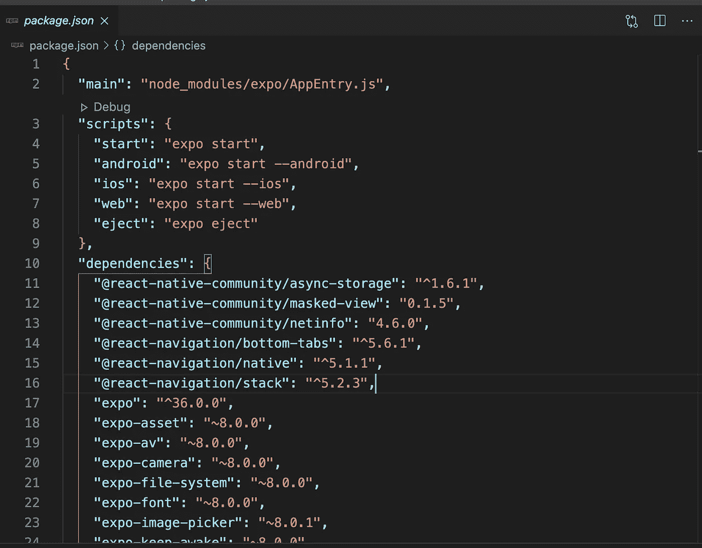

# 使用 Expo 构建移动应用程序

> 原文：<https://medium.com/analytics-vidhya/build-a-mobile-app-with-expo-1dfdb7675088?source=collection_archive---------16----------------------->

> 为什么您应该使用 Expo 构建移动应用程序



当我开始开发移动应用程序时，我努力学习母语来编写 ios 应用程序或 android 应用程序。例如，在 IOS 中，要在 swift 中开始编码，你必须设置所有的配置，而且你有需要 MacOS 来开始编码的限制。你可以用虚拟机来解决这个问题，但它需要一台好的计算机来处理同时运行的两个操作系统。

我在 SWIFT 呆了几个月，当 a 想把我的应用程序发送给一个有安卓系统的朋友时，我无法发送，所以我需要学习另一种编程语言，只是重复我之前为获得相同的应用程序所做的所有工作。

但后来我发现 Expo 和 react native 允许我 1)编写一个应用程序，并同时分发到 ios 和 Android 2)允许我使用 javascript，所以我不需要学习另一种编程语言。太棒了。

## **但是什么是 react native 和 expo 呢？**

React Native 是由脸书创建的开源移动应用框架。通过支持开发人员使用 React 和本机平台功能，它可用于为 Android、Android TV、iOS、macOS、tvOS、Web 和 Windows 开发应用程序

因此，react native 允许您使用前端框架(react)来编写移动应用程序。但它不同于 Cordova、Ionic 或 PhoneGap，因为这些前端框架允许您使用 HTML、CSS 和 Javascript 为各种移动平台创建原生应用程序。Cordova 获取您的 web 应用程序，并将其呈现在本地 WebView 中。WebView 是一个应用程序组件(如按钮或标签栏),用于在本机应用程序中显示 web 内容。由于用 Ionic、Cordova 和 PhoneGap tech 构建的**混合应用**本质上是在 WebView 中呈现的网络应用，它们经常遭受糟糕的性能。

React Native 拥有 100%的原生 UI。不需要 WebView，这使它比混合应用程序更有优势。此外，它使用本机呈现的 UI，与本机应用程序中的 UI 一样快。

在 RN 中，您可以直接使用原生 API，这要快得多。您可以使用 Objective-C/Swift 和 Java 编写的本机模块来提高图像/视频处理等资源密集型任务的性能。

React Native 的工作原理实际上与 React 相同，只是 React Native 不通过虚拟 DOM 操纵 DOM。它直接在终端设备上的后台进程(解释开发者编写的 JavaScript)中运行，并通过序列化、异步和批处理桥与本机平台通信。

React 组件包装现有的本机代码，并通过 React 的声明式 UI 范式和 JavaScript 与本机 API 进行交互。这使得全新的开发团队能够进行原生应用开发，并让现有的原生团队工作得更快。

React Native 不使用 HTML 或 CSS。相反，来自 JavaScript 线程的消息用于操纵本地视图。React Native 还允许开发人员使用 Java for Android 和 Objective-C 或 Swift for iOS 等语言编写本机代码，这使得它更加灵活。

## 世博会从何而来？

Expo 是通用 React 应用程序的框架和平台。它是一套围绕 React 原生和原生平台构建的工具和服务，可帮助您从相同的 JavaScript/TypeScript 代码库开发、构建、部署和快速迭代 iOS、Android 和 web 应用程序。

有了 Expo，你就有了一个框架，你就有了多个库来帮助你开发和分发应用。它有办法利用世博会

使用 Expo 工具构建应用程序的两种方法被称为“托管”和“裸”工作流。

*   使用*托管工作流*，您只需编写 JavaScript / TypeScript，Expo 工具和服务会为您处理所有其他事情。
*   在*的裸工作流程*中，你可以完全控制原生项目的每一个方面，而 Expo 工具和服务则稍微受限一些。

在管理工作流中，你可以改变的东西更有限，但取决于你的情况，这真的不是问题。您可以使用托管工作流做的事情非常强大，例如，如果您需要更改某些特定内容并需要对开发流程进行更多控制，您可以随时“退出”,您的项目将只是一个典型的原生项目，其中安装并配置了您的应用程序正在使用的 React Native 和 Expo SDK 包。

开始使用 Expo 非常简单，不会超过 5 分钟。

首先，您需要安装命令行工具

```
npm install — global expo-cli
```

然后启动一个世博项目

```
expo init my-project
```

移动到文件夹并启动项目

```
cd my-appexpo start
```

## **世博 vs React 本土**

这两种方法我都用过，对我来说，用 expo 比 RN 更容易、更快。它需要更少的配置，你将有更少的问题与图书馆，你必须手动连接或确保所有的 ios 和 android 文件是正确的。当你不使用 expo 时，如果你有一个依赖或库的问题，你将不得不写本地代码来解决这个问题。

**但是什么时候有必要只用 RN 呢？**

如果你要使用一些像蓝牙 API 这样的本地特性，或者你需要你的应用非常快并且非常优化，你只需要使用 RN。

Expo 发展迅速，增加了许多新功能，所以你不需要手工编码。

这就是现在，我希望这能帮助一些人开始。敬请关注 react-native 上的更多帖子。

参考:

 [## 世博会介绍

### Expo 是通用 React 应用程序的框架和平台。它是一套围绕…构建的工具和服务

docs.expo.io](https://docs.expo.io/) [](https://reactnative.dev/docs/getting-started) [## 介绍反应自然

### 欢迎来到 React Native 之旅的起点！如果您正在寻找环境设置说明，他们已经…

反应性发展](https://reactnative.dev/docs/getting-started)