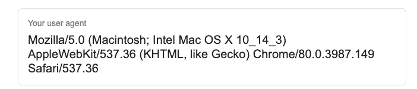

# 构建一个 Python 应用程序来跟踪在线价格并发送电子邮件通知。

> 原文：<https://medium.com/analytics-vidhya/build-a-python-app-that-tracks-online-prices-and-sends-email-notifications-d7dd5a840f0b?source=collection_archive---------17----------------------->


礼貌: [RawPixel](http://rawpixel.com)

嗯，那是在 2018 年年中左右，我快要疯了，想买一部新的智能手机，它太贵了(不提品牌了！).所以我想出了一个主意，建立一个小的 python 应用程序来跟踪价格，如果价格下跌，它会给我发送电子邮件通知。

在这篇博客中，我将带你一步一步地学习 ***构建一个跟踪在线价格并发送电子邮件通知的 Python 应用*** 。我们一起编码吧。会很有趣的！

但是如果你已经知道了整件事，只是想看看代码。给你。

首先，我们将安装两个必要的库，即 requests 和 bs4。简而言之，请求库将帮助我们访问网络，bs4 将帮助我们从网站上提取数据。所以启动你的终端，输入下面的命令。

```
pip install requests bs4
```

现在让我们导入我们安装的库和另一个必要的库，我们将使用它在邮件服务器之间发送电子邮件和路由电子邮件。

```
import requests
from bs4 import BeautifulSoup
import smtplib
```

每当您的 web 浏览器向网站发出请求时，它都会发送一个名为“**用户代理**”的 HTTP 头。用户代理字符串包含关于您的 web 浏览器名称、操作系统、设备类型和许多其他有用信息的信息。为了了解你的用户代理，只需谷歌“我的用户代理”。你会得到这样的东西。



现在让我们定义产品的 URL(我们将跟踪价格)和用户代理。

```
URL = 'producturl.com/xyz'
headers = {"User-Agent": 'YOUR USER AGENT'}
```

是时候编写函数来实现我们 Python 应用程序的第一个目的了。我们将定义一个函数 check_price()，它将包括访问 URL、提取网页信息(包括产品名称和价格)并使用 BeautifulSoup 类解析它们。我们还定义了一个 if 条件，用于比较价格，如果比较结果为真，那么宾果！我们将收到电子邮件。

```
def check_price():    
     page= requests.get(URL, headers=headers)     
     soup = BeautifulSoup(page.content, 'html.parser')     
     title = soup.find(id = "ebooksProductTitle").get_text()     
     for price in soup.findAll(attrs={'class' : 'a-size-medium a-color-price'}):
        price = price.text.strip()     
     converted_price =  float(price[0:5])     
     if(converted_price < 179):        
        send_email() 
```

在上面的函数中，我们使用 id 作为提取标题的定位器，使用类来提取产品的价格。想了解更多关于 BeautifulSoup 的信息，你可以去他们的网站。

现在我们已经准备好定义函数来实现 Python 应用程序的第二个目的。我们将定义一个函数 send_email()。但在此之前，我们需要为发件人的邮件生成密码，因为一些设备不支持双因素认证。要生成密码，只需导航至谷歌账户的应用程序密码。您将会看到一个如下图所示的屏幕。


选择应用程序为“邮件”，并根据您的要求选择设备。点击生成！现在你可以清楚地看到你的密码了。现在让我们编写 send_email()函数。

```
def send_email():     
     server = smtplib.SMTP('smtp.gmail.com', 587)    
     server.ehlo()    
     server.starttls()    
     server.ehlo()    
     server.login('sender's email', '#password')     
     subject = 'Write your subject here'     
     body = 'Write your mail content here'     
     msg = f"Subject: {subject} \n\n {body}"
     server.sendmail('sender's email', 'receiver's email', msg)     
     print('Email sent !')     
     server.quit()
```

所以在上面的函数中，我们使用 Python 的 smtplib 通过 SMTP(简单邮件传输协议)服务器发送邮件。将用于与服务器连接的 SMTP 对象。在我们发出邮件之前，EHLO 命令将用于识别发送到 SMTP 的主机的域名。最后，让我们调用 check_price()函数。答对了。

```
check_price()
```

更多此类项目，请访问 [Techism101](https://www.techism101.com)