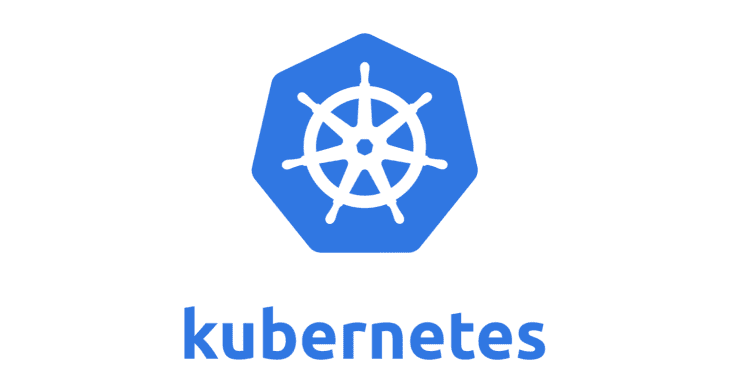
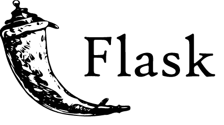
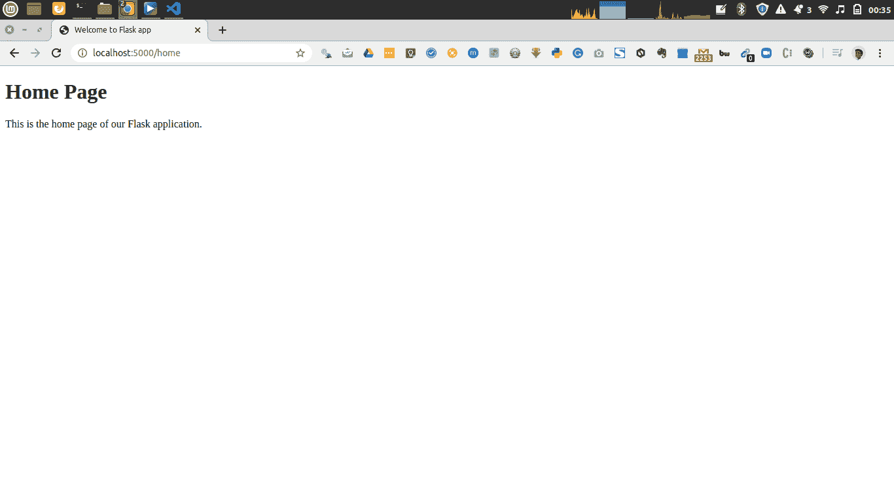

# 构建 PYTHON FLASK 应用程序并使用 KUBERNETES 进行部署

> 原文：<https://medium.com/analytics-vidhya/build-a-python-flask-app-and-deploy-with-kubernetes-ccc99bbec5dc?source=collection_archive---------3----------------------->

在本文中，您将学习如何在 python Flask 中开发一个简单的 Python 应用程序，并将其部署在 Kubernetes 上。

但是首先，让我们了解 Kubernetes 是什么，以及为什么我们要使用 Kubernetes 部署我们的应用程序。



Kubernetes 是一个常用的容器编排和管理系统。Kubernetes 是一个开源平台，它使用户能够部署、维护和扩展应用程序及其功能。Kubernetes 允许用户选择首选的编程语言或框架，并使用户能够跟踪和监控日志。Kubernetes 有一个非常大的社区，随时准备提供帮助和问题的答案，也提供困难的解决方案。

我们将使用 Kubernetes 来部署我们的 Python Flask 应用程序，因为它允许我们无缝地部署和管理我们的应用程序，它还允许我们扩展和发布新功能，同时将资源减少到使我们的应用程序平稳运行所需的资源。



[Flask](http://flask.pocoo.org/) 是一个轻量级的 Python web 框架。它允许用户更快更容易地构建应用程序，并为扩展复杂的应用程序提供了空间。

Flask 是一个微框架，因此，它允许开发人员使用不同的工具和包，因为它不强制使用特定的布局。

Flask 有一个很大的社区，它提供不同的包和扩展，使开发人员能够轻松地执行不同的功能，还提供开发人员可能遇到的不同问题的答案。

每个 flask 应用程序都有一个内置的服务器。它接受来自 web 服务器的请求，并将其转换为 Python 应用程序的信息。

同时，web 服务器使公众可以访问该应用程序。它接受来自用户的请求，并向应用服务器发送一个反向代理。

构建和部署我们的 flask 应用程序的要求是:

*   [Python](https://www.python.org/downloads/) (我们将使用 Python 3)和 [Pip](https://pypi.org/project/pip/) 包管理器
*   [Docker](https://www.docker.com/) 和 DockerHub
*   [库贝克特尔](https://kubernetes.io/docs/tasks/tools/install-kubectl/)

事不宜迟，让我们开始构建我们的 flask 应用程序。

# 创建基本的烧瓶应用程序

要创建 Flask 应用程序，我们需要安装 python 的 Flask 包。但是在我们这样做之前，建议总是创建一个虚拟环境，这样我们所做的一切都不会影响我们机器上安装的 Python。

# 步骤 1:安装

构建 flask 应用程序的第一步是创建应用程序文件夹，安装 python 虚拟环境并安装 flask 包。

创建应用程序目录:

```
mkdir my_flask_app
cd my_flask_app
```

使用 pip 安装 python 虚拟环境:

```
pip install virtualenv
```

为我们的应用创建虚拟环境:

```
virtualenv venv
```

激活我们创建的虚拟环境:

```
source venv/bin/activate
```

安装烧瓶组件:

```
pip install Flask
```

将所有包保存在一个文件中:

```
pip freeze > requirements.txt
```

现在我们已经安装了 Flask，我们准备构建我们的应用程序。

# 步骤 2:构建 Flask 应用程序

创建 flask 应用程序的第一步是创建一个文件，并将其命名为 app.py，然后用您喜欢的 IDE 或编辑器打开该文件，开始编码。

创建一个简单的 Hello World 烧瓶应用程序:

简单的烧瓶 Hello World 应用程序

要在本地机器上运行应用程序，请执行以下操作:

```
python app.py
```

# 步骤 3:提供 HTML/模板文件

Flask 允许我们用 HTML 向用户显示内容。在这一步，我们将为我们的主页创建一个 HTML 文件。

Flask 从名为 templates 的目录中读取 HTML 文件，并从静态目录中读取 CSS、Javascript 和图像等资产。

在 my_flask_app 目录中创建模板和静态目录:

```
mkdir templates static
```

在模板目录下创建一个新文件，命名为 home.html。在我们的应用程序中为它创建路线之前，我们将在这个文件中添加几行 HTML 代码。

我们的 home.html 文件将如下所示:

Home.html

接下来，我们将创建一个路由和函数来服务我们的 HTML 文件。为了在 flask 中提供 HTML 文件，我们将导入并使用一个名为 render_template 的 Flask 函数。

我们的 app.py now 文件将如下所示:

新建 app.py 文件

通过运行以下命令在本地计算机上运行应用程序:

```
python app.py
```

在首选浏览器上导航到 localhost:5000/home，查看您的 Flask 应用程序。



现在我们已经运行了基本的 Flask 应用程序，我们将继续为我们的应用程序构建 docker 映像，这样我们就可以用 Kubernetes 部署它。

# 步骤 4:建立 Docker 图像

我们需要创建一个容器来在 Kubernetes 上运行我们的应用程序。要创建这个容器，我们必须创建一个 Docker 映像，该映像将被发布到 Dockerhub 上的注册表中。

为了构建 docker 映像，我们需要在应用程序目录中创建一个 docker 文件。

创建一个文件，将其命名为 Dockerfile，并在其中添加以下几行:

在 docker 文件中，我们在第一行基于 python 基础映像构建我们的应用程序。下一行创建一个工作目录，docker 文件中的第三行将创建的目录设置为工作目录。第四行和第六行复制 requirements.txt 并在其中安装包，同时第五行升级 pip python 包管理器。接下来我们要做的是复制我们的应用程序目录中的所有文件，将我们的应用程序暴露给端口 5000，并使用最后一行运行我们的应用程序。

下一步我们将通过运行以下命令来构建我们的 docker 映像:

```
docker build -t [your_username]/my_flask_app .
```

将上面命令中的“您的用户名”替换为您的 Dockerhub 用户名。

构建 docker 映像后，我们需要将它发布到像 Dockerhub 这样的云注册中心。为了发布我们的 docker 图像，我们首先给它添加一个版本标签，然后进行推送。

给图像添加标签:

```
docker tag my_flask_app:latest [your_username]/my_flask_app:0.1
```

运行 docker 映像:

```
docker run -p 5000:5000 [username]/my_flask_app:0.1
```

将图像推送到 Dockerhub:

```
docker push [your_username]/my_flask_app:0.1
```

既然我们已经成功发布了 docker 映像，现在我们将在 Kubernetes 上部署应用程序。

# 步骤 5:在 Kubernetes 上部署应用程序

我们将把我们的基本 Flask 应用程序部署为一个独立的 pod，并将其公开为一个负载平衡服务。为此，我们首先创建一个名称空间。命名空间允许用户对集群进行分段。

创建名称空间 flaskapp:

```
kubectl create namespace flaskapp
```

要列出集群运行中的所有名称空间:

```
kubectl get namespace
```

接下来，我们将创建一个部署清单文件，该文件将创建并运行我们的部署

创建一个名为 my_flask_app_deploy.yaml 的清单文件:

Flask app 部署 YAML 文件

要在我们的 flaskapp 命名空间中部署，请运行:

```
kubectl apply -f my_flask_app_deploy.yaml -n flaskapp
```

要检查此部署是否正在运行，请执行以下操作:

```
kubectl get deploy -n flaskapp
```

接下来，我们将本地端口转发到 pod 的集装箱端口:

```
kubectl port-forward deployment/myflaskapp-deploy -n flaskapp 5000:5000
```

导航到 localhost:5000/home 以查看您的 Flask 应用程序。

接下来，我们将创建一个 Kubernetes 服务，为 running pod 创建一个稳定的网络。为此，我们将创建一个清单文件。

创建一个名为 my_flask_app_service.yaml 的清单文件:

Flask 应用服务 YAML 文件

要创建服务运行:

```
kubectl apply -f my_flask_app_service.yaml -n flask
```

调配云负载平衡器可能需要一些时间。

要验证它是否已预配运行:

```
kubectl get svc -w
```

一旦您看到服务的外部 IP，请在您的浏览器上导航到它，以检查您的首选 web 浏览器。

# TL；速度三角形定位法(dead reckoning)

*   Docker 是一个工具，旨在通过使用容器来简化应用程序的创建、部署和运行。容器将所有代码及其依赖项打包成一个单元，以便从一个计算环境快速运行到另一个计算环境。
*   Flask 是一个轻量级的 Python web 框架。它允许用户更快更容易地构建应用程序，并为扩展复杂的应用程序提供了空间。Flask 是一个微框架，因此，它允许开发人员使用不同的工具和包，因为它不强制使用特定的布局。
*   Kubernetes 是一个常用的容器编排和管理系统。Kubernetes 是一个开源平台，它使用户能够部署、维护和扩展应用程序及其功能。
*   我们将把我们的基本 Flask 应用程序部署为一个独立的 pod，并将其公开为一个负载平衡服务。为此，我们首先创建一个名称空间。命名空间允许用户对集群进行分段。