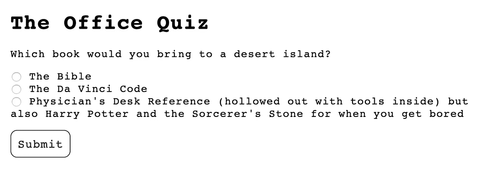
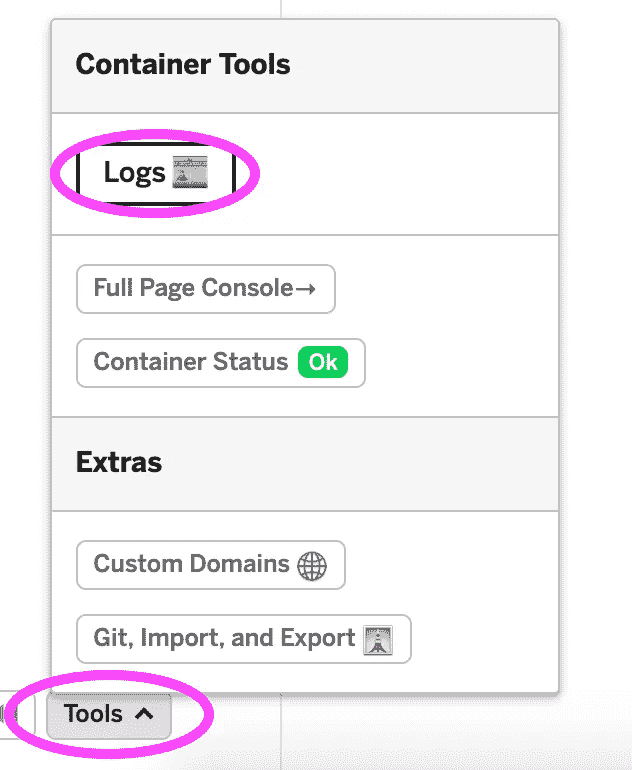

# 在 Glitch 上构建一个 Python Flask 应用程序！

> 原文：<https://medium.com/analytics-vidhya/build-a-python-flask-app-on-glitch-fc2c4367baaf?source=collection_archive---------2----------------------->

厌倦了用 Python 制作基于文本的自主冒险游戏？准备好通过结合 HTML/CSS 图形用户界面将您的 Python 程序带到下一个级别了吗？

Flask 是用 Python 后端构建 HTML/CSS web 应用程序的完美框架。在本教程中，我们将在 [Glitch](https://glitch.com/) 上构建一个*Office-*主题的 Flask 应用程序！


via [GIPHY](https://giphy.com/)

是的，你没听错——没有令人沮丧的下载或设置，没有用头撞墙。你可以使用 [Glitch](https://glitch.com/) 直接在你的浏览器中构建这个 Flask 应用！

我们将制作这个应用程序，要求您选择荒岛书籍…



…然后根据你的回答告诉你你是哪个*办公室*人物！


如果你还没有，去 [Glitch](https://glitch.com/) 做个账户。然后按下预览屏幕右下角的麦克风按钮，重新混合 [Flask Office starter 代码](https://glitch.com/~flask-office-starter)。


*注意:本教程假设读者熟悉 HTML/CSS 和 Python 编程。如果你对这些主题不熟悉，可以看看我的其他教程，如果你不怕的话，也可以跟着复制粘贴！*

# 模型-视图-控制器架构，或者为什么我们有所有这些文件

这么多文件，都是给你准备的！为什么这么多？


为什么文件树中有这么多文件？

首先，让我们回顾一下大多数 web 应用程序是如何分解的基础知识。

*   **模型**:这是你的应用的主要 Python 后端逻辑。你所有的类，函数等等。住在这里。我们的模型目前包含在 **model.py** 中，尽管在其他地方你可能会看到一个包含多个 Python 类和文件的文件夹。
*   查看:这是我们漂亮的 HTML/CSS 界面——用户看到的。我们的视图目前包含在**模板**文件夹中，其中包含两个空的 HTML 文件:**index.html**和**result.html**。还有一个**静态**文件夹，其中包含我们的 **style.css** 文件等资产。
*   **控制器**:控制器介于模型和视图之间，调用模型进行后端计算，并将结果传递给视图。我们的控制器住在 **server.py** 里。

为了将这种架构概念化，将 web 应用程序想象成一家餐馆会有所帮助。模型就是厨房，所有的食物都是在这里烹饪的。视图是呈现给客人的菜单。服务员就是控制者，跑在客人和厨房之间，给客人送食物。

# 预览主页

现在，我们的主页很无聊。如果我们按“显示”，我们只会看到一些非常简单的 Times New Roman 文本，上面写着“你好，世界！”


BOOOO 环

这条消息到底是从哪里来的？弹出打开 **server.py** ，看看能不能找到线。


实际上，我们将在这里变得有趣起来，而不是仅仅返回一个字符串，而是返回一个完整的 HTML 页面作为我们的主页。

您可以从导入中看到我们已经导入了`from flask import render_template`，这意味着我们可以使用 Flask 中的`render_template`函数来呈现 HTML 页面。

而不是回“你好，世界！”我将让我的 Flask 应用程序从我的**模板**文件夹中提供**index.html**页面。

```
[@app](http://twitter.com/app).route("/")
def home():
  return render_template("index.html")
```

我们已经准备好看看我们的应用程序现在做了什么…除了一条关于 Glitch 上编码 Flask 应用程序的**重要信息！**

# 在 Glitch 上使用控制台

每当你在 Glitch 上对 Flask 应用程序进行更改时，都需要一段时间才能生效。但是，您可以通过打开控制台并运行刷新命令来强制 Glitch 更新应用程序。

我通常通过点击左下角的“工具”，然后选择工具栏顶部的“日志”来打开控制台。然后，我可以导航到“控制台”作为选项之一，并运行“刷新”



键入“刷新”，然后点击返回！

顺便说一句，控制台也是你可以运行像`mkdir`和`touch`这样的命令来创建新目录和文件的地方。

# 在主页上使用模板

好的，你在控制台中运行了“刷新”,然后再次预览了你的应用。这是一个完全无聊的白页吗？

这是因为，如果你打开**模板**，然后打开**index.html**，我们实际上并没有在这里编写任何 HTML 代码！

让我们解决这个问题，添加一个 HTML 框架和一个标题:

```
<!DOCTYPE html>
<html>
  <head>
    <title>The Office Quiz</title>
    <link rel="stylesheet" type="text/css" href="static/style.css">
  </head>
  <body>
    <h1>
      The Office Quiz
    </h1>
  </body>
</html>
```

现在，在运行“刷新”之后，您应该会在页面上看到一些文本！


太美了。

# 制造另一条路线

我们已经建立了主页的基本框架。我们只需要另外一个页面，当用户发现他们是什么样的 Office 角色时就会得到这个结果。

让我们跳回 **server.py** 并添加这条路线。

```
[@app](http://twitter.com/app).route("/result")
def result():
  return render_template("result.html")
```

可以通过在点击“显示”时出现的应用程序 URL 后添加/result 来访问路径——例如，在代码中的 flask-office-starter.glitch.me/result.，我们定义了一个 Python 函数，当用户到达该页面时运行该函数。在这里，我们再次返回一个模板，但是这次是**result.html**文件。

让我们前往 **templates/result.html** 并稍微修饰一下模板！添加一个 HTML 框架和一个标题:

```
<!DOCTYPE html>
<html>
  <head>
    <title>The Office Quiz</title>
    <link rel="stylesheet" type="text/css" href="static/style.css">
  </head>
  <body>
    <h1>
      You're {{ character }}!
    </h1>
  </body>
</html>
```

`{{ character }}`行是一个占位符，我们稍后会谈到。很快，这将打印出用户所在的*办公室*的字符！

现在，如果您在控制台中运行“刷新”,在 Glitch 上按“显示”,并将“/结果”添加到 URL，您应该会到达您的结果页面！


“结果”路线中的存在主义快乐

注意`{{ character }}`还没有打印任何东西。这种情况很快就会改变！

# 以 HTML 格式发送数据

现在，我们要给用户一个小测验，将他们从主页带到结果页，在那里他们可以找到自己是哪个角色！

为了简单起见，我们的测验只有一个问题:荒岛书的问题。在我们的**index.html**模板的主体中，我们将使用 HTML 表单中的单选按钮来询问它:

```
<form method="post" action="/result">
      <p>
        Which book would you bring to a desert island?
      </p>
      <input type="radio" name="book" value="bible"> The Bible<br>
      <input type="radio" name="book" value="davinci"> The Da Vinci Code<br>
      <input type="radio" name="book" value="hp"> Physician's Desk Reference (hollowed out with tools inside) but also Harry Potter and the Sorcerer's Stone for when you get bored
      <p>
        <input type="submit" />
      </p>
</form>
```

该表单使用 POST 方法将数据从一个网页(index.html)发送到另一个网页(result.html)。表单将通过“/result”路径。

请注意，所有单选按钮的名称都是“book”

现在这个表单应该出现在主页上了！(记住，运行“刷新”，然后点击“显示”。)


# 模型编程

好了，我们要去后端走一趟。当我们的用户通过表单发送数据时，我们需要处理它。具体来说，我需要一个函数，它接收用户选择的书，并返回他们所在的办公室角色。

进入 **model.py** 并编写以下函数:

```
def get_character(book):
  if book == "bible":
    return "Angela"
  elif book == "davinci":
    return "Phyllis"
  elif book == "hp":
    return "Dwight"
  else:
    return None
```

注意，Python 中的每本书都与 HTML 中的单选按钮值相同。

现在，因为我很有想象力，我也想要一个函数，它从*Office*中获取一个角色，并将 URL 返回给他们的一个有趣的 gif。将此功能添加到 **model.py** :

```
def get_gif(character):
  if character == "Angela":
    return "[https://media.giphy.com/media/Vew93C1vI2ze/giphy.gif](https://media.giphy.com/media/Vew93C1vI2ze/giphy.gif)"
  elif character == "Phyllis":
    return "[https://media.giphy.com/media/1oGnY1ZqXb123IDO4a/giphy.gif](https://media.giphy.com/media/1oGnY1ZqXb123IDO4a/giphy.gif)"
  elif character == "Dwight":
    return "[https://media.giphy.com/media/Cz1it5S65QGuA/giphy.gif](https://media.giphy.com/media/Cz1it5S65QGuA/giphy.gif)"
  else:
    return None
```

# 用控制器连接模型和视图

好了，我们有了(有点)漂亮的外形。我们有我们(绝对)美丽的功能。现在我们需要连接它们！

直接进入控制器的核心， **server.py** 。

你可以在`import model`一行中看到，我们已经导入了 model.py 的所有内容，这些功能现在对我们可用了。

行`from flask import request`意味着我们现在有了一些处理 HTTP GET 和 POST 请求的功能。(GET 是指我们只要求网页，如主页，而 POST 将用于发送数据，如结果页。)

因为我们将数据发送到“/result”路由，所以我们需要修改头部以包含 POST 请求。更改第一行以包含 GET 和 POST 请求的功能:

```
[@app](http://twitter.com/app).route("/result", methods=["GET", "POST"])
```

现在，我们可以让我们的函数做不同的事情，这取决于用户是获取还是发送到页面。将您的函数修改为:

```
def result():
  if request.method == "POST":
    return render_template("result.html")
  else:
    return "Sorry, there was an error."
```

用 else 语句捕捉错误(比如当我们需要 POST 请求时发送 GET 请求)总是一种好的做法。

这很好，但我们仍然没有与用户数据进行交互或处理用户数据。

在函数的 if 分支中，您可以获取由类似这样的表单发送的所有数据。将这一行放在 if 分支内，但在 return 语句之前:

```
userdata = dict(request.form)
```

如果您打印数据，在 Glitch 上“刷新”并运行您的应用程序，当您提交表单时，您会在**日志**中看到类似这样的内容:

```
{'book': [u'bible']}
```

这是一个字典，其中“book”是一个键，值是一个单项式列表！您可以向下钻取并分离出具体的图书，如下所示:

```
book = userdata["book"][0]
```

现在我们可以将模型中的`book`变量输入到我们的`get_character`函数中，并找出用户是什么角色:

```
character = model.get_character(book)
```

最后，因为我很好奇，我将把`character`变量输入到`get_gif`函数中，得到一个用户 gif 的 URL！

```
gif_url = model.get_gif(character)
```

好吧…但是我们如何将用户的角色打印到结果页面呢？！

还记得在 results.html 的 h1 中，我们写了下面的占位符吗:

```
<h1>You're {{ character }}!</h1>
```

这个占位符实际上是在 [Jinja](https://jinja.palletsprojects.com/en/2.10.x/) 中，一种 Python 的模板语言。当我们渲染模板时，我们实际上可以定义`{{ character }}`应该有什么值。

```
return render_template("result.html", character=character)
```

如果我们跳到 result.html，我们甚至可以添加一个 gif 的占位符:

```
<p>
  
</p>
```

我们可以在呈现模板时将 gif_url 值和字符值一起发送。

```
return render_template("result.html", character=character, gif_url=gif_url)
```

现在，在 **server.py** 中，您完成的“/result”路线应该是这样的:

```
[@app](http://twitter.com/app).route("/result", methods=["GET", "POST"])
def result():
  if request.method == 'POST' and len(dict(request.form)) > 0:
    userdata = dict(request.form)
    print(userdata)
    book = userdata["book"][0]
    character = model.get_character(book)
    gif_url = model.get_gif(character)
    return render_template("result.html", character=character, gif_url=gif_url)
  else:
    return "Sorry, there was an error."
```

您能找到我偷偷添加检查的地方吗，以确保用户在发送表单之前确实填写了表单？！

运行“刷新”，按“显示”，测试您的测验！


# 使用 CSS 设置样式

最后一件事:去 **static/style.css** 添加你的风格。下面是我使用的简单样式表:

```
body {
  font-family: courier;
  margin: 2em;
  letter-spacing: 1px;
}input[type="submit"] {
  border: 1px solid black;
  font-family: courier;
  padding: 10px;
  border-radius: 10px;
  font-size: 1.1em;
  letter-spacing: 1px;
}input[type="submit"]:hover {
  background-color: #eee;
  cursor: pointer;
}
```

运行“刷新”，点击“显示”，欣赏您的作品！我发现 CSS 样式需要一段时间才能生效，所以不要害怕用一个[硬刷新](https://www.google.com/search?q=hard+refresh)来清空你的缓存。

恭喜你，你已经在 Glitch 上建立了一个 Flask 应用程序！


via [GIPHY](https://giphy.com/)

# 扩展ˌ扩张

*   当然是设计你的应用程序！
*   添加更多选项和结果。(迈克尔、吉姆和帕姆呢？)
*   向测验中添加另一个问题。

# 其他 Python 教程

*   [编码&英语文学:Python 中的自然语言处理](/@kellylougheed/coding-english-lit-natural-language-processing-in-python-ba8ebae4dde3)
*   [编码&外文 Lit:用 Python NLTK 解析但丁的《地狱》](https://towardsdatascience.com/coding-foreign-language-lit-analyzing-dantes-inferno-with-python-nltk-419124c9eb44)
*   [带蟒蛇的霍格沃茨分院帽](/@kellylougheed/hogwarts-sorting-hat-with-python-ae1ab98a3c6b)