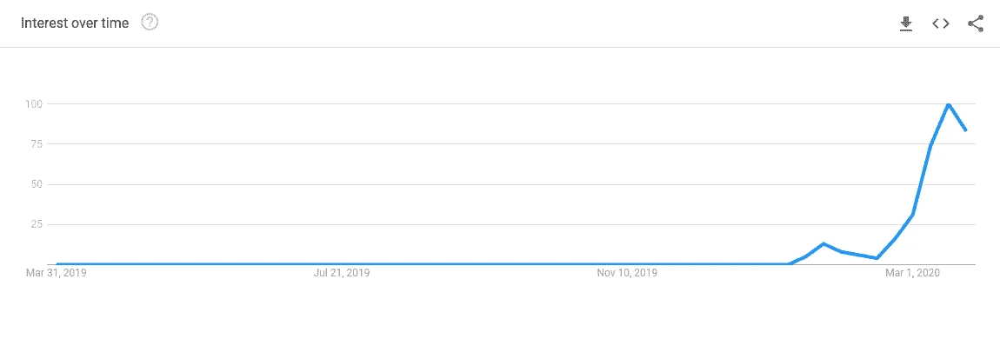

# 使用 Python 和 Messenger 跟踪冠状病毒更新

> 原文：<https://medium.com/analytics-vidhya/build-a-python-messenger-bot-to-provide-daily-coronavirus-statistics-for-your-country-5b3ca972e247?source=collection_archive---------26----------------------->

不需要谷歌趋势搜索就能注意到新冠肺炎(冠状病毒)目前受到的关注。随着整个国家目前处于封锁状态，并不断暴露于世界末日式的言论，很难区分事实信息和现实。这就是为什么这篇文章对**你**和你的**社区**都是**至关重要的**。

谷歌-随着时间的推移，对关键术语“冠状病毒”的兴趣趋势图