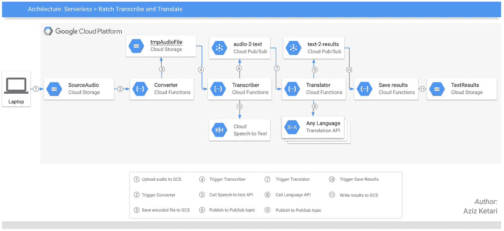
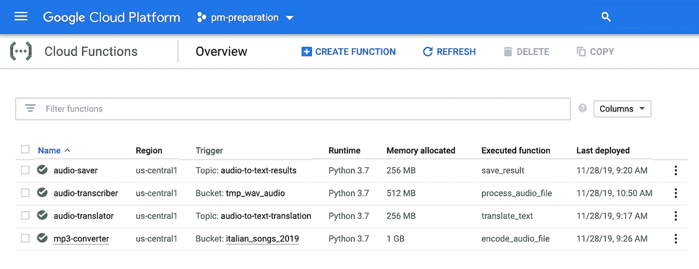
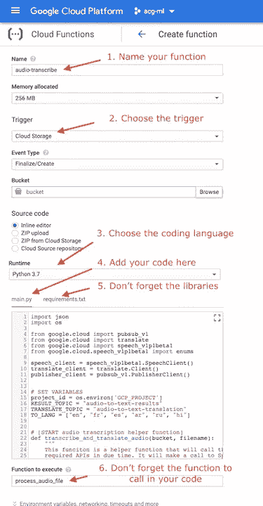
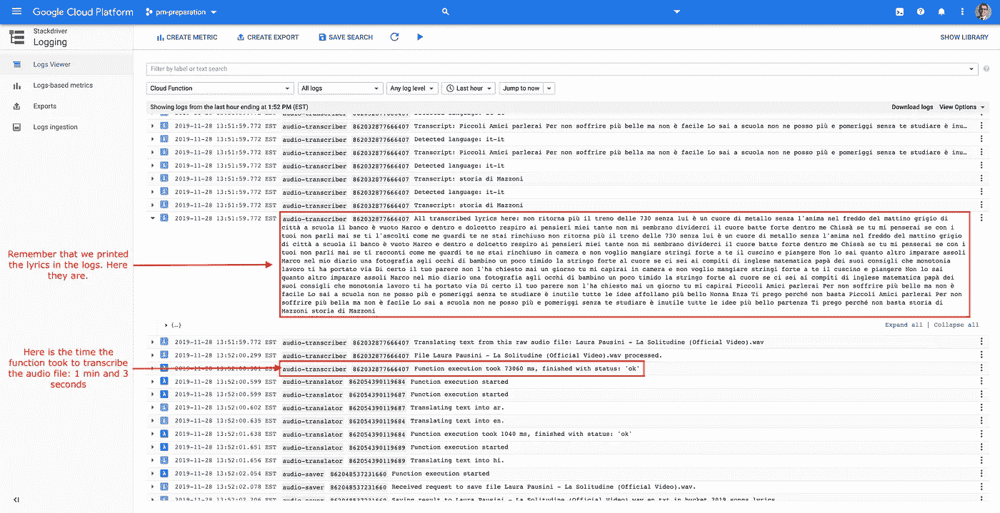
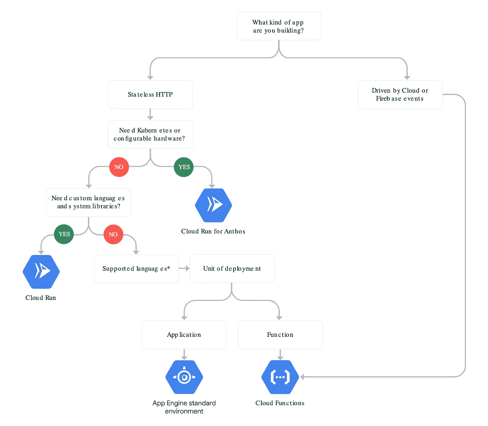

# 在 10 分钟内在谷歌云平台上建立一个无服务器的转录翻译

> 原文：<https://medium.com/analytics-vidhya/build-a-serverless-transcriber-translator-on-google-cloud-platform-in-10-min-54763568bf34?source=collection_archive---------11----------------------->

## 曾经想翻译你最喜欢的歌曲的歌词吗？



应用 GCP 架构

## 介绍

当我们构建产品时，我和我的团队有时会面临来自管理后端基础设施或维护 API 的意外开销。不是很性感的东西…但感谢谷歌在 GCP 提供了一些完全托管的服务。虽然它有一些副作用。(“*无服务器*”和“*现成的 API*”成为我真正感兴趣的东西)


这只猫身上有一种让他非常意大利化的特质！([来源](https://www.google.com/url?sa=i&source=images&cd=&cad=rja&uact=8&ved=2ahUKEwjc4p3slevlAhXRJzQIHaUxDoYQjB16BAgBEAM&url=http%3A%2F%2Fwww.quickmeme.com%2Fmeme%2F3umrwm&psig=AOvVaw2WaMjfP8LHfyDozA_-6RXH&ust=1573871317761996))

你为什么要在乎？嗯，我碰巧也在学意大利语。我使用的方法之一是翻唱 Spotify 上的歌曲。但是我(我的室友们真的)意识到我在喃喃自语而不是真的在唱歌。Spotify 并不总是提供歌曲的歌词。

因此，我决定构建一个性感的应用程序——按照我的标准——(无服务器，使用现成的 API)，可以转录和翻译我最喜欢的歌曲。

本文旨在指导您完成部署，最终，您应该能够在 Google 云平台上处理任何音频文件。
没有 DevOps 开销。没有模型训练或部署。只有好东西。

文章中显示的所有片段都可以在我的 [Github 资源库](https://github.com/aziz-ketari/google-cloud-apps/tree/master/ServerlessTranscriber)中找到。

最后一件事，我的第一篇文章*[*使用签名的 URL 在 GCP 上短暂分享内容*](/@ak3776/ephemeral-sharing-of-content-on-gcp-using-signed-urls-bc70dbcae875)*利用了 Google Cloud GUI，所以为了给我的生活增添趣味，我决定这次使用 CLI 命令。**

**我们走吧！**

## **启用 API(每个项目只需要做一次)**

```
**gcloud services enable cloudfunctions.googleapis.com
gcloud services enable pubsub.googleapis.com
gcloud services enable speech.googleapis.com
gcloud services enable translate.googleapis.com** 
```

## **创造资源**

**首先，我们需要创建 GCS 存储桶。第一个桶将包含音频文件(例如意大利歌曲 2019)，而第二个桶将包含转录的文本(例如歌曲歌词 2019)。你可以随意给它们起名字。**

**对于这个例子，我正在创建一个区域存储桶(省钱。活得更好。-沃尔玛)。我建议选择一个靠近你所在的地区，以减少上传文件时的延迟。(没有人喜欢等待)**

```
**# First bucket
gsutil mb -l us-west2 -c regional gs://[BUCKET_NAME_1]
# Second bucket
gsutil mb -l us-west2 -c regional gs://[BUCKET_NAME_2]**
```

**其次，我们需要创建消息传递系统的 PubSub 主题。第一个主题(例如音频到文本的翻译)将包含指示转录完成的消息。而第二主题(例如音频到文本的结果)将包含指示翻译完成的消息。**

```
**# First Topic
gcloud pubsub topics create [FirstTopic]
# Second Topic
gcloud pubsub topics create [SecondTopic]**
```

# **更严重的是:云功能**

**这次没有 CLI 命令。视觉支持更有用。下面是我们正在构建的函数的完整列表:**

****

**4 个功能，1 个 app，0 DevOps 开销。**

**让我们看看如何构建我们的第一个云函数:**

****

**重要字段**

## **第一云函数**

**现在你知道了如何创建云函数，去复制/粘贴这 4 个云函数的代码。您将在下面找到粘贴到 main.py 和 requirements.txt 中的每个云函数的代码。**

***小贴士:
1。云函数讨厌缩进标签。在复制/粘贴代码之前，不要忘记将所有的缩进标签转换成空格。
2。如果你打算转录大的音频文件，我建议你增加内存分配和超时时间。[默认值为 256 Mb 和 60 秒]***

**你也应该参考[我的回购最新代码版本](https://github.com/aziz-ketari/google-cloud-apps/tree/master/ServerlessTranscriber)**

**用于转换音频文件的云函数代码**

**对于库，添加以下内容:**

```
**google-cloud-storage==1.13.0
pydub==0.23.1**
```

****第二云函数****

**此外，如果你想知道更多关于语音转文本 API 的工作原理，它希望你指定假设的语言，但如果你不确定，你也可以添加一些替代语言。在这种情况下，假设音频文件中所说的语言是英语，可能的替代语言是西班牙语、法语或意大利语。**

***提示:Speech API 对依赖于音频文件格式的参数(通道数、采样率……)非常挑剔。您可以从 wave 文件的头中提取这些参数，并通过配置文件将它们发送给 API。***

**转录音频文件的云功能代码**

**对于库，添加以下内容:**

```
**google-cloud-pubsub==0.38.0
google-cloud-speech==1.2.0
google-cloud-storage==1.13.0
google-cloud-translate==1.3.1**
```

## **第三云函数**

**该功能将转录的文本翻译成英语、法语、西班牙语、阿拉伯语、俄语和印地语。该列表是在前面的函数中定义的。**

**翻译歌词的云函数代码**

**对于库，添加以下内容:**

```
**google-cloud-pubsub==0.38.0
google-cloud-translate==1.3.1**
```

## **第四云函数**

**就是这样！魔法已经基本完成了。最后一个云函数会将结果保存在您的目标桶中。**

**保存翻译歌词的云功能代码**

**对于库，添加以下内容:**

```
**google-cloud-pubsub==0.38.0
google-cloud-storage==1.13.0**
```

## **测试**

**只需将音频文件转储到您的存储桶中，并在您的结果存储桶中寻找文本文件。
例如，下面是 gsutil 命令，用于将公共音频文件复制/粘贴到您的私有存储桶中:**

```
**gsutil cp gs://italian_songs_2019/Laura_Pausini_La Solitudine.mp3 gs://[YOUR_SOURCE_BUCKET]/PATH/TO/THIS/FOLDER/**
```

****

**等等，别走！([来源](https://www.google.com/url?sa=i&source=images&cd=&cad=rja&uact=8&ved=2ahUKEwjW-te5vOzlAhVBJzQIHS-4ATkQjB16BAgBEAM&url=https%3A%2F%2Fimgur.com%2Fgallery%2FAT5SCUQ%2Fcomment%2F444373086&psig=AOvVaw0HKJGL1_THmjWp8tFf2iM_&ust=1573915997268540))**

## **使用 Stackdriver 记录日志**

**在您离开之前，我建议您访问日志工具。
极其有用。**

**这是一种让你的数据告诉你它在 GCP 的激动人心的冒险之旅的方式。它如何通过云功能导航，也许会在最近的 PubSub 主题酒吧停下来喝点东西，最终会在云存储桶中结束(为一个狂欢派对)。**

****

**太棒了。**

**让我们看看我们的应用程序做得怎么样！嗯…不管怎样，我们学到了很多！**

## **丰富**

**嗯，我们总是可以做得更好或者与众不同。以下是一些建议:**

*   ****Requirements.txt:** 由于云函数是无状态的，所以最小化要导入的库的数量将大大减少调用延迟。**
*   ****IO 运营:**这里肯定有一定的提升空间。在执行云功能时，可以使用临时目录来实现原子性。**
*   ****触发多样性**:我在这个应用程序中使用了云存储和发布/订阅作为例子。尽管如此，还有很多其他选择。**
*   **[**Cloud Composer**](https://cloud.google.com/composer/)**备选方案:**我决定在这个应用程序中使用云函数，但是还有其他备选方案，比如 Composer。事实上， [Composer](https://cloud.google.com/composer/) 也是无服务器的，它允许你使用 Airflow 来编排你的应用程序。如果你感兴趣，请在评论中告诉我。**
*   **[**云润**](https://cloud.google.com/run/) **备选:**也是一个选项。也没有服务器。也是事件驱动的。并且没有超时限制。但是只支持 HTTP 事件。但是如果你已经将代码打包在容器中，那么 CloudRun 是正确的选择。**
*   **[**app engine**](https://cloud.google.com/appengine/)**备选:**也是一个选项。也没有服务器。但是我建议只有当你正在构建一个具有其他功能的更复杂的应用程序时才使用它。对于这个小小的婴儿应用程序来说，这似乎有点矫枉过正**

**关于哪种产品最适合您的应用程序的更多细节，请查看 Google 提供的这个令人惊叹的流程图！**

****

**[来源](https://cloud.google.com/serverless-options/)**

**就这样结束了！**

**这是我关于媒体的第三篇文章。我希望你喜欢它！如果你有其他学习意大利语的建议，请告诉我。此外，请分享您对 Google Cloud 面临的任何问题的反馈或意见。**