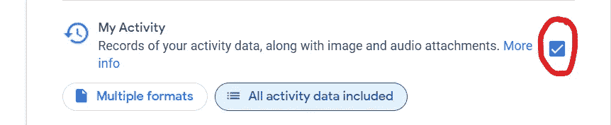

# 用你自己的谷歌搜索历史建立一个简单的自动完成模型

> 原文：<https://medium.com/analytics-vidhya/build-a-simple-autocomplete-model-with-your-own-google-search-history-ead26b3b6bd4?source=collection_archive---------6----------------------->


这里我们使用一个简单的 ***概率方法*** 用于自动完成模型。

首先，我们必须提取你的谷歌搜索历史。

去 https://takeout.google.com/settings/takeout

单击取消全选。(我们不需要所有的数据，谷歌搜索查询就足够了)


找到“我的活动”部分并选择它。



然后，我们必须为谷歌搜索查询过滤我们的结果。为此，**点击“包括所有活动数据”**并取消选择除“搜索”之外的所有选项。


然后，您可以选择 JSON 作为输出格式。为此，**点击‘多种格式’**并在下拉列表中选择 JSON。


继续下一步，选择您喜欢的下载方法。几分钟后，你就可以下载名为**外卖<一些数字>的 zip 文件了。拉链**。解压并找到 **MyActivity.json** 文件。这将是我们模型的输入文件。

让我们对 MyActivity.json 文件进行一些预处理，并将搜索查询提取到 myactivity.txt 文件中。这个文本文件填充是我们模型的输入。

```
import json
import re
data=[]processed=[]
regex = re.compile('[^a-zA-Z ]')with open('myActivity.json',encoding="utf8") as f:
    data = json.load(f)for i in range(len(data)):
    search_query = data[i]['title']
    if search_query.startswith('Visited'):
        search_query = search_query[8:].lower()
        search_query = regex.sub('', search_query)
        if search_query.startswith('http'):
            continue
        processed.append(search_query)
    elif search_query.startswith('Searched for'):
        search_query = search_query[13:].lower()
        search_query = regex.sub('', search_query)
        if search_query.startswith('http'):
            continue
        processed.append(search_query)
    else:
        passprint(processed[:50])with open('myactivity.txt','w') as file:
    file.write('\n'.join(processed))
```

在接下来的步骤中，我们将使用 JavaScript(😋为什么不呢？).也许你能把这个模型和一个简单的带有文本建议的前端系统结合起来。

导入所需的包。为此，你可能需要下载 npm 包[https://www.npmjs.com/package/sentence-tokenization](https://www.npmjs.com/package/sentence-tokenization)

现在我们必须逐行读取 myactivity.txt 文件，并对每个句子进行标记。标记化就是简单地将句子分割成单词，并将它们作为元素存储在类似数组的结构中。对于这个简单的模型，我只考虑了带有英文字母的单词。对于更高级的模型，您可以使用标点符号和表情符号作为标记。

在执行 main()函数之前，我们需要模型的一些辅助函数。

现在我们要建立一个小词汇量。在这个例子中，我们将使用在输入文件中至少出现两次的标记来构建词汇表。建立词汇后，将输入句子中的其他标记替换为<unk>标记。(这表示它是一个不在词汇表中的单词)</unk>

现在让我们深入研究模型的实际逻辑。

***该方法基于 n 元语言模型。n 元语法是 n 个标记的相邻集合。为了简单起见，考虑 n = 2。在这种情况下，n 元模型将被称为二元模型。***

句子“这是一个简单的概率模型”的二元模型将是

```
["this", "is"], ["is", "a"], ["a", "simple"], ["simple", "probabilistic"], ["probabilistic", "model"]
```

对于 n=3，三元模型将是

```
["this", "is", "a"], ["is", "a", "simple"], ["a", "simple", "probabilistic"], ["simple", "probabilistic", "model"]
```

同样，我们必须计算每个 n 元语法在输入文本中出现的次数。为此，我们可以使用一个 n 大小的窗口来扫描令牌列表。在此之前，我们必须添加特殊的标记来表示句子的开始和结束。~~和<e>。~~在句首加 n-1 次，而<e>只加一次。</e>~~</e>~~

现在我们有了二元模型和三元模型(即 n 元模型和 n+1 元模型)的计数。现在我们可以估计下一个单词的概率，给定前两个单词。

假设前面两个词(令牌)是[“什么”，“是”]。那么，对于词汇中的每个单词 ***w*** ，我们可以将概率计算为


上述计数有可能为 0。作为解决方案，我们可以将平滑常数 ***k*** 添加到等式中。那么等式就变成了，


同样，我们可以得到词汇表中每个单词的概率。

在计算每个单词的概率后，我们可以根据最大概率选择最佳建议。你也可以选择几个带有最大概率单词的建议。

我们可以通过使用几个 n-gram 计数来进一步开发该模型。如果开始的话是“什么是 a ”,我们可以使用几个模型并得到更多的建议。

*   使用["a"]作为起始标记，并使用单字和双字计数
*   使用["is "，" a"]作为起始标记，并使用二元模型和三元模型计数
*   使用[“什么”、“是”、“a”]作为起始标记，并使用三元组和四元组计数。

请注意，对于每种方法，我们总是必须使用 n-gram 计数和 n+1-gram 计数。

这里我使用了 5 克的计数。

用这种方法，对于起始词“什么是 a ”,我得到了下面的建议和各自的概率值。

功能→ 0.020064602834036733
轻量级→ 0.008857318249583442
良好→0.009494937

请注意，单词“good”出现了两次，因为 3-gram 和 4-gram 模型都预测了单词“good”。

完整的源代码:

如您所见，我们设法用概率方法构建了一个简单的自动完成模型。如果你对这种自然语言处理模型感兴趣，我非常鼓励你参加 Coursera 中 deeplearning.ai 的自然语言专业。你将能够通过机器学习和深度神经网络学习更高级的模型。

另一本有用的参考书籍[https://web.stanford.edu/~jurafsky/slp3/](https://web.stanford.edu/~jurafsky/slp3/)

祝你好运！！！