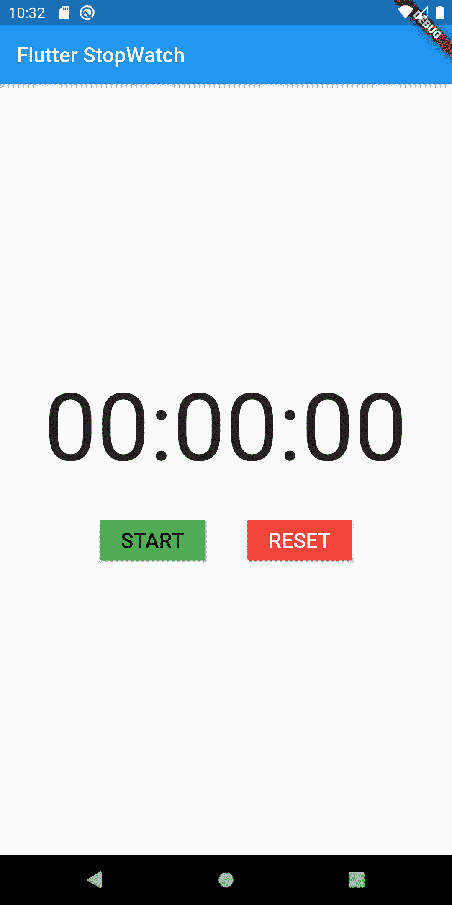
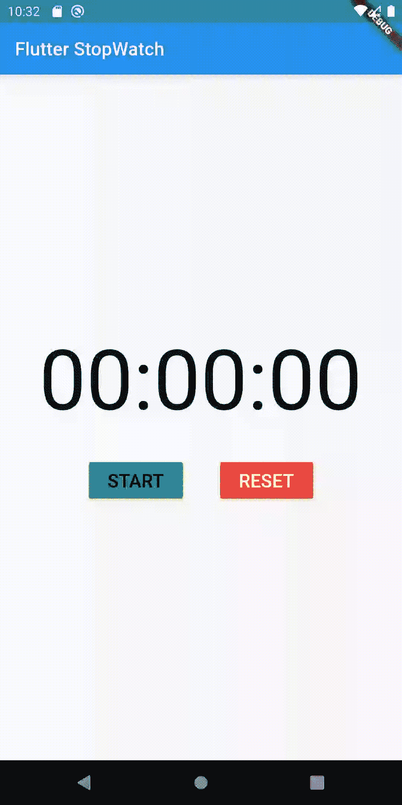

# 在 Flutter 中构建一个简单的秒表

> 原文：<https://medium.com/analytics-vidhya/build-a-simple-stopwatch-in-flutter-a1f21cfcd7a8?source=collection_archive---------1----------------------->

还是真的那么简单？

所以我在做一个项目，我需要实现一个简单的秒表，让用户知道完成一个特定任务所花费的时间间隔。好吧，这有多难？Dart 已经有了一个我可以直接使用的秒表()类。

但是当我开始工作的时候，我意识到我大错特错了，这么简单的特性是如何不容易实现的，Dart 中的 Stopwatch()类是如何的糟糕！(那只是一个人的看法。可能对你来说不吸)。由于我是一个懒惰的人，我想好吧，让我们搜索**“在 flutter 中创建秒表”**，然后复制代码并粘贴它。但是我的天啊！代码有多复杂。这就像一个简单的秒表功能的 1000 行代码。(使用你无法理解的代码是不好的做法)。

因此，我决定以尽可能简单的方式自己编写秒表功能，而不是遍历所有 1000 行代码。经过两个小时的编码和一个破碎的玻璃，我能够在左侧管理类似的东西。

**带有启动和重置按钮的简单秒表。**

它是用相当少的代码完成的。(希望你看完文章后也有同样的看法。手指交叉)

# 我构建该功能的思考过程:

*让我先带你看看我的思维过程。我要写下我到底在想什么(如果你想直接看代码，可以跳过这一部分)。*

好的，我需要一个看起来像 00:00 的计时器。它应该从一个开始按钮开始，然后用一个复位按钮归零。嗯……Dart 有一个秒表库(我之前用它来计算一串特定代码所用的时间)。我可以直接使用它并显示在屏幕上。嘣。我只需要使用一个文本小部件，启动秒表(使用 stopwatch()类)并在屏幕上显示经过的时间。

*但是等等。我需要每秒在文本小部件中读取一个不同的值。所以我需要以流的形式获取数据。* ***但遗憾的是秒表()类的 dart 没有方法获取值作为流*** *。每当调用它的一个方法时，它只输出一个值。*

*所以不能用。好了，这是我意识到这不会像我最初想的那么简单的地方。*

***新计划*** *。我需要创建一个每秒输出一个新值的流。有点像 1，2，3，4，5，6，…然后我可以监听流并更新文本小部件中的值。问题解决了(至少在我看来)。*

*但是等等。还有一个问题。当值超过 60 时会发生什么。我不能显示 61，62，63 等。没错。我需要格式化这些值，并更改分钟和秒，这样我就可以漂亮地显示它们。*

# 现在让我们来看代码

## 步骤 1:创建秒表流

首先，我们将创建一个流，它将给出每秒钟经过的时间，以便我们可以将它更新到 UI。

我们定义了一个名为 stopWatchStream()的方法，它将返回一个整数流。

我们将使用一个[流控制器](https://dart.dev/articles/libraries/creating-streams)来控制流的事件。

> 一个`StreamController`给了你一个新的流和一个在任何点从任何地方添加事件到流的方法。该流具有处理侦听器和暂停所需的所有逻辑。你返回流，把控制器留给自己。

当实例化 StreamController 时，我们需要传递一些参数。第一个是 onListen，每当我们想听流的时候就会调用它。下一个是 OnCancel，它将在取消流时被调用。我们一会儿会讲到原因。

## startTimer()

在 OnListen 中，我们传递了一个方法 startTimer。让我们看看 startTimer 在做什么。startTimer 正在创建 Timer.periodic()的新实例。Timer.periodic()接受两个参数:一个间隔和一个回调函数。它所做的是在每一个间隔之后，再次调用给定的回调函数&直到计时器被取消。这里，Timer.periodic()将在每 1 秒钟后调用 tick()函数。

> 您可以使用不同的间隔来代替 1 秒。只需更改 timerInterval 变量中的持续时间

## **打勾()**

现在让我们看看 tick()函数在做什么。tick 函数只是将计数器加 1，然后将计数器加到流中。每当我们监听流时，每次调用 streamcontroller.add()方法时，我们都会得到这个“计数器”。

## 停止计时器()

好了，现在让我们看看 stopTimer()方法，它将在取消流时被调用。我们正在做一系列的事情。首先，我们检查计时器是否不为空，即必须有一个正在运行的计时器实例。如果有人调用 stopTimer()方法而没有首先启动计时器，那么计时器将等于 null。

接下来我们取消计时器。一旦取消，它将每秒停止运行滴答功能。

我们还将它设置为 null，这样它从零开始，而不是从上次结束的地方开始。

接下来，我们将计数器设置为 0，这样，下次启动计时器时，它也会从 0 开始计数。

最后，我们使用 streamcontroller.close()关闭流

## 步骤 2:将计时器流添加到 UI

我们这里有 3 个主要部件:-

*   显示时间的文本小部件
*   开始按钮
*   重置按钮

文本小部件很简单。它只是以 HH:MM:SS 格式显示时间。

## 现在让我们看看开始按钮。

这里发生了很多事。

> timer stream = stopWatchStream()；

首先，我们从之前创建的 stopWatchStream()创建一个新的流，并将其设置为 var timerStream。现在你可能会想，为什么每次按下开始按钮时，我都要创建一个新的流。我可以在 initState 中直接创建一个新的流，这样效率会更高。

**一个大大的不！**

如果你这样做了，那么当你第一次点击开始按钮时，一切都会好的。但是如果你第二次点击开始按钮，你会得到这样的错误

> [扑:状态不好:流已经被监听](https://stackoverflow.com/questions/51396769/flutter-bad-state-stream-has-already-been-listened-to)

这是因为 dart 以某种方式允许您只听一次流，即使在取消订阅流之后。

解决这个问题的一个方法是使用广播流。但问题是它没有完全关闭流。它只是以某种方式暂停流，然后在重新开始时从我们之前离开的相同位置继续。

因此，在我们的秒表中，当我单击开始按钮时，我希望计时器显示为 1、2、3、4、5…然后单击重置按钮，应该会将计时器重置为 0。如果我第二次点击开始按钮，它必须从 0，1，2，3，4，5 开始，以此类推。但是如果你使用的是广播流，那么当你点击重置按钮时，界面中的计时器会回到 0，但是在后台计时器仍然会运行。因此，当你第二次点击开始按钮时，它不是从 0 开始，而是从 11、12、13 或类似的数字开始(从你第一次点击开始按钮后经过的秒数)。

所以为了修复这个 bug，我只是在每次点击开始按钮时实例化一个新的流。

## 听 timerStream

接下来我聆听小溪。所以在这里，每过一秒钟，我就会得到一个新的刻度值(比如 1，2，3，4，5，6，7)。但是我们不能直接在 UI 中显示刻度值。我们必须将其转换为 HH:MM:SS 格式。

正如您在 listen 函数中看到的，我们使用了 3 个字符串变量 hoursSTR、minutesStr 和 secondsStr。在其中的每一个中，我们都使用一种算法将刻度分别转换为小时、分钟、秒，然后更新 setState()函数中的变量。

让我用一个例子来解释 secondsStr 中的格式:

> **secondsStr = (newTick % 60)。地板()。toString()。padLeft(2，“0”)；**

假设 newTick 值是 81。当然我们不能显示 81，因为一个钟只有 60 秒。秒钟后，必须从 1 开始，直到 60，以此类推。因此，根据 HH:MM:SS 格式，81 秒在我们的秒表中应该显示为 21 秒。让我们看看我们的代码是如何做到这一点的。

前 81 % 60 = 21

。floor()只是将它更改为 int。(我知道它已经是 int 了，只是作为一个额外的措施。预防胜于治疗对吧！)

接下来使用 to String()将其转换为字符串

Well padLeft(2，' 0 ')对 21 没有影响。但是如果它是一个一位数，那么它将在数字的左边填充一个 0。(例如-> 4 到 04)

minutesStr 也是一样的，不同的是，我们首先将 tick 值除以 60，以将秒转换为分。

类似地，在 hoursStr 中，我们将它除以 3600 以转换为小时。

(你也可以将天数除以 3600*24 或年数除以 3600*24*365)

## 最后是重置按钮

我们只需在这里取消对调用 stopTimer()方法的流的订阅(timerSubscription.cancel())，我已经在上面解释过了。

我还将 timerStream 设置为 null，作为额外的措施。

# 搞定了。

就这样。我们有秒表。

**点击开始按钮启动计时器，重置按钮将时间重置为零。**

> 你可以在 github 这里找到完整的代码:【https://github.com/realdiganta/Flutter-Stopwatch

*请告诉我，如果我在代码中或解释代码时犯了任何错误，或者如果你认为我可以以任何方式使代码更简单。因为这是我背后的主要动机:* ***用尽可能少的代码行在 Flutter 中构建一个秒表。***

如果我能以任何方式为你的一天增添价值，请不要忘记为这篇文章鼓掌。这真的鼓励我写更多这样的文章。

> 你可以在这里联系我:**digantakalita.ai@gmail.com**

# 参考

1.  [https://dart.dev/articles/libraries/creating-streams](https://dart.dev/articles/libraries/creating-streams)
2.  [https://bloclibrary.dev/#/fluttertimertutorial](https://bloclibrary.dev/#/fluttertimertutorial)