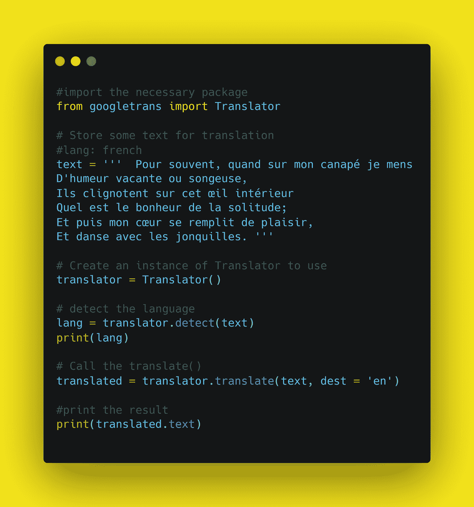

# 使用 Python 构建一个翻译器

> 原文：<https://medium.com/analytics-vidhya/build-a-translator-using-python-d4fcbd0adc04?source=collection_archive---------9----------------------->

在这篇博客文章中，我们将学习如何创建一个翻译器。我们将看到 python 中的实现。


[python 中终极资源的储存库](https://github.com/ayushi7rawat/Ultimate-Python-Resource-Hub)。发现有用就掉颗星！有什么要补充的吗？开个 PR 就一样了！

你可以参考我的 YouTube 视频教程，以便更好地理解

# 这个博客将会涵盖什么

```
1\. Translator Introduction
2\. What is Googletrans?
3\. Create a Translator with Python
```

# 译者简介:

字典定义:

> 翻译的定义是帮助说不同语言的人交流，或者把一种语言的东西(比如一篇演讲或一本书)翻译成另一种语言以便人们理解的人。

如果你想了解更多，可以参考[翻译维基百科页面](https://en.wikipedia.org/wiki/Translation)。使用此链接导航到 GIF 的维基百科页面。

# 什么是 Googletrans？

Googletrans 是一个免费且无限制的 python 库，实现了 Google Translate API。这使用了 [Google Translate Ajax API](https://translate.google.com/) 来调用诸如 detect 和 Translate 这样的方法。

*   快速可靠——它使用的服务器与 translate.google.com 使用的服务器相同
*   自动语言检测
*   批量翻译
*   可定制的服务 URL
*   连接池(使用请求的优势。会话)
*   HTTP/2 支持

如果你想了解更多，可以参考 [Googletrans 文档](https://py-googletrans.readthedocs.io/en/latest/)。使用此链接导航到文档。

现在你已经了解了 Translator 和 Googletrans 的基础知识，我们可以前进到编码部分了。

# 该编码了！

你可以在我的 [GitHub 库](https://github.com/ayushi7rawat/Youtube-Projects/tree/master/Build%20a%20translater)找到所有代码。发现有用就掉颗星。



# 安装 Googletrans

打开您的终端并运行以下命令

```
pip install googletrans
```

现在我们有了这个包，我们准备将它导入到我们的 python 脚本中。

```
from googletrans import Translator
```

让我们存储一些将用于翻译的文本。您可以使用自己选择的任何文本片段。我用了威廉·华兹华斯的一首我最喜欢的诗《水仙花》。我们把它存储在`text`里吧。这是这首诗的最后一节。

我正在使用的语言是`French`。你可以选择任何你喜欢的语言。

如果你愿意，你甚至可以把文本作为用户输入，这样你就不必每次想用翻译器的时候都要修改你的程序。

```
text = '''  Pour souvent, quand sur mon canapé je mens
D'humeur vacante ou songeuse,
Ils clignotent sur cet œil intérieur
Quel est le bonheur de la solitude;
Et puis mon cœur se remplit de plaisir,
Et danse avec les jonquilles. '''
```

让我们创建一个 Translator 实例来使用。

```
translator = Translator()
```

这使用了 [Google Translate Ajax API](https://translate.google.com/) 来调用诸如 detect 和 Translate 这样的方法。现在，让我们调用`translator`上的`detect`方法，传入我们存储在`text`中的数据，并将其存储在`lang`中。

```
lang = translator.detect(text)
print(lang)
```

现在让`print`出来吧。

*   `lang=fr`表示检测到的语言是法语。
*   `confidence=0.9365149`是翻译者对语言检测的信心百分比。

```
Detected(lang=fr, confidence=0.9365149)
```

一旦完成，让我们继续前进，真正翻译它。我在这里调用`translator`上的`translate`方法，并传递两个参数。

*   `text`:我们的原始语言数据
*   `dest`:我们的目标语言

现在，要参考其他语言代码，您可以参考[谷歌语言文档](https://cloud.google.com/translate/docs/languages)

注意:如果您没有指定任何目标语言，它将自动切换到默认语言，即`English`。

```
res = translator.translate(text, dest = 'en')
```

最后，让我们通过打印我们的`res`来验证一下。

```
Often when on my couch I lie
In a vacant or pensive mood,
They blink on that inner eye
What is the happiness of solitude;
And then my heart fills with pleasure,
And dance with the daffodils.
```

这就是转换的方式。这是关于用 Python 创建一个翻译器的全部内容。就是这样！很简单，不是吗？希望这篇教程有所帮助。

您可以使用这个库，探索更多的特性，甚至使用 Tkinter 来利用 Python GUI。

你可以在我的 [GitHub 库](https://github.com/ayushi7rawat/Youtube-Projects/tree/master/Build%20a%20translater)找到所有代码。发现有用就掉颗星。

感谢您的阅读，我很乐意通过[Twitter](https://twitter.com/ayushi7rawat)|[LinkedIn](https://ayushirawat.com/build-a-translator-using-python)与您联系。我会推荐你去看看 YouTube 上的视频，别忘了订阅我的频道。

请分享您的宝贵反馈和建议！

你绝对应该看看我的其他博客:

*   [Python 3.9:你需要知道的一切](https://ayushirawat.com/python-39-all-you-need-to-know)
*   [终极 Python 资源枢纽](https://ayushirawat.com/the-ultimate-python-resource-hub)
*   [GitHub CLI 1.0:你需要知道的一切](https://ayushirawat.com/github-cli-10-all-you-need-to-know)
*   [成为更好的程序员](https://ayushirawat.com/become-a-better-programmer)
*   [如何制作自己的谷歌 Chrome 扩展](https://ayushirawat.com/how-to-make-your-own-google-chrome-extension-1)
*   [使用 Python 从任何 pdf 创建您自己的有声读物](https://ayushirawat.com/create-your-own-audiobook-from-any-pdf-with-python)
*   你很重要，你的心理健康也很重要！

# 资源:

*   [py-googletrans.readthedocs.io/en/latest](https://py-googletrans.readthedocs.io/en/latest/)
*   [github.com/ssut/py-googletrans](https://github.com/ssut/py-googletrans)
*   [github.com/Zulko/moviepyhttps://pypi.org/pr](https://github.com/Zulko/moviepyhttps://pypi.org/project/googletrans/)
*   [poetryfoundation.org/poems/45521/i-wandered](https://www.poetryfoundation.org/poems/45521/i-wandered-lonely-as-a-cloud)
*   [cloud.google.com/translate/docs/languages](https://cloud.google.com/translate/docs/languages)

在我的下一篇博客文章中再见，保重