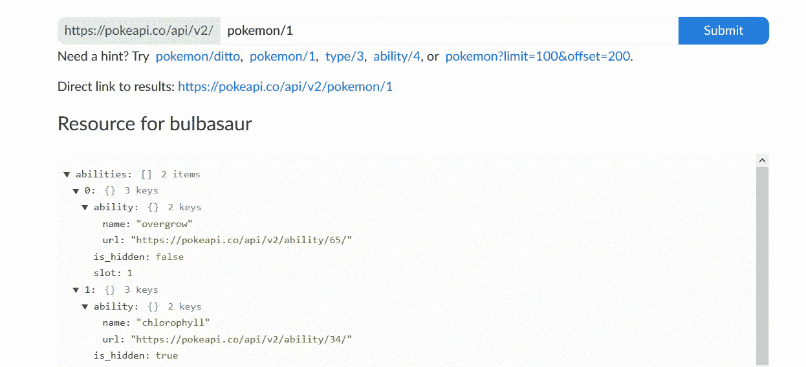
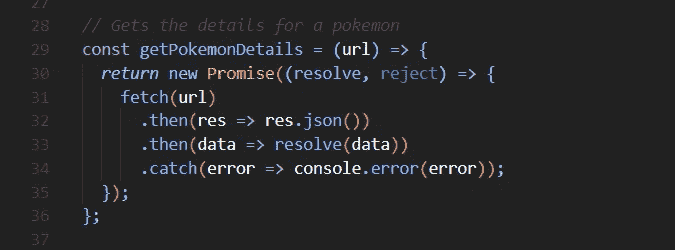

# 用 Node.js 和神奇宝贝 API 构建一个 Twitter Bot

> 原文：<https://medium.com/analytics-vidhya/build-a-twitter-bot-with-node-js-and-the-pok%C3%A9mon-api-963edf7ce2a8?source=collection_archive---------16----------------------->


本文的目标是向您展示如何计划、开发和部署 Twitter bot。如果您继续下去，最终您将拥有一个已部署的 Twitter bot，但这可以用作与 Twitter API 交互和了解 Heroku 的通用模板。我们将制作的机器人将每小时在推特上发布一次口袋妖怪精灵的图像，并配有描述它的标题。


Twitter bot 将使用一些技术，但主要是使用 Twitter API、Pokémon API、Node、JavaScript ES6 Promises 和 Heroku。到本文结束时，您将拥有一个类似这样的部署好的 Twitter 机器人:[https://twitter.com/Pokemon_Sprites](https://twitter.com/Pokemon_Sprites)。

编程一个 Twitter 机器人的过程相当简单，一旦你知道如何制作一个，你可以让他们做的事情是无限的。从档案里发照片？记录股票市场的财务变化？转推# SpaghettiWestern 西部电影的图片？所有这些都可以通过 Twitter API 和技术诀窍或好奇心来实现。

# 从 Twitter API 开始

对于我们的 Twitter 机器人，我们需要两样东西:

1.  一个新的推特账户。
2.  一个拥有 API 密钥和读/写权限的 Twitter 开发人员帐户。

## 报名

首先，我们将创建一个 Twitter 帐户或登录到您已经拥有的 Twitter 帐户(机器人将在帐户的时间轴上发布推文，因此最好创建一个新帐户)。要创建一个新账户，请点击 Twitter 链接:【https://twitter.com/i/flow/signup。

如果你注册时只有一个电话号码，*你必须给你的账户添加一个电子邮件。*我们将需要这个链接到一个开发者账户。创建帐户后，我们准备开始设置我们的开发者帐户。

## Twitter 开发者门户

在这里，我们可以申请我们的开发者帐户:

[https://developer.twitter.com/en/apply/user.html](https://developer.twitter.com/en/apply/user.html)

在接下来的几个步骤中，我们有几个选择，但文档对此做了很好的解释。


1.  我们想在业余爱好者类别下申请制作一个 Twitter 机器人，一旦选中，单击“下一步”。
2.  填写您的国家和您的机器人的名称，然后单击“下一步”。
3.  描述你打算用 Twitter 开发者账户做什么——用神奇宝贝 API 做一个 Twitter 机器人。对所有选项选择“否”，然后单击“下一步”。
4.  检查你的信息，并确认它看起来不错。
5.  接受服务条款。(我们快到了！)
6.  点击 Twitter 发送给您的电子邮件中的确认信息。
7.  给你的新机器人命名！
8.  跳到仪表板-我们将需要更改设置并重新生成密钥。


点击“应用程序设置”查看设置


常规设置视图

9.在“设置”页面上，在“应用程序权限”标题下，将权限编辑为“读写”。

10.现在滚动到顶部和 change tab 窗格，查看您的 API 密钥和令牌。

11.我们需要 4 样东西:API 密钥、API 密钥秘密、访问令牌密钥和访问令牌秘密。

12.重新生成并写下它们，或者复制并粘贴到某个安全的地方以备后用。

13.机器人时间到了！

# 规划我们的计划

文章的这一部分将关注 Twitter 机器人的实际编程。但是，它确实假设了一些事情:对终端或命令行的基本理解，JavaScript 基础知识，以及对使用 API 和 JSON 的一般了解或理解。然而，我们不会对这些话题中的任何一个进行深入探讨，如果一次只看一部分，这里没有什么是特别难理解的。

在我们开始实际编写代码之前，重要的是我们要考虑我们要达到的目标，这个项目的 MVP(最小可行产品)是什么？不要太花哨——一个每小时发一次精灵的推特，并配有简单说明的机器人。我们知道我们需要使用神奇宝贝 [API](https://pokeapi.co/) 来获取这些信息，所以让我们从这里开始。


我们的机器人将发布的推文示例

## 神奇宝贝 API

Pokémon API 是使用 API 和 JSON 的最友好和最容易的入口之一。这是一个 [RESTful](https://developer.mozilla.org/en-US/docs/Glossary/REST) API，具有易于理解的探索数据的路径。一些端点返回表示 Pokemon 的对象的分页数组，我们可以探索其细节，但我们感兴趣的是单个 Pokemon 的端点，它将具有完整的细节。



妙蛙种子精灵宝可梦的第一个精灵宝可梦的终点

当我们对数据库进行 API 调用以获取 Pokemon 的详细信息时，我们将使用上图中“提交”按钮列出的这些端点路由。查看口袋妖怪 1 号妙蛙种子的信息，我们可以看到许多不同类型的数据。我们有键/值对来访问返回的 JSON 中我们想要使用的数据。我们可以通过导航数组和对象来找到我们需要的东西，从而缩小取值范围。[查看妙蛙种子的原始 JSON。](https://pokeapi.co/api/v2/pokemon/1)

对于 API 端点，最重要的是我们可以通过口袋妖怪的名字*或者他们的 ID* 来访问它。沿着 ID 的路线，我们可以使用普通的 JavaScript 功能创建一个随机数来附加到该路线，因此我们的 Tweet 每小时都会被随机化。

```
[https://pokeapi.co/api/v2/pokemon/**811**](https://pokeapi.co/api/v2/pokemon/811)Here '811' represents the unique endpoint for a Pokemon. We can append numbers onto this to randomize the Pokemon encountered.
```

了解 API 的端点和数据的形状有助于我们在开始编写代码将所有这些信息整合在一起时做出重要的设计决策。例如，我们可以使用以口袋妖怪的名字结尾的路线来创建搜索功能！了解了所有这些，是时候开始编程了。

# 编写我们的程序

## 在终点站

为了开始，我们将需要打开一个终端或命令行，并导航到我们想要开始我们的项目的任何地方。在那里，我们将创建一个新的文件夹和一些文件。从命令行输入:

```
mkdir pokemon-bot && cd pokemon-bot
```


这将创建一个名为“口袋妖怪机器人”的目录，并从命令行进入。现在运行:

```
npm init -y
```

这将为您的应用程序初始化一个节点包。

在我们离开航站楼之前，我们还需要一些东西:

```
npm i twitter node-fetch
```

这将安装两个包，我们需要使用我们的机器人 [twitter](https://www.npmjs.com/package/twitter) 和[节点获取](https://www.npmjs.com/package/node-fetch)。这些允许我们在 Node/JavaScript 环境中使用 Twitter API 并向 Pokémon API 发出获取请求。

最后，我们需要三个文件:

```
touch Procfile .gitignore bot.js
```

同样，我们需要初始化我们的项目:

```
git init
```

“Touch”创建文件，所以我们用它来为 Heroku 创建一个[**proc file**](https://devcenter.heroku.com/articles/procfile)**(这将类似于我们如何在本地运行我们的 bot)，一个 **gitignore** 以便我们不会将不需要的东西推送到 Github，以及 **bot.js** ，将运行我们的程序的实际 JavaScript 文件。运行‘Git init’将初始化我们的存储库，以便与 [Git 的版本控制](https://git-scm.com/book/en/v2/Getting-Started-What-is-Git%3F)软件一起使用。现在我们可以输入“代码”或者“原子”在我们选择的编辑器中打开我们的项目(或者打开您的编辑器，然后打开“pokemon-bot”文件夹)。**

## **在我们的编辑器中**

1.  **在我们的**里。gitignore** 我们需要添加的文件:**

```
node_modules 
image.png
```

**当提交到 Github 时，这将忽略我们的 node_modules 和我们将要创建的映像。**

**2.在我们的 **Procfile** 中，我们将添加:**

```
worker: node bot.js
```

**一旦部署到 Heroku，这就是运行我们的 **bot.js** 文件所需的全部内容。此时，我们可以编写机器人的功能。**

**在我们的 **bot.js** 文件中，为了测试一切正常，添加:**

```
console.log(‘Hello, world’);
```

**在终端运行中:**

```
node bot.js
```

**你应该看到终端上印着“Hello，world”。如果是这样，继续删除控制台语句——这只是为了测试我们的文件是否链接在一起。**

**3.在我们的 **bot.js** 文件中，我们有要添加的导入和精灵宝可梦 API 需要的两个变量:**

```
const Twitter = require(‘twitter’);const fs = require(‘fs’);const fetch = require(‘node-fetch’);const request = require(‘request’);const baseURL = “https://pokeapi.co/api/v2/pokemon/";const pokemonCountURL = “https://pokeapi.co/api/v2/pokemon-species/?limit=0";
```

**' Twitter '允许我们使用他们的 API，' fs '允许我们使用[文件系统](https://developer.mozilla.org/en-US/docs/Web/API/FileSystem)，而' fetch '和' request '将在我们的 API 调用中使用。“baseURL”和“pokemonCountURL”也将用于在我们构建唯一的 URL 端点来访问 Pokemon 数据时与 Pokémon API 进行通信。**

**4.接下来，我们将使用之前保存的 API 键声明我们的 config 对象，并将其传递给 Twitter API 的一个新实例。这个实例化的变量‘pokemon bot’就是我们用来发布图片和推文的东西。**

```
const config = { consumer_key: ‘123YourKey’, consumer_secret: ‘456YourOtherKey’, access_token_key: ‘123AnotherKey’, access_token_secret: ‘456TheLastOne’};const PokemonBot = new Twitter(config);
```

**此时，你的 **bot.js** 文件应该看起来像这样，并包含*你的* API 键。**

****

**您的配置将在“TEST”所在的每个位置有唯一的值**

## **服务和助手功能**

**现在我们可以编写四个助手/服务函数，我们将使用它们来 1)获取 Pokédex 计数，2)在 Pokédex 计数范围内创建一个随机数，3)获取 Pokemon 的详细信息，以及 4)根据 Pokemon 精灵的 URL 下载一个图像。**

1.  **getPokemonCount()**

****

**ES6 承诺😊**

**这是一个相对通用的函数，我们将使用它来获得 Pokédex 的当前计数(它总是在增长，因此我们的 bot 将以这种方式面向未来)。它接受 Pokémon API 的“URL”端点，并发回一个响应，我们将其转换为 JSON 并作为“数据”返回。我们将使用该 JSON 来获取 Pokédex 的当前计数，并使用该计数创建一个新的随机数。这个数字将是传入 Pokémon API 的 RESTful 端点的 ID，它将返回给定 Pokemon 的详细信息。**

**这个函数和其他几个函数将利用 [JavaScript 承诺](https://developer.mozilla.org/en-US/docs/Web/JavaScript/Reference/Global_Objects/Promise)。当我们一起运行我们的代码时，它需要异步运行，这样我们就可以等待一个调用的结果，以便进行另一个调用——例如，在我们的第二个 API 调用中，我们将无法访问详细的 Pokemon URL，所以我们需要首先获得我们的计数来构造我们的链接。**

**2.randomNumberWithinRange()**

****

**另一个一般化的函数，利用普通的 Math.random()获得 Pokédex 计数范围内的随机数。**

**3.getPokemonDetails()**

****

**类似于 getPokemonCount()，getPokemonDetails()将返回一个承诺并接受一个“url”——该 URL 将是我们用“baseURL”变量和 randomNumberWithinRange()的结果创建的。**

**4.downloadImage()**

****

**[https://developer . Mozilla . org/en-US/docs/Web/API/Streams _ API/Using _ writable _ Streams](https://developer.mozilla.org/en-US/docs/Web/API/Streams_API/Using_writable_streams)**

**该函数将接受 uri(特定资源的标识符，我们图像的 URL)、文件名和回调函数。结合承诺，这将从 URI 请求资源，通过文件系统将其写入文件，并在传递给它的回调函数中解析承诺。**

**将所有这些函数组合在一起将产生我们的机器人需要发送 tweet 的所有数据——pokédex 计数、代表 Pokemon 的新随机 ID、Pokemon 的详细信息以及下载的精灵。**

**最后，我们需要编写逻辑来将我们所有的元素 alchemize 在一起，并发布一条 tweet。**

## **构建我们机器人的大脑**

**首先，我们需要声明一个异步箭头函数:**

```
const encounterAndTweetPokemon = async () => {};
```

**我们将需要我们的功能是异步的，以便利用承诺的待定性质。**

****

**我们稍后将在函数体中更新“标题”**

**我们的首要任务是声明“caption”以便以后使用，并运行我们的第一个 API 服务函数“getPokemonCount()”。我们将传入之前定义的 pokemonCountURL，并用'将一个新的承诺链接到它上面。然后(回应)’。这将从 API 调用返回解析后的数据，有了这些数据，我们可以使用带“response.count”的点符号来访问计数值。**

****

**现在我们将添加另一个。then()'，这次使用的是我们从 getPokemonCount()承诺返回的 pokedexCount。有了这个值，我们可以向 getPokemonDetails 传递一个[模板文本](https://developer.mozilla.org/en-US/docs/Web/JavaScript/Reference/Template_literals)，它将 baseURL 和我们的 helper 函数的结果与 pokedexCount 结合起来。**

```
getPokemonDetails(`${baseURL}${randomNumberWithinRange(1, pokedexCount)}`)
```

**这将最终看起来像:【https://pokeapi.co/api/v2/pokemon/549并成为传递给函数的 URL。**

****

**让我们看看数据吧！**

**在这里面。然后(口袋妖怪)‘我们有一个随机口袋妖怪的 JSON！我们可以导航到那个口袋妖怪的对象属性，以获得它的编号、名称、类型和口袋妖怪前视图的 URI 等值。例如，Pokemon 可以有多种类型，因此要访问第一种类型，我们将声明:**

```
const type = pokemon.types[0].type.name;
```

**这将访问类型数组中的第一个对象，在第一个类型对象中，我们访问属性“name”。我们可以使用这个变量“type”和我们声明的其他变量，将一个模板文本赋给上面作用域中声明的标题变量。这将是我们简单而有效的推文标题。**

```
(no. 658) — greninja — water
```

**最后，我们返回另一个下载 Pokemon 图像的承诺——我们传递我们的 photoURL、文件名和解析承诺的回调函数。此时，我们的函数从 Pokédex 中获得一个随机的 Pokemon，创建关于它的标题，并下载它的图像！我们肯定会到达那里。**

****

**[https://nodejs.org/api/fs.html](https://nodejs.org/api/fs.html)—关于文件系统的更多信息**

**我们可以使用文件系统来读取我们在 downloadImage 函数中创建的文件。数据接受引用项目目录的“__dirname ”,并帮助我们创建图像文件的路径。现在，我们通过上传存储在变量数据中的图像来与 Twitter API 进行交互。我们[使用‘媒体/上传’参数和我们的媒体对象‘数据’发布到 Twitter](https://developer.twitter.com/en/docs/twitter-api/v1/media/upload-media/api-reference/post-media-upload) 。**

****

**最后，我们可以返回媒体并将其发布出去。从我们最后的承诺返回“媒体”,我们为我们的 Heroku 日志记录了一个成功的更新。我们声明“status”，这是一个包含我们的标题和惟一的媒体 ID 的对象，我们在返回的承诺中上传我们的图像。现在需要做的就是将该状态对象添加到 PokemonBot 中，该 pokemon bot 已经在我们的函数解析时积累了数据。简单地说，我们只需记录 tweet 并捕捉任何发生的错误——一旦我们部署完毕，这一切都是为了 Heroku。要运行我们的函数，我们必须在第 98 行用' encounterAndTweetPokemon()'调用它。此时，我们可以在终端中运行“node bot.js ”,我们应该可以在终端中看到控制台日志以及时间线上的 tweet！**

****

**最后，我们的机器人的大脑。**

**如果一切正常，我们可以准备将我们的机器人部署到 Heroku，这样它将在设定的时间自动运行。**

**[代码参考](https://github.com/sanchito59/Pokemon_Twitter_Bot/blob/master/bot.js)**

# **准备部署**

**我们将从编辑 Twitter 配置对象开始，这样如果我们有 Github repo，我们的变量就不会公开可见。Heroku 很聪明，可以通过我们将要改变的一些设置来读取这些值。**

****

**您永远不希望公开暴露您的 API 凭证**

**这就是我们的代码——现在我们可以准备部署到 Heroku 并在线托管我们的 bot 了。**

# **设置和部署**

1.  **[创建一个 Heroku 帐户或登录](https://id.heroku.com/login)**
2.  **[下载并安装 Heroku CLI](https://devcenter.heroku.com/articles/heroku-cli#download-and-install)**
3.  **在终端中，使用 Heroku 帐户和 CLI 设置，运行:**

```
heroku create
```

**这将创建一个新的 Heroku 存储库，当我们在线部署我们的应用程序时，我们会将它推送到这个存储库。Heroku 对你的存储库和应用程序名称进行随机化，所以为了方便起见，如果你愿意，你可以选择运行以下代码:**

```
heroku apps:rename newname
```

**“新名字”是“口袋妖怪机器人 5000”或任何你喜欢的名字。**

****

**初始化我们的存储库后，我们可以一次运行一个命令:**

```
git add .git commit -m “prepare files to deploy to heroku”git push heroku master
```

**这将添加我们所有的文件，不包括**中的文件。gitignore** ，用我们指定的消息在我们的 Git 历史中“提交”，并将代码推送到 Heroku。如果一切顺利，我们应该会在仪表板中看到我们的应用程序！**

****

**您的应用程序将如下所示列出**

**点击我们的应用程序会将我们带到另一个特定于我们的应用程序的仪表板；在这里，我们将添加 Heroku Scheduler 插件，并设置我们的 API 键供 Heroku 读取。**

****

**“配置附加组件”是我们的目标**

**一旦我们进入附加组件页面，我们将搜索 Heroku 调度程序，添加它(免费)，然后单击附加组件来设置我们的 [Dyno](https://www.heroku.com/dynos) 作业。**

****

**每月 550 小时的免费动态时间已经足够了**

****

**我们的任务非常简单——我们可以选择它何时运行以及任务做什么。Heroku 调度程序将使用一个内置命令行来运行“node bot.js ”,它将运行我们之前创建的 Procfile worker。**

**从应用程序的仪表板，我们想进入设置和编辑应用程序的环境变量。要设置它们:**

****

**我们的键都设置好了，我们的任务也安排好了，我们可以期待我们的机器人自己发微博了。Heroku Scheduler 加载项将显示任务下次运行的时间。随着一切的设置，我们的 Twitter 机器人是好的！建好了！**

**如果您有任何问题或建议，请发表评论！**

**代号:【https://github.com/sanchito59/Pokemon_Twitter_Bot **

**机器人:[https://twitter.com/Pokemon_Sprites](https://twitter.com/Pokemon_Sprites)**

**其他机器人:[https://twitter.com/i/lists/1316210473084219393](https://twitter.com/i/lists/1316210473084219393)**

****