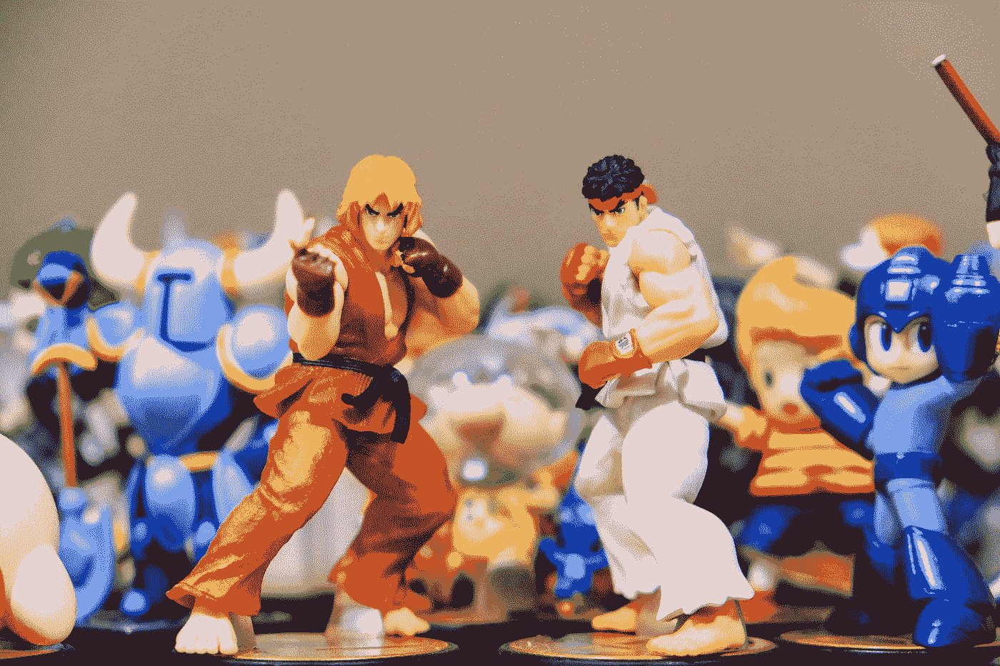

# 用 Python 和 Stable-Baseline 构建一个玩街霸的 AI(第 1 部分)

> 原文：<https://medium.com/analytics-vidhya/build-an-ai-to-play-street-fighter-with-python-and-stable-baseline-part-1-bfc95ff07162?source=collection_archive---------11----------------------->

瑞安·昆塔尔在 [Unsplash](https://unsplash.com?utm_source=medium&utm_medium=referral) 上拍摄的照片

我个人是一个格斗游戏迷，一有机会就会去参加街头格斗锦标赛。在了解了所有的机器学习技术后，我想知道是否有可能建立一个可以打败真正的人类玩家的街头霸王 AI。如果我能从人工智能那里学习来提高我的游戏技能。