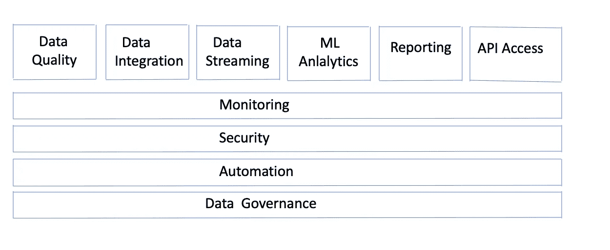
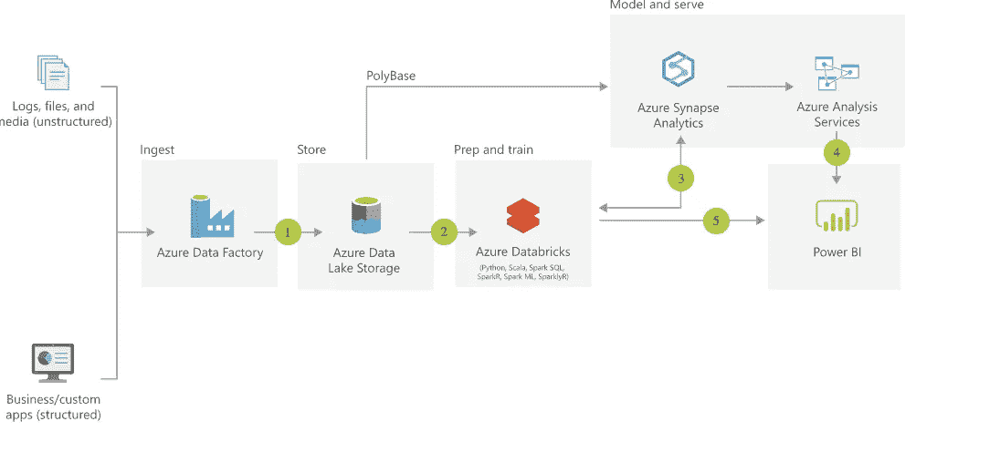

# 在云上构建企业数据湖—简介

> 原文：<https://medium.com/analytics-vidhya/build-an-enterprise-data-lake-on-cloud-introduction-d906eb429cc?source=collection_archive---------18----------------------->

这篇博客是一个博客系列的第 1 部分，这个博客系列讲述了如何在云上创建一个数据湖。每个解决方案/设计架构师需要理解的第一个也是最重要的部分是，构建数据湖不仅仅是一个技术挑战，它是经济因素、公司战略、根据您所在的地区/区域、风险管理、资源技能和时机保持数据治理合规性的综合。在设计数据湖之前，确保企业已经定义了 ***为什么/谁/如何。***

***为什么/谁/怎样？***

为什么？..公司是否想要建立一个数据湖，这与你的公司战略有什么关系，例如:忠诚度管理/可持续性等等。这是迁移到新数据湖架构的所有团队的倒数第二颗北极星。我们在目前的组织中看到的是，这颗星是模糊的，尽管这听起来很简单，但定义这颗北极星并让这一信息从高层流向实施它们的团队几乎是在赢得战争之前。(也是最难爬的山)。理解这个领域以及这个领域的前景是帮助建立这种清晰性的关键因素。

谁啊。..一旦定义了北极星，接下来最重要的部分就是定义迁移到新架构/云所需的史诗。确定支柱首先是需要到位的第一个最高级别的架构概念。一旦确定了这一点，就需要确定这些支柱的功能要求。接下来最重要的任务是确定 ***谁*** 负责这个支柱。这包括时间表、向云迁移、功能定义、向其他支柱开放消费和生产接口。

怎么会？..在明确了原因和人员之后，启动转型的下一步是跟踪，为了做到这一点，定义可以基于战略、业务价值、数据治理、资源技能和最重要的发布时间对每个支柱进行监控的指标。坚持这些标准和时间对于看到隧道尽头的曙光至关重要。定期审查这些支柱以及分担这些支柱责任的总体团队非常重要，因此理想情况下，负责这些支柱的人员/领导将属于同一个团队，并有一些这些团队必须遵守的*不可协商的*任务/基础，例如:交换数据的开放共享协议和开放接口、元数据注册遵守等。

一旦设置好了，我们就可以开始这个项目了，遵循敏捷方法是让这个项目进行下去的最好方法。与任何真正的软件项目一样，这一迁移需要对当前数据环境进行全面的理解/评估。

识别和定义用于放置工作负载的分类桶非常重要，例如:

1.  根据风险，如果数据损坏一天会发生什么？
2.  应用程序的 RTO /RPO 目标
3.  工作负荷的重要性
4.  工作负载的复杂性
5.  计算能力(高/中/低)
6.  计划场景(每小时/每天/每周/每月)
7.  依赖性。(高/中/低)
8.  编排复杂性(高/中/低)
9.  数据消费的使用模式(每个模式中的使用百分比)
10.  访问方式(流/批处理/ API)

创建这些工作负载的组合、定义分类并将工作负载放入这些桶中，有助于规划针对风险较低、RTO/ RPO 较高、关键程度较低的 Beta 工作负载的迁移，这些工作负载可以在查看更关键的工作负载之前先进行迁移和测试。

下一步是确定支柱，一些主要支柱(但不限于) :

1.  安全性(基础设施和数据)
2.  监控和警报
3.  自动化
4.  数据治理、风险和合规性
5.  数据质量
6.  数据集成
7.  数据流
8.  机器学习和分析
9.  报告
10.  API 访问

创建数据湖的基础支柱

下面 4 个支柱是不可协商的支柱，是任何数据相关云项目的基础。需要在这些支柱(TBD)中定义严格的指标，这些指标将在设计、架构和开发阶段充当其他支柱的北极星。

这些是与供应商无关的主题，可以适用于任何云数据之旅，对于这些博客系列，我们将重点关注如何在 [Azure](https://azure.microsoft.com/en-gb/) 云上构建您的企业数据湖。

为了建立我们的云数据湖，我们将参考 Azure 上的[现代数据仓库](https://docs.microsoft.com/en-us/azure/architecture/solution-ideas/articles/modern-data-warehouse)架构。

Azure 上的现代数据仓库

本博客的[第二部分](/@sarathsasi87/building-an-enterprise-data-lake-on-cloud-security-9817e526bfd0)，我们将深入探讨第一个安全支柱。这些是所有工具都必须遵守的基本安全要求，当我们在后面的博客中研究单个工具时，将会讨论单个组件/产品级别的安全性。