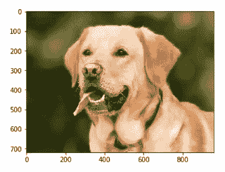
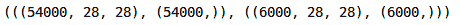
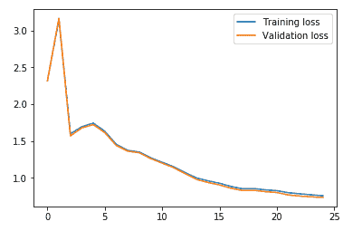

# 利用 PyTorch 中的卷积神经网络建立图像分类模型

> 原文：<https://medium.com/analytics-vidhya/build-an-image-classification-model-using-convolutional-neural-networks-in-pytorch-45c904791c7e?source=collection_archive---------4----------------------->

我被神经网络的力量和能力迷住了。几乎现在机器学习和深度学习领域发生的每一项突破都以神经网络模型为核心。

这在[计算机视觉](https://courses.analyticsvidhya.com/courses/computer-vision-using-deep-learning-version2?utm_source=blog&utm_medium=building-image-classification-models-cnn-pytorch)领域尤为普遍。神经网络开辟了处理图像数据的可能性——无论是简单的图像分类还是更高级的东西，如物体检测。简而言之，对于像我这样的数据科学家来说，这是一座金矿！


当我们使用深度学习解决图像分类问题时，简单的神经网络总是一个很好的起点。但是它们确实有局限性，并且在某一点之后，模型的性能无法提高。

这就是卷积神经网络(CNN)改变游戏场的地方。它们在计算机视觉应用中无处不在。老实说，我觉得每个计算机视觉爱好者都应该很快学会这个概念。

本文是我的新系列的延续，在该系列中，我使用流行的 PyTorch 框架向您介绍新的深度学习概念。在本文中，我们将了解卷积神经网络如何有用，以及它们如何帮助我们提高模型的性能。我们还将研究 CNN 在 PyTorch 中的实现。

*这是本系列的第二篇文章，我强烈建议在阅读本文之前先阅读第一部分:*

*   [*py torch 初学者友好指南以及它如何从头开始工作*](https://www.analyticsvidhya.com/blog/2019/09/introduction-to-pytorch-from-scratch/?utm_source=blog&utm_medium=building-image-classification-models-cnn-pytorch)

# PyTorch、Tensors 和 NumPy 概述

让我们快速回顾一下我们在[第一篇文章](https://www.analyticsvidhya.com/blog/2019/09/introduction-to-pytorch-from-scratch/?utm_source=blog&utm_medium=building-image-classification-models-cnn-pytorch)中讲述的内容。我们讨论了 PyTorch 和张量的基础知识，还讨论了 PyTorch 与 NumPy 的相似之处。

PyTorch 是一个基于 Python 的库，它提供了如下功能:

*   用于创建可序列化和可优化模型的 TorchScript
*   并行计算的分布式培训
*   动态计算图，可以随时制作计算图，等等


PyTorch 中的张量类似于 NumPy 的 n 维数组，也可以用于 GPU。在这些张量上执行操作几乎类似于在 NumPy 数组上执行操作。这使得 PyTorch 非常用户友好且易于学习。

在本系列的第 1 部分中，我们构建了一个简单的神经网络来解决一个案例研究。使用我们的简单模型，我们在测试集上获得了大约 65%的基准准确率。现在，我们将尝试使用卷积神经网络来提高这个分数。

# 为什么选择卷积神经网络(CNN)？

在我们进入实现部分之前，让我们快速地看看为什么我们首先需要 CNN，以及它们是如何有帮助的。

> *我们可以将卷积神经网络(CNN)视为帮助从图像中提取特征的特征提取器。*

在一个简单的神经网络中，我们将三维图像转换为一维图像，对吗？让我们看一个例子来理解这一点:


你能认出上面的图像吗？似乎没什么意义。现在，让我们看看下图:



我们现在可以很容易地说，这是一只狗的形象。如果我告诉你这两幅图像是一样的呢？相信我，他们是！唯一的区别是第一幅图像是一维表示，而第二幅图像是同一幅图像的二维表示。

# 空间定向

人工神经网络(ann)也会丢失图像的空间方向。让我们再举一个例子来理解它:


你能辨别这两幅图像的不同之处吗？至少我不能。因为这是一维表示，所以很难识别差异。现在，让我们看看这些图像的二维表示:


难道你不喜欢通过简单地改变它的表现形式来改变同一个图像的不同外观吗？这里，图像的方向发生了变化，但是我们无法通过查看一维表示来识别它。

这就是人工神经网络的问题——它们失去了空间方向。

# 大量参数

神经网络的另一个问题是大量的参数在起作用。假设我们的图像大小为 28*28*3，那么这里的参数将是 2，352。如果我们有一个 224*224*3 大小的图像会怎么样？这里的参数数量是 150，528。

并且这些参数只会随着我们增加隐藏层的数量而增加。所以，使用人工神经网络的两个主要缺点是:

1.  丢失图像的空间方向
2.  参数的数量急剧增加

那么我们如何处理这个问题呢？我们如何保持空间方向，同时减少可学习的参数？

这就是卷积神经网络真正有用的地方。**细胞神经网络有助于从图像中提取特征，这些特征可能有助于对图像中的物体进行分类。**首先从图像中提取低维特征(如边缘)，然后是一些高维特征，如形状。

> 我们使用过滤器从图像中提取特征，并使用池技术来减少可学习参数的数量。

在本文中，我们不会深入探讨这些主题的细节。如果你希望了解过滤器如何帮助提取特征，以及池是如何工作的，我强烈建议你阅读[一个全面的教程，从头开始学习卷积神经网络](https://www.analyticsvidhya.com/blog/2018/12/guide-convolutional-neural-network-cnn/?utm_source=blog&utm_medium=building-image-classification-models-cnn-pytorch)。

# 理解问题陈述:识别服装

够了，让我们开始编码吧！我们将继续讨论我们在[第一篇文章](https://www.analyticsvidhya.com/blog/2019/09/introduction-to-pytorch-from-scratch/?utm_source=blog&utm_medium=building-image-classification-models-cnn-pytorch)中提到的同一问题陈述。这是因为我们可以直接将 CNN 模型的性能与我们在那里构建的简单神经网络进行比较。

**你可以从** [**这里**](https://datahack.analyticsvidhya.com/contest/practice-problem-identify-the-apparels/?utm_source=blog&utm_medium=building-image-classification-models-cnn-pytorch) **下载这个“识别”服装问题的数据集。**

让我快速总结一下问题陈述。我们的任务是通过查看各种服装图像来识别服装的类型。我们可以将服装图像分为 10 类:


该数据集总共包含 70，000 幅图像。这些图像中的 60，000 个属于训练集，剩余的 10，000 个在测试集中。所有图像都是大小为(28*28)的灰度图像。数据集包含两个文件夹，分别用于训练集和测试集。在每个文件夹中，都有一个包含图像的 *id* 及其相应标签的. csv 文件，以及一个包含该特定组图像的文件夹。

准备开始了吗？我们将从导入所需的库开始:

```
# importing the libraries
import pandas as pd
import numpy as np# for reading and displaying images
from skimage.io import imread
import matplotlib.pyplot as plt
%matplotlib inline# for creating validation set
from sklearn.model_selection import train_test_split# for evaluating the model
from sklearn.metrics import accuracy_score
from tqdm import tqdm# PyTorch libraries and modules
import torch
from torch.autograd import Variable
from torch.nn import Linear, ReLU, CrossEntropyLoss, Sequential, Conv2d, MaxPool2d, Module, Softmax, BatchNorm2d, Dropout
from torch.optim import Adam, SGD
```

# 加载数据集

现在，让我们加载数据集，包括训练、测试和样本提交文件:

```
# loading dataset
train = pd.read_csv('train_LbELtWX/train.csv')
test = pd.read_csv('test_ScVgIM0/test.csv')sample_submission = pd.read_csv('sample_submission_I5njJSF.csv')train.head()
```


*   训练文件包含每个图像的 id 及其相应的标签
*   **另一方面，测试文件只有 id，我们必须预测它们对应的标签**
*   样本提交文件将告诉我们提交预测的格式

我们将一个接一个地读取所有的图像，并将它们一个接一个地堆叠在一个数组中。我们还将图像的像素除以 255，使图像的像素值在范围[0，1]内。这一步有助于优化我们模型的性能。

那么，让我们继续加载图像:

```
# loading training images
train_img = []
for img_name in tqdm(train['id']):
    # defining the image path
    image_path = 'train_LbELtWX/train/' + str(img_name) + '.png'
    # reading the image
    img = imread(image_path, as_gray=True)
    # normalizing the pixel values
    img /= 255.0
    # converting the type of pixel to float 32
    img = img.astype('float32')
    # appending the image into the list
    train_img.append(img)# converting the list to numpy array
train_x = np.array(train_img)
# defining the target
train_y = train['label'].values
train_x.shape
```


如您所见，在训练集中，我们有 60，000 张图片，每张图片的大小为(28，28)。由于图像是灰度格式，我们只有一个单通道，因此形状(28，28)。

现在，让我们来研究这些数据并可视化一些图像:

```
# visualizing images
i = 0
plt.figure(figsize=(10,10))
plt.subplot(221), plt.imshow(train_x[i], cmap='gray')
plt.subplot(222), plt.imshow(train_x[i+25], cmap='gray')
plt.subplot(223), plt.imshow(train_x[i+50], cmap='gray')
plt.subplot(224), plt.imshow(train_x[i+75], cmap='gray')
```


这是数据集中的几个例子。我鼓励你探索更多，想象其他的图像。接下来，我们将把我们的图像分成训练集和验证集。

# 创建验证集并预处理图像

```
# create validation set
train_x, val_x, train_y, val_y = train_test_split(train_x, train_y, test_size = 0.1)
(train_x.shape, train_y.shape), (val_x.shape, val_y.shape)
view raw
```



我们将 10%的数据保存在验证集中，其余的保存在训练集中。接下来，让我们将图像和目标转换为 torch 格式:

```
# converting training images into torch format
train_x = train_x.reshape(54000, 1, 28, 28)
train_x  = torch.from_numpy(train_x)# converting the target into torch format
train_y = train_y.astype(int);
train_y = torch.from_numpy(train_y)# shape of training data
train_x.shape, train_y.shape
```


同样，我们将转换验证图像:

```
# converting validation images into torch format
val_x = val_x.reshape(6000, 1, 28, 28)
val_x  = torch.from_numpy(val_x)# converting the target into torch format
val_y = val_y.astype(int);
val_y = torch.from_numpy(val_y)# shape of validation data
val_x.shape, val_y.shape
```


我们的数据现在准备好了。最后，是时候创建我们的 CNN 模型了！

# 使用 PyTorch 实现 CNN

我们将使用一个非常简单的 CNN 架构，只有两个卷积层来从图像中提取特征。然后，我们将使用完全连接的密集图层将这些要素分类到各自的类别中。

让我们来定义架构:

```
class Net(Module):   
    def __init__(self):
        super(Net, self).__init__()self.cnn_layers = Sequential(
            # Defining a 2D convolution layer
            Conv2d(1, 4, kernel_size=3, stride=1, padding=1),
            BatchNorm2d(4),
            ReLU(inplace=True),
            MaxPool2d(kernel_size=2, stride=2),
            # Defining another 2D convolution layer
            Conv2d(4, 4, kernel_size=3, stride=1, padding=1),
            BatchNorm2d(4),
            ReLU(inplace=True),
            MaxPool2d(kernel_size=2, stride=2),
        )self.linear_layers = Sequential(
            Linear(4 * 7 * 7, 10)
        )# Defining the forward pass    
    def forward(self, x):
        x = self.cnn_layers(x)
        x = x.view(x.size(0), -1)
        x = self.linear_layers(x)
        return x
```

现在让我们调用这个模型，并为模型定义优化器和损失函数:

```
# defining the model
model = Net()
# defining the optimizer
optimizer = Adam(model.parameters(), lr=0.07)
# defining the loss function
criterion = CrossEntropyLoss()
# checking if GPU is available
if torch.cuda.is_available():
    model = model.cuda()
    criterion = criterion.cuda()

print(model)
```


这是模型的架构。我们有两个 Conv2d 层和一个线性层。接下来，我们将定义一个函数来训练模型:

```
def train(epoch):
    model.train()
    tr_loss = 0
    # getting the training set
    x_train, y_train = Variable(train_x), Variable(train_y)
    # getting the validation set
    x_val, y_val = Variable(val_x), Variable(val_y)
    # converting the data into GPU format
    if torch.cuda.is_available():
        x_train = x_train.cuda()
        y_train = y_train.cuda()
        x_val = x_val.cuda()
        y_val = y_val.cuda()# clearing the Gradients of the model parameters
    optimizer.zero_grad()

    # prediction for training and validation set
    output_train = model(x_train)
    output_val = model(x_val)# computing the training and validation loss
    loss_train = criterion(output_train, y_train)
    loss_val = criterion(output_val, y_val)
    train_losses.append(loss_train)
    val_losses.append(loss_val)# computing the updated weights of all the model parameters
    loss_train.backward()
    optimizer.step()
    tr_loss = loss_train.item()
    if epoch%2 == 0:
        # printing the validation loss
        print('Epoch : ',epoch+1, '\t', 'loss :', loss_val)
```

最后，我们将训练 25 个时期的模型，并存储训练和验证损失:

```
# defining the number of epochs
n_epochs = 25
# empty list to store training losses
train_losses = []
# empty list to store validation losses
val_losses = []
# training the model
for epoch in range(n_epochs):
    train(epoch)
```


我们可以看到，随着时代的增加，验证损失在减少。让我们将培训和验证损失绘制成图，以示形象化:

```
# plotting the training and validation loss
plt.plot(train_losses, label='Training loss')
plt.plot(val_losses, label='Validation loss')
plt.legend()
plt.show()
```



啊，我喜欢视觉化的力量。我们可以清楚地看到，训练和验证损失是同步的。这是一个好迹象，因为模型在验证集上概括得很好。

让我们在训练和验证集上检查模型的准确性:

```
# prediction for training set
with torch.no_grad():
    output = model(train_x.cuda())

softmax = torch.exp(output).cpu()
prob = list(softmax.numpy())
predictions = np.argmax(prob, axis=1)# accuracy on training set
accuracy_score(train_y, predictions)
```


在训练集上大约 72%的准确度是非常好的。让我们也检查一下验证集的准确性:

```
# prediction for validation set
with torch.no_grad():
    output = model(val_x.cuda())softmax = torch.exp(output).cpu()
prob = list(softmax.numpy())
predictions = np.argmax(prob, axis=1)# accuracy on validation set
accuracy_score(val_y, predictions)
```


正如我们在损失中看到的，这里的准确性也是同步的——我们在验证集上也得到了大约 72%。

# 为测试集生成预测

终于到了为测试集生成预测的时候了。我们将加载测试集中的所有图像，执行与训练集相同的预处理步骤，并最终生成预测。

因此，让我们从加载测试图像开始:

```
# loading test images
test_img = []
for img_name in tqdm(test['id']):
    # defining the image path
    image_path = 'test_ScVgIM0/test/' + str(img_name) + '.png'
    # reading the image
    img = imread(image_path, as_gray=True)
    # normalizing the pixel values
    img /= 255.0
    # converting the type of pixel to float 32
    img = img.astype('float32')
    # appending the image into the list
    test_img.append(img)# converting the list to numpy array
test_x = np.array(test_img)
test_x.shape
```


现在，我们将对这些图像执行预处理步骤，类似于之前对训练图像执行的步骤:

```
# converting training images into torch format
test_x = test_x.reshape(10000, 1, 28, 28)
test_x  = torch.from_numpy(test_x)
test_x.shape
```


最后，我们将为测试集生成预测:

```
# generating predictions for test set
with torch.no_grad():
    output = model(test_x.cuda())softmax = torch.exp(output).cpu()
prob = list(softmax.numpy())
predictions = np.argmax(prob, axis=1)
```

将样本提交文件中的标签替换为预测，最后保存文件并提交到排行榜:

```
# replacing the label with prediction
sample_submission['label'] = predictions
sample_submission.head()
```


```
# saving the file
sample_submission.to_csv('submission.csv', index=False)
```

您将在当前目录中看到一个名为 *submission.csv* 的文件。你只需要把它上传到问题页面的[解决方案检查器上，它就会产生分数。](https://datahack.analyticsvidhya.com/contest/practice-problem-identify-the-apparels/?utm_source=blog&utm_medium=building-image-classification-models-cnn-pytorch)

我们的 CNN 模型在测试集上给出了大约 71%的准确率。与我们在上一篇文章中使用简单的神经网络获得的 65%相比，这是一个相当大的进步。

# 结束注释

在本文中，我们研究了 CNN 如何用于从图像中提取特征。他们帮助我们将之前的神经网络模型的准确性从 65%提高到 71%，这是一个重大的提升。

您可以使用 CNN 模型的超参数，并尝试进一步提高精确度。要调整的一些超参数可以是卷积层数、每个卷积层中的滤波器数、时期数、密集层数、每个密集层中的隐藏单元数等。

在本系列的下一篇文章中，我们将学习如何使用像 VGG-16 这样的预训练模型和 PyTorch 中的模型检查点步骤。和往常一样，如果你对这篇文章有任何疑问，欢迎在下面的评论区发表！

*原载于 2019 年 10 月 1 日*[*【https://www.analyticsvidhya.com】*](https://www.analyticsvidhya.com/blog/2019/10/building-image-classification-models-cnn-pytorch/)*。*