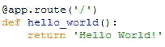

# 使用 AWS 和 API 构建和部署机器学习模型

> 原文：<https://medium.com/analytics-vidhya/build-and-deploy-an-machine-learning-model-using-aws-and-apis-1d22eadb2b83?source=collection_archive---------3----------------------->

# 介绍

部署机器学习模型仍然是一个重大挑战。即使将机器学习模型推向生产是构建机器学习应用程序的最重要步骤之一，也没有多少教程显示如何做到这一点。因此，在本文中，我将介绍如何通过使用 Flask web 微框架构建一个普通网站来生产机器学习模型。

# 亚马逊网络服务(AWS)简介

**什么是 AWS？—亚马逊 Web 服务(AWS)** 是来自亚马逊的云服务，它以构建块的形式提供服务，这些构建块可以用来在云中创建和部署任何类型的应用程序。

这些服务或构建块被设计为彼此协同工作，并产生复杂且高度可伸缩的应用程序。

# 烧瓶简介

## 烧瓶是什么？

**Flask** 是一个 web 框架。这意味着 flask 为您提供了工具、库和技术，允许您构建 web 应用程序。这个 web 应用程序可以是一些网页、一个博客、一个 wiki，也可以是一个基于 web 的日历应用程序或一个商业网站。

Flask 是微观框架类别的一部分。**微框架**通常是对外部库依赖很少甚至没有依赖的框架。这有利有弊。优点是框架很轻，几乎没有什么依赖来更新和监视安全漏洞，缺点是有时你必须自己做更多的工作，或者通过添加插件来增加依赖列表。在 Flask 的情况下，它的依赖关系是:

*   一个 WSGI 实用程序库
*   **jinja2** 是它的模板引擎

# 在 AWS 中生产机器学习模型的 7 个简单步骤:

1.  在您的本地机器上构建一个模型，并将该模型和其他关键模型相关变量存储在 pickle 文件中(**)。pkl 文件**
2.  在 **AWS** 上启动一个微实例。
3.  连接到 AWS 实例。
4.  将文件移动到 AWS-EC2 实例中
5.  安装 AWS 实例上需要的所有软件包。
6.  在 AWS 盒子上运行 app.py。
7.  在浏览器中检查输出。

# 所需软件:(蟒蛇)

要下载 **Anaconda** 请点击下面的链接:

[**Windows 64 位**](https://repo.continuum.io/archive/Anaconda3-5.2.0-Windows-x86_64.exe) **，** [**Windows 32 位**](https://repo.continuum.io/archive/Anaconda3-5.2.0-Windows-x86.exe) **，**[**Mac**](https://repo.continuum.io/archive/Anaconda3-5.2.0-MacOSX-x86_64.sh)**，** [**Linux 64 位**](https://repo.continuum.io/archive/Anaconda3-5.2.0-Linux-x86_64.sh) **，** [**Linux 32 位**](https://repo.continuum.io/archive/Anaconda3-5.2.0-Linux-x86.sh)

# 数据采集

作为一个例子，我采用了亚马逊美食评论数据集。亚马逊美食评论数据集由来自亚马逊的美食评论组成。

**来源:**[https://www . ka ggle . com/amanai/Amazon-fine-food-review-情操-分析](https://www.kaggle.com/amanai/amazon-fine-food-review-sentiment-analysis)

# 数据集概述

**评论数**:568454
**用户数**:256059
**产品数**:74258
**时间跨度**:1999 年 10 月—2012 年 10 月
**数据中属性/列数** : 10

## 让我们在本地机器上运行代码

让我先给你看看文件夹结构和里面的文件:

**第一步**:打开 Anaconda 提示:

**第二步**:切换到代码目录。

**第三步**:运行“python app.py”

**第四步**:浏览器:[http://localhost:8080/index](http://localhost:8080/index)

## **命令提示符快照:**

## **网页快照:**

**对于正面评价:**

审查输入

预测=正面

**负面评论:**

审查输入

预测=负面

## 让我们来理解代码

1.  **index.html:**这是用来建立一个简单的网页，我们提供 **Review_text** 作为输入，点击 **Submit** 按钮，我们得到一个预测。这里我们在**表单动作**标签中提供函数名称( **predict()** )。

2.这里是我们编写使用 **Flask 创建 API 的代码的地方。**

初始化

这部分代码抓取 URL(**http://localhost:8080/**)，如果在最后找到“ **/** ”，它将只打印“ **Hello World** ”。

这部分代码抓取 URL(**http://localhost:8080/index**)，如果在末尾找到“ **/index** ”，它将呈现 html 内容，当在 html 表单部分找到( **'/predict '，methods=['POST']** )时，它将执行 **predict()** 函数。

# 在 Amazon Web 服务器上部署应用程序( **AWS**

正如我们所知，如果我们在本地机器上运行任何应用程序，其他人都无法访问它，但如果我们将它部署或托管在云服务器上，那么我们可以让实例一直运行，人们可以随时访问它。因此，现在让我们看看如何在 **AWS** 中部署机器学习模型。

# 在 **AWS** 上启动一个微实例

## **创建 AWS 账户:**

[*https://aws.amazon.com*](https://aws.amazon.com)*[*https://portal.aws.amazon.com/billing/signup#/start*](https://portal.aws.amazon.com/billing/signup#/start)*

## ***登录**:*

*[*https://console.aws.amazon.com*](https://console.aws.amazon.com)*

## ***3。登录后:***

**

## *4.**启动“EC2”实例**
5。选择 **Ubuntu 免费轮胎***

**

## *6.点击**‘选择’**
7。选择“ **t2.micro”符合条件的自由层***

**

## *8.**点击“审核并启动”***

**

## *9.**点击‘启动’***

**

## *10.**点击“下载密钥对”并保存。pem 文件"然后点击【启动实例】***

**

## *11.**你会看到这个屏幕，你已经成功启动了一个“EC2”实例，现在我们需要在它里面启动一个“Flask API”**
12。**最后一步**:*

**

## *13.**选择【网络&安全】- >安全组，然后点击【创建安全组】***

**

## *14.**然后将特定的安全组添加到网络接口***

****

## *15.**连接到您的 AWS 实例***

**按照下图中的步骤连接到您的实例**

**

## *16.**将文件移动到 AWS EC2 实例**:*

***打开命令行**并输入下面的命令到**复制文件到实例。***

*****scp-r-I " for _ live . PEM "。/ubuntu@ec2–13–59–191–237.us-east-2.compute.amazonaws.com*****

**********

## *****17.**安装 AWS EC2 实例所需的所有软件包*******

*******sudo apt-get 安装 python3-pip*******

*******pip3 安装<以下每个软件包>*******

## *****需要的包:*****

*******pip3，pandas，numpy，sklearn，beautifulsoup4，lxml，flask，re*******

## *****18.在 AWS 盒子上运行“app.py”。*****

**********

## *****19 .**检查浏览器**中的输出。*****

**********

# *****结论*****

*****生产你的机器学习模型是机器学习项目的重要部分，Flask 可以用来创建一个只有几行代码的网站。*****

********只需按照所有步骤，将你的机器学习模型量产到 AWS*** *。******

# ****在哪里可以找到我的代码？****

********

******GITHUB**:[*https://GITHUB . com/SubhamIO/Build-and-Deploy-an-Machine-Learning-Model-using-AWS-and-API-s*](https://github.com/SubhamIO/Build-and-Deploy-an-Machine-Learning-Model-using-AWS-and-API-s)****

# ****参考****

1.  ****[*https://pymbook.readthedocs.io/en/latest/flask.html*](https://pymbook.readthedocs.io/en/latest/flask.html)****
2.  ****[*https://www . geeks forgeeks . org/ssh-command-in-Linux-with-examples/*](https://www.geeksforgeeks.org/ssh-command-in-linux-with-examples/)****
3.  ****[*https://www . geeksforgeeks . org/scp-command-in-Linux-with-examples/*](https://www.geeksforgeeks.org/scp-command-in-linux-with-examples/)****
4.  ****[*https://www.edureka.co/blog/what-is-aws/*](https://www.edureka.co/blog/what-is-aws/)****

# ****我希望你喜欢阅读这个博客！谢谢…****