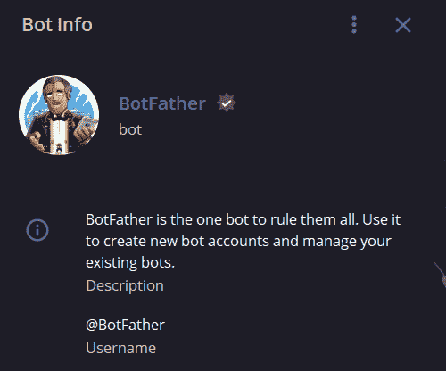
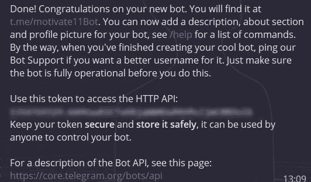
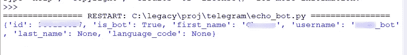

# 使用 Python 构建您的第一个电报机器人

> 原文：<https://medium.com/analytics-vidhya/build-and-deploy-your-first-telegram-bot-using-python-part-1-dcfd83bd6718?source=collection_archive---------9----------------------->


电报标志

***如果你正在学习 python，并且想尝试一下实时项目，来找个座位，让我带你进入 python 的奇妙世界。***

让我先介绍一下你暂时需要的东西:

1.  使用 botfather 创建 bot 令牌(当然假设您有一个电报帐户)
2.  python 中电报 API 的包装器(pyTelegramBotAPI)
3.  你的热情(肯定是的)

是的，这就是你做第一个电报机器人需要的所有配方。

## **创建我们的机器人**

第一步:在 telegram 中搜索@BotFather，按开始。



电报中的父亲

第二步:输入 */newbot，*然后输入你想要的机器人名称和用户名(确保创建一个唯一的用户名，并且必须以‘bot’结尾)。

```
 e.g. motivate11Bot or motivate11_bot
```

第三步:恭喜你，现在你在 Telegram 中有了自己的机器人，可以自动操作你的东西。复制 API 令牌并开始编写 bot 代码。



bot 的 API 密钥

> 不要共享或公开你的 API 令牌。就像给你的账号密码一样。

## 安装软件包和依赖项

始终确保创建一个虚拟环境，以便依赖关系不会搞乱您的整个环境。要创建虚拟环境，打开命令提示符，或者如果您使用 anaconda 提示符，这将容易得多。

```
For command prompt:
$ python3 -m venv /path/to/new/virtual/environmentFor anaconda prompt:
$ conda create -n pybot python=3.7.2
```

创建这个虚拟环境后，从基本环境切换到虚拟环境。

```
For command prompt:
$ source ./venv/bin/activateFor anaconda prompt:
$ conda activate pybot
```

现在，让我们安装具有魔力的软件包，

`$ pip install pyTelegramBotAPI`

这几乎涵盖了所有需要的东西，还有很多其他的 Telegram API 可用，但是我们选择 pyTelegramBotAPI 是因为它的简单和优雅。

跟进这个目录结构

```
.
├── bot.py
└── config.json
```

在同一个目录中创建一个名为“config.json”的新文件，其中包含获得的 API_KEY 作为键值对。

示例:

现在，让我们通过启动 IDE 来开始编码。

```
#required packages
import telebot
import requests
import os
import json#Config vars
with open(‘config.json’) as f:
 token = json.load(f)#initialise bot
bot = telebot.TeleBot(token[‘telegramToken’])
x = bot.get_me()
print(x)#pool~start the bot
bot.polling()
```

Telebot 是处理与 Telegram bot 交互的`pyTelegramBotAPI`的一部分。运行代码片段，瞧！！！。

如果您得到这样的输出:



然后，您现在已经成功地将您的电报机器人与 Python 连接起来了。

让我们添加更多的命令，机器人可以使用这些命令与用户进行交互。在“汇集”步骤之前添加以下功能。(链接到本文末尾给出的示例存储库)

```
#handling commands - /start [@bot](http://twitter.com/bot).message_handler(commands=[‘start’, ‘help’])
def send_welcome(message):
 bot.send_message(message.chat.id, “Welcome user”)
```

使用` @bot.message_handler` decorator，您现在已经触发了一段代码，在调用上述命令时运行。当提供/start 或/help 命令时，这将欢迎用户或发送帮助消息。

> 更多的处理程序和 API 方法，查看:[https://github.com/eternnoir/pyTelegramBotAPI](https://github.com/eternnoir/pyTelegramBotAPI)&[https://core.telegram.org/bots/api](https://core.telegram.org/bots/api)

现在，让我们连接一个简单的 API 来演示如何使用机器人来自动化和简化您的日常任务。

```
#handling commands - /motivate
[@bot](http://twitter.com/bot).message_handler(commands=[‘motivate’])
def send_quotes(message):
 quote= requests.request(url=’[https://api.quotable.io/random',method='get'](https://api.quotable.io/random',method='get'))
 bot.reply_to(message, quote.json()[‘content’])
```

每当发送/motivate 时，它都会用一个来自“quotable.io”的随机引用来回复用户。

> 要清楚地了解代码和设置，请访问此报告:
> 
> [https://github.com/krsh-37/TelegramBot](https://github.com/krsh-37/TelegramBot)

所以，我演示了一种使用这个机器人自动完成简单任务的方法，你可以创建一个机器人，*提供你公司的每日统计数据*或*给客户的产品价格*或*作为你机器学习模型的网关*！！

将您的想法释放到工作模型中。开始建造你自己的机器人。

在本博客的第 2 部分，学习如何将这个机器人部署到 Heroku:

[](/@krsh37/learn-how-to-deploy-into-heroku-3158a41b46fb) [## 在 Heroku 中构建并部署一个简单的 YouTube 下载器 bot

### 从 GitHub 集成自动 Heroku 部署

medium.com](/@krsh37/learn-how-to-deploy-into-heroku-3158a41b46fb) 

*学习，分享&投稿。快乐学习！！*