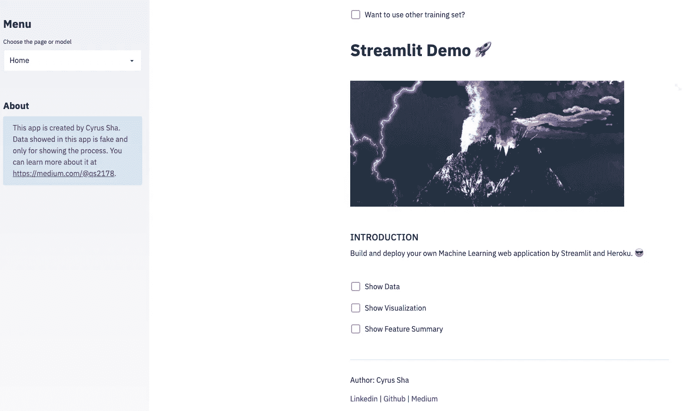

# 通过 Streamlit 和 Heroku 构建和部署您自己的机器学习 Web 应用程序

> 原文：<https://medium.com/analytics-vidhya/build-and-deploy-your-own-machine-learning-web-application-by-streamlit-and-heroku-d306f2d29474?source=collection_archive---------2----------------------->

在这篇文章中，我将一步一步地演示如何使用 Streamlit 并将其部署在 Heroku 上，构建自己的机器学习 web 应用程序，并与朋友或同事分享。简单介绍一下，我目前是一家 Fintech 的机器学习工程师。

# ✍🏻你能从这篇文章中学到什么