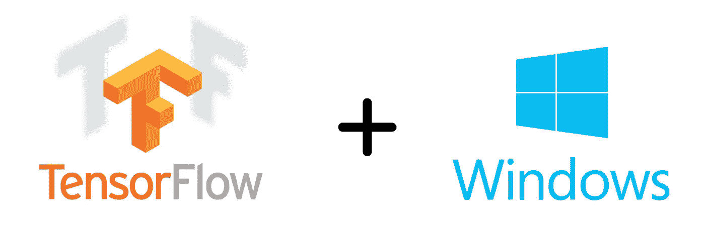

# 在 Windows 上从源代码构建和安装 TensorFlow for CPU(第 1 部分)

> 原文：<https://medium.com/analytics-vidhya/build-and-install-tensorflow-for-cpu-from-source-code-on-windows-b56e0ba4241a?source=collection_archive---------14----------------------->

你是否已经为在 Windows 10 上从源代码构建 TensorFlow 奋斗了很长时间？找不到一步到位的完整指南来指导如何做？那么这篇文章就是给你看的！



**这是描述如何在 Windows 上从源代码构建 TensorFlow 的两篇系列文章中的第一篇。如果你已经看完了这个帖子，你可以直接进入下一个帖子** [**这里**](/@modaksada11/build-and-install-tensorflow-for-cpu-from-source-code-on-windows-part-2-ae42600545c6) **。**

这是我关于 medium 的第一篇文章，我非常乐意分享我自己在 Windows 10 上从源代码构建和安装 tensor flow 1 . 14 . 0 版的经验。在这篇文章*(由两篇系列文章组成)*中，我将努力确保完整过程的所有细节都被包含在内*(因为我在解决一些小问题时做了很多努力！)*让你顺利走完整个流程。

首先，让我们简单地讨论一下，当我们可以简单地安装 TensorFlow 时，为什么我们需要从源代码构建它。

# **为什么首先要从源代码构建？**

> 顺便提一下，我在使用 pip 安装的 TensorFlow v1.14.0 时发现了这个“从源代码构建 TensorFlow”的东西，在执行某个程序时，出现了以下消息

> 您的 CPU 支持此 TensorFlow 二进制文件未编译使用的指令:AVX AVX2

> 在这之后，我深入挖掘，发现了这种“从源代码构建”的方法。

所以基本上，安装任何 python 包(比如 TensorFlow)都有两种标准方式。第一种是最基本的一种，也是通常使用的一种，通过使用 **pip 命令**。该命令使用**预装的二进制轮**安装软件包。这个二进制文件被构建为在不同的系统上广泛兼容**，因此**不使用 CPU 扩展，因为这些扩展的兼容性可能因 CPU 而异**。SSE4.1、SSE4.2、AVX、AVX2、FMA 等 CPU 扩展。是非常有用的，并大大加快线性代数计算。因此，本质上第二种方法利用了这些 CPU 扩展的使用，因为我们自己构建了自己的二进制轮文件*(特定于我们的系统，因此它使用我们的系统支持的 CPU 扩展)*，然后使用这个*“自制”*二进制文件安装包，这就是我们将在本文中讨论的所谓的**从源代码构建**方法。**

> 关于上一段更详细的讨论可以在[这里](https://stackoverflow.com/questions/47068709/your-cpu-supports-instructions-that-this-tensorflow-binary-was-not-compiled-to-u)找到。

## 这篇文章涉及:

*   建筑 **Tensorflow 版本 1.14.0**
*   基于 **Windows 10 x64 处理器**
*   使用 **Python 3.7**
*   配置为 **CPU 专用设置** *(本文不涉及为 GPU 构建 tensor flow)*

**但是，该流程是通用的，也可以很容易地扩展到其他系统。尽管如此，我们必须记住构建任何 TensorFlow 版本的具体要求(此处给出了**[](https://www.tensorflow.org/install/source_windows#tested_build_configurations)****),例如，要构建 TensorFlow v1.14.0(我们将在本文中完成), Python 3.8 不受支持。****

> **请注意，这里假设已经安装了 Python 和 pip。如果没有，那么只需从[这里](https://www.python.org/downloads/)安装所需的 python 版本。安装非常容易。另外，pip 预装了 python。**
> 
> ****重要提示:**python 和 pip 安装完成后，将以下路径添加到**环境系统变量**(要了解更多关于如何操作的信息，请点击[此处](https://docs.bazel.build/versions/master/windows.html#setting-environment-variables)):**

```
C:\Program Files\Python37
C:\Program Files\Python37\Scripts
```

# **所涉及步骤的概述**

**这篇文章被分成两个帖子的**系列。第一篇文章非常详细地描述了所需的所有先决条件以及如何安装它们，然后第二篇文章[描述了实际的“构建和安装”过程。总而言之，这提供了一个从源代码成功构建 TensorFlow 的完整方法。](/@modaksada11/build-and-install-tensorflow-for-cpu-from-source-code-on-windows-part-2-ae42600545c6)****

## **帖子 1:先决条件**

1.  **卸载任何现有的 TensorFlow 安装**
2.  **为 Windows 安装 Git**
3.  **安装 MSYS2 及其命令行工具**
4.  **安装 Visual Studio 社区 2017 以及 Visual C++构建工具 2015**
5.  **安装 Bazel**
6.  **安装所需的 Python 包**

## **帖子 2:构建并安装 TensorFlow ( [链接到它](/@modaksada11/build-and-install-tensorflow-for-cpu-from-source-code-on-windows-part-2-ae42600545c6))**

1.  **克隆有源代码的官方 TensorFlow repo**
2.  **使用 Bazel 配置构建参数**
3.  **使用配置的参数构建 TensorFlow 包**
4.  **使用 pip 为 TensorFlow 安装创建二进制轮文件**
5.  **Pip 使用创建的二进制轮文件安装 TensorFlow 包**
6.  ***(可选)*测试 TensorFlow 安装**

> ****官方网站(** [**此处**](https://www.tensorflow.org/install/source_windows) **)涵盖了其中一些步骤，但我发现对于任何初学者来说都有点不太容易理解！****

**在每个步骤之后，我将提供一个**步骤检查**，它将帮助您确保该步骤是否已正确完成。这将有助于您在出现问题时进行调试！**

# **步骤 1:卸载任何现有的 TensorFlow 安装**

**点击开始菜单，输入“运行”，然后按回车键。然后在对话框中键入“cmd”打开 Windows 命令提示符。现在执行以下命令:**

```
pip uninstall tensorflow
pip uninstall tensorflow-estimator
pip uninstall tensorboard
```

> ****注意:**有时仅使用`pip`可能会给出以下信息:**

> **警告:pip 正在被一个旧的脚本包装调用。这在 pip 的未来版本中将会失败。**

> **因此，如果这个警告出现，对于这篇文章和下一篇文章中的所有命令，如果你想避免这个警告，你可以简单地用`python -m pip`代替`pip`！**

**之后，转到 Python 目录`C:\Users\<Username>\AppData\Roaming\Python\Python37\site-packages`，搜索任何名为“ *tensorflow* ”、“ *tensorflow-estimator* ”或“ *tensorboard* ”的文件夹，如果找到任何此类文件夹，则将其删除。这是干净卸载所必需的。**

> **您可能会找到类似“tensor flow _ estimator-2 . 2 . 0 . dist-info”等文件夹。使用`pip uninstall`后仍有剩余。所以只需手动删除这些。**

****步骤检查:**打开命令提示符，执行以下命令:**

```
pip show tensorflow
pip show tensorflow-estimator
pip show tensorboard
```

****预期结果:**如果卸载成功，那么你必须得到*“警告:找不到包”*以上三个语句的每一个。**

# **步骤 2:安装 Git for Windows**

**要下载 Git，请单击此处的[并下载最新的 Git windows 版本。然后运行可执行安装文件，并简单地点击“下一步”，直到安装完成。将以下路径添加到**环境系统变量**(要了解更多关于如何做的信息，点击](https://git-scm.com/downloads)[此处](https://docs.bazel.build/versions/master/windows.html#setting-environment-variables)):**

```
C:\Program Files\Git
C:\Program Files\Git\bin
```

****步骤检查:**打开命令提示符，执行命令`git --version`。**

****预期结果:**您应该得到一条消息*“git version<version>”*。**

# **步骤 3:安装 MSYS2 及其命令行工具**

**下载 MSYS2 安装文件 *msys2-x86_64- <版本>。exe* 从[到这里](https://www.msys2.org/)。运行安装程序。**

> ****注意:**我建议不要更改默认的安装文件夹`C:\msys64`，因为即使是命名约定中的一个小错误(如文件夹名称中的空格)也会导致灾难性的失败！**

**继续点击“下一步”,直到安装完成。完成后，将以下路径添加到**环境系统变量**(要了解更多关于如何做的信息，请点击[此处](https://docs.bazel.build/versions/master/windows.html#setting-environment-variables)):**

```
C:\msys64
C:\msys64\usr\bin
```

**现在，点击开始菜单，搜索*“MSYS2 MSYS”*，打开 MSYS 2 外壳。现在按顺序执行以下命令:**

> **您可能需要在执行以下每个命令后关闭并重新打开 msys2 shell(如果您看到一个警告，告诉您重新启动 shell)。**

```
pacman -Syu
pacman -Su
pacman -S git patch unzip
```

**执行完上述命令后，关闭“ *MSYS2 MSYS* ”外壳。**

****步骤检查:**如果执行上述命令没有产生错误，并且所有必需的软件包(如果有的话)都已成功安装，那么您可以继续了！**

# **步骤 4:安装 Visual Studio 社区 2017 以及 Visual C++构建工具 2015**

**转到[这个链接](https://visualstudio.microsoft.com/vs/older-downloads/)。然后在“旧下载”部分，点击 2017 年的“下载”按钮。您可能需要登录您的 Microsoft 帐户。现在，搜索“Visual Studio 社区 2017”。安装 Visual Studio Community 2017 的可执行文件(15.9 版)。运行安装程序。**

> **同样，如果你想避免将来的问题，我建议不要改变默认的安装文件夹`C:\Program Files (x86)\Microsoft Visual Studio 14.0`！**

****

****安装菜单****

**当安装菜单(如上所示)出现时，**确保您选择了**以下选项:**

*   **用 C++进行桌面开发(见上图左边部分)**
*   **Windows 10 SDK 最新版本(在本例中是 10.0.17763.0)(见上图右侧)**
*   **VC++ 2015.3 v14.00 (v140)桌面工具集(见上图右下方)**

**然后点击安装按钮，等待它完成。**

****步骤检查:**转到`C:\Program Files (x86)`，如果你看到一个名为“Microsoft Visual Studio 14.0”的文件夹，那么你就可以继续了！**

# **第五步:安装 Bazel**

**首先，从[这里](https://www.tensorflow.org/install/source_windows#tested_build_configurations)检查您尝试构建的 TensorFlow 版本所需的 Bazel 版本，然后从[这里](https://github.com/bazelbuild/bazel/releases)下载您的特定 Bazel 版本。**

**出于本文的目的，为了使用 python 3.7 构建 TensorFlow v1.14.0，我们将下载 Bazel 版本 0.25.2。点击[此链接](https://github.com/bazelbuild/bazel/releases/download/0.25.2/bazel-0.25.2-windows-x86_64.exe)，可执行二进制文件的下载将自动开始。将二进制文件从“*bazel-0 . 25 . 2-windows-x86 _ 64 . exe*”重命名为“*bazel.exe*”。现在将这个二进制文件移动到你选择的任何文件夹，假设我们将它移动到`C:\Program Files`，然后将`C:\Program Files` *(或者你选择的文件夹的路径)*添加到环境系统变量。**

> ****提示:**将 Bazel 二进制 exe 文件移动到该驱动器(C、D、E 等)中至少有 8–9 GB 可用磁盘空间的文件夹中。你将在第二部分中看到，我们需要大约 8-9gb 的磁盘空间来使用 Bazel 构建 TensorFlow 包。**

**现在我们需要创建 3 个新的环境系统变量。打开此处所述[的环境系统变量对话框，点击“系统变量”下的**新建**按钮，创建以下每个新变量:](https://docs.bazel.build/versions/master/windows.html#setting-environment-variables)**

****步骤检查:**打开命令提示符，执行命令`bazel version`。**

****预期结果:**您应该得到一条消息，显示关于 Bazel 的信息，比如版本、构建目标和时间戳等。**

# **步骤 6:安装所需的 Python 包**

**最后，从源代码构建 TensorFlow 所需的所有先决条件的最后是必要的 Python 包。**

**可以在官方 TensorFlow 资源库的[这里](https://github.com/tensorflow/tensorflow/blob/633c41f3ea2a3585d67740b79c2b4cc4b19da70b/tensorflow/tools/pip_package/setup.py#L54)找到它的完整列表。**

**为了安装所有这些包，我在这里提供了一个 GitHub Gist 链接，点击后会下载一个 zip 文件。拉开拉链。点击解压后的文件夹，你会发现里面有一个“requirements.txt”文件。复制“requirements.txt”并把它放在你选择的任何文件夹中(比如桌面)。现在，只需打开命令提示符并执行以下命令:**

> ****注意:**下面的/d 标志只是让你改变驱动器，如果你现在在一个不同的驱动器。**

```
cd /d C:\Users\<Username>\Desktop
pip install -r requirements.txt --no-deps
```

****步骤检查:**打开命令提示符，执行命令`pip list`。它将向您显示您已经安装的所有软件包的列表。**

****预期输出:**您应该看到“requirements.txt”中列出的每一个包都出现在命令`pip list`的输出中，并带有所需的版本。**

> ***如果您已经成功通过了上述所有步骤，那么恭喜您！现在，您已经成功安装了从源代码构建 TensorFlow 的所有先决条件。***

***希望你喜欢这篇文章！如果这里描述的过程对你有用，或者你在遵循这篇文章中提到的步骤时遇到了任何问题，请在下面的评论部分告诉我。***

## **不要忘记看看这一系列两篇文章中的下一篇(也是最后一篇)。下一个帖子的链接是 [*这里是*](/@modaksada11/build-and-install-tensorflow-for-cpu-from-source-code-on-windows-part-2-ae42600545c6) *。***