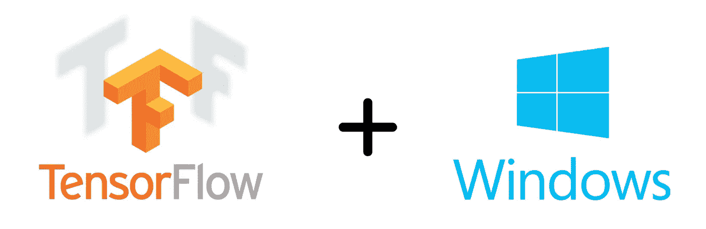
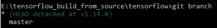
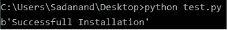

# 在 Windows 上从源代码构建和安装 TensorFlow for CPU(第 2 部分)

> 原文：<https://medium.com/analytics-vidhya/build-and-install-tensorflow-for-cpu-from-source-code-on-windows-part-2-ae42600545c6?source=collection_archive---------18----------------------->

*你是否已经为在 Windows 10 上从源代码构建 TensorFlow 奋斗了相当一段时间？找不到一步到位的完整指南来指导如何做？那么这篇文章就是给你看的！*



这是在 Windows 上从源代码为 CPU 构建 TensorFlow 的两篇系列文章中的第二篇(也是最后一篇)。**如果你还没有看过第一篇文章**[](/@modaksada11/build-and-install-tensorflow-for-cpu-from-source-code-on-windows-b56e0ba4241a)****，请点击这里查看。****

# **所涉及步骤的概述**

**在本文中，我们将执行 TensorFlow 的实际“构建和安装”,因为我们已经安装了第 1 部分中所有必需的先决条件。**

1.  **克隆有源代码的官方 TensorFlow repo**
2.  **使用 Bazel 配置构建参数**
3.  **使用配置的参数构建 TensorFlow 包**
4.  **使用 pip 为 TensorFlow 安装创建二进制轮文件**
5.  **Pip 使用创建的二进制轮文件安装 TensorFlow 包**
6.  ***(可选)*测试 TensorFlow 安装**

> *****官方网站(*** [***此处***](https://www.tensorflow.org/install/source_windows) ***)涵盖了其中一些步骤，但我发现对任何初学者来说都有点不太容易理解！*****

**在每个步骤之后，我将提供一个**步骤检查**，它将帮助您确保该步骤是否已正确完成。这将有助于您在出现问题时进行调试！**

# **第一步:克隆有源代码的官方 TensorFlow repo**

**我们需要拿到张量流源代码。为此，首先，选择您想要克隆整个 [TensorFlow 存储库](https://github.com/tensorflow/tensorflow) (~700 MB)的目录，例如，我选择了`E:\`。现在打开命令提示符并执行以下命令:**

```
# Change E:\ below to your chosen folder path.
cd /d E:\
mkdir build-tensorflow-from-source
cd build-tensorflow-from-source# Now we are in E:\build-tensorflow-from-source
git clone https://github.com/tensorflow/tensorflow.git# This will create a folder named "tensorflow"
```

**现在，我们需要进入“ *tensorflow* ”文件夹。现在棘手的部分来了，这是我在网上找到的大多数在线资源所没有的！默认情况下，进入“ *tensorflow* ”文件夹后我们在主分支。当我们构建TensorFlow v1.14.0 时，我们需要签出到目标版本*的特定标签“ *v1.14.0* ”(将标签视为整个提交历史中特定提交的别名)*，以便我们的工作目录中的所有文件都与我们的目标版本一致。**

> **所有对应不同可用 TensorFlow 版本的标签都可以在[这里](https://github.com/tensorflow/tensorflow/tags)查看。**

**在命令提示符下执行以下命令:**

```
# To ensure you are in the correct directory
cd /d E:\build-tensorflow-from-source\tensorflowgit checkout v1.14.0
# Now the HEAD shifts to this tag and gets detached from master branch
```

> **现在，如果你在工作目录中做了任何更改，这些更改将是临时的，如果你签出到任何其他分支/标签，这些更改将会消失，也就是说，**你不能通过提交标签**来存储更改。然而，出于本文的目的，我们不需要对这个标签做任何修改，我们将简单地使用这个标签来构建我们自己的定制二进制轮子文件。**
> 
> **另外，如果您想在签出到 v1.14.0 标签之后，在工作目录中存储您想要进行的更改，在进行这些更改之前，只需使用命令`git checkout -b v1.14.0-branch v1.14.0`创建一个以该标签为头的分支，然后您就可以像往常一样将所有更改提交到该分支了！要了解更多信息，请点击[此处](https://stackoverflow.com/questions/5582208/checking-out-git-tag-leads-to-detached-head-state#:~:text=0%20%2C%20you%20are%20switching%20to,new%20commit%20you've%20made.)。**
> 
> **要了解更多关于 git 中标签和分支的信息，请查看链接。**

****步骤检查:**打开命令提示符，执行:**

```
cd /d E:\build-tensorflow-from-source\tensorflow
git branch
```

****预期输出:**如果你得到下面的输出，那么你继续前进！**

****

# **步骤 2:使用 Bazel 配置构建参数**

**在这里，我们将指定我们的系统特定的参数(包括 CPU 指令，如 AVX，AVX2 等)，使用这些参数来构建我们的自定义二进制轮。在命令提示符下执行以下命令:**

```
cd /d E:\build-tensorflow-from-source\tensorflow
python ./configure.py
```

**现在，您应该会看到以下消息:**

```
...
You have bazel 0.25.2 installed.
```

**之后，你应该会看到一些与 python.exe 路径、编译器标志等相关的问题。**根据您的具体系统回答所有这些问题。**然而，如果您的系统、python 版本和您试图构建的 TensorFlow 版本**与我在本文中使用的内容**完全匹配，那么您将会被问到以下问题，我在下面提供了这些问题的答案(问题用*斜体*，我的答案用**粗体**)。如果您想接受**默认**答案，请按**键输入**。**

> **查看我的系统规格和 python 版本等。参见本系列文章第一部分 中的**[****一节。****](/@modaksada11/build-and-install-tensorflow-for-cpu-from-source-code-on-windows-b56e0ba4241a)****

```
*Please specify the location of python. [Default is C:\python37\python.exe]:* **C:\Program Files\Python37\python.exe***Found possible Python library paths:
  C:\Program Files\Python37\lib\site-packages
Please input the desired Python library path to use.  Default is [C:\Program Files\Python37\lib\site-packages]* **<Press Enter>***Do you wish to build TensorFlow with CUDA support? [y/N]:* **N***Do you wish to build TensorFlow with ROCm support? [y/N]:* **N***Do you wish to build TensorFlow with XLA JIT support? [y/N]:* **N***Please specify optimization flags to use during compilation when bazel option "--config=opt" is specified [Default is /arch:AVX]:* **/arch:AVX2***Would you like to override eigen strong inline for some C++ compilation to reduce the compilation time? [Y/n]:* **Y**
```

****步骤检查:**正确回答上述所有问题后，您应该会看到一条消息，显示您可以与`--config`标志一起使用的不同值。如果您看到这样的消息，那么您可以继续！**

# **步骤 3:使用配置的参数构建 TensorFlow 包**

**现在，我们将使用`bazel build`命令**来创建二进制车轮文件**的创建者，即，使用`bazel build`命令我们将创建`build_pip_package`可执行文件，使用该文件*(在下一步)*我们将构建二进制车轮文件。两个重要的注意事项是:**

*   **确保驱动 *(C、D、E 等。)*存储“*bazel.exe*”的位置至少有 8–9 GB 的可用空间。**
*   **`bazel build`花了相当多的时间*(在我的例子中，花了大约 2.5 小时)*。因此，我建议禁用您的 windows defender 和任何其他反病毒软件，以获得不间断的软件包构建。**

**在命令提示符下执行以下命令:**

```
cd /d E:\build-tensorflow-from-source\tensorflow
bazel build --config=opt //tensorflow/tools/pip_package:build_pip_package
```

****步骤检查:**如果您正确地遵循了上面的所有说明，那么在构建完成后，您很可能会收到一条消息，告知您成功完成了`bazel build`。**

**然而，如果你在整个过程之间得到一些误差，你可以**尝试**下面的解决方案:**

*   **在上述`bazel build`语句中使用`--define=no_tensorflow_py_deps=true`标志(参考[此链接](https://github.com/tensorflow/tensorflow/issues/22390)了解更多信息)**
*   **在上述`bazel build`语句中使用`--local_ram_resources=2048`标志(参考[此链接](https://github.com/tensorflow/tensorflow/issues/30047)了解更多信息)**
*   **在上述`bazel build`语句中使用`--incompatible_bzl_disallow_load_after_statement=false`标志(参考[此链接](https://github.com/bazelbuild/bazel/issues/8682)了解更多信息)**
*   **在上述`bazel build`语句中使用`--cxxopt=-std=c++11`标志(参考[此链接](https://github.com/bazelbuild/bazel/issues/5728)了解更多信息)**

# **步骤 4:使用 pip 为 TensorFlow 安装创建二进制车轮文件**

**我们现在将从我们在上一步中构建的`build_pip_package`可执行文件中构建二进制轮子。可执行文件可以在`E:\build-tensorflow-from-source\tensorflow\bazel-bin\tensorflow\tools\pip_package`找到。现在，只需打开命令提示符并执行以下命令:**

```
cd /d E:\build-tensorflow-from-source\tensorflow
mkdir ..\out# Run the build_pip_package executable
bazel-bin\tensorflow\tools\pip_package\build_pip_package ..\out
```

****步骤检查:**转到`E:\build-tensorflow-from-source\out`。如果你看到一个二进制的轮子文件“*tensor flow-1 . 14 . 0-cp37-cp37m-win _ amd64 . whl*”，那么你就好进行下一步了！**

# ****步骤 5: Pip 使用创建的二进制轮文件**安装 TensorFlow 包**

**终于！在如此漫长而乏味的过程之后，我们现在将使用上一步中构建的自定义二进制轮文件 pip-install TensorFlow v1.14.0。打开命令提示符并执行以下命令:**

```
cd /d E:\build-tensorflow-from-source\out
pip install tensorflow-1.14.0-cp37-cp37m-win_amd64.whl
```

****步骤检查:**打开命令提示符，执行命令`pip list`。它将向您显示您已经安装的所有软件包的列表。**

****预期输出:**您应该会在命令`pip list`的输出中看到 tensorflow、tensorflow-estimator 和 tensorboard 的 v1.14.0 版本。**

# **步骤 6: *(可选)*测试 TensorFlow 安装**

**现在是关键时刻了！让我们看看你所有的努力有没有成功的回报。点击[这个链接](https://gist.github.com/sadanand1120/a8ae25401839414ef868186741d296e9/archive/b8301104716d9d43392883d357ce4983572d14e0.zip)，zip 就会被下载。解压缩该文件夹。打开该文件夹，将 *"test.py"* 脚本复制到您选择的任何文件夹中(比如桌面)。现在打开命令提示符并执行以下命令:**

```
cd /d C:\Users\<Username>\Desktop
python test.py
```

****预期产出:****

****

****如果你看到上面的输出，那么恭喜你！您现在已经成功地在 Windows 上构建了 TensorFlow 版本 1.14.0，配备了非常有用的 CPU 指令集，如 AVX、AVX2 等。这将使你的计算速度快得多！****

***我喜欢写这篇文章(我的第一篇！)很多。希望你也喜欢这个帖子！如果这里描述的过程对你有用，或者你在遵循这篇文章中提到的步骤时遇到了任何问题，请在下面的评论部分告诉我。***