# 使用 Azure 机器学习-数据标记(MLAssist)构建基于自定义视觉的图像标记

> 原文：<https://medium.com/analytics-vidhya/build-custom-vision-based-image-labeling-using-azure-machine-learning-data-labeling-mlassist-489afbfd306?source=collection_archive---------19----------------------->

# 基于 Coco 数据集的包围盒图像标注

# 先决条件

*   Azure 订阅
*   在美国东部或美国东部创建 Azure 机器学习服务 2
*   我们需要图形处理器计算 ML 辅助数据标记
*   确保通过支持创建请求以扩展 GPU 配额
*   需要 2 天才能延长配额
*   创建类似 NC 系列的 gpu 计算，包含 0 到 4 个节点
*   创建 azure 数据湖存储 gen 2 来存储图像
*   从 coco 下载网站移图片[https://cocodataset.org/#download](https://cocodataset.org/#download)
*   使用下面的教程来使用 Azure 数据工厂将图像移动到存储

[https://github . com/balakreshnan/mlops/blob/master/MLAssitDataLabelling/copycocofiles . MD](https://github.com/balakreshnan/mlops/blob/master/MLAssitDataLabelling/copycocofiles.md)

*   上面的教程将指导用户下载图像并解压缩到 blob 以供进一步处理
*   我用的是 2017 的 Val 图片压缩，因为它有 5K 的图片。
*   我还试了 2017 火车图片 118K 图片大概用了 1 小时 7 分钟
*   验证 5K 图像耗时 3 分 6 秒 03:06

# 工艺流程

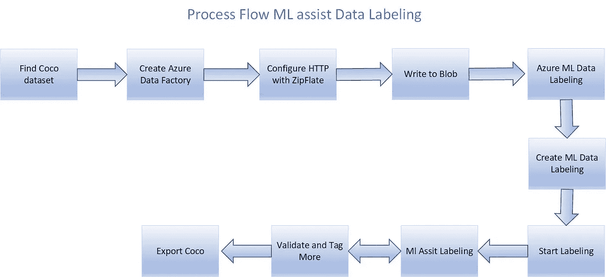

# 体系结构

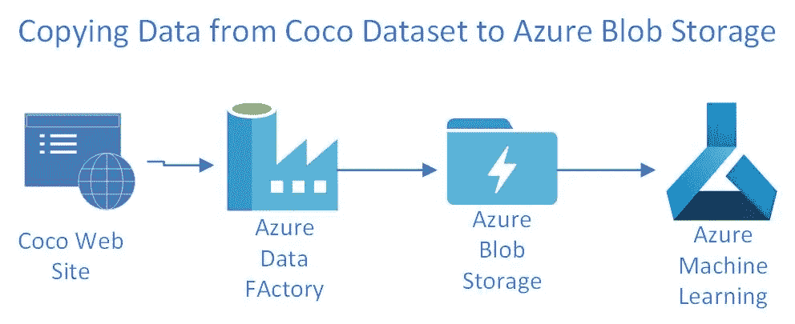

# 创建标注项目的步骤

*   创建新的数据标签
*   创建一个名为 coco2017 的项目，然后选择对象检测

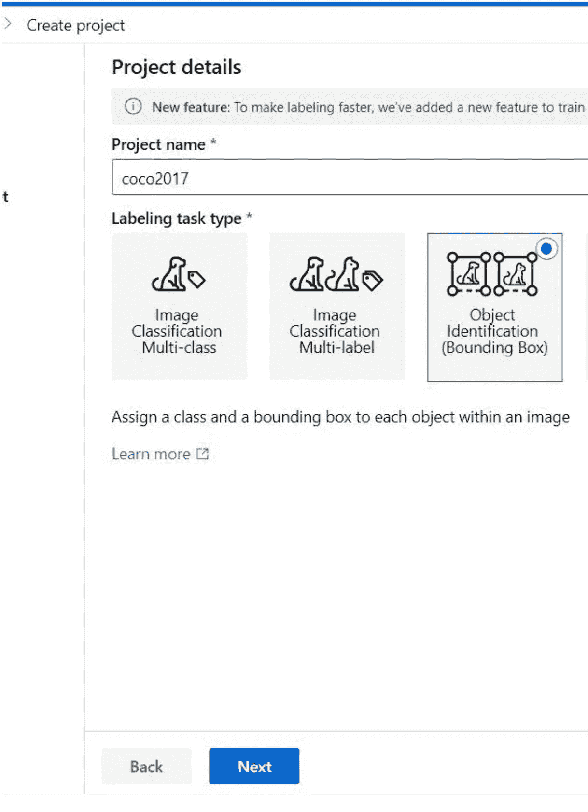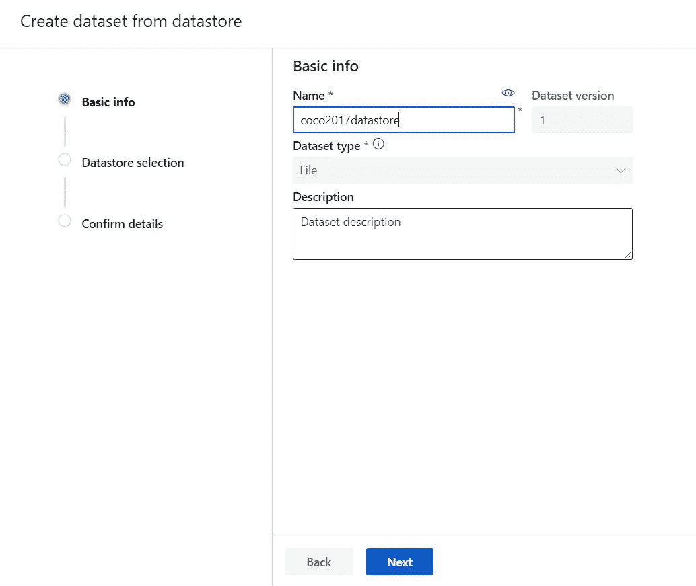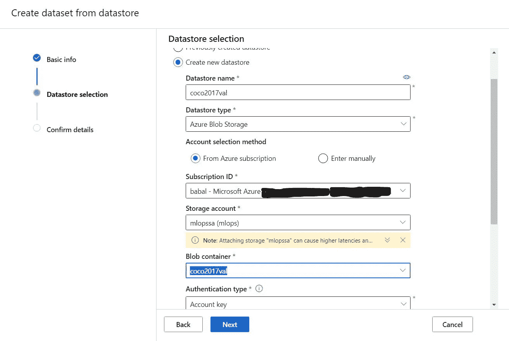

*   选择数据存储
*   启用增量刷新

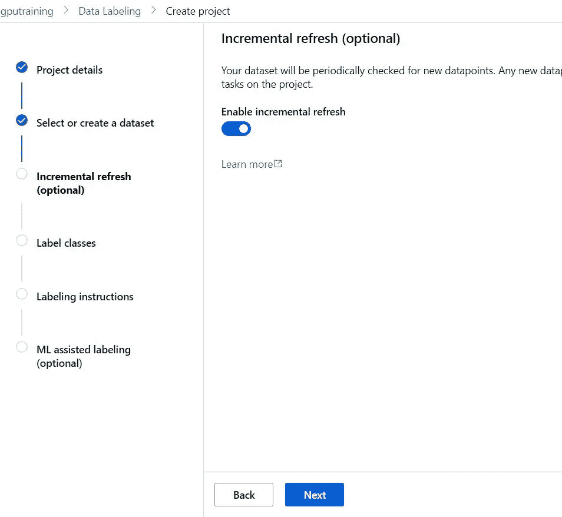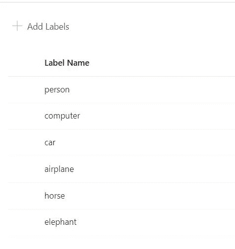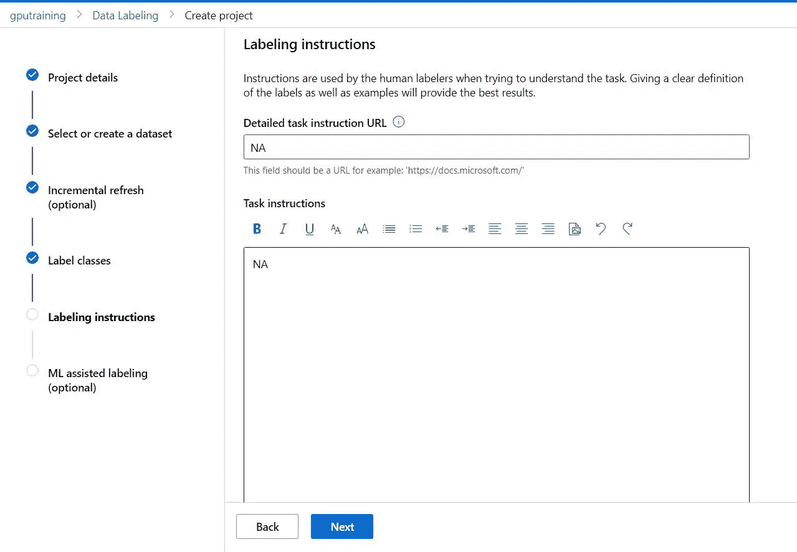

*   选择 ML 辅助
*   目前仅适用于矩形边界框项目。
*   无需大量人工标注就可以完成单类和多类图像分类

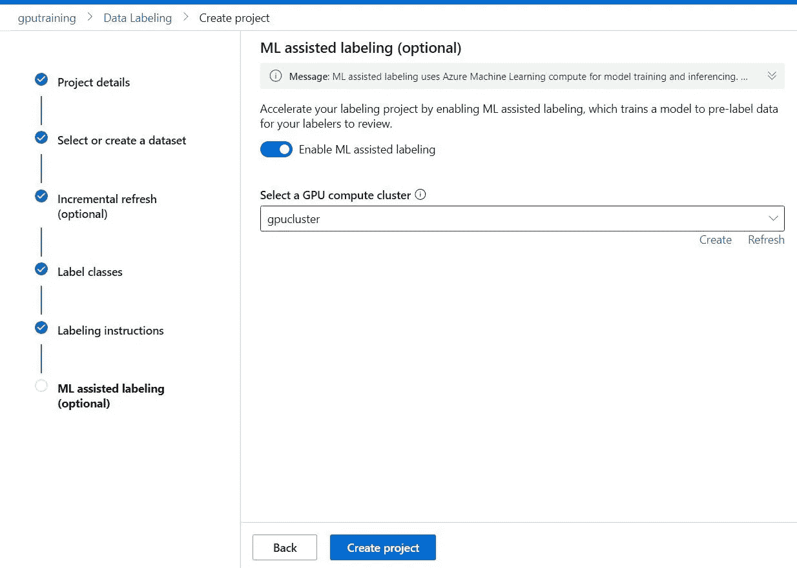

*   创建项目
*   现在转到项目
*   在仪表板中，它应该显示有多少照片的标签
*   系统自动为各种贴标机挑选最接近的最小图像
*   如果超过 2 个或更多，那么最少每个将得到 75 个图像进行标记
*   贴标机的进度也会显示在仪表板上

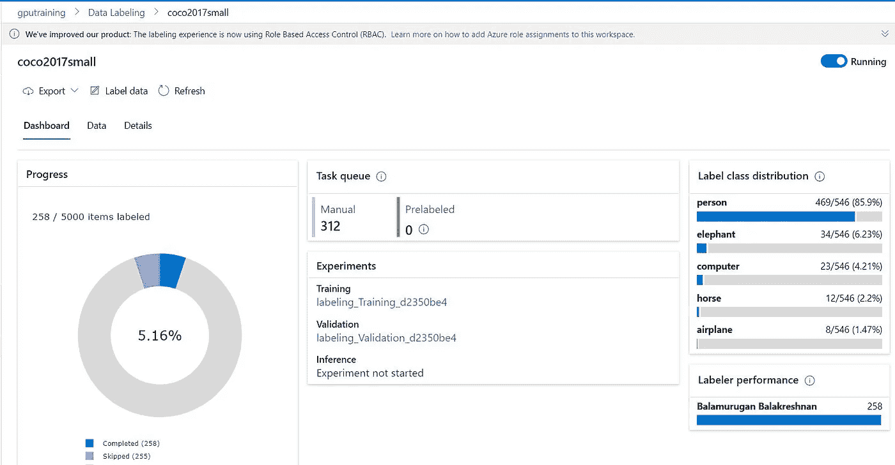

*   要开始标记，请单击标记的数据
*   然后单击开始标注

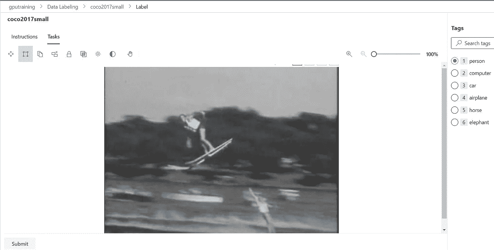

*   现在您可以选择标签，然后选择并拖动对象的框
*   一旦完成，然后点击提交按钮进行到下一个图像
*   如果没有对象，有一个手图标可以跳过图像
*   继续做更多的图像
*   在我的例子中，我必须标记 250 张图片，然后自动开始 ML 的训练
*   训练和验证完成后，您还会在标记数据部分看到任务预标记文本
*   根据模型，仪表板将显示多少是预先标记或手动标记

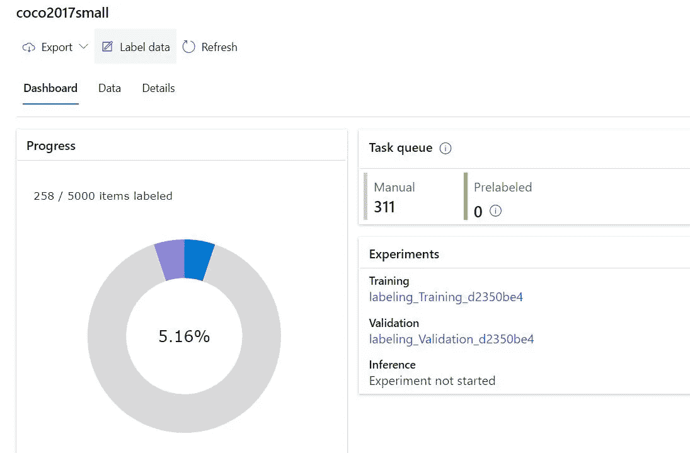

*   上面的图像表明训练和验证已经完成，但是包围盒对于 ML 辅助是不够的
*   因此，模型是说，做更多的 311 手动标签，看看它是否可以触发另一个模型运行
*   一旦模型运行，如果它有足够的数据点，模型将绘制边界框。
*   你也可以在左边看到贴标机的性能

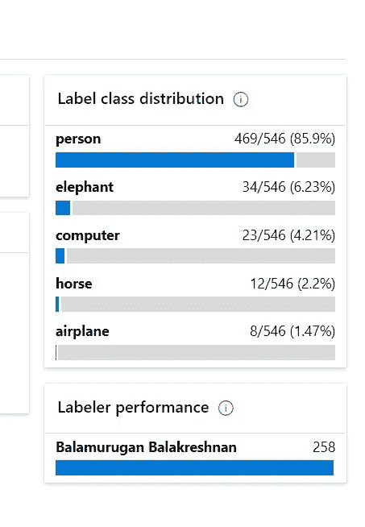

*   给定更多的图像，ML assist 可能需要更多的图像来标记
*   系统根据它的算法来检测，以确定有多少图像
*   完成后，我们可以将模型导出为 COCO 文件导出
*   使用 designer 或 Azure 机器学习创建 automl 模型

玩得开心

*最初发表于*[*【https://github.com】*](https://github.com/balakreshnan/mlops/blob/master/MLAssitDataLabelling/cocomlassist.md)*。*