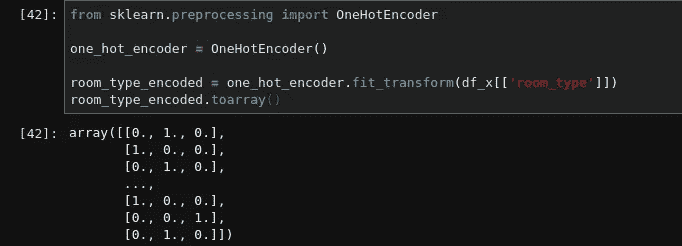

# 使用 Scikit-learn 构建数据转换管道

> 原文：<https://medium.com/analytics-vidhya/build-data-transformation-pipelines-using-scikit-learn-e36c9d5280e3?source=collection_archive---------4----------------------->

[田宽](https://unsplash.com/@realaxer?utm_source=medium&utm_medium=referral)在 [Unsplash](https://unsplash.com?utm_source=medium&utm_medium=referral) 上拍照

学习数据是任何机器学习过程中至关重要的一部分。一个好的机器学习实践者应该始终意识到，数据清理在准备数据中起着至关重要的作用，以便机器学习模型可以更好地理解数据集，最终作为模型提供更好的结果。清理数据有许多方法和步骤，有些非常简单，有些非常复杂。由于数据集是唯一的，因此应该精心设计一套独特的流程，将每一个数据集转换成可用于训练模型的东西。

在这里，我将谈论创建一个简单的管道，它将准备一个用于机器学习算法的数据集。首先，我们来看看数据集。我打算用**纽约市 Airbnb 开放数据**这个[是免费的@ kaggle](https://www.kaggle.com/dgomonov/new-york-city-airbnb-open-data) 。您可以从 Kaggle 下载 CSV 文件，并使用 Pandas 将其加载到 Jupyter 笔记本中。

让我们来看看数据集，以确定我们在这里处理的是什么类型的要素。

数据集的列及其包含的数据类型

如您所见，有 16 列包含不同类型的数据。它们需要进行相应的预处理。此外，您可能已经注意到列' *last_review* '和' *reviews_per_month* '有大量缺失值。您可能会看到一些属性是数字的，而另一些则带有“对象”数据。它们可以保存任何类型的 python 对象。在加载数据集并检查它们之后，您将看到它们是字符串，除了' *last_review* '之外，它清楚地包含日期。此外，您可能会注意到' *room_type* '可能是一个分类属性。让我们通过计算其中不同值的数量来检查它是否是分类的。

***房间类型*** 的相异值计数

事实上，这是一个分类属性，包含 3 种类型的数据。

接下来，我们将继续为数据集的数字属性绘制直方图。

数据集数值属性的直方图

除了*纬度*和*经度*之外，其他直方图似乎连一点正态分布都没有。这可能是一个问题，因为一些机器学习算法可能无法在这种数据下发挥最佳性能。这些应该被转换成正态分布。

*‘id’*属性表示唯一的 AirBnB 列表，而’*host _ id*表示唯一的主机。因此，我们没有必要保留' *name* '和' *host_name* '属性。它们是字符串值，会显著降低机器学习模型的训练过程。

从数据集中删除不需要的列

由于这是一个演示，**我不会将当前数据集分成测试集和训练集**。但是如果你在一个真实的项目中工作，**这是你将测试集**留给以后使用的地方。

接下来，我将分离预测值和标签，因为没有必要对预测值和标签应用相同的变换。假设我们想要建立一个机器学习模型来预测 AirBnB 房源的价格。那么列' *price* '将是标签列，所有其他列将是预测值。

分离预测值和标签

现在我们可以进入实际的数据转换过程。

我们应该关心的第一件事是数据清理。这意味着消除缺失的价值。这是数据转换的关键部分，因为许多机器学习模型无法处理缺失值。之前，我们注意到有两列缺少值。展望未来，我们有 3 个选择来处理这个问题。

1.  删除缺少值的 AirBnB 列表。
2.  删除缺少值的属性。
3.  将缺失值设置为某个值(平均值、列的中值或简单的零)。

因为为属性' *last_review* '设置缺失值是没有意义的，所以我将删除整个列。对于'*每月评论数*'列，我将用 0 替换缺少的值。

我将使用 Scikit-Learn**simple imputr**用 0 替换丢失的值。

删除**上次审核**并估算**每月审核**

接下来，我将处理包含分类值的列。我将尝试将这些值转换为数字，而不是使用默认类别，因为机器学习模型往往更适合数字属性，而不是字符串值属性。我将使用 Scikit-Learn**OneHotEncoder**来执行这个转换。

用 OneHotEncoder 编码分类值

OneHotEncoder 所做的是为分类值中的每个类别创建一个单独的列。因此，在本例中，它为我们之前看到的“*房间类型*”中的 3 个类别创建了 3 列。此方法将占用大量内存和处理能力，可能会降低训练速度，并影响模型的性能。如果一个分类列有大量可能的类别，使用 **OneHotEncoder** 是不明智的。明智的做法是使用类似于 [**OrdinalEncoder**](https://scikit-learn.org/stable/modules/generated/sklearn.preprocessing.OrdinalEncoder.html) 的东西来转换这类列。

然后，我们将继续讨论特征缩放。我将使用 Scikit-Learn**standard scaler**来缩放数字属性。它将从属性中的每个值中减去平均值，然后将它们除以标准偏差。这将确保变换后的值始终具有零均值和单位方差。

## 为数值创建转换管道

处理数值的管道

这条管道将，

1.  对于所有数字属性中的每个缺失值，添加 0。在这种情况下，在所有数字属性中，只有属性' *reviews_per_month* '缺少值。
2.  对每个数字属性执行标准缩放。

## 创建最终转换器来处理各种数据

处理所有属性的管道

这条管道将，

1.  执行由用于处理数字属性的管道完成的每个转换。
2.  删除不需要的属性(这是我们在前面的步骤中手动完成的)。
3.  将分类属性“ *room_type* ”编码为数字类别。
4.  保持剩余两个字符串属性:'*neighborhood*'和'*neighborhood _ group*'

这条管道将把从 Kaggle 获取的原始数据集转换成可用于有效训练机器学习模型的东西。

这是管道的完整代码。

完整管道的代码

请注意，我没有将这个数据集分为训练集和测试集。当您在实际项目中使用它时，请确保在此管道中使用 fit_transform 方法来训练数据，并且仅在需要时使用管道的 transform()方法来转换测试数据。**你没有根据测试数据再次拟合现有管道。它应该只用于转换测试集**。标签应始终不受影响。

## 参考

*   sci kit-学习用户指南:[https://scikit-learn.org/stable/user_guide.html](https://scikit-learn.org/stable/user_guide.html)
*   Géron，a，2020。使用 Scikit-Learn、Keras 和 Tensorflow 进行机器学习，第二版。【在线】奥莱利在线学习。可在:<[https://www . oreilly . com/library/view/hands-on-machine-learning/9781492032632/](https://www.oreilly.com/library/view/hands-on-machine-learning/9781492032632/)>【2020 年 12 月 9 日访问】。