# 使用 ML Kit Firebase 通过机器学习构建人脸运动检测

> 原文：<https://medium.com/analytics-vidhya/build-face-movement-detection-with-machine-learning-using-ml-kit-firebase-a4f1ea69ae04?source=collection_archive---------4----------------------->

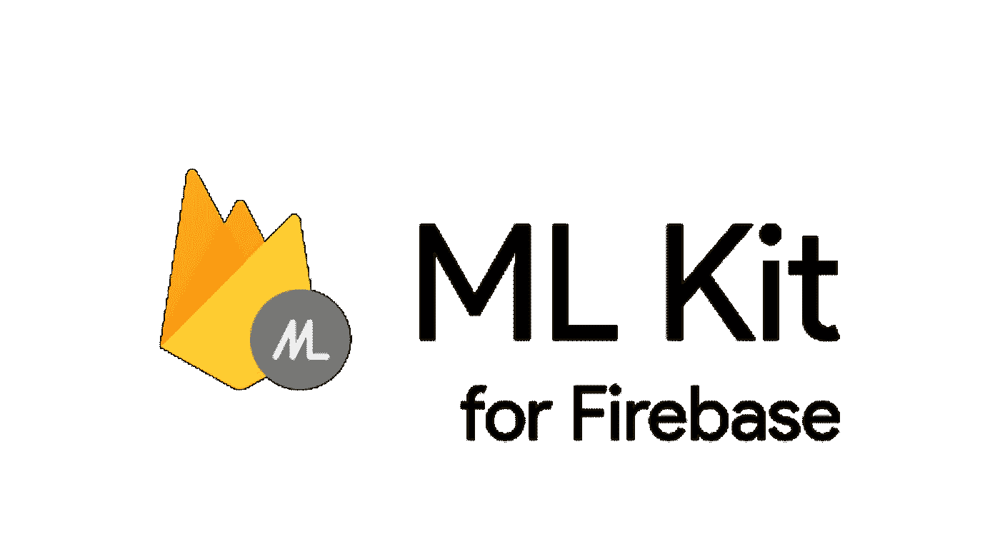

ML Kit firebase 是 firebase magic 之一，可以在您的移动应用程序中进行机器学习，通过导入 Firebase 为我们准备的库和 AI 模型，您可以轻松实现机器学习功能，现在有一些模型可供我们使用，您可以在 Firebase 控制台中查看所有可用的模型，如下所示。

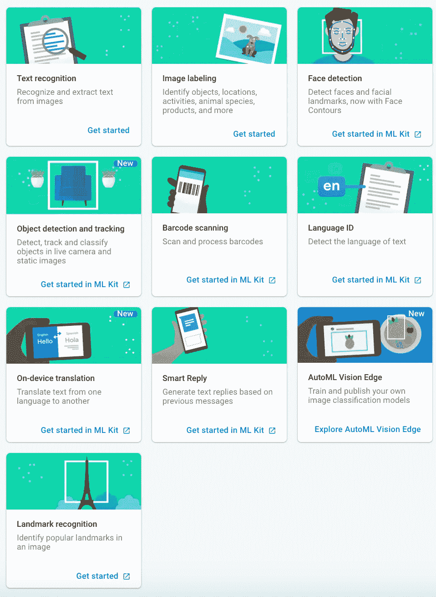

为了表示这种面部运动检测的用例，我们将使用一个名为**活跃度检测的用例，**它是一个功能特性，用于检测和验证用户是否真的是真实用户，为了验证它，有一些方法可以这样做:

1.  将捕获的视频上传到服务器
2.  用户和管理员之间的视频通话
3.  使用人工智能来验证和自动化活性检测

所以为了解决这个问题，在这里我们将使用来自 Firebase 的 ML 工具包。

# 我们将使用的技术

> ML Vision—Firebase 的 ML 套件

# 我们将使用的人工智能模型

> ML 视觉—人脸模型

# Firebase 设置

为了得到这些人工智能模型中的一个，我们需要在 https://firebase.google.com/[创建一个 Firebase 项目。
登录后，您需要创建一个 Firebase 项目，如下所示。](https://firebase.google.com/)

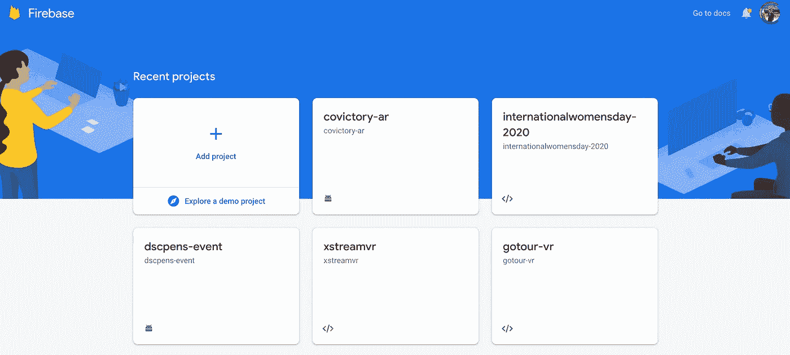

然后，单击左边的机器学习部分，因为我们将在这里进行活性检测，所以我们将使用一个名为**人脸检测**的模型。

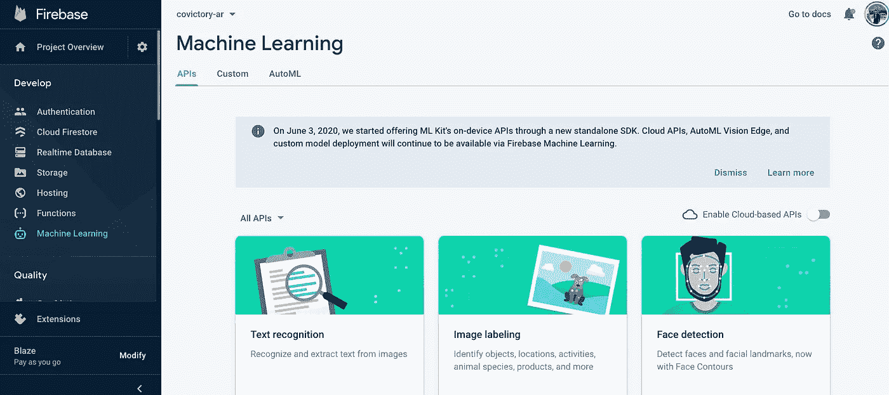

一旦我们选择了模型，填充一些关于我们项目的信息并下载我们的 **google-services.json** 。我们可以跳转到 Android Studio 来构建我们的应用程序。

所以在继续之前，我们先来了解一下 MLKit Firebase 的基础知识——人脸检测。

# 基础知识

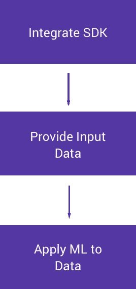

1.  将 SDK
    Import MLKit 依赖项集成到项目中
2.  提供输入数据
    输入数据将是从摄像机拍摄的图像帧，并在设备中本地独立处理。(设备上处理)
3.  将 ML 应用于数据
    从设备摄像头拍摄的数据将由 AI 机器学习模型进行处理，该模型在我们构建应用时已经嵌入到应用中。

此 MLKit(机器学习套件)中还有一些其他功能，包括:

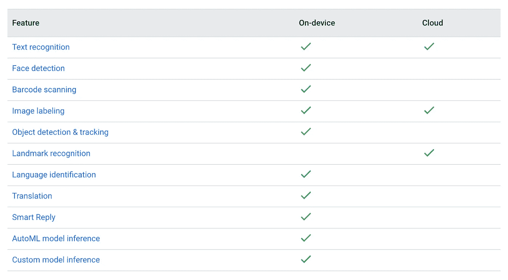

正如我们可以看到的，我们现在将用于活体检测的**人脸检测**是一个**设备上的**功能，这意味着一切都将在用户的设备内处理。

# 面向方向

以下术语描述了面相对于相机的角度:

*   **欧拉 X** :欧拉 X 角为正的面朝上。
*   **欧拉 Y** :欧拉 Y 角为正的脸看向镜头右边，为负的脸看向左边。
*   **欧拉 Z** :欧拉 Z 角为正的面相对于相机逆时针旋转。

在以下情况下，ML 套件不会报告检测到的面的欧拉 X、欧拉 Y 或欧拉 Z 角度:

> 地标 _ 模式 _ 无
> 
> 轮廓 _ 模式 _ 全部
> 
> 分类 _ 模式 _ 无
> 
> 性能模式快速

被设置在一起。

现在，让我们开始 Android Studio，所以在继续之前，请确保您已经创建了您的 Android Studio 项目，并将您的 **google-services.json** 放在项目的根目录中。

# 预设置

MLKit 要求 minSdk 16，适用于:

*   ML 试剂盒普通版本 19.0.0
*   ML 套件视觉版本 20.0.0
*   ML 套件对象检测和跟踪模型版本 16.0.0
*   ML 工具包自然语言版本 19.0.0
*   ML 试剂盒语言识别模型版本 19.0.0
*   ML 套件智能回复模型版本 19.0.0
*   ML 套件翻译模型版本 19.0.0
*   ML 套件模型解释器版本 19.0.0
*   ML 套件 Vision AutoML 版本 16.0.0

首先，将 MLKit 库导入到项目中，并添加一个人脸模型作为从属模型。

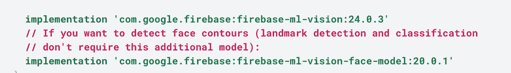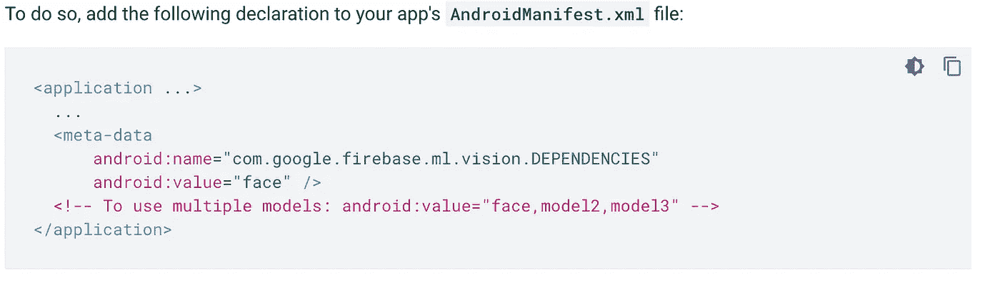

# 1.配置面部检测器

在将人脸检测应用于图像或扫描仪之前，如果我们想要更改人脸检测器的任何默认设置，请使用 firebasevisionfaceteditoroptions 对象指定这些设置。我们可以通过以下设置进行更改:

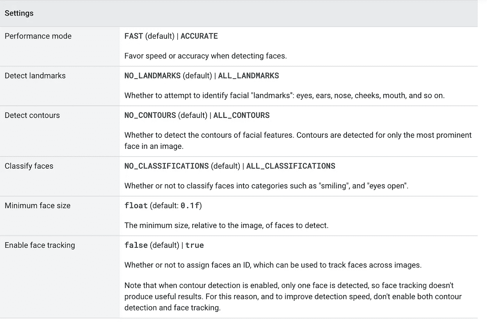

因此，在这里我们将配置如下:

*   **性能模式**变得**快**
    我们使用性能模式变得**快**而不是**准**因为用户的设备并不是真正的高端设备，所以处理和运行 AI 模型的能力并不是真的很好或足够快。
*   **地标模式**为**所有地标**
    使用此选项，我们将获得人工智能模型检测到的人脸上的所有地标，如鼻子、右耳、左耳等。

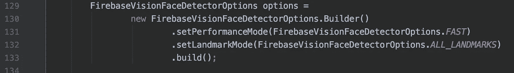

# 2.准备数据源

为了检测图像中的人脸，我们可以从图像、视频或实时相机渲染中创建一个 InputImage 对象。然后，将 InputImage 对象传递给 FaceDetector 的 process 方法。

*   **基于捕获图像的输入图像**

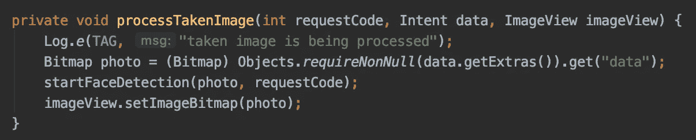

位图对象是从相机意图中获取并创建的，所述对象将被传递给人脸检测函数以进行进一步处理。

*   **基于实时渲染输入视频**

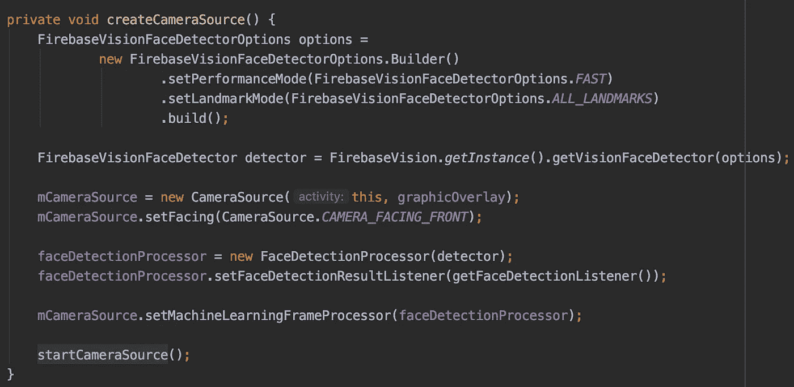

我们不是创建一个 Image 对象，而是创建一个 FaceDetectionProcessor 对象来附加到一个摄像机源。这样，我们将能够立即处理渲染数据，并近乎实时地检测所述对象的活性(性能取决于所用设备的规格)。

# 3.从 FaceDetector 实例启动检测器

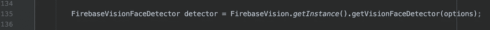

检测器用于启动任何检测，我们将从 Firebase Vision 实例中获得这些检测。

# 4.处理数据源

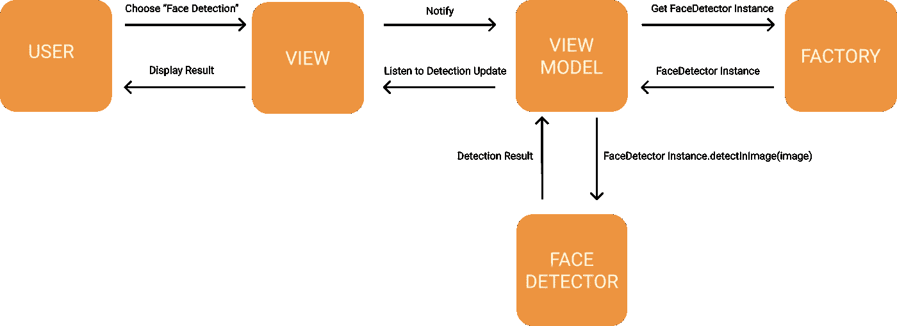

在检测器启动后，接下来我们将把图像传递给检测图像函数，以便所述检测器能够从传递的图像中提取 FireBaseVisionFaces 对象。处理本身将由 FireBase 库处理，并自动将其输出传递给监听器函数。

# 5.从检测结果中获取信息

一旦我们从 MLKit 的嵌入式 AI 模型中获得检测结果，监听器将被 FirebaseVisionFaces 的对象触发，其中将包含每个已检测到的人脸的检测结果，因为现在原型只能正常工作，如果检测到 2 个以上的人脸，将会有一些不期望的结果。

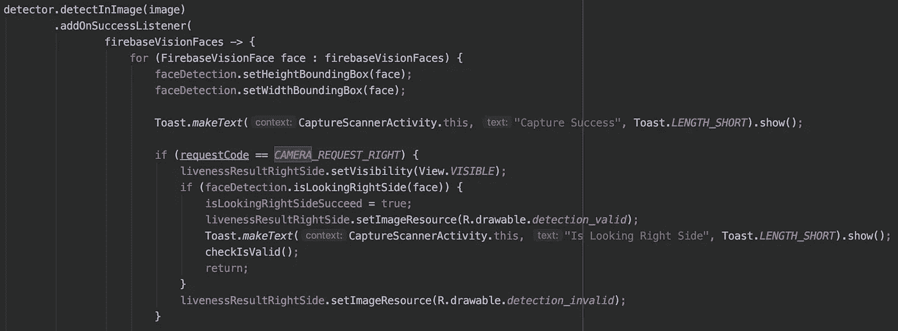

当在传递的图像中检测到 FireBaseVisionFaces 对象时，addOnSuccessListener 将在其参数内运行 lambda 函数。在这种情况下，提取的人脸对象将被传递给 FaceDetection 对象，以进行进一步处理。例如，这里的 face 对象将被传递给 isLookingRightSide 函数。

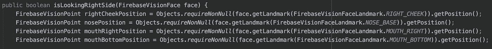

在将 FireBaseVisionFaces 对象传递给 isLookingRightSide 函数后，该函数将提取在配置步骤中已配置的地标的位置。

在这里，我们将提取面部中间到右侧的标志。那就是:

*   右脸颊
*   向右张嘴
*   鼻基
*   嘴底部

这些职位将被进一步处理，所以我们可以根据我们的需要来计算它。

# 6.根据需要用我们的计算处理信息

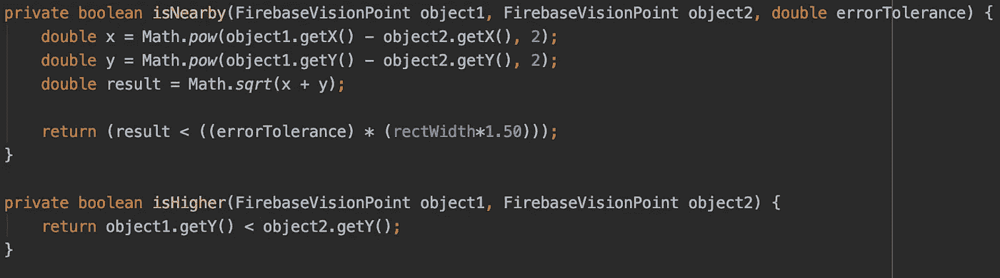

从提取的位置，我们可以使用 isNearby 和 isHigher 函数计算 2 个点的差异，以确定两点之间的“接近度”或 Y 位置比较。这些函数将被用作对结果进行分类的参数。

# 7.根据需要对过程结果进行分类

计算后，结果将被归入 4 个不同的分类，即:

*   抬头看；查阅

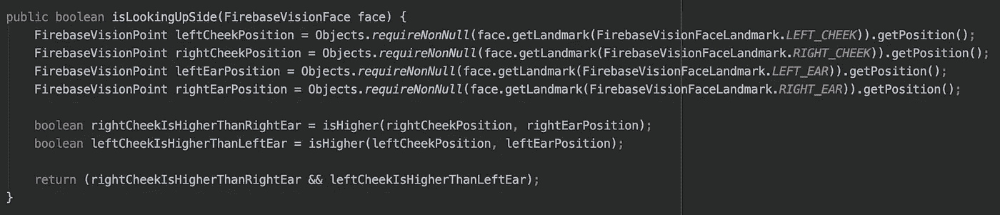

*   向下看

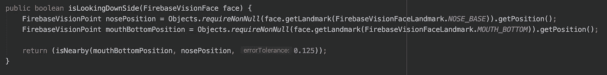

*   向左看

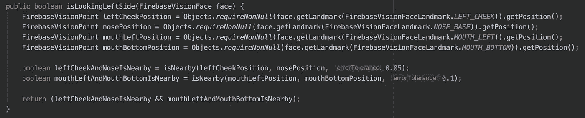

*   向右看

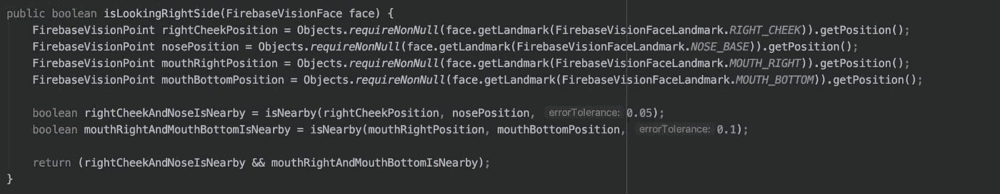

在 isLookingRight 功能的情况下，当**右脸颊位置**接近**鼻梁位置**并且**嘴部右位置**接近**嘴部下位置**时，所述面部将被分类为向右看，这同样适用于另一种检测，因此基本上每次检测我们将基于 AI 模型实时给出的数据使用不同的算法和数学计算。

**误差容限**

这种计算也取决于在某些函数中应用的**误差容限**，这个**误差容限**是一个特定检测被视为有效检测的值范围，**误差容限**越大，检测的准确性就越低，因此给出一个适当且平衡的**误差容限**值是非常重要和关键的，但是这个**误差容限**从何而来呢？该值来自于我们开发函数时的值测试，并猜测特定检测的**误差容差**的理想值。

因此，一旦一切都设置妥当，瞧，这就是结果！

希望有帮助！如果你们有任何问题，请随时问我，如果你们喜欢，不要忘记给一些掌声！:D