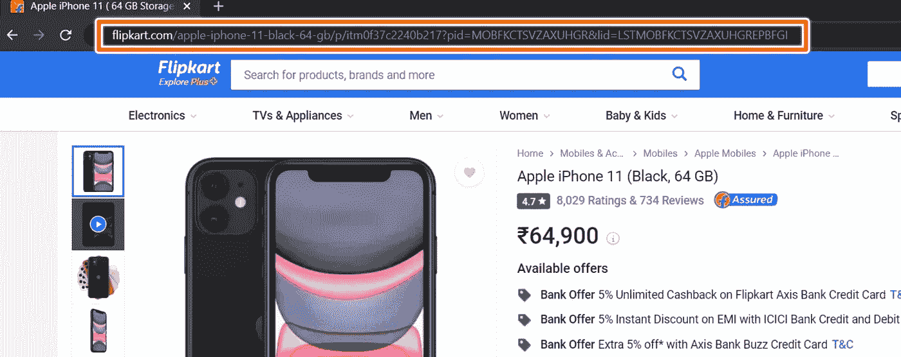

# 使用 Python 构建 Flipkart 价格跟踪器

> 原文：<https://medium.com/analytics-vidhya/build-flipkart-price-tracker-using-python-b2271aa41987?source=collection_archive---------7----------------------->


你和我一样穷，买不起他们真实价格的新 iPhone。你是做什么的？你等着价格下跌。(说实话，还是比不上降价的 iPhone，但如果价格下降，我们会假设我会买😅)毫无疑问，你可以使用成千上万现有的价格下降聚合器中的一个，但是自己建立一个会有多酷呢？让我们开始吧。

首先，让我们导入我们将需要的包。

请求:将用于获取网页的 HTML 代码
smtplib:将用于发送电子邮件
BeautifulSoup:将用于解析网站
时间:持续检查价格下降

```
import requests 
import smtplib 
from bs4 import BeautifulSoup 
import time 
```

现在我们已经进口了包装，是时候得到我们想要不断检查价格的产品了。

在这个例子中，我将使用 iPhone 11。你可以选择使用任何其他产品。打开产品页面后，复制网址并将其存储在一个变量中，如下所示。



```
URL = '[https://www.flipkart.com/apple-iphone-11-black-64-gb/p/itm0f37c2240b217?pid=MOBFKCTSVZAXUHGR&lid=LSTMOBFKCTSVZAXUHGREPBFGI'](https://www.flipkart.com/apple-iphone-11-black-64-gb/p/itm0f37c2240b217?pid=MOBFKCTSVZAXUHGR&lid=LSTMOBFKCTSVZAXUHGREPBFGI')
```

现在，我们要为 HTTP 请求中的头定义用户代理。用户代理是一种识别操作系统和发出请求的代理的浏览器的方法。

如果你想知道你的用户代理是什么，只需谷歌“我的用户代理”


现在复制用户代理并添加一个字典，如下所示:

```
headers = { 'User-Agent': 'Mozilla/5.0 (Windows NT 10.0; Win64; x64) AppleWebKit/537.36 (KHTML, like Gecko) Chrome/79.0.3945.130 Safari/537.36' }
```

我们将首先获取带有提供的 URL 和标题的网页，并将其存储在一个变量中。

```
page = requests.get(URL, headers=headers)
```

然后，我们将使用 beautiful soup 解析提取并存储在变量“page”中的 HTML。

```
soup = BeautifulSoup(page.content, 'html.parser')
```

让我们试着得到产品的名称。用 *Ctrl + Shift + I* 打开 Inspect 元素，指向产品名称，您会看到它被封装在一个 *< span/ >* 标签中，标签上有一个类名 *_35KyD6* 。


代码看起来会像这样，

```
title = soup.find("span", {"class": "_35KyD6"}).get_text()
```

我们可以遵循类似的路径来提取价格。


Replace 用于删除价格中的逗号。我们使用*【1:】*得到没有'₹'符号的价格。

```
price = float(soup.find("div", {"class": "_1vC4OE _3qQ9m1"}).get_text()[1:].replace(',',''))
```

假设我们希望在价格低于 55，000 时发送电子邮件。现在，让我们将上面写的所有内容包含到 check_price()函数中，该函数将检查 Flipkart 上产品的价格。

```
def check_price():
    page = requests.get(URL, headers=headers)
    soup = BeautifulSoup(page.content, 'html.parser')

    title = soup.find("span", {"class": "_35KyD6"}).get_text()
    price = float(soup.find("div", {"class": "_1vC4OE _3qQ9m1"}).get_text()[1:].replace(',',''))

    print(price)

    if( price < 55000.0 ): 
        sendmail()
```

是时候定义设置 *sendmail()* 函数了，该函数将负责在价格下跌时发送电子邮件。

首先，我们将使用主机名和端口号定义一个 SMTP 客户端会话。由于我们将使用 Gmail 发送电子邮件，主机名将为*smtp.gmail.com*，端口号为 *587* 。

```
server = smtplib.SMTP('smtp.gmail.com', 587)
```

然后我们将发送一个 ehlo()请求。黄玉荣基本上是指由哪些服务器来识别客户端。请求之后，我们将在 TLS 中启动一个 SMTP 连接，并重新发送 ehlo()。

```
server.ehlo() 
server.starttls() 
server.ehlo()
```

现在，你必须获得 Gmail 的应用程序密码，才能真正发送电子邮件。为此，请前往[https://myaccount.google.com/security](https://myaccount.google.com/security)，然后点击应用程序密码


然后选取“邮件”和您所在的设备，然后生成密码。


之后，保存密码和您的电子邮件，如下面的代码所述。

```
server.login('your_email@gmail.com', 'your_app_password')
```

然后，让我们定义电子邮件的各个方面，如发送电子邮件前的主题和邮件正文。

```
subject = 'Hey! Price fell down'
body = 'Check the link ' + URL
msg = f"Subject: {subject}\n\n{body}"server.sendmail('sender_email@gmail.com', 'receiver_email@gmail.com', msg)
```

现在，让我们将上面写的所有内容附到我们的 sendmail()函数中，该函数将允许在价格下跌时自动发送电子邮件。

```
def sendmail():
    '''Function called when the email needs to be sent ''' server = smtplib.SMTP('smtp.gmail.com', 587) 
    server.ehlo()
    server.starttls() 
    server.ehlo()

    server.login('xyz@example.com', 'myAppPassword') 

    subject = 'Hey! Price fell down' 
    body = 'Check the link ' + URL 

    msg = f"Subject: {subject}\n\n{body}" 

    server.sendmail('sender_email@gmail.com', 'receiver_email@gmail.com', msg)

    print('Email Sent')

    server.quit() 
```

完成了。除了…每小时自动检查价格(60*60 秒)。为此，我们将借助睡眠功能。

```
while(True):
    check_price()
    time.sleep(60*60)
```

您可以在 Github 上用整个 python 文件检查项目。

[](https://github.com/mukundmadhav/flipkart-price-tracker) [## mukundmadhav/flipkart-价格跟踪系统

### 用 Python 写的 Flipkart 价格跟踪器。通过创建一个……

github.com](https://github.com/mukundmadhav/flipkart-price-tracker) 

# 下一步是什么？

您可以使用相同的自动保存这些数据到一个数据库，并使您自己的价格跟踪网站或出口到一个产品列表的 CSV 文件。