# 使用 Python 和 R 中的自动 ARIMA 构建高性能时间序列模型

> 原文：<https://medium.com/analytics-vidhya/build-high-performance-time-series-models-using-auto-arima-in-python-and-r-f1d996583bf6?source=collection_archive---------0----------------------->


想象一下，你的任务是预测下一部 iPhone 的价格，并获得了历史数据。这包括季度销售额、月环比支出以及苹果资产负债表上的一系列内容。作为一名数据科学家，您会将这归为哪一类问题？当然是时间序列建模。

从预测产品销售到估计家庭用电量，时间序列预测是任何数据科学家都应该知道的核心技能之一，如果不是掌握的话。有太多不同的技术可供您使用，我们将在本文中介绍最有效的一种，称为自动 ARIMA。

我们将首先了解 ARIMA 的概念，这将导致我们的主要议题——汽车 ARIMA。为了巩固我们的概念，我们将使用一个数据集并用 Python 和 r 实现它。

# 目录

1.  什么是时间序列？
2.  时间序列预测方法
3.  ARIMA 简介
4.  实施 ARIMA 的步骤
5.  我们为什么需要 AutoARIMA？
6.  自动 ARIMA 实现(在航空乘客数据集上)
7.  自动 ARIMA 如何选择参数？

如果你熟悉时间序列及其技术(如移动平均、指数平滑和 ARIMA)，你可以直接跳到第 4 节。对于初学者，从下面一节开始，这是对时间序列和各种预测技术的简要介绍。

# 1.什么是时间序列？

在我们学习处理时间序列数据的技术之前，我们必须首先了解时间序列实际上是什么，以及它与任何其他类型的数据有何不同。这是时间序列的正式定义——它是以一致的时间间隔测量的一系列数据点**。这仅仅意味着特定的值以固定的时间间隔记录，可能是每小时、每天、每周、每 10 天等等。**时间序列的不同之处在于，序列中的每个数据点都依赖于之前的数据点。**举几个例子，让我们更清楚地理解两者的区别。**

示例 1:

假设您有一个从特定公司贷款的人的数据集(如下表所示)。您认为每一行都与前面的行相关吗？肯定不是！一个人所接受的贷款将基于他的财务状况和需求(也可能有其他因素，如家庭规模等。，但为了简单起见，我们只考虑收入和贷款类型)。此外，数据不是在任何特定的时间间隔收集的。这取决于公司何时收到贷款请求。

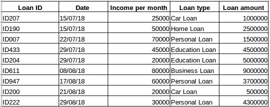

示例 2:

我们再举一个例子。假设您有一个包含每天空气中 CO2 水平的数据集(如下截图)。通过查看过去几天的数值，您能够预测第二天二氧化碳的大致数量吗？当然了。如果观察的话，数据一直是按天记录的，也就是时间间隔不变(24 小时)。

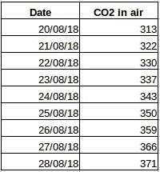

到现在为止，您一定已经对此有了一个直觉——第一种情况是一个简单的回归问题，第二种情况是一个时间序列问题。虽然这里的时间序列难题也可以使用线性回归来解决，但这并不是最好的方法，因为它忽略了这些值与所有相对过去值的关系。现在让我们来看看解决时间序列问题的一些常用技术。

# 2.时间序列预测方法

时间序列预测有多种方法，我们将在本节简要介绍这些方法。下面提到的所有技术的详细解释和 python 代码可以在本文中找到:[时间序列预测的 7 种技术(用 python 代码)](https://www.analyticsvidhya.com/blog/2018/02/time-series-forecasting-methods/)。

1.  **朴素方法:**在这种预测技术中，新数据点的值被预测为等于先前数据点的值。结果将是一条平线，因为所有新值都采用以前的值。

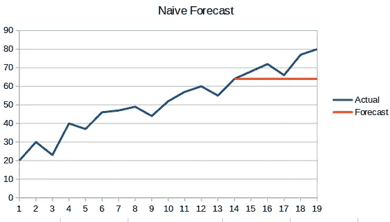

**2。简单平均:**下一个值取之前所有值的平均值。这里的预测比‘天真方法’更好，因为它不会产生一条平坦的线，但这里，所有过去的值都被考虑在内，这可能并不总是有用的。例如，当被要求预测今天的温度时，你会考虑最近 7 天的温度，而不是一个月前的温度。

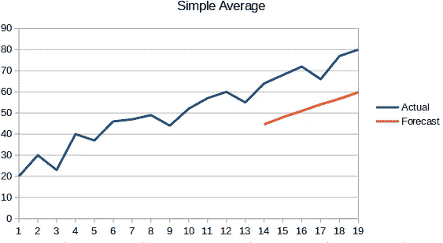

**3。移动平均线:**这是对之前技术的改进。不是取所有先前点的平均值，而是取“n”个先前点的平均值作为预测值。

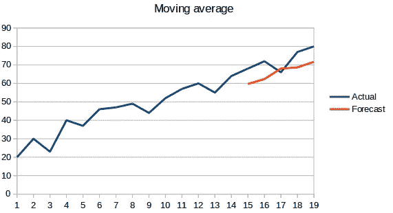

**4。加权移动平均:**加权移动平均是对过去的“n”个值赋予不同权重的移动平均。

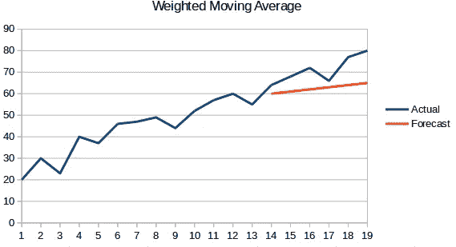

**5。简单指数平滑:**在这种技术中，较之遥远过去的观测值，更大的权重被分配给最近的观测值。

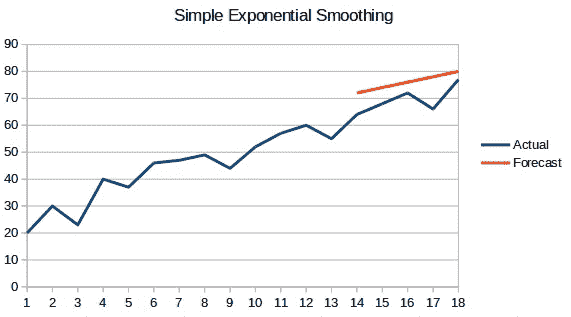

**6。霍尔特线性趋势模型:**这种方法考虑了数据集的趋势。所谓趋势，我们指的是该系列的递增或递减性质。假设一家酒店的预订量每年都在增加，那么我们可以说预订量呈增加趋势。该方法中的预测函数是水平和趋势的函数。

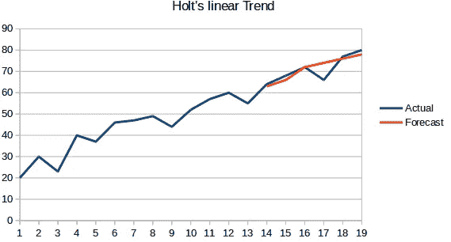

7 .**。霍尔特温特斯法:**该算法同时考虑了数列的趋势性和季节性。例如，酒店的预订量在周末很高，在工作日很低，并且每年都在增加；存在周季节性和增加趋势。

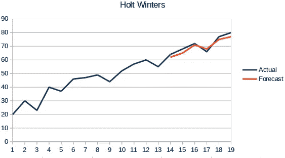

**8。ARIMA:** ARIMA 是一种非常流行的时间序列建模技术。它描述了数据点之间的相关性，并考虑了值的差异。ARIMA 的一个改进是萨里玛(或季节性 ARIMA)。我们将在下一节更详细地讨论 ARIMA。

# 3.ARIMA 简介

在本节中，我们将快速介绍 ARIMA，这将有助于理解汽车 Arima。Arima、参数(p，q，d)、图(ACF PACF)和实现的详细说明包含在本文中:[时间序列完整教程](https://www.analyticsvidhya.com/blog/2015/12/complete-tutorial-time-series-modeling/)。

ARIMA 是一种非常流行的时间序列预测统计方法。ARIMA 代表**自回归综合移动平均线**。ARIMA 模型基于以下假设

*   数据序列是稳定的，这意味着平均值和方差不应随时间变化。通过使用对数变换或差分序列，可以使序列成为平稳的。
*   作为输入提供的数据必须是单变量序列，因为 arima 使用过去的值来预测未来的值。

ARIMA 有三个分量——AR(自回归项)、I(差分项)和 MA(移动平均项)。让我们了解这些组件中的每一个

*   AR 术语是指用于预测下一个值的过去值。AR 项由 arima 中的参数“p”定义。使用 ACF 图确定“p”的值。
*   MA 术语用于定义用于预测未来值的过去预测误差的数量。arima 中的参数“q”代表 ma 项。PACF 图用于确定正确的“q”值。
*   差分顺序指定对序列执行差分操作的次数，以使其稳定。像 ADF 和 KPSS 这样的检验可以用来确定数列是否平稳，并有助于确定 d 值。

# 4.实施 ARIMA 的步骤

实施 ARIMA 模式的一般步骤是

1.  **加载数据:**建模的第一步当然是加载数据集
2.  **预处理:**根据数据集的不同，将定义预处理的步骤。这将包括创建时间戳、转换日期/时间列的数据类型、使序列成为单变量等。
3.  **使数列平稳:**为了满足假设，需要使数列平稳。这将包括检查序列的平稳性和执行所需的转换
4.  **确定 d 值:**为了使数列平稳，差分运算的次数将作为 d 值
5.  **创建 ACF 和 PACF 地块:**这是 ARIMA 实施中最重要的一步。ACF PACF 图用于确定我们的 ARIMA 模型的输入参数
6.  **确定 p 和 q 值:**从上一步的图中读取 p 和 q 值
7.  **拟合 ARIMA 模型:**使用经过处理的数据和我们在前面步骤中计算的参数值，拟合 ARIMA 模型
8.  **预测验证集上的值:**预测未来值
9.  **计算 RMSE:** 要检查模型的性能，请使用验证集上的预测值和实际值来检查 RMSE 值

# 5.为什么我们需要汽车 ARIMA？

虽然 ARIMA 是预测时间序列数据的一个非常强大的模型，但数据准备和参数调整过程最终非常耗时。在实现 ARIMA 之前，你需要使序列稳定，并使用我们上面讨论的图来确定 p 和 q 的值。自动 ARIMA 使这项任务对我们来说非常简单，因为它消除了我们在上一节看到的步骤 3 至 6。以下是实施自动 ARIMA 时应遵循的步骤:

1.  加载数据:这一步是一样的。将数据载入你的笔记本
2.  预处理数据:输入应该是单变量的，因此删除其他列
3.  拟合自动 ARIMA:拟合单变量序列的模型
4.  预测验证集的值:对验证集进行预测
5.  计算 RMSE:使用预测值和实际值来检查模型的性能

如您所见，我们完全忽略了 p 和 q 特性的选择。真是松了一口气！在下一节中，我们将使用玩具数据集实现自动 ARIMA。

# 6.用 Python 和 R 实现

我们将使用国际航班乘客数据集。该数据集包含每月乘客总数(以千计)。它有两列——月份和乘客数量。你可以从[这个链接](https://datamarket.com/data/set/22u3/international-airline-passengers-monthly-totals-in-thousands-jan-49-dec-60#!ds=22u3&display=line)下载数据集。

```
#load the data
data = pd.read_csv('international-airline-passengers.csv')

#divide into train and validation set
train = data[:int(0.7*(len(data)))]
valid = data[int(0.7*(len(data))):]

#preprocessing (since arima takes univariate series as input)
train.drop('Month',axis=1,inplace=True)
valid.drop('Month',axis=1,inplace=True)

#plotting the data
train['International airline passengers'].plot()
valid['International airline passengers'].plot()
```

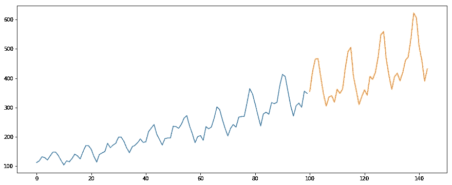

```
#building the model
from pyramid.arima import auto_arima
model = auto_arima(train, trace=True, error_action='ignore', suppress_warnings=True)
model.fit(train)

forecast = model.predict(n_periods=len(valid))
forecast = pd.DataFrame(forecast,index = valid.index,columns=['Prediction'])

#plot the predictions for validation set
plt.plot(train, label='Train')
plt.plot(valid, label='Valid')
plt.plot(forecast, label='Prediction')
plt.show()
```

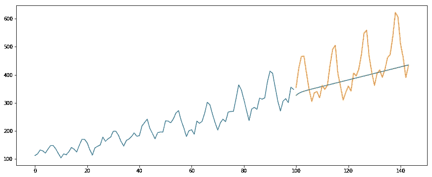

```
#calculate rmse
from math import sqrt
from sklearn.metrics import mean_squared_error

rms = sqrt(mean_squared_error(valid,forecast))
print(rms)output -
76.51355764316357
```

下面是同一个问题的 R 代码:

```
# loading packages
library(forecast)
library(Metrics)

# reading data
data = read.csv("international-airline-passengers.csv")

# splitting data into train and valid sets
train = data[1:100,]
valid = data[101:nrow(data),]

# removing "Month" column
train$Month = NULL

# training model
model = auto.arima(train)

# model summary
summary(model)

# forecasting
forecast = predict(model,44)

# evaluation
rmse(valid$International.airline.passengers, forecast$pred)
```

# 7.Auto Arima 如何选择最佳参数

在上面的代码中，我们简单地使用了*。fit()* 命令来拟合模型，而不必选择 p，q，d 的组合，但是模型是如何计算出这些参数的最佳组合的呢？自动 ARIMA 考虑生成的 AIC 和 BIC 值(如您在代码中所见)来确定参数的最佳组合。AIC(阿凯克信息准则)和 BIC(贝叶斯信息准则)值是比较模型的估计量。这些值越低，模型越好。

如果你对[【AIC】](http://www.statisticshowto.com/akaikes-information-criterion/)[【BIC】](http://www.statisticshowto.com/bayesian-information-criterion/)背后的数学有兴趣，可以看看这些链接。

# 8.结束笔记和进一步阅读

我发现自动 ARIMA 是进行时间序列预测的最简单的技术。知道一条捷径很好，但熟悉捷径背后的数学知识也很重要。在这篇文章中，我已经浏览了 ARIMA 如何工作的细节，但是请确保你浏览了文章中提供的链接。为了便于您参考，以下是链接:

*   [Python 时间序列预测初学者综合指南](https://www.analyticsvidhya.com/blog/2016/02/time-series-forecasting-codes-python/)
*   [R 中时间序列的完整教程](https://www.analyticsvidhya.com/blog/2015/12/complete-tutorial-time-series-modeling/)
*   [7 种时间序列预测技术(用 python 代码)](https://www.analyticsvidhya.com/blog/2018/02/time-series-forecasting-methods/)

我建议在这个练习题上练习我们在这里学到的:[时序练习题](https://datahack.analyticsvidhya.com/contest/practice-problem-time-series-2/)。您也可以参加我们针对同一个练习题[时间序列预测](https://trainings.analyticsvidhya.com/courses/course-v1:AnalyticsVidhya+TS_101+TS_term1/about)创建的培训课程，为您提供一个良好的开端。

祝你好运，欢迎在下面的评论区提供你的反馈和问题。

*原载于 2018 年 8 月 30 日*[*www.analyticsvidhya.com*](https://www.analyticsvidhya.com/blog/2018/08/auto-arima-time-series-modeling-python-r/)*。*