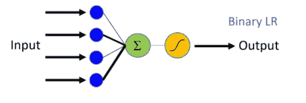
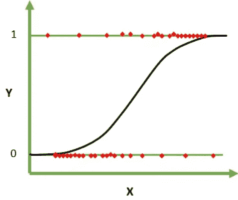

# 用 SKlearn 和 Keras 建立相似的逻辑回归模型

> 原文：<https://medium.com/analytics-vidhya/build-lookalike-logistic-regression-model-with-sklearn-and-keras-2b03c540cdd5?source=collection_archive---------5----------------------->


> `*~If you could attenuate to every strand of quivering data, the future would be entirely calculable.~Sherlock*`

*   无隐层神经网络，输出层具有 sigmoid 激活函数。



具有一个输出层的神经网络

*   Sklearn 逻辑回归函数

每当分类问题出现时，逻辑回归模型在其他分类模型中脱颖而出。逻辑回归是一种线性模型，它将概率分数映射到两个或多个类别。分类过程基于默认阈值 0.5。它使用最大似然法给每个变量(系数估计)一个权重，以最大化似然函数。逻辑函数是几率函数对数的指数。



**p(X) = Pr(Y = 1|X)**

逻辑回归，可以用几种方法在 python 中实现，不同的包可以很好地完成这项工作。一种方法是通过使用著名的 sklearn 包，另一种是通过导入神经网络包 Keras。为了在两种方法中获得相似的结果，我们应该改变两种模型中的超参数，以考虑迭代次数、优化技术和要使用的正则化方法。

## 参数调整

***迭代次数/次数:***

在 Keras 中，传递给 LogisticRegression()的历元数应该= SKlearn 的 max_iter。后者通常默认为 100。

```
* Solution: nb_epochs = max_iter
```

***优化器***

我们在 Keras 中使用“Adam”(Adaptive Moment estimation o)优化器，而 LogisticRegression 默认使用 liblinear 优化器。Sklearn 称之为“解算器”。亚当运行梯度和梯度二阶矩的平均值。用简单的英语来说，梯度是为达到一个目标而采取的小步骤，我们的目标是最小化数据代表方程(目标函数)。

```
* Solution: KERAS: Optimizer = 'sgd' (stochastic gradient descent) 
            SkLearn :Solver = 'sag' (stochastic average gradient descent)
```

随机平均梯度下降(sag)是一种优化算法，它处理大型数据集，并处理 l2(脊)损失或根本不处理损失。这种优化器快速收敛以解决数据的目标函数，只有当所有数据特征偏离相同尺度时才得到保证。这可以通过 MinMaxscaler()或任何其他 scaler 函数获得。在任一模型中的缩放特征，对于在两种情况下获得稳健的相似模型是至关重要的。三个逻辑回归模型将被实例化，以表明如果数据没有缩放，模型的表现不如 KERAS 版本。

随机梯度下降(sgd)是一种迭代优化技术。它是最适合数据集目标函数的梯度的近似值，而不是平均值，其中近似梯度是从整个数据的随机子集获得的。目标函数是尽可能接近描述所解释的基础数据集的通用函数的最佳拟合函数。

这些算法适用于大型训练集，不存在简单的公式。它们减少了达到合适的最优解所需的计算负担和时间。

***正规化***

Sklearn 的 LogisticRegression 默认使用惩罚= L2 正则化，在 Keras 中不进行权重正则化。在 Keras 中，可以使用每个层的 kernel _ regularizer 或 dropout 正则化来正则化权重。

```
* Solution: KERAS: kernel_regularizer=l2(0.) 
            SkLearn: penalty = l2
```

> 模型数据集
> 
> 来源:[https://www . ka ggle . com/Wendy Kan/lending-club-loan-data/下载](https://www.kaggle.com/wendykan/lending-club-loan-data/download%E2%80%9D)

```
X = model_data[features]
Y = model_data[target]
X_train_select,X_test_select,y_train_select,y_test_select=train_test_split(X,Y,test_size=0.3,random_state= 0)# Feature Scaling
scaler = MinMaxScaler()
scaled_train = scaler.fit_transform(X_train_select) #ONLY FIT to train data!!
scaled_test = scaler.transform(X_test_select)
```

为了演示使用 sklearn 和神经网络包 Keras 构建 lookalike LR 模型，Lending club 的贷款数据用于此目的。在数据清理、空值插补和数据处理之后，使用随机改组对数据集进行分割，以进行训练和测试。

## KERAS Sigmoid 输出图层(无隐藏图层)

没有隐藏层而只有一个输出层的神经网络简单地由该层中设置的激活函数来定义。例如，如果激活函数是“sigmoid ”,那么预测是基于概率的对数 logit，这是与 sklearn 中线性回归相同的分配可变系数的方法。

```
import keras
from keras.models import Sequential
from keras.layers import Dense
from keras.wrappers.scikit_learn import KerasClassifier
from keras.regularizers import l2
from keras.optimizers import SGDdef build_logistic_regression_model():
    model = Sequential()
    model.add(Dense(units=1,kernel_initializer='glorot_uniform', **activation='sigmoid'**,**kernel_regularizer=l2(0.)**))
    model.compile(**optimizer='sgd'**,
                  loss='binary_crossentropy',
                  metrics=['accuracy'])
    return model
model_logit = KerasClassifier(build_fn=build_logistic_regression_model, batch_size = 10, **nb_epoch = 10**)
y_pred_logit = model_logit.predict(scaled_test)
print(classification_report(y_test,y_pred_logit))
print(model_logit.score(scaled_test,y_test)) #Returns the mean accuracy on the given test data and labels.*              precision    recall  f1-score   support

           0       0.71      0.34      0.46     85363
           1       0.91      0.98      0.94    592829

    accuracy                           0.90    678192
   macro avg       0.81      0.66      0.70    678192
weighted avg       0.89      0.90      0.88    678192

678192/678192 [==============================] - 65s 95us/step
*Accuracy Score: 0.8998543112427028
```

## SKLearn 逻辑回归

正则化包括在模型的不同参数上增加惩罚，以减少模型的自由度。因此，模型将不太可能适合训练数据的噪声，并且将提高模型的泛化能力。对于线性模型，通常有 3 种类型的正则化:

*   L1 正则化(也称为套索):L1 /套索将一些参数缩小到零，因此允许消除特征。
*   L2 正则化(也称为岭):对于 l2 /岭，随着惩罚的增加，系数接近但不等于零，因此没有变量被排除！
*   L1/L2 正则化(也称为弹性网)

下面，我将举例说明三个 LR 模型进行比较，并尝试获得尽可能接近 Keras 版本的精度分数。

```
**# Standard Logistic Regression Model**
lrmodel = LogisticRegression()
lrmodel.fit(X_train_select,y_train_select)
predict = lrmodel.predict(X_test_select)
print(classification_report(y_test_select,predict))
print(lrmodel.score(X_test_select, y_test_select))*               precision    recall  f1-score   support

           0       0.23      0.01      0.02     85363
           1       0.87      1.00      0.93    592829

    accuracy                           0.87    678192
   macro avg       0.55      0.50      0.47    678192
weighted avg       0.79      0.87      0.82    678192

*Accuracy Score: 0.8715260575176351**# Tuned Logistic Regression Model using original dataset**
logmodel = LogisticRegression(penalty='l2', solver='sag', max_iter=10)
logmodel.fit(X_train,y_train)
predictions = logmodel.predict(X_test)
print(classification_report(y_test,predictions))
print(logmodel.score(X_test, y_test))*                precision    recall  f1-score   support

           0       0.21      0.01      0.03     85363
           1       0.87      0.99      0.93    592829

    accuracy                           0.87    678192
   macro avg       0.54      0.50      0.48    678192
weighted avg       0.79      0.87      0.82    678192

*Accuracy Score: 0.8694986080637932**# Tuned Logistic Regression Model using scaled dataset used for Keras model:** logmodel_scaled = LogisticRegression(**penalty='l2', solver='sag', max_iter=10**)
logmodel_scaled.fit(scaled_train,y_train_select)
predictions_scaled = logmodel_scaled.predict(scaled_test)
print(classification_report(y_test_select,predictions_scaled))
print(logmodel_scaled.score(scaled_test, y_test_select))*                precision    recall  f1-score   support

           0       0.75      0.34      0.47     85363
           1       0.91      0.98      0.95    592829

    accuracy                           0.90    678192
   macro avg       0.83      0.66      0.71    678192
weighted avg       0.89      0.90      0.89    678192

*Accuracy Score: 0.9023816264420695
```

> KERAS 准确度得分= 0.8998 VS SKLean 准确度得分:0.9023
> 
> KERAS F1-得分:0.46/0.94 VS sk lean F1-得分:0.47/0.95

# 结论

*   在分别调整 max_iterations/nb_epochs、solver/optimizer 和 regulization 方法后，sklearn 逻辑模型具有与 KERAS 版本近似的精度和性能。
*   在 KERAS 中拟合和测试的缩放数据也应该被缩放以在 SKLearn LR 模型中拟合和测试。
*   对两个模型中的边际差异的解释可能是 KERAS 版本中的 batch_size，因为它在 SKLearn 模型中没有被考虑。