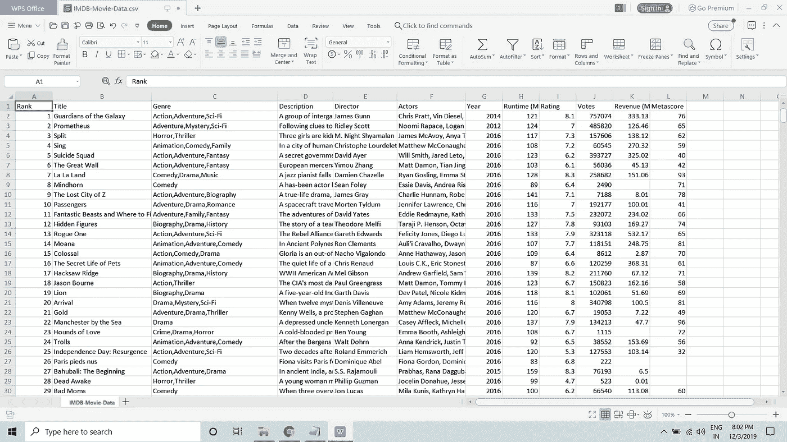

# 在 15 分钟内建立电影推荐！

> 原文：<https://medium.com/analytics-vidhya/build-movie-recommender-in-15-mins-64039dcbca40?source=collection_archive---------17----------------------->


嘿伙计们，欢迎来到博客。这个博客将帮助你在简历中添加一个很酷的项目，即使你没有 ML、python 或编程的知识。每个题目我都会先教，然后再用。我必须告诉你，即使这是一个非常普通的项目，但在你的简历中看起来真的很酷。所以让我们开始吧。

在开始制作这个项目之前，快速概述一下项目的先决条件非常有帮助。

**软件要求:-**

1.  Anaconda(巨蛇，不要与流行的 python 发行版混淆)。

是的，这就是你所需要的。

这篇博客并不包括将 GUI 添加到项目中，我会写另一篇关于它的博客。此外，它涉及非常基本的 ML 算法，因为读者是假定初学者和复杂的算法是不是真的有必要在这个项目中。

现在让我们开始讨论**什么是机器学习？**

机器学习基本上是一个研究领域，它赋予机器从一个数据中学习并将该知识应用于另一个数据的能力。它根据经验进行改进，而无需显式编程。

现在让我补充另一个多余的解释，它来自互联网，基本上没有任何理由。

“学习的过程始于观察或数据，如例子、直接经验或指导，以便在数据中寻找模式，并根据我们提供的例子在未来做出更好的决策。**主要目的是让计算机在没有人类干预或帮助的情况下自动学习**，并相应地调整动作

希望这能澄清。

我希望你已经清楚，我们将从我们的电影评级(数据)中学习，并将其应用到大量电影中，以预测用户应该观看哪些电影。

所以问题是数据在哪里？就是这里:- [数据](https://drive.google.com/file/d/1RGPh3XQ0eB0LqgA7vzsUZe_KWVvtSLz6/view?usp=sharing)

我从:-[https://datasets.imdbws.com/](https://datasets.imdbws.com/)那里偷了这个数据，这个数据真的很有用，它有 2006 年到 2016 年 IMDB 排名前 100 的电影。

文档:-[https://www.imdb.com/interfaces/](https://www.imdb.com/interfaces/)

如您所见，该数据可能如下所示



很不错吧！。有几个领域，如流派，描述，评级等。我们将使用流派，评级和 Metascore 来推荐电影，让我们看看如何。

我希望您下载了数据库，现在打开 Anaconda 并选择 Spyder 作为您的 IDE 并开始编写。

首先，我们将导入 python 库。Python 库只是一个函数和方法的集合，允许您在不编写代码的情况下执行许多操作。

```
import numpy as np
import pandas as pd 
```

numpy 将帮助我们进行阵列操作，pandas 将帮助我们添加数据库

```
dataset =pd.read_csv('IMDB-Movie-Data.csv')
```

现在从右边部分选择数据库所在的文件夹，并在 python IDE 中运行这段代码来添加数据库。

现在在写下一部分之前，让我告诉你什么是因变量和自变量

自变量是被操纵或改变以预测因变量的变量。独立变量的另一个名字是预测值。因变量是依赖于自变量的变量，其值是要预测的。

我们代码中的因变量是 genre、imdbrating 和 Metascore，独立于 be 用户评级(将在后面解释)。

因为我们不会使用数据中的所有列进行预测，所以像这样分离出所需的数据(不需要描述、参与者等):

```
impdataset=dataset.iloc[:,[1,2,6,8,10,11]]
```

这段代码将把所有行和给定列复制到变量 impdataset。

类别流派具有不能用作自变量的非数值数据集。所以，为了把它作为因变量，我们将把每一个流派作为不同的布尔变量。

```
impdataset['Action']=0
impdataset['Comedy']=0
impdataset['Sci-Fi']=0
impdataset['Adventure']=0
impdataset['Drama']=0
impdataset['Horror']=0
impdataset['Thriller']=0
impdataset['Animation']=0
impdataset['Romance']=0
impdataset['Fantasy']=0
impdataset['Family']=0
impdataset['History']=0
impdataset['Biography']=0
impdataset['Music']=0
impdataset['Mystery']=0
impdataset['Crime']=0
```

现在，为了方便起见，我们将为不同变量命名流派。

```
l='Action'
a='Comedy'
b='Sci-Fi'
c='Adventure'
d='Drama'
e='Horror'
f='Thriller'
g='Animation'
h='Romance'
i='Fantasy'
j='Family'
k='History'
m='Biography'
n='Music'
o='Mystery'
z='Crime'
```

现在，首先我们导入数组库来使用数组，我们用 float ('f ')数据类型创建数组 p，最初用 0 表示。

我们循环 1000 次，循环数表示行或电影条目，其中 p[i]对应于流派类别的数量(如“惊悚喜剧”将给出值 2)。

对于每一个条目，我们检查它是否有一个特定的流派(a，b，c，d 等对应于流派的变量)，如果有，我们增加其相应的布尔值为 1，并增加 p[i]。

我们使用了 x = imp dataset . loc[index]. genre . rfind(a，b，c，d…)，这一行不需要解释，如果没有找到，它将返回-1。

```
index=0
import array
p=array.array('f',[0])
while(index<1000):
    p.append(0)
    x=impdataset.loc[index].Genre.rfind(l)
    if(x!=-1):
        impdataset.loc[index,l]=impdataset.loc[index,l]+1
        p[index]=p[index]+1
    x=impdataset.loc[index].Genre.rfind(a)
    if(x!=-1):
        impdataset.loc[index,a]=impdataset.loc[index,a]+1   
        p[index]=p[index]+1
    x=impdataset.loc[index].Genre.rfind(b)
    if(x!=-1):
        impdataset.loc[index,b]=impdataset.loc[index,b]+1
        p[index]=p[index]+1
    x=impdataset.loc[index].Genre.rfind(c)
    if(x!=-1):
        impdataset.loc[index,c]=impdataset.loc[index,c]+1   
        p[index]=p[index]+1
    x=impdataset.loc[index].Genre.rfind(d)
    if(x!=-1):
        impdataset.loc[index,d]=impdataset.loc[index,d]+1
        p[index]=p[index]+1
    x=impdataset.loc[index].Genre.rfind(e)
    if(x!=-1):
        impdataset.loc[index,e]=impdataset.loc[index,e]+1   
        p[index]=p[index]+1
    x=impdataset.loc[index].Genre.rfind(f)
    if(x!=-1):
        impdataset.loc[index,f]=impdataset.loc[index,f]+1
        p[index]=p[index]+1
    x=impdataset.loc[index].Genre.rfind(g)
    if(x!=-1):
        impdataset.loc[index,g]=impdataset.loc[index,g]+1 
        p[index]=p[index]+1
    x=impdataset.loc[index].Genre.rfind(h)
    if(x!=-1):
        impdataset.loc[index,h]=impdataset.loc[index,h]+1
        p[index]=p[index]+1
    x=impdataset.loc[index].Genre.rfind(i)
    if(x!=-1):
        impdataset.loc[index,i]=impdataset.loc[index,i]+1  
        p[index]=p[index]+1
    x=impdataset.loc[index].Genre.rfind(j)
    if(x!=-1):
        impdataset.loc[index,j]=impdataset.loc[index,j]+1
        p[index]=p[index]+1
    x=impdataset.loc[index].Genre.rfind(k)
    if(x!=-1):
        impdataset.loc[index,k]=impdataset.loc[index,k]+1 
        p[index]=p[index]+1
    x=impdataset.loc[index].Genre.rfind(m)
    if(x!=-1):
        impdataset.loc[index,m]=impdataset.loc[index,m]+1
        p[index]=p[index]+1
    x=impdataset.loc[index].Genre.rfind(n)
    if(x!=-1):
        impdataset.loc[index,n]=impdataset.loc[index,n]+1   
        p[index]=p[index]+1
    x=impdataset.loc[index].Genre.rfind(o)
    if(x!=-1):
        impdataset.loc[index,o]=impdataset.loc[index,o]+1
        p[index]=p[index]+1
    x=impdataset.loc[index].Genre.rfind(z)
    if(x!=-1):
        impdataset.loc[index,z]=impdataset.loc[index,z]+1  
        p[index]=p[index]+1
    index=index+1
```

现在，我将制作另一个数据库，我将给出我的评级。我选了 54，80，117，36，96，249，64，99，124，13 的电影，分别给了 9，9.7，8.5，9.2，7，8，8.2，9，9.5，8 的评分。

对于每个评级，我将评级乘以流派数量，然后除以 3，得到一个平均评级。(现在让我告诉你我为什么这么做，“惊悚剧悬疑”的 p[i]=3，因此 algo 将读作 a *惊悚+b *剧情+c *悬疑(其余将变为 0)=评级，但如果只有“惊悚剧”，algo 将读作 a*惊悚+b *剧情=评级，如果只有“惊悚”存在，它将读作 a*惊悚=评级。所以为了使它平均，我用流派的数量来划分它，不要担心它是 bouncer，只是随大流，我后面也解释了)。

分配 X 作为自变量(X 将有流派)，y 作为因变量。

```
traindata=impdataset.iloc[[54,80,117,36,96,249,64,99,124,133],:]
traindata['Ratingbyme']=[9,9.7,8.5,9.2,7,8,8.2,9,9.5,8] 
for w in [54,80,117,36,96,249,64,99,124,133]:          traindata.loc[w,'Ratingbyme']=traindata.loc[w,'Ratingbyme']*p[w]/3   
X=traindata.iloc[:,6:21].values
y=traindata.iloc[:,22].values
```

现在到了最重要的部分，算法。现在，我将告诉你我们实际上在做什么。

我们将使用线性回归作为我们的算法。那么什么是线性回归。

线性回归用于寻找两组连续变量之间的关系。一个是自变量，另一个是因变量。例如，y= m*x +C，基本上它所做的是遍历 x 和 y 的所有值，并找到 m 和 C 的值，使得实际 y 和预测 y 之间的所有差异最小”

我可以花几个小时解释线性回归，但我建议你自己读一下。

这是简单的线性回归，我们将使用多元线性回归。它做同样的工作，但有多个独立变量，方程看起来像这样

Y= a*x1 + b*x2 + c*x3 ……

其中 x1、x2 是流派列的布尔值，a、b、c、d 被称为变量的权重。因此，我们将使用这些流派列值和 Y 值(评级)来训练模型，以找到流派的权重值，然后我们使用 Y= a*x1 + b*x2 + c*x3 ……来预测所有数据的 Y。

我希望你清楚这一点。现在最好的事情是，我们不必自己写代码，而是有人为我们写的，我们只需传递 X 和 y 来训练数据。

```
from sklearn.linear_model import LinearRegression 
regressor=LinearRegression()
regressor.fit(X,y)
```

此代码导入线性回归并为我们实现，regressor.fit(X，y)训练数据。

```
 impdataset['ratingbyme']=regressor.predict(impdataset.iloc[:,6:21])
traindata['ratingbyme1']=regressor.predict(X)
```

现在 regressor.predict 预测所有数据集的等级。我们制作第二个变量 ratingbyme1 来比较我们的评级和模型刚刚给出的值。这叫做测试。

宾果现在我们到了最后一部分，现在我要做的是所谓的职业玩家的举动，假设一部电影有惊悚悬疑类别，我们的算法发现惊悚的权重为 2.5，悬疑为 3.5，所以评级加起来为 6，但如果一部电影有惊悚悬疑剧，评级将达到 2.5+ 3.5 + 2(戏剧)，= 8，更多的类型给出更多的评级，这很不公平，所以我们做的是按类型评级，而不是只评级，现在两部电影都将有 6/2*3 = 9 和 8/3*3

看看下面的代码，直到第 6 行，我希望它能让你清楚，现在我们有了按流派给出的评级，实际 imdb 评级和 Metascore。因此，我们设计了一个公式，将给出最终评级为 imdbrating*(最终评级*20 + Metascore)(此公式使得 genre-rating(满分为 100)的权重是 Metascore 的两倍)，您所要做的就是运行代码，并在变量部分中，根据此评级对数据进行排序。你会有你推荐的电影。

```
index=0
while(index<1000):
    f=float(impdataset.loc[index,'ratingbyme'])
    if(p[index]!=0):
      f=f/float(p[index])
    impdataset.loc[index,'ratingbyme']=f*3
    int metascore=impdataset.loc[index,'Metascore']
    float sc=((20*impdataset.loc[index,'Rating'])+metascore)
        impdataset.loc[index,'finalscore']=impdataset.loc[index,'ratingbyme']*sc
    index=index+1
```

答对了，你成功了，不一定是项目，但至少是博客。我希望你喜欢它，并请评论你的评论和疑问。我会写一篇博客，把这个项目转变成一个网站，在此之前，请欣赏并阅读我的另一个博客——[博客](/@pranjalshivalol/how-i-got-internship-at-goldman-sachs-463138b8719a)。和平。

```
import numpy as np
import pandas as pddataset =pd.read_csv('IMDB-Movie-Data.csv')
impdataset=dataset.iloc[:,[1,2,6,8,10,11]]
impdataset['Action']=0
impdataset['Comedy']=0
impdataset['Sci-Fi']=0
impdataset['Adventure']=0
impdataset['Drama']=0
impdataset['Horror']=0
impdataset['Thriller']=0
impdataset['Animation']=0
impdataset['Romance']=0
impdataset['Fantasy']=0
impdataset['Family']=0
impdataset['History']=0
impdataset['Biography']=0
impdataset['Music']=0
impdataset['Mystery']=0
impdataset['Crime']=0
l='Action'
a='Comedy'
b='Sci-Fi'
c='Adventure'
d='Drama'
e='Horror'
f='Thriller'
g='Animation'
h='Romance'
i='Fantasy'
j='Family'
k='History'
m='Biography'
n='Music'
o='Mystery'
z='Crime'
index=0
import array
p=array.array('f',[0])
while(index<1000):
    p.append(0)
    x=impdataset.loc[index].Genre.rfind(l)
    if(x!=-1):
        impdataset.loc[index,l]=impdataset.loc[index,l]+1
        p[index]=p[index]+1
    x=impdataset.loc[index].Genre.rfind(a)
    if(x!=-1):
        impdataset.loc[index,a]=impdataset.loc[index,a]+1   
        p[index]=p[index]+1
    x=impdataset.loc[index].Genre.rfind(b)
    if(x!=-1):
        impdataset.loc[index,b]=impdataset.loc[index,b]+1
        p[index]=p[index]+1
    x=impdataset.loc[index].Genre.rfind(c)
    if(x!=-1):
        impdataset.loc[index,c]=impdataset.loc[index,c]+1   
        p[index]=p[index]+1
    x=impdataset.loc[index].Genre.rfind(d)
    if(x!=-1):
        impdataset.loc[index,d]=impdataset.loc[index,d]+1
        p[index]=p[index]+1
    x=impdataset.loc[index].Genre.rfind(e)
    if(x!=-1):
        impdataset.loc[index,e]=impdataset.loc[index,e]+1   
        p[index]=p[index]+1
    x=impdataset.loc[index].Genre.rfind(f)
    if(x!=-1):
        impdataset.loc[index,f]=impdataset.loc[index,f]+1
        p[index]=p[index]+1
    x=impdataset.loc[index].Genre.rfind(g)
    if(x!=-1):
        impdataset.loc[index,g]=impdataset.loc[index,g]+1 
        p[index]=p[index]+1
    x=impdataset.loc[index].Genre.rfind(h)
    if(x!=-1):
        impdataset.loc[index,h]=impdataset.loc[index,h]+1
        p[index]=p[index]+1
    x=impdataset.loc[index].Genre.rfind(i)
    if(x!=-1):
        impdataset.loc[index,i]=impdataset.loc[index,i]+1  
        p[index]=p[index]+1
    x=impdataset.loc[index].Genre.rfind(j)
    if(x!=-1):
        impdataset.loc[index,j]=impdataset.loc[index,j]+1
        p[index]=p[index]+1
    x=impdataset.loc[index].Genre.rfind(k)
    if(x!=-1):
        impdataset.loc[index,k]=impdataset.loc[index,k]+1 
        p[index]=p[index]+1
    x=impdataset.loc[index].Genre.rfind(m)
    if(x!=-1):
        impdataset.loc[index,m]=impdataset.loc[index,m]+1
        p[index]=p[index]+1
    x=impdataset.loc[index].Genre.rfind(n)
    if(x!=-1):
        impdataset.loc[index,n]=impdataset.loc[index,n]+1   
        p[index]=p[index]+1
    x=impdataset.loc[index].Genre.rfind(o)
    if(x!=-1):
        impdataset.loc[index,o]=impdataset.loc[index,o]+1
        p[index]=p[index]+1
    x=impdataset.loc[index].Genre.rfind(z)
    if(x!=-1):
        impdataset.loc[index,z]=impdataset.loc[index,z]+1  
        p[index]=p[index]+1
    index=index+1
traindata=impdataset.iloc[[54,80,117,36,96,249,64,99,124,133],:]
traindata['Ratingbyme']=[9,9.7,8.5,9.2,7,8,8.2,9,9.5,8] 
for w in [54,80,117,36,96,249,64,99,124,133]:
  traindata.loc[w,'Ratingbyme']=traindata.loc[w,'Ratingbyme']*p[w]/3   
X=traindata.iloc[:,6:21].values
y=traindata.iloc[:,22].values

from sklearn.linear_model import LinearRegression 
regressor=LinearRegression()
regressor.fit(X,y)

impdataset['ratingbyme']=regressor.predict(impdataset.iloc[:,6:21])
traindata['ratingbyme1']=regressor.predict(X)
index=0
while(index<1000):
    f=float(impdataset.loc[index,'ratingbyme'])
    if(p[index]!=0):
      f=f/float(p[index])   
    impdataset.loc[index,'ratingbyme']=f*3
    int metascore=impdataset.loc[index,'Metascore']
    float sc=((20*impdataset.loc[index,'Rating'])+metascore)
    impdataset.loc[index,'finalscore']=impdataset.loc[index,'ratingbyme']*sc
    index=index+1
```