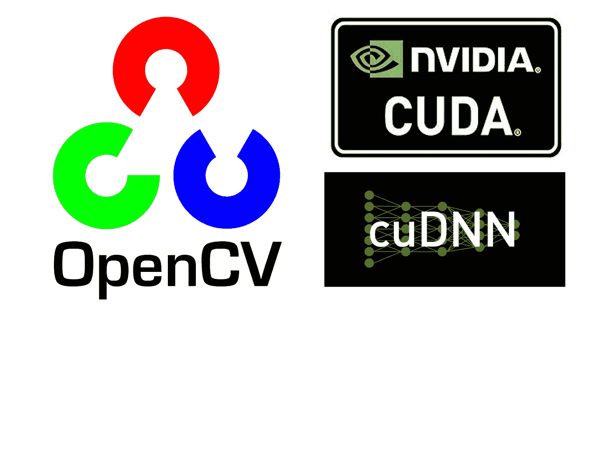
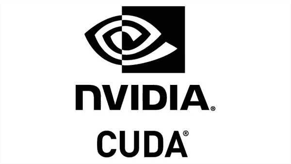
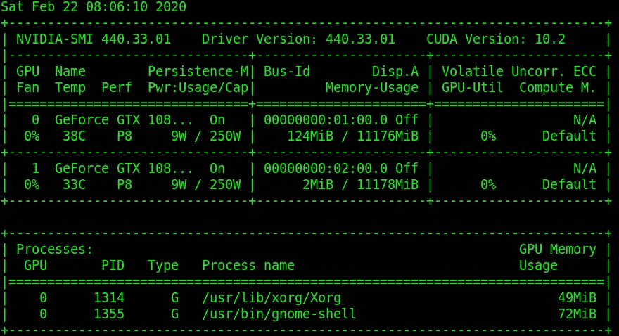

# 在 Ubuntu 18.04 上使用 Nvidia GPU 支持构建 OpenCV DNN 模块

> 原文：<https://medium.com/analytics-vidhya/build-opencv-dnn-module-with-nvidia-gpu-support-on-ubuntu-18-04-e7dec52521b4?source=collection_archive---------13----------------------->

## 一个完整的指南，用示例代码教你构建 OpenCV CUDA 支持的 DNN 模块。



我们终于得到了等待多年的 OpenCV DNN 模块与 Nvidia GPU 的合作。

> *使用* [*这个朋友链接*](/analytics-vidhya/build-opencv-dnn-module-with-nvidia-gpu-support-on-ubuntu-18-04-e7dec52521b4?source=friends_link&sk=4c34e8743d5300d548ede9626b543e72) *如果你被挡在付费墙后面，就可以阅读故事的其余部分。*

2017 年，OpenCV 3.3 带来了革命性的 DNN 模块。久而久之，目前支持大量深度学习框架，如 TensorFlow、Caffe、Darknet 等。在该模块的帮助下，我们可以使用 OpenCV 来:

1.  从磁盘加载预训练模型。
2.  对输入图像进行预处理。
3.  通过网络传递图像并获得输出结果。
4.  最少依赖(只有 OpenCV！).

虽然我们*不能*用 OpenCV 训练一个深度学习模型(虽然这没有意义)，但是我们可以用其他深度学习框架训练的模型，在 CPU 上用 OpenCV 以不可思议的速度进行推理。

然而，DNN 模块直到现在还不支持 Nvidia GPU。在 Google Summer of Code (GSoC) 2019 中，OpenCV DNN 模块终于[用](https://summerofcode.withgoogle.com/archive/2019/projects/6169918255398912/)[Davis King](https://github.com/davisking)—[dlib](https://github.com/davisking/dlib)的创造者 [Yashas Samaga](https://github.com/YashasSamaga) 的作品支持 Nvidia GPU 进行推理，而这个作品在[版本 4.2.0](https://github.com/opencv/opencv/wiki/ChangeLog#version420) 中公开。作为一个精通 OpenCV 的程序员，我想我应该在第一时间分享这个令人兴奋的消息。此外，我将教您如何使用 Nvidia GPU 的工具编译和安装 OpenCV，以进行深度神经网络推理，并且我将提供 C++和 Python 的最小可行示例代码。

# 菜单，使用 CUDA 和支持 cuDNN 的 DNN 模块编译 OpenCV

# 假设

我假设您正在使用以下设置:

1.  一个 Nvidia GPU(当然！).
2.  Ubuntu 18.04(或其他等效的基于 Debian 的发行版)。
3.  CUDA 10.0 和 cuDNN 的对应版本(这里我用的是 v7.6.5)。
4.  您的系统帐户拥有`sudo`权限。
5.  OpenCV 版本 4.2.0。

# 步骤 1:安装 Nvidia CUDA 驱动程序、CUDA 工具包和 cuDNN



1.  ***备份你的系统，句号。*** 根据我的经验，你在安装任何一种驱动的时候都有可能不小心弄坏系统。虽然您可以恢复反向安装的系统，但有时您无法成功恢复，因为您忘记了步骤，甚至驱动程序做了一些更改，而您根本没有注意到。作为一个两次破坏系统的人(都是用安装 CUDA 驱动)，我 ***强烈建议*** 你在任何情况下都要备份你的系统。
2.  安装前的行动我在这里做一些概述。有关详细信息，您可以访问此处的。

*   `lspci | grep -i nvidia`:确认你有一个支持 CUDA 的 GPU。
*   `uname -m && cat /etc/*release`:验证您是否拥有受支持的 Linux 版本。
*   `gcc --version`:验证系统是否安装了 GCC。
*   `uname -r`:检查系统是否安装了正确的内核头文件和开发包。
*   `sudo apt-get install linux-headers-$(uname -r)`:安装当前运行内核的内核头文件和开发包。

3.安装 CUDA 驱动程序通过键入以下命令安装 CUDA 驱动程序:

```
$ sudo add-apt-repository ppa:graphics-drivers/ppa
$ sudo apt-get update
$ sudo apt-get install nvidia-driver-418
```

4.安装后，重新启动系统:

一旦您的系统启动，输入`nvidia-smi`，它应该会给出类似的输出:



nvidia-smi 的示例输出。

5.安装 CUDA toolkit 我会选择 runfile 包来安装 CUDA 驱动程序，因为如果你用特定于发行版的包方法安装，你可能会升级这些包，这将在以后引起巨大的问题。

首先，从[这里](https://developer.nvidia.com/cuda-downloads)下载适合您系统的运行文件。

然后键入以下命令来运行运行文件:`sudo sh cuda_<version>_linux.run --override`

完成安装后，通过在概要文件的底部插入下面几行来更新 bash 概要文件(`~/.bashrc`):

```
# NVIDIA CUDA Toolkit
export PATH=/usr/local/cuda-10.0/bin:$PATH
export LD_LIBRARY_PATH=/usr/local/cuda-10.0/lib64:$LD_LIBRARY_PATH
```

然后获取配置文件:

```
$ source ~/.bashrc
```

类型`nvcc -V`。如果您得到类似的输出，您就完成了！

```
$ nvcc -V
nvcc: NVIDIA (R) Cuda compiler driver
Copyright (c) 2005-2018 NVIDIA Corporation
Built on Sat_Aug_25_21:08:01_CDT_2018
Cuda compilation tools, release 10.0, V10.0.130
```

6.安装 cuDNN 安装 cuDNN 比安装 CUDA 驱动和 CUDA 工具包要乏味得多。

一开始，从[这里](https://developer.nvidia.com/rdp/cudnn-archive)下载 cuDNN v7.6.5 for CUDA 10.0(可能需要登录或注册才能下载 cuDNN)。

接下来，提取 zip 文件，并将头文件和共享库:

```
$ tar -zvf cudnn-10.0-linux-x64-v7.6.5.32.tgz
$ cd cuda
$ sudo cp -P lib64/* /usr/local/cuda/lib64/
$ sudo cp -P include/* /usr/local/cuda/include/
$ cd ~
```

如果你在这里没有遇到任何问题，恭喜你！你已经完成了最难的部分！

# 步骤 2 安装 OpenCV 依赖项

OpenCV 有大量的依赖项，我写在这里，所以你只需复制和粘贴以下命令:

```
$ sudo apt-get update
$ sudo apt-get upgrade
$ sudo apt-get install build-essential cmake unzip pkg-config git \
libjpeg-dev libpng-dev libtiff-dev \
libavcodec-dev libavformat-dev libswscale-dev \
libv4l-dev libxvidcore-dev libx264-dev \
libgtk-3-dev \
libatlas-base-dev gfortran \
python3-dev
```

# 步骤 3 下载 OpenCV 源代码

目前没有 python wheels 或 dpkg 包是在 Nvidia GPU 支持下构建的。所以我们必须从源代码编译 OpenCV。

在本教程中，我将`opencv`和`opencv_contrib`存储库都放在`~/opencv`目录中。我会用`git`下载源代码，这样我就可以换我喜欢的版本了:

```
$ cd ~
$ mkdir opencv
$ cd opencv
$ git clone https://github.com/opencv/opencv.git
$ git clone https://github.com/opencv/opencv_contrib.git
$ cd opencv
$ git checkout 4.2.0
$ cd ..
$ cd opencv_contrib
$ git checkout 4.2.0
$ cd ../opencv
```

# 步骤 4 配置 Python 虚拟环境

对于使用 Python 进行开发，使用虚拟环境是一个很好的实践，因为可以隔离使用不同版本的 Python 库，并且在生产环境中产生的问题较少。

在这一部分，我将使用`virtualenv`和`virtualenvwrapper`作为虚拟环境。

1.  使用`pip`安装`virtualenv`和`virtualenvwrapper`。

```
$ sudo pip install virtualenv virtualenvwrapper
```

安装完这两个包后，您需要在`~/.bashrc`中添加以下代码行，以便让 bash 在每次终端启动时加载 virtualenv 和 virtualenvwrapper:

```
# virtualenv and virtualenvwrapper
export WORKON_HOME=$HOME/.virtualenvs
export VIRTUALENVWRAPPER_PYTHON=/usr/bin/python3
source /usr/local/bin/virtualenvwrapper.sh
```

然后重新加载您的`~/.bashrc`，让设置立即激活:

```
source ~/.bashrc
```

2.创建一个虚拟环境。第一步是创建虚拟环境:

```
$ mkvirtualenv opencv_cuda -p python3
```

这个命令将使用 Python 3 创建一个名为`opencv_cuda`的虚拟环境。创建完成后，您当前工作的虚拟环境应该是`opencv_cuda`。

**注意**:如果您曾经关闭您的终端或停用虚拟环境，您可以通过键入以下命令来重新激活它:

```
$ workon opencv_cuda
```

因为 OpenCV Python 将使用`numpy`，所以我们接着安装`numpy`:

```
$ pip install numpy
```

# 第 5 步确定你的 CUDA 架构版本

作为一名经验丰富的 CUDA 程序员，确定 CUDA 架构版本是一项必需的实践，因为它让编译器在您的 GPU 上生成更高效的代码。此外，设置不包括 Nvidia GPU 架构的架构参数会让您的程序在执行时无法工作。

我们可以用`nvidia-smi`算出你的 Nvidia GPU 是什么型号:


你可以看到我用的是名字部分写的**Nvidia Geforce GTX 1080 GPU**。请确保您已经通过运行`nvidia-smi`让*验证了您的 GPU 型号*，然后再继续下一部分。

获得 Nvidia GPU 模型后，您可以使用此页面找到您的 CUDA 架构:

> [*https://developer.nvidia.com/cuda-gpus*](https://developer.nvidia.com/cuda-gpus)

向下滚动到“您的 GPU 计算能力”段落。由于我使用的是 GTX 1080，我将点击“支持 CUDA 的 GeForce 和 TITAN 产品”部分。

检查后，我意识到我的 Nvidia GPU 架构版本是`6.1`。提醒一下，您的 GPU 架构版本可能会有所不同。

一旦你拿到了 GPU 架构版本，*请记下它*，因为我们将在下一步使用它。

# 第 6 步:用 Nvidia GPU 支持配置 OpenCV

OpenCV 使用 CMake 来配置和生成构建。首先激活`opencv_cuda`虚拟环境:

```
$ workon opencv_cuda
```

然后，将目录更改到您克隆 OpenCV 源代码的位置(例如`~/opencv`，然后创建一个构建目录(我们使用的是 out-of-source build):

```
$ cd ~/opencv
$ cd opencv
$ mkdir build && cd build
```

接下来，运行下面的`cmake`命令，**更改您在步骤#5** 中写下的 `**CUDA_ARCH_BIN**` **变量:**

```
$ cmake -D CMAKE_BUILD_TYPE=RELEASE \
-D CMAKE_INSTALL_PREFIX=/usr/local \
-D INSTALL_PYTHON_EXAMPLES=ON \
-D INSTALL_C_EXAMPLES=OFF \
-D OPENCV_ENABLE_NONFREE=ON \
-D WITH_CUDA=ON \
-D WITH_CUDNN=ON \
-D OPENCV_DNN_CUDA=ON \
-D ENABLE_FAST_MATH=1 \
-D CUDA_FAST_MATH=1 \
-D CUDA_ARCH_BIN=6.1 \
-D WITH_CUBLAS=1 \
-D OPENCV_EXTRA_MODULES_PATH=~/opencv/opencv_contrib-4.2.0/modules/ \
-D HAVE_opencv_python3=ON \
-D PYTHON_EXECUTABLE=~/.virtualenvs/opencv_cuda/bin/python \
-D BUILD_EXAMPLES=ON
```

还有一点，检查 CMake 输出的`Python 3`部分的`install path`。我们将在第 8 步中使用`install path`。**所以请留下**的备注。

```
--   Python 3:
--     Interpreter:                 /home/cudachen/.virtualenvs/opencv_cuda/bin/python3 (ver 3.6.9)
--     Libraries:                   /usr/lib/x86_64-linux-gnu/libpython3.6m.so (ver 3.6.9)
--     numpy:                       /home/cudachen/.virtualenvs/opencv_cuda/lib/python3.6/site-packages/numpy/core/include (ver 1.18.1)
--     install path:                lib/python3.6/site-packages/cv2/python-3.6
```

# 步骤 7 编译 OpenCV

如果`cmake`没有错误地退出，那么用下面的命令编译 OpenCV:

```
$ make -j$(nproc)
```

# 步骤 8:安装 OpenCV 和 CUDA DNN 模块

如果`make`成功完成，您键入以下命令来安装 OpenCV:

```
$ sudo make install
$ sudo ldconfig
```

然后，我们将创建一个符号链接，将 OpenCV Python 绑定到您的 Python 虚拟环境中。在步骤#6 中提到，我们知道`install path`就是`/usr/local/lib/python3.6/site-packages/cv2/python-3.6`。

要确认，您可以使用`ls`命令:

```
$ ls -l /usr/local/lib/python3.6/site-packages/cv2/python-3.6
...
```

您可以看到我的 OpenCV Python 绑定的名称是`cv2.cpython-36m-x86_64-linux-gnu.so`(您可能有自己构建的绑定的类似名称)。

接下来，创建一个指向虚拟环境的符号链接:

```
$ ln -s /usr/local/lib/python3.6/site-packages/cv2/python-3.6 ~/.virtualenvs/opencv_cuda/lib/python3.6/site-packages/cv2.so
```

记得花点时间检查你的文件路径，因为如果 OpenCV 绑定的路径不正确的话`ln`将 *slient 失败*。

# 验证安装

# C++

我们可以通过两种方式验证安装是否成功:

1.  程序用 OpenCV 编译没问题。
2.  程序执行时没有错误。

## 验证步骤，C++部分

1.  下载自述文件中提到的 [repo](https://github.com/Cuda-Chen/opencv-dnn-cuda-test) 和权重。
2.  转到`cpp_code`目录并键入以下命令:`g++ -o opencv_dnn_cuda_test_cpp main.cpp -I/usr/local/include/opencv4 -lopencv_core -lopencv_dnn -lopencv_highgui -lopencv_imgcodecs`
3.  使用以下命令运行可执行文件:`opencv_dnn_cuda_test_cpp`
4.  如果终端输出类似的信息，你就完了！

```
$ ./opencv_dnn_cuda_test_cpp 
Time per inference: 14 ms
FPS: 71.4286
```

# 计算机编程语言

我们可以通过两种方式验证安装是否成功:

1.  我们可以用 Python 脚本导入 OpenCV。
2.  我们能够通过 DNN 模块使用 Nvidia GPU。

## 验证步骤，Python 部分

1.  下载自述文件中提到的 [repo](https://github.com/Cuda-Chen/opencv-dnn-cuda-test) 和砝码。
2.  激活虚拟环境(即`opencv_cuda`)。
3.  转到`python_code`目录，键入命令:`python main.py`
4.  如果终端输出类似的信息，你就完了！

```
$ python main.py 
Time per inference: 14.480803 ms
FPS:  69.05694381124881
```

# 概述

在这篇文章中，我将教你如何在 Ubuntu 18.04 上从头开始安装 OpenCV 和支持 CUDA 的 DNN 模块。此外，我还提供了一个 C++和 Python 的最小样本代码，以便您可以在以后的项目中方便地使用它们。

要使用 CUDA 作为 OpenCV DNN 模块的后端，您只需在加载预训练模型后添加这两行代码:

```
// C++
net.setPreferableBackend(cv::dnn::DNN_BACKEND_CUDA);
net.setPreferableTarget(cv::dnn::DNN_TARGET_CUDA);

...

# Python
net.setPreferableBackend(cv.dnn.DNN_BACKEND_CUDA)
net.setPreferableTarget(cv.dnn.DNN_TARGET_CUDA)
```

# 特别感谢

我非常感谢[在 pyimagesearch.com 的这篇文章](https://www.pyimagesearch.com/2020/02/03/how-to-use-opencvs-dnn-module-with-nvidia-gpus-cuda-and-cudnn/)。如果没有这篇文章，我不会简单地完成这篇文章。

我还要特别感谢 [YashasSamaga](https://github.com/YashasSamaga) ，他是 OpenCV DNN 模块和 CUDA 的主要贡献者。他还讲授了很多关于 OpenCV GitHub repo 的问题，这帮助很多人解决了使用 OpenCV CUDA 支持的 DNN 模块进行编译的问题。

*原载于 2020 年 2 月 22 日*[*https://cuda-Chen . github . io*](https://cuda-chen.github.io/image%20processing/programming/2020/02/22/build-opencv-dnn-module-with-nvidia-gpu-support-on-ubuntu-1804.html)*。*

> *如果你有什么想法和问题要分享，请联系我*[***clh 960524【at】Gmail . com***](http://clh960524@gmail.com/)*。还有，其他作品可以查看我的* [*GitHub 库*](https://github.com/Cuda-Chen) *。如果你和我一样热衷于机器学习、图像处理和并行计算，欢迎在 LinkedIn 上* [*加我*](https://www.linkedin.com/in/lu-hsuan-chen-78071b171/) *。*