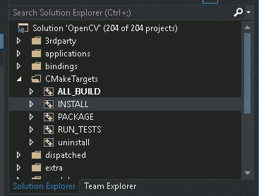

# 使用 CUDA 从源代码构建 OpenCV，以便在 Windows 上访问 GPU

> 原文：<https://medium.com/analytics-vidhya/build-opencv-from-source-with-cuda-for-gpu-access-on-windows-5cd0ce2b9b37?source=collection_archive---------0----------------------->


# 介绍

Opencv 是计算机视觉中非常有用的库。python 程序员面对 Opencv 模块的一个常见问题是，如果我们用“ **pip** ”或“ **conda** ”直接安装它，它会使用 CPU 进行推理。Opencv 有深度学习模块“ **DNN** ”，默认使用 CPU 进行计算。
具有 GPU 访问功能的 Opencv 将根据 GPU 的能力将性能提高数倍。为了实现这一点，我们必须使用 Nvidia **GPU** 、 **CUDA** 和 **cuDNN** 编译 Opencv 的源代码，使用的工具包括 **CMake** 和 **Visual Studio** ，后者使用 c++的 GCC 编译器。
我写这篇博客的主要原因是它耗费了大量的时间来搜索安装，而且我发现没有适合我的文档。在 Linux 机器上安装 Opencv 很容易，但在 Windows 上很难。
用于在 Linux 机器上安装 Opencv:
[https://www . pyimagesearch . com/2016/07/11/compilating-Opencv-with-cuda-support/](https://www.pyimagesearch.com/2016/07/11/compiling-opencv-with-cuda-support/)
本博客用于在 Windows 机器上从源代码构建 Opencv

## 我们实例的规格

仅供参考，我正在用一个 Windows AMI 实例在一个<aws-ec2-g4.xlarge>中构建 OpenCV，该实例带有一个容量为 16gb 的特斯拉 T4 GPU 和 4 核 CPU。我从本地 Linux 机器通过 RDP(远程桌面协议)连接访问这个实例。
反正这个博客就是关心一个有好 GPU 的 Windows 机器</aws-ec2-g4.xlarge>

# 抽象层次的步骤(仅供参考)

**您可以点击这些子链接直接跳转到该步骤**

> 1.[下载并安装 Visual Studio 19](#8a14)
> 2。[下载安装 CMake](#604a)3。[根据你的 GPU](#8061)
> 4 安装 CUDA 和 cuDNN。[卸载 anaconda，为所有用户安装 python](#3860)
> 5。[从 Github](#ba8b)
> 6 下载并解压 Opencv-4.4。[从 Github](#0c44)
> 7 下载并解压 Opencv-contrib-4.4。[安装“numpy”，卸载“opencv-python”，“opencv-contrib-python”](#d463)
> 8。[制作一个【构建】文件夹](#fa5d)9
> 。[对 opencv 的 CMake 文件“opencvdetectpython . CMake”](#30e9)
> 进行修改 10。[使用 Cmake](#7d83)11 配置 Opencv 和 Opencv-contrib。[用 Visual Studio](#e123)
> 12 构建 Cmake 创建的项目。[确认安装是否正确](#8b43)

# 步伐

这里的主要思想是从源代码下载 opencv 和 opencv-contrib 包。然后通过 CMake 和 visual studio 在一个名为“build”的文件夹中配置和编译(构建)包。

## 1.下载并安装 Visual Studio 19

> **1.1*。*** *下载 Visual Studio 最新社区版，我的情况是 VS19:*[【https://visualstudio.microsoft.com/downloads/】](https://visualstudio.microsoft.com/downloads/)***1.2。*** *用 C++点击桌面开发，继续默认安装*


## 2.下载并安装 CMake(我的版本 3.18.3)

> *2.1 点击此链接:*[*https://cmake.org/download/*](https://cmake.org/download/)


## 3.根据你的 GPU 安装 CUDA 和 cuDNN

> ***3.1。*** *点击我的另一个链接:-*[https://medium . com/@ ankitkumar 60323/installing-cuda-and-cud nn-on-windows-d 44 b 8 e 9876 b5](/@ankitkumar60323/installing-cuda-and-cudnn-on-windows-d44b8e9876b5)***3.2 .*** *按照这个维基百科页面获取你的 gpu 的架构二进制* [*https://en.wikipedia.org/wiki/CUDA*](https://en.wikipedia.org/wiki/CUDA) *在我的例子中架构二进制是 7.5。CUDA 版本为 10.1，cuDNN 版本为 7.6.5。*

## 4.卸载 Anaconda 并为所有用户安装 python

> 如果我们不遵循本部分
> ***4.1，将会出现路径问题。****Goto****安装程序*** *并卸载 anaconda 和 python* ***4.2。*** *检查* ***系统环境变量*** *并移除蟒蛇和蟒蛇形成的路径*


> **4.3*。*** *现在安装 python 并使用所有用户权限继续“自定义安装”*


> **4.4*。*** *在命令提示符下检查是否检测到“python ”,如果没有，则在“系统环境变量”中给出 python 可执行文件的路径*


## 5.从 Github 下载并解压 Opencv-4.4

> 这是 opencv 代码所在的源代码
> ***5.1。*** *跟着这个链接:-*[*https://opencv.org/releases/*](https://opencv.org/releases/)


> **5.2*。*** *点击来源* ***5.3。*** *解压下载的文件夹*

## 6.从 github 下载并解压 Opencv-contrib-4.4

> *这是与 opencv* ***6.1 一起使用的额外模块包。*** *Goto 链接*[*https://github.com/opencv/opencv_contrib/tree/4.4.0*](https://github.com/opencv/opencv_contrib/tree/4.4.0)*并下载 zip* ***6.2。*** *提取下载的文件夹*

## 7.安装 numpy，卸载 opencv-python，opencv-contrib-python

> 在编译之前，确保安装了“numpy”。确保“opencv-python”和“opencv-contrib-python”被卸载，并且 ***将永远不会在此环境中使用“pip”再次安装*** ****7.1。*** *pip 安装编号* ***7.2。*** *pip 卸载 opencv-python opencv-contrib-python* ***7.3。*** *在我的例子中，cmake 需要这些 python 路径:**

```
*PYTHON3_EXECUTABLE= C:/program files/python38/python.exe
PYTHON3_INCLUDE_DIR= C:/program files/python38/include
PYTHON3_LIBRARY= C:/program files/python38/libs/python38.lib
PYTHON3_NUMPY_INCLUDE_DIRS= C:/program files/python38/Lib/site-packages/numpy/core/include
PYTHON3_PACKAGES_PATH= C:/program files/python38/Lib/site-packages*
```

## *8.创建一个“构建”文件夹*

> **这是我们将编译并保存目标代码* ***8.1 的文件夹。我们需要创建编译 Opencv 的文件夹****

**

## *9.在 opencv 的 cmake 文件“OpenCVDetectPython.cmake”中进行更改*

> *当我们用 cmake 构建时，默认情况下它会搜索 python2。我们需要更改代码，使其在默认情况下检测 python3，并在名为“opencv-4 . 4 . 0”
> ***9.1 的解压缩文件夹中使用 python2 作为后备
> 。*** *打开文件【opencv-4 . 4 . 0 \ opencv-4 . 4 . 0 \ cmake \ opencvdetectpython . cmake】* ***9.2。*** *编辑文件的最后一段代码，将代码替换为以下代码:
> 替换此部分:-**

```
*if(PYTHON_DEFAULT_EXECUTABLE)
 set(PYTHON_DEFAULT_AVAILABLE “TRUE”)
 elseif(PYTHON2INTERP_FOUND) 
 # Use Python 2 as default Python interpreter
 set(PYTHON_DEFAULT_AVAILABLE “TRUE”)
 set(PYTHON_DEFAULT_EXECUTABLE “${PYTHON2_EXECUTABLE}”)
 elseif(PYTHON3INTERP_FOUND) 
 # Use Python 3 as fallback Python interpreter (if there is no Python 2)
 set(PYTHON_DEFAULT_AVAILABLE “TRUE”)
 set(PYTHON_DEFAULT_EXECUTABLE “${PYTHON3_EXECUTABLE}”)
 endif()*
```

> **用这个代码:-**

```
*if(PYTHON_DEFAULT_EXECUTABLE)
    set(PYTHON_DEFAULT_AVAILABLE "TRUE")
elseif(PYTHON3INTERP_FOUND) 
 # Use Python 3 as default Python interpreter
    set(PYTHON_DEFAULT_AVAILABLE "TRUE")
    set(PYTHON_DEFAULT_EXECUTABLE "${PYTHON3_EXECUTABLE}")
elseif(PYTHON2INTERP_FOUND) 
    # Use Python 2 as fallback Python interpreter (if there is no Python 3)
    set(PYTHON_DEFAULT_AVAILABLE "TRUE")
    set(PYTHON_DEFAULT_EXECUTABLE "${PYTHON2_EXECUTABLE}")
endif()*
```

## *10.使用 Cmake 配置 Opencv 和 Opencv-contrib*

> **现在我们将根据我们的机器配置来配置 Opencv，如 CUDA、cuDNN、GPU 架构等* ***10.1 的路径。*** *打开我们之前安装的 cmake-gui app(步骤 2)* ***10.2。*** *在我的例子中，给出源代码的路径和二进制文件的“build”文件夹的路径:-
> C:/Users/Administrator/Downloads/opencv-4 . 4 . 0/opencv-4 . 4 . 0
> C:/Users/Administrator/Downloads/build**

**

> ***10.3*。*** *点击配置* ***10.4。*** *选择可选平台 x64，点击完成**

**

> ***10.5*。*** *在输出部分下面配置按钮 goto 部分命名为“* ***OpenCV 模块*** *”。在那段看值的* ***要建*** *，那里的* ***应该是 python3 某处的*** *。确保(第 7.3 节)中描述的路径得到良好检查**

**

> ****10.6。*** *如果对 10.5 不满意，则存在路径问题，您需要首先解决它**

**

> ****10.7。*** *现在，如果上述部分没有问题，那么通过在搜索选项卡中搜索 cmake 中的变量来配置该变量:**

```
*WITH_CUDA — Checked
OPENCV_DNN_CUDA — Checked
ENABLE_FAST_MATH — Checked
OPENCV_EXTRA_MODULES_PATH — “Give path to “opencv-contrib-4.4.0” directory(see section 6) by pointng at “modules” directory(in my case: C:\Users\Administrator\Downloads\opncv-contrib-4.4.0\opencv-contrib-4.4.0\modules) “*
```

********

> ****10.8。*** *再次点击配置按钮，等待“配置完成”输出* ***10.9。*** *现在我们再将***多配置一些变量，我们可以说第二轮配置***

```
**CUDA_FAST_MATH — Checked
CUDA_ARCH_BIN — 7.5 (This is strictly for my case)**
```

> ***如果你想知道你的 GPU 的 arch_bin 跟随* ***维基*** *链接:*[*https://en.wikipedia.org/wiki/CUDA*](https://en.wikipedia.org/wiki/CUDA)*并查找* ***表*** *并根据你的 GPU 型号名称选择二进制***

********

> ****10.10*。*** *再次点击配置，等待“配置完成”输出* ***10.11。*** *点击生成按钮，等待“生成完成”输出***

****

> ****10.12*。*** *你的配置和代码的生成都完成了。现在您可以关闭 cmake-gui 应用程序***

## **11.用 Visual Studio 编译 Cmake 创建的项目**

> ***现在我们将编译和构建由 cmake 编写和配置的代码，放在名为“build”* ***11.1 的文件夹中。*** *使用命令提示符* ***转到“构建”文件夹 11.2。*** *键入 OpenCV.sln 并按回车键。之后，它会为我们打开 Visual Studio***

****

> ****11.3*。*** *如果 Visual Studio 打开时带有错误标签，那么只需执行以下操作:-***

****

> ****11 . 3 . 1*。*** *在 VS goto* ***工具>选项******11 . 3 . 2。*** *在选项面板中导航到* ***【项目和解决方案】> Web 项目******11 . 3 . 3。*** *取消选中该选项卡的最后一个选项***

****

**11.3.3**

> ****11 . 3 . 4。** *点击 ok，按步骤 11.1 和 11.2 重新启动 Visual Studio***
> 
> *****11.4。*** *在 VS 时* ***调试*** *“模式到”* ***释放*** *“模式到”***

****

> *****11.5。*** *在 VS 右侧展开【cmake targets】* ***11.6。*** *右键点击“ALL_BUILD”，点击 BUILD。这大约需要 30 分钟。* ***11.7。****11.6 之后，右键“安装”，打 build。这将很快完成。***

********

**步骤 11.6**

****

**所有生成的输出**

****

**安装输出**

> ****11.8*。*** *确保 11.6 和 11.7 中没有错误。如果是这样，确保你点击了释放模式(第 11.4 节)* ***11.9。*** *最后你用 CUDA、cuDNN、GPU access* ***11.10 构建编译了 opencv。***关闭 Visual Studio**

## ****12。**确认安装是否正确**

> ****12.1*。*** *打开命令提示符，打 python* ***12.2。*** *键入以下内容:-***

****

> ****12.3*。*** *如果 12.2。如果是这样，那么你已经成功地安装了 OpenCV 和 GPU。恭喜***

# **结论**

**这是我们经历的一个漫长而又紧张的过程。OpenCV 应该内置 GPU 检测过程，这可能会简化为新环境反复构建它的过程。**

# **参考**

*   **C++语言 OpenCV 安装:[https://docs . OpenCV . org/master/D3/d52/tutorial _ windows _ install . html](https://docs.opencv.org/master/d3/d52/tutorial_windows_install.html)**
*   **主要错误:[https://answers . opencv . org/question/235491/Error-importing-cv2-after-compilating-opencv-from-source-python/](https://answers.opencv.org/question/235491/error-importing-cv2-after-compiling-opencv-from-source-python/)**
*   **这很有帮助，但对我不起作用:[https://jamesbowley . co . uk/accelerate-opencv-4-4-0-build-with-cuda-and-python-bindings/# visual _ studio _ cmake _ cmd](https://jamesbowley.co.uk/accelerate-opencv-4-4-0-build-with-cuda-and-python-bindings/#visual_studio_cmake_cmd)**
*   **这个 Youtube 视频真的帮了大忙:[https://www.youtube.com/watch?v=tjXkW0-4gME&t = 461s](https://www.youtube.com/watch?v=tjXkW0-4gME&t=461s)**
*   **维基百科页面为 CUDA:[https://en.wikipedia.org/wiki/CUDA](https://en.wikipedia.org/wiki/CUDA)**
*   **对于 CUDA 和 cuDNN 安装:[https://medium . com/@ ankitkumar 60323/installing-CUDA-and-cud nn-on-windows-d 44 b 8 e 9876 b 5](/@ankitkumar60323/installing-cuda-and-cudnn-on-windows-d44b8e9876b5)**