# 使用 Keras、Python 和 Tensorflow 逐步构建您的第一个深度学习基本模型

> 原文：<https://medium.com/analytics-vidhya/build-our-first-deep-learning-basic-model-using-keras-python-and-tensorflow-step-by-step-approach-d61c41b8a866?source=collection_archive---------7----------------------->

Keras、Tensorflow、Python

在上一篇文章中，我们看到了关于神经网络的所有内容，如神经网络的历史、神经网络的基本构建模块、神经网络的实时用例，并且我们已经通过基本示例了解了神经网络是如何工作的。如果你没有看过我的上一篇文章，我强烈推荐你看一下这篇文章，然后再看这篇文章，因为这是上一篇文章的链接。在我的上一篇文章中，我已经涵盖了我将在这篇文章中使用的所有基本术语。本文将完全使用 python 和 keras 进行编程。我将使用非常基本的例子，并向你展示机器如何学习预测。我之前文章的链接在下面，它是通过分析 Vidhya 发布的

 [## 通过实时用例逐步介绍分层结构的深度神经网络

### 在我们上一系列的深度学习中，我们已经学习了如何为自然语言的神经网络准备输入…

medium.com](/analytics-vidhya/introduction-to-deep-neural-networks-with-layers-architecture-step-by-step-with-real-time-use-cases-ef544580687b) 

在本文中，我们将使用一个将摄氏温度转换为华氏温度的简单示例，但在此之前，我们将尝试理解什么是密集层，因为我们将使用 keras 的密集层来构建我们的第一个网络。为了理解这一点，我们将假设一个神经网络，它具有带 **3 个单元**的 **1 个输入层**，带 **2 个单元**的 **1 个隐藏层**，以及带 **1 个单元**的**输出层**，解释这个假设的神经网络的图示如下。单位无非是**神经元**。每个神经元都与前一层的所有神经元相连，我的意思是输入层的所有神经元都将与隐藏层的神经元相连，隐藏层的每个神经元都将与输出层的神经元相连，我们可以有多个隐藏层，但为了简单起见，本例中我们仅采用了 **1 个隐藏层**。我们可以在下图中看到，所有的神经元都与前几层的神经元完全连接。这类层为**全连通**或**密集**层。

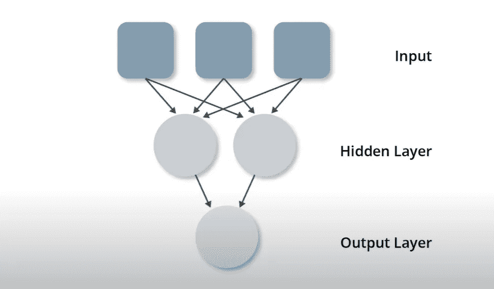

完全连接或密集层

我们已经理解了神经网络中全连接或密集层的概念。因此，我们需要了解，如果我们在 keras 中使用密集层，我们只是简单地声明神经元完全连接到前一层的神经元。为了在 Keras 中以编程方式创建上面讨论的层，我们将使用下面的 python 代码

喀拉斯致密层

上面的代码声明我们有 **1 个隐藏层**和 **2 个神经元**。在 keras 中，我们曾经将神经元的数量指定为一个单元，并将其作为一个参数传递到创建的层中。类似地，对于输出层，我们将**单元指定为 1** ，这表明我们在输出层中有 **1 个神经元**。在创建隐藏层和输出层之后，我们通常通过在顺序 API 中将隐藏层和输出层作为参数传递来构建模型。如果你想知道更多关于喀拉的事，我建议你去看看我之前的博客，我已经一步一步解释过了。

我们已经理解了致密层。现在我们将试着理解这个密集层在网络中到底在做什么。要理解这一点，我们需要回忆一下我们在上一篇文章中学习过的概念，权重和偏差的概念。在我们之前讨论的神经网络中，假设我们将 x1、x2、x3 作为实际输入，a1 和 a2 是隐藏层的神经元，a3 是输出层的神经元。正如我们在全连接层中讨论的，每个神经元都连接到前一层的神经元，因此将有与所有隐藏和输出层相关联的权重，因此我们将有 8 个权重，3 个用于 1 个隐藏层 a1，因为我们有 3 个输入，3 个用于其他隐藏层 a2，2 个用于输出层，因为我们有 2 个隐藏神经元。这可以通过下图来理解。在神经网络的执行过程中，对于给定的输入到输出，权重和偏差将被调整到最佳匹配。在训练神经网络的过程中，只有权重和偏差发生变化，以适应最佳值，从而适应我们用于输入神经网络的输入和输出。

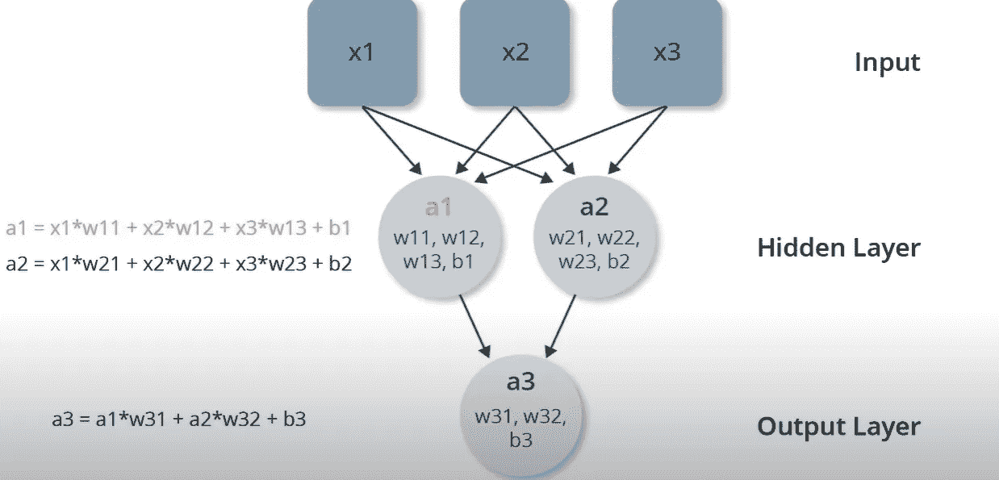

神经网络中的权重和偏差

我们了解了致密层和神经元的基本知识，以及这些神经元是如何相互连接的。现在，我们可以使用 Keras 的密集层来构建我们的第一个深度学习模型。

我们知道这样一个例子，我们需要构建一个模型，它将学习给出华氏温度，而模型将被给出摄氏温度。为了快速复习，下面是相同的公式。

# f=c*1.8+32

f 是华氏温度，c 是摄氏温度。这看起来像一个直线方程。所以我们将使用一种线性回归来解决这个问题。如果你不知道线性回归，不要担心，我们将在下一篇文章中讨论机器学习的类型和方法。**当然，创建一个直接执行这种计算的传统 python 函数是足够简单的，但我们在这里的动机是使用深度学习解决相同的问题**

要解决这个问题，我们肯定需要输入和输出。因此，在这种情况下，输入将是某个样本的摄氏温度值，输出将是与输入的摄氏温度值相对应的某个华氏温度值，最终目标是我们的模型将学习接近 1.8 的重量和接近 32 的偏差，因此，如果有人将通过摄氏温度值，我们的模型应该能够给出与该摄氏温度值相对应的华氏温度值。试着理解清楚这一点。

现在，我们将直接使用 Tensorflow、Keras 和 Python 构建第一个模型。为了建立模型，我们将使用下面的代码。首先，我们将导入 tensorflow，numpy，logger 和 basic，我们将需要建立我们的模型

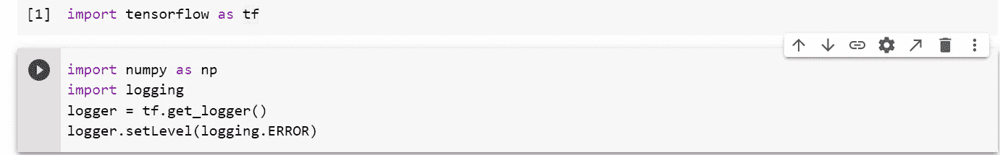

导入 tesnsorflow、numpy 和 logger

现在我们将准备输入和输出。正如我们所讨论的，输入将是一些摄氏温度值的样本，输出将是相应的华氏温度值。输入将是摄氏 _q=[-40，-10，0，8，15，22，38]，输出将是华氏 _a=[-40，14，32，46，59，72，100]。

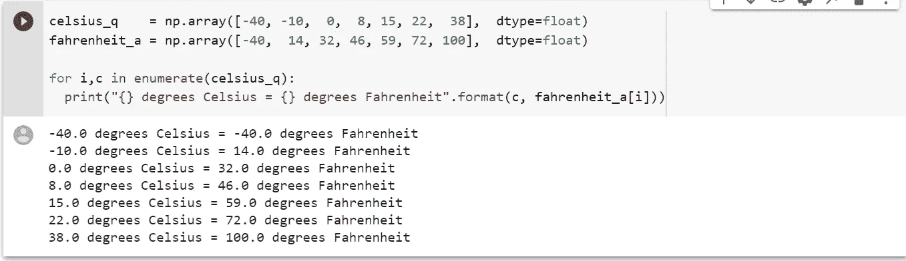

输入和输出

**在上面的例子中，如果我们要谈论深度学习术语，我们将摄氏温度作为特征，华氏温度作为标签。**

现在，是时候创建我们的模型了，因为我们已经指定了输入和相应的标签。我们将创建一个单层**密集**的模型。创建密集层后，我们将该层分配给模型。为此，我们将使用下面的 python 代码。

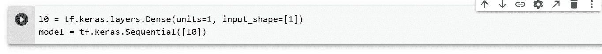

模型的创建

**在创建模型之后，现在是编译模型的时候了，基本上训练模型以调整正确的重量，以便模型的学习将是良好的，并且当摄氏温度传递给模型时，模型能够给出华氏温度。keras 里有个叫优化器和损耗的东西，负责损耗的计算和权重的调整。到目前为止，请记住，权重的调整是由神经网络中的优化器负责的。优化器和损失函数本身是一个很大的话题，我们将在下一个教程中讨论。我们将使用 mean_squared_error 作为损失函数，并使用 Adam optimizer 编译模型**。这可以使用下面的 python 代码来实现。 **0.1 是以下代码中的学习率**，我们可以更改该参数，因为它是模型中的**超参数**之一。学习率基本上告诉 Tensorflow 我们如何积极地试图找到最佳模型。该值可以在 0.001–0.1 之间，这是我们可以尝试的 LR 的较好值。

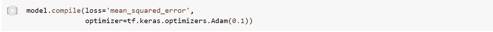

编译模型

现在是时候训练我们的模型了。我们可以通过使用下面的 python 代码在创建的模型上使用**拟合方法**来**训练**我们的模型。Fit 通常用来获取输入和相应的输出以及**历元的数量。1 Epochs 是我们上面看到的例子的完整迭代。**由于我们有 7 个输入输出样本，如果我们提供的历元为 500，模型将训练多达 500 *7=3500 次

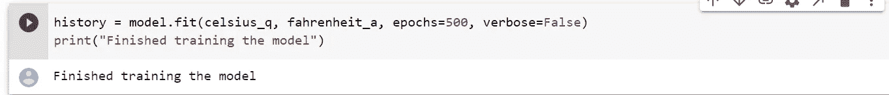

训练模型

由于我们已经成功训练了我们的模型，现在我们将尝试使用图形来可视化训练损失。Matplotlib 是用于可视化的 python 包。我们可以通过下面的 python 代码来可视化训练损失:

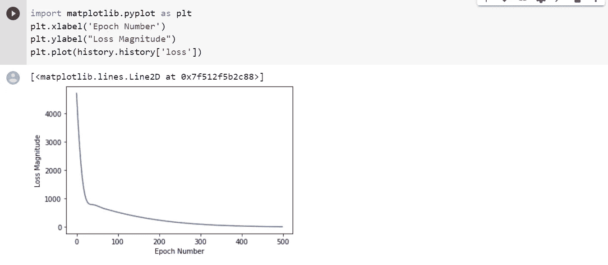

培训损失可视化

从上图中我们可以清楚地看到，随着历元数的增加，模型 moss 在减少，损失的减少对我们的模型有好处，这意味着随着损失接近于零，我们的模型将能够更准确地预测。我们可以看到，损失从第一个时期的 4000 多开始，随着时期数的增加，它向 0 收敛。

我们将为 python 可视化库的详细内容撰写单独的系列文章。在那里，我们将详细讨论可视化。如果您现在还没有理解上面的代码，请不要担心。与此同时，如果你想学习可视化，请查阅 python 的官方 matplotlib 文档。

我们已经成功地训练了我们的模型。现在，我们将尝试通过将摄氏温度值传递给我们的模型来预测华氏温度值。这可以通过对创建的训练模型使用预测方法来完成。注意，我们可以将任何值传递给我们的模型，我们的模型将给出相应的华氏温度值。这可以使用下面的 python 代码来完成。

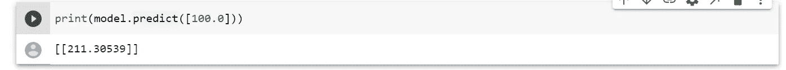

华氏温度值预测

恭喜我们的模型已经学会预测华氏温度。在上面的预测中，我们已经超过了 100 摄氏度。**通过公式将尝试计算 100 摄氏度的华氏温度值，我们将得到 100*1.8+32=212。正确值为 212，模型预测值为 211.30539。我们的模型预测值接近 212。所以我们可以说模型在这种情况下表现良好。**

现在，我们将通过使用下面的 python 代码来查看我们的模型已经了解的权重和偏差

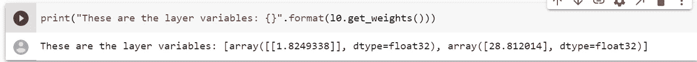

模型的权重和偏差

权重为 1.824，接近原公式中的**“c * 1.8+32 = f”1.8**，偏差为 28.81，接近 32。恭喜我们已经建立了一个模型，当摄氏温度通过它时，它成功地给出了华氏温度的正确接近值，而没有硬编码和 python 代码类型。我们通过训练神经网络完成了这项任务。本文中使用的完整 python 代码如下:

**注意:粗体文本非常重要。请读两遍，试着理解。**

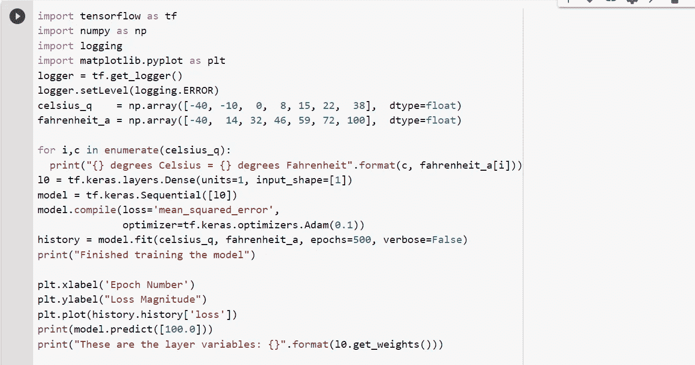

本文中使用的完整代码

在下一篇文章中，我将尝试在深度学习中深入一点，并将看到更多关于深度学习的术语和例子。如果你想学习深度学习的基本概念，我已经附上了上面的链接，你可以通过它来学习。我希望你喜欢这个基本的例子。如果你对这篇文章或代码有任何类型的困惑，你可以在下面评论，我很乐意回答。如果你对云计算感兴趣，我推荐你看看我下面的文章，这篇文章会让你逐步了解云计算

 [## 云计算简介和迈向亚马逊网络服务的第一步

### 在这篇文章中，我将主要关注云计算的基本介绍，我们将尝试了解步骤…

medium.com](/analytics-vidhya/cloud-computing-introduction-and-1st-step-towards-amazon-web-services-22344ac7178e) 

# 敬请关注