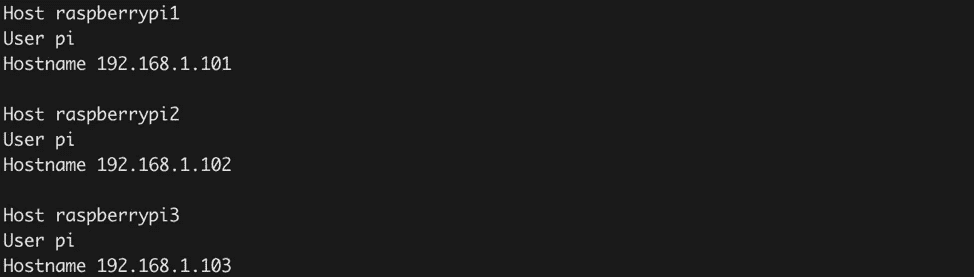
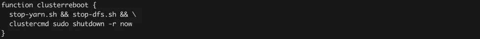
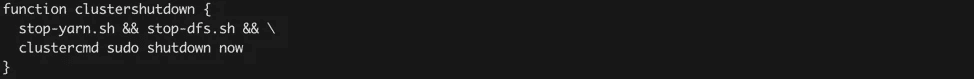
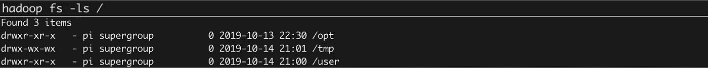
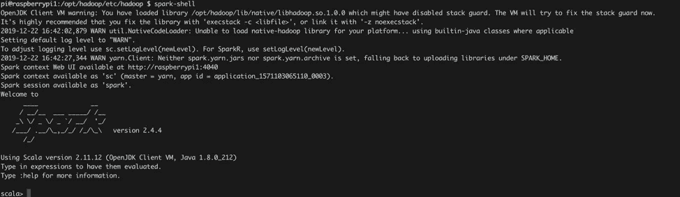
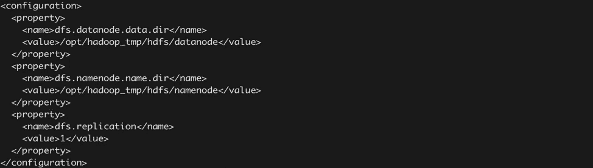
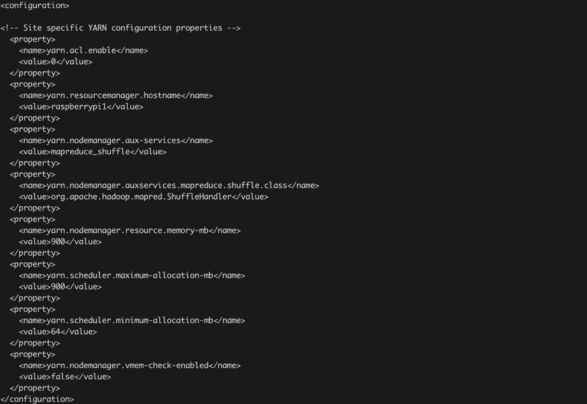
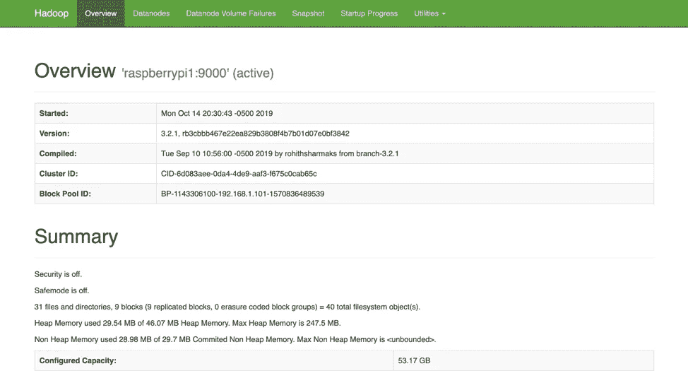
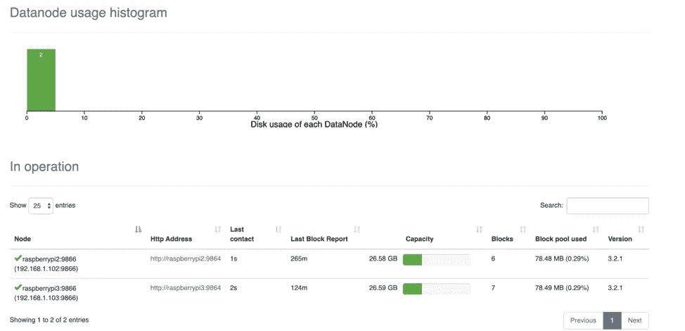

# 从头开始构建 Raspberry Pi Hadoop/Spark 集群

> 原文：<https://medium.com/analytics-vidhya/build-raspberry-pi-hadoop-spark-cluster-from-scratch-c2fa056138e0?source=collection_archive---------1----------------------->

# 介绍

为了更好地理解云计算是如何工作的，我和我的同学林振决定深入挖掘数据工程师的世界。我们的目标是从头开始构建 Spark Hadoop Raspberry Pi Hadoop 集群。我们将向您介绍我们采取的步骤，并解决您在整个过程中可能遇到的错误。

*上图是我们购买的部件:树莓派 4 *3，SD 卡*3，网线*3，Charing 线*3，Switch *1*

*上图显示了组装好的树莓果串的外观。*

# ***第一阶段:树莓 Pi 设置***

***在树莓 Pi 上安装操作系统***

我们选择使用基于 Debian 的操作系统 Raspbian。Raspbian NOOB 是我们发现的让操作系统在 Raspberry Pi 上完美运行的最简单的方法。我们将 microSD 卡格式化为 FAT，并提取 NOOBS*。zip 存档。然后，我们把文件复制到我们的 microSD 卡上。最后，我们将 microSD 卡插入 Pi，成功地安装了操作系统。

上图显示 Raspbian 操作系统正在运行。

***配置静态 IP 地址***

我们为网络交换机上的每个 Pi 设置静态 IP 地址，以便于 Pi 的简单联网。我们将它们分别命名为 raspberrypi1、raspberrypi2、raspberrypi3。然后，我们编辑每个 Pi 上的文件`***/etc/dhcpcd.conf***` 并取消注释。编辑此行:

*其中 X 应替换为 1 代表 Pi1，2 代表 Pi2，依此类推。*

注意，您为 Pis 设置的静态 ip 地址应该与您路由器的 ip 地址一致。例如，我们路由器的 ip 地址从 192.168.1.10X/24 开始，因此我们为每个 Pi 分配如下所示的 ip 地址。

*上图显示了我们为 raspberry pi1 设置的 ip 地址。(相应地，我们对 pi 2 使用 192.168.1.102/24，对 pi 3 使用 192 . 168 . 1 . 103/24)*

***启用 SSH***

然后，我们按照这个 [*链接*](https://www.raspberrypi.org/documentation/remote-access/ssh/) 的指示启用 SSH。

***设置主机名***

首先，所有的 pi 都被称为 raspberrypi，并且只有一个用户。如果我们经常在网络上不同的 pi 之间来回移动，这可能会变得非常混乱。为了解决这个问题，我们将根据每个 Pi 在机箱/网络交换机中的位置为其分配一个主机名。Pi #1 将被称为 raspberrypi1，Pi #2 将被称为 raspberrypi2，依此类推。

必须编辑两个文件，包括 ***/etc/hosts*** 和 ***/etc/hostname*** 。在这些文件中，raspberry pi 应该只出现一次，这是默认的主机名。我们将其中的每一个都改为 ***raspberrypiX*** ，其中 ***X*** 是适当的数字 1–3。最后，仅在 ***/etc/hosts*** 中，我们还在文件末尾添加了所有其他 pi 的 IP，如下图所示。

从现在开始，我们看到的终端看起来像下图所示:

***简化宋承宪***

要从一个 pi 连接到另一个 pi，键入如下图所示的一系列命令可能会非常麻烦。

我们可以通过设置带有公钥/私钥对的 ***ssh 别名*** 和 ***无密码 ssh*** 连接来简化这个过程。

***宋承宪别名***

编辑**~/*。ssh/config*** 文件并添加以下几行:

将 X 替换为每个 Pis 的编号。这是在单个 Pi 上完成的，因此一个 Pi 应该包含 ***~/中的所有代码块。ssh/config***

(在我们的例子中，因为我们选择的主机名和我们构建的集群有三个 raspberrypi，所以看起来像上面这样)

在这之后，我们的 ssh 命令序列变成如上图所示:

但是此时我们仍然需要输入密码。我们可以通过建立公钥/私钥对来进一步简化这一点。

***公钥/私钥对***

首先，在每个 Pi 上，运行以下命令:

这将在目录 ***~/中生成一个公钥/私钥对。ssh/*** ，可以用来安全 ssh，不需要输入密码。其中一个文件将被称为 ***id_ed25519*** ，这就是私钥。另外，***id _ ed 25519 . pub***是公钥。不需要密码来保护对密钥对的访问。公钥用于与其他 pi 通信，私钥永远不会离开其主机，也永远不会被移动或复制到任何其他设备。

那么每个公钥都需要连接到 ***~/。每隔一个 Pi 上的 ssh/authorized_keys 文件*** 。让我们假设 Pi #1 将包含“主”记录，然后将它复制到另一个 Pi。

首先，在 Pi #2(和#3，等等。)，运行上面显示的以下命令:

这将 Pi #2 的公钥文件与 Pi #1 的授权密钥列表连接起来，给予 Pi #2 在没有密码的情况下 ssh 到 Pi #1 的权限(公钥和私钥用于验证连接)。我们需要对每台机器都这样做，将每个公钥文件连接到 Pi #1 的授权密钥列表。

我们也应该为 Pi #1 这样做，这样当我们将完成的 ***authorized_keys 文件*** 复制到其他 Pi 时，它们都有 ssh 到 Pi #1 的权限。在 Pi #1 上运行以下命令:

一旦完成了这一步，以及前面的部分，ssh-ing 就变得简单了:

***复制配置***

最后，要在所有 Pi 之间复制无密码 ssh，只需使用 scp 将上面提到的两个文件从 Pi #1 复制到另一个 Pi:

其中 ***piX*** 应该是你选择的主机名。(在我们的例子中，它是 raspberrypi1、raspberrypi2、raspberrypi3)您现在应该能够从任何其他 pi 通过 ssh 访问集群上的任何 pi，只需使用 ***ssh piX*** 。

***为了使用方便***

编辑 ***~/。bashrc* 文件下面的**和添加几行(注意，每当你编辑 ***~/。bashrc*** ，要使这些更改生效，您必须 ***源*** 文件或注销并重新登录。)然后，就可以调用新的函数了。下面是我们强烈推荐使用的功能。

***1。* *获取除此之外的每个 Pi 的主机名***

**2*。* *向所有 pi 发送相同的命令***

**3。*重启集群***

***4。关闭集群***

**5。*向所有 pi 发送相同的文件***

然后我们可以复制我们在~/中定义的所有易用的函数。使用下面显示的命令将 bashrc 连接到集群上的所有其他 Pi:

# ***第二期:Hadoop & Spark***

***单节点设置***

***Hadoop 安装***

在安装 Hadoop 之前，我们确保我们的 pi 拥有可接受的 Java 版本。我们首先在我们选择的主节点上构建一个单节点设置。在 pi#1 上，用这个命令获取 Hadoop(这是获取 hadoop-3.2.0.tar.gz 的一个简短链接):

接下来，使用下面显示的命令:

然后，确保更改该目录的权限:

最后，通过编辑 ***~/，将这个目录添加到$PATH 中。bashrc*** **文件**并在文件末尾加上以下几行:

上图显示了我们用来编辑 ***~/的线条。bashrc*** **文件**

然后编辑***/opt/Hadoop/etc/Hadoop/Hadoop-env . sh*****文件**添加下面一行:

上图显示了我们用来编辑***/opt/Hadoop/etc/Hadoop/Hadoop-env . sh*****文件**的代码行

通过检查版本来验证 Hadoop 是否已正确安装:

***火花安装***

我们将以与下载 Hadoop 类似的方式下载 Spark，运行以下命令(这是 spark-2.4.3-bin-hadoop2.7.tgz 的简短链接):

然后使用下面显示的命令:

然后，确保更改该目录的权限:

最后，通过编辑 ***~/，将这个目录添加到您的$PATH 中。bashrc*** 并在文件末尾添加以下行:

您可以通过检查版本来验证 Spark 是否已正确安装:

***【HDFS(Hadoop 分布式文件系统)***

为了启动并运行 Hadoop 分布式文件系统(HDFS ),我们需要修改一些配置文件。

*   所有这些文件都在***/opt/Hadoop/etc/Hadoop***内
*   包括 **core-site.xml，hdfs-site.xml，mapred-site.xml，yarn-site.xml**

编辑***core-site . XML***所以看起来是这样的。

编辑***HDFS-site . XML***所以看起来是这样的。

上面显示的行配置了 DataNode 和 NameNode 信息的存储位置，还将 replication(跨集群复制块的次数)设置为 1(我们可以在以后根据您构建的 DataNode 的数量来更改)。

使用下面显示的命令创建这些目录:

然后调整这些目录的所有者:

将下面几行添加到***mapred-site . XML***中，使其看起来如下所示:

最后，将下面的行添加到***yarn-site . XML***中，如下所示:

编辑完这四个文件后，我们可以使用下面的命令格式化 HDFS。(警告:如果您在 HDFS 已经有数据，请不要这样做！它将会丢失！):

然后，我们用下面显示的两个命令启动 HDFS:

并通过创建一个临时目录来测试它是否工作:

或者通过运行命令 jps:

上图显示 HDFS 已经启动并运行，至少在 1 号码头是这样。要检查 Spark 和 Hadoop 是否协同工作，我们可以使用下面的命令行:

然后它会打开 Spark shell，并提示 Scala >:

***集群设置***

此时，我们有了一个单节点集群，该单节点同时充当主节点和工作节点。为了设置工作节点(并将计算分布到整个集群)，我们采取以下步骤。

***创建目录***

使用下面显示的命令行在所有其他 pi 上创建所需的目录:

***复制配置***

将 ***/opt/hadoop*** 中的文件复制到对方 Pi 中使用:

过一会儿，您可以通过使用以下命令查询每个节点上的 Hadoop 版本来验证文件复制是否正确:

***在集群上配置 Hadoop***

为了让 HDFS 在集群中运行，我们需要修改之前编辑的配置文件。所有这些文件都在***/opt/Hadoop/etc/Hadoop***内

首先，编辑***core-site . XML***使其看起来如上图。

编辑***HDFS-site . XML***这样看起来就像上面的。(我们没有改变复制号，像以前一样使用 1，因为我们决定只有两个 DataNode。)

编辑***mapred-site . XML***使其看起来如上图。

最后，编辑***yarn-site . XML***使其看起来如上图。

对这些文件进行这些更改，然后从所有 pi 中删除所有旧文件。您可以通过以下方式清理所有 Pis:

接下来，我们需要在***$ HADOOP _ HOME/etc/HADOOP/***中创建两个文件，这两个文件告诉 HADOOP 将哪个 Pi 用作工作节点，哪个 Pi 应该是主(NameNode)节点。

首先，我们在前面提到的目录中创建一个名为 master 的文件，并只添加一行 Pi(***raspberrypi)***)。其次，我们在同一目录下创建一个名为的文件，并添加所有其他 pi(***【raspberrypi 2…)***，如下图所示:

然后，你需要再次编辑 ***/etc/hosts*** 。在任何 Pi 上，删除如下所示的线:

其中 X 是特定圆周率的指数。

然后，使用以下命令将该文件复制到所有其他 pi:

我们现在可以这样做，因为这个文件不再是特定于 Pi 的。最后，重新启动集群以使这些更改生效。当所有 Pi 都重新启动后，在 Pi #1 上运行命令:

然后，我们使用以下两个命令启动 HDFS:

我们可以通过从任何 Pi(使用 hadoop fs -put)将文件放入 HDFS 来测试集群，并确保它们显示在其他 Pi 上(使用 hadoop fs -ls)。您还可以通过打开 web 浏览器并导航到[***http://192 . 168 . 1 . 101:9870/***](http://192.168.1.101:9870/)***(在我们的示例中)*** 来检查群集是否已启动并正在运行。该 web 界面为您提供了一个文件浏览器以及有关群集运行状况的信息。

*运行在端口 9000 上的 Hadoop web UI。*

*显示 DataNode 统计数据的 Hadoop web UI。*

***在集群上配置火花***

为了让 Spark 能够与 YARN 通信，我们需要在 Pi #1 的 ***~/中再配置两个环境变量。巴沙尔*** 。之前，我们定义了:

**中的 *~/。巴沙尔*** 。在此之下，我们现在将添加两个环境变量:

***$ HADOOP _ CONF _ 目录*** 是包含我们上面编辑的所有 ****-site.xml*** 配置文件的目录。接下来，我们使用下面显示的命令行创建 Spark 配置文件:

然后，我们将以下几行添加到该文件的末尾:

此链接解释了这些值的含义。但是请注意，以上是非常特定于机器的。完成所有这些配置后，重新启动集群。请注意，当您重新启动时，您不应该再次格式化 HDFS 命名节点。相反，只需使用以下命令停止并重新启动 HDFS 服务:

现在，您可以在命令行上向 Spark 提交作业！我们使用下面显示的命令行从文本文件创建简单的 RDD。

输出应该如下图所示。

# ***结论***

最终，我们成功完成了这个从零开始构建树莓 pi hadoop/spark 集群的项目。这是一个漫长的配置和探索过程。然而，我们确实乐在其中。这是我们职业生涯中的第一个数据工程师兼职项目，我们期待着更多地了解大数据分析领域。

**参考**

[1]:安德鲁。(2019 年 7 月 22 日)。[构建 Raspberry Pi Hadoop / Spark 集群](https://dev.to/awwsmm/building-a-raspberry-pi-hadoop-spark-cluster-8b2?fbclid=IwAR1jloBA6-6U3LhcxhkLT0Kq2Nx90YZjnCCIfT01SQSRs3mHHB87kt4AK4w)