# 使用 Flask 和 PythonAnywhere 构建、保存和部署您的第一个 Web 应用程序

> 原文：<https://medium.com/analytics-vidhya/build-save-and-deploy-your-first-web-app-using-flask-and-pythonanywhere-110ddd691026?source=collection_archive---------5----------------------->

## 快速入门 Flask 和 PythonAnywhere 的示例教程

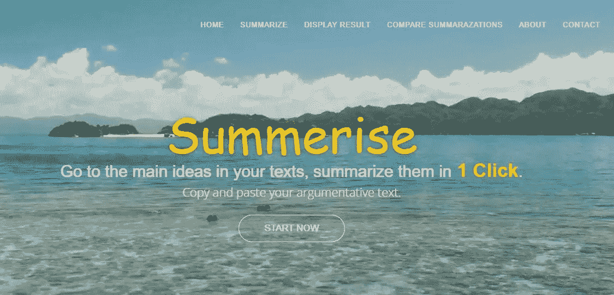

创建您的第一个文本摘要 Web 应用程序，并使用 PythonAnywhere 部署它。

# 介绍

文本摘要是指缩短长文本的技术。目的是创建一个连贯流畅的摘要，只包含文档中概述的要点。

自动文本摘要是机器学习和自然语言处理领域中最具挑战性和最有趣的问题之一。

通过这篇文章，我们将使用 Python web 应用程序框架 [Flask](http://flask.pocoo.org/) 构建一个简单的文本摘要应用程序。如果你喜欢阅读，但没有时间阅读冗长的文本，那么我们的应用程序将是你的最佳解决方案。

在本教程中，我们将能够使用 Flask 和一些优秀的 NLP 包(如 SpaCy、NLTK、Gensim 和 Sumy)构建一个文本摘要器 Web 应用程序，并将其托管在 PythonAnywhere 上。我们将把这个应用程序称为 Summerise。

# 目录

1.  文本摘要方法
2.  我们在这个应用中使用的 NLP 包
3.  用 Flask 构建我们的 Web 应用程序
4.  使用 PythonAnywhere 部署我们的应用程序
5.  下一步是什么？

# 文本摘要方法

在 NLP 中，有两种主要的文本摘要方法:

**基于抽取的摘要:**这些技术包括从源文本中提取关键短语，并将其组合成摘要。这就是为什么在提取方法中，确定正确的总结句子是很重要的。

**基于抽象的摘要**:这些技术通过使用先进的自然语言处理技术产生一个全新的摘要。当抽象应用于深度学习问题的文本摘要时，可以克服抽取方法的语法不一致性。

然而，进行抽象所需的文本摘要算法更难开发，这就是为什么在本文中，为了简单起见，我们将集中讨论**提取摘要技术**。

# 我们在这个应用中使用的 NLP 包

[**NLTK**](http://www.nltk.org/) **(自然语言工具包)**用于标记化、词条化、词干化、解析等任务。这个库有几乎所有 NLP 任务的工具。

Spacy 是 NLTK 的主要竞争对手。这两个库可以用于相同的任务。

[**Gensim**](https://radimrehurek.com/gensim/summarization/summariser.html) 是一个提供文本汇总功能的模块。摘要是基于使用 TextRank 算法的变体的文本句子的等级。

[**Sumy**](https://pypi.org/project/sumy/) 是一个简单的库和命令行工具，用于从纯文本中提取摘要。该软件包包含文本摘要的简单评估框架。

# 用 Flask 构建我们的 Web 应用程序

在本教程中，我们将逐步向您展示如何构建一个简单的 Python Flask 应用程序。

[Flask](https://flask-doc.readthedocs.io/en/latest/) 是一个基于 Werkzeug、Jinja 2 和 good intentions 的 Python 微框架。

我们假设用户之前有以下经验:

*   [Pip&](https://pip.pypa.io/en/stable/user_guide/)[virtualenv](https://docs.python.org/3/library/venv.html)。
*   HTML、CSS 和[引导程序](https://getbootstrap.com/)。

## 设置开发环境

在我们开始学习技术材料之前，我们需要首先设置我们的环境。然而，如果你熟悉的话，你可能已经有了我们实际需要的东西。

但是，如果你不是，这不是一个问题，因为我将描述你应该需要设置环境。

一般来说，我们需要的是:

1.  为与您相关的操作系统下载 Anaconda。对于 Windows，您将需要安装 Python 3 版本，我们推荐图形安装程序。根据您的电脑不同，有 64 位版本和 32 位版本。事实上，Anaconda 将会提供许多数据科学包。一旦下载了 Anaconda，在完成安装过程后，您应该能够在命令行运行 Python。

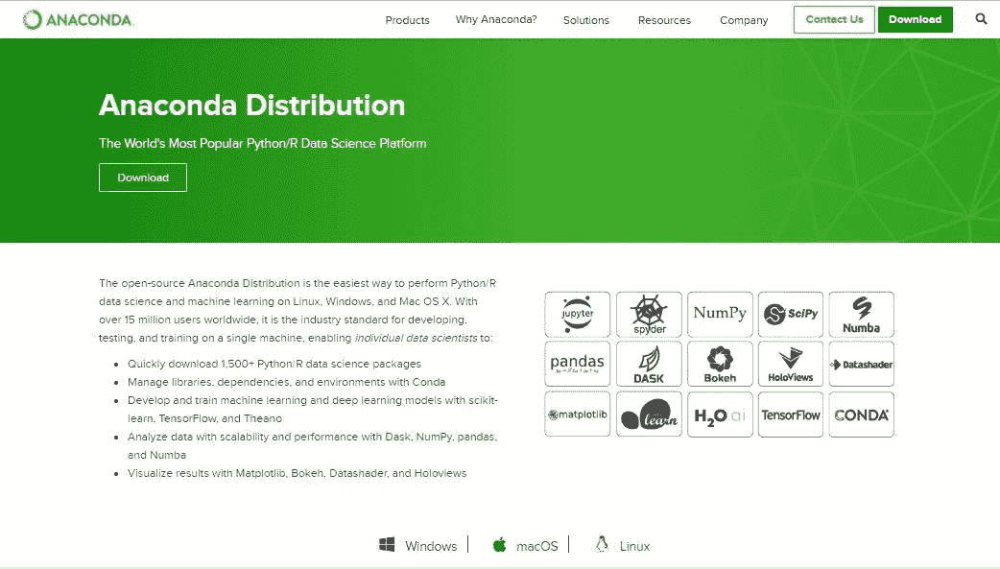

[下载 Anaconda 的链接](https://www.anaconda.com/distribution/)

2.因为您已经设置了 Anaconda 和 Python。现在让我们设置我们的开发环境。我们可以看到，在 Anaconda Navigator 中有 Visual studio。你只需要点击启动按钮。

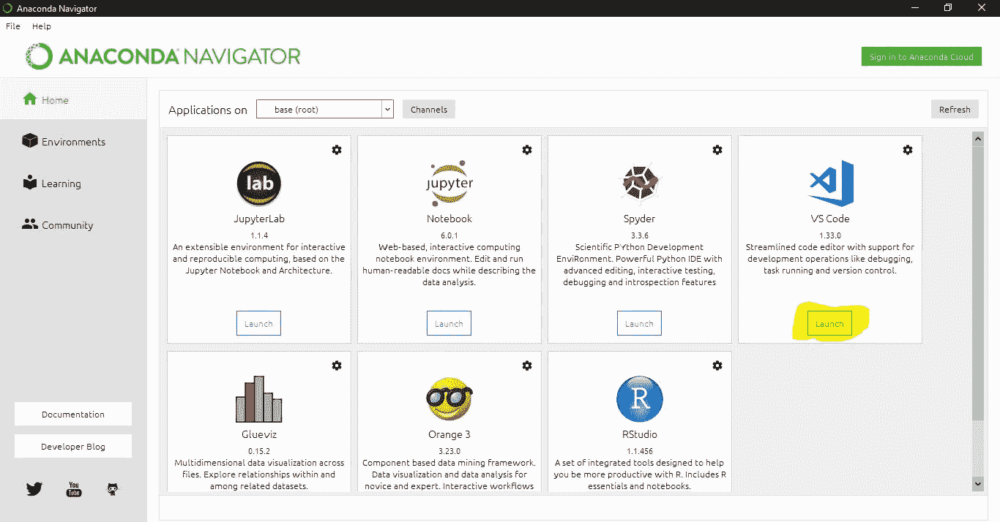

巨蟒领航员

让我们向您展示如何为 Web 开发安装有用扩展:

*   在 Visual Studio 代码中，转到扩展并安装 **Web Development Essentials 扩展包**。这是一个扩展包，其中的扩展对 Web 开发人员非常有帮助(例如:Live server、括号对着色、自动重命名标签等。)

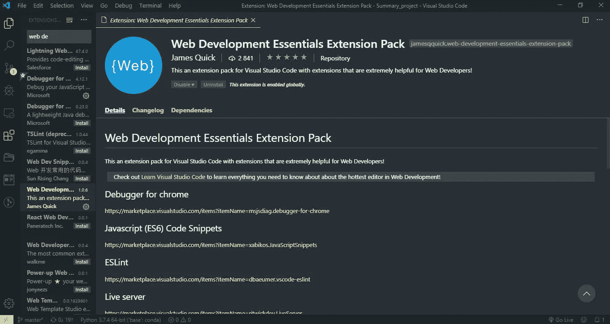

3.现在，我们用命令行工具设置虚拟环境，或者终端存在于 VS 代码中(设置虚拟 env 是可选的，但是我们建议使用它，因为您将能够安全地运行我们的代码)。因此，为了方便起见，我们已经创建了一个 **requirements.txt** 文件，您可以用一行代码安装所有库都将使用的文件。

为了在命令行使用这个文件，你需要将 **cd(更改目录)**保存到你保存了**解压后的**版本代码的地方。

因此，让我们进入命令行，找到 **requirements.txt** 并向您展示如何创建虚拟环境，然后轻松安装项目所需的所有库。

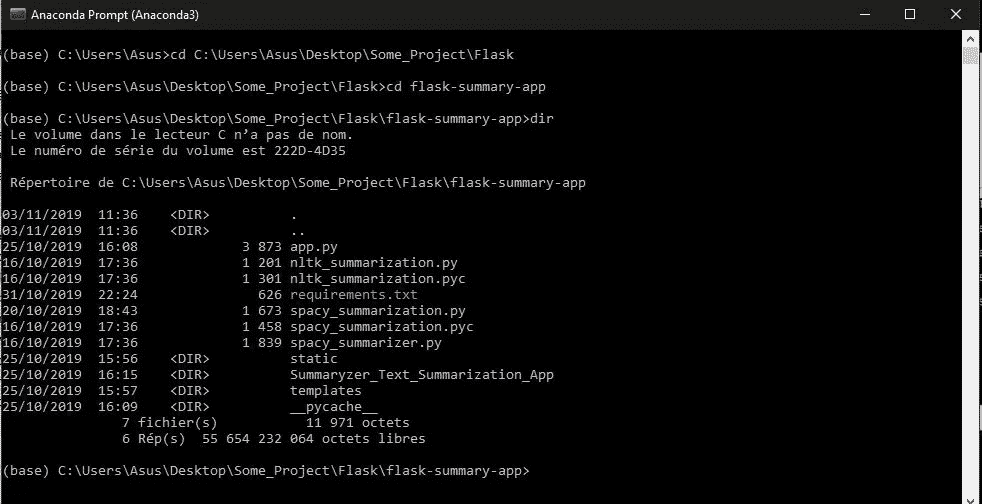

在文件夹中找到 requirements.txt

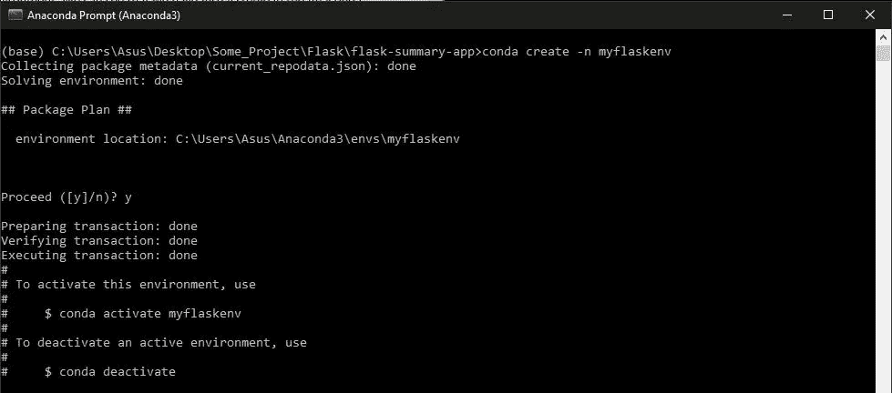

创建虚拟环境

让我们激活虚拟环境并安装项目所需的软件包:

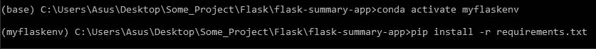

> 作为参考，这个项目的代码可以在我的 [GitHub](https://github.com/AmalM7/flask-summary-app) 上找到。

## 运行应用程序

如下设置项目文件夹。模板文件夹将包含将在网站上显示的`index.html`文件。`app.py`是我们所有 Flask 逻辑要去的文件。不要将你的任何文件命名为`flask.py`，因为这将与 Flask 本身相冲突。静态文件夹将包含`css`、`js`、`images`和`video`文件夹。

要在本地显示应用程序，请在您的终端上运行`$python app.py`，然后前往 [http://127.0.0.1:5000](http://127.0.0.1:5000/) 查看您的应用程序。

# 使用 PythonAnywhere 部署我们的应用程序

您是否希望将 Python web 应用程序部署到实时服务器上？现在，有了 **PythonAnywhere** 可以让我们通过服务器终端访问 *Linux 服务器*，我们可以从我们的互联网浏览器访问它。在这一部分中，我们将详细介绍设置 PythonAnywhere 的步骤。我们开始吧！

## 1.设置帐户:

我们可以很容易地在 [PythonAnywhere](https://www.pythonanywhere.com/) ( *初学者账户*)上注册一个免费计划，让我们获得 500 MB 的磁盘空间。如果我们想要更多的服务器资源，我们可以升级到付费计划之一。

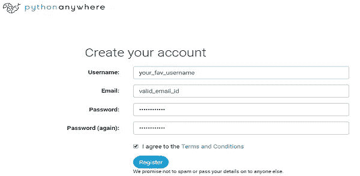

[Python Anywhere 注册页面](https://www.pythonanywhere.com/registration/register/beginner/)

## **2。转到 *Web* 菜单项，然后按下*添加新 web app 按钮，*** 点击*下一步*然后点击*烧瓶*并点击最新版本的 Python，然后再次点击*下一步*接受项目路径。

就是这样。你可以在*https://yourusername.pythonanywhere.com 上访问你的网络应用。*(用您实际的 PythonAnywhere 用户名更改*用户名*)。这是你的应用程序的网址。如果您想上传自己的项目，请遵循以下步骤:

1.  在*网页*菜单页面的*代码*部分，点击*进入*源代码旁边的*目录。*

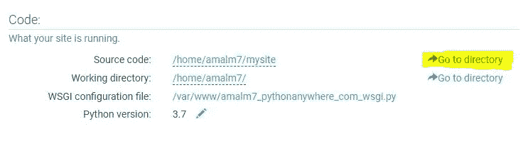

2.删除 *flask_app.py* 文件。

3.使用*上传文件*按钮上传您自己的`app.py` Python 文件，并在*目录*部分创建一个*模板*和一个*静态*目录，并将您的文件上传到那里。

4.在 *Web* 菜单页面的*代码*部分，点击 WSGI 配置文件*。用* `app` *改变* `flask_app` *并保存文件。*

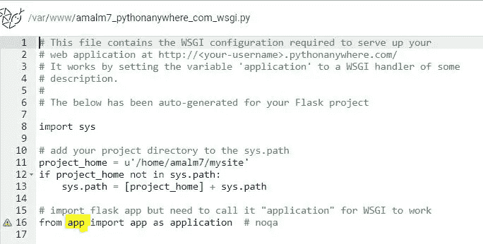

更改 wsgi.py 文件

5.转到控制台，点击 Bash 并安装这个项目所需的所有库。

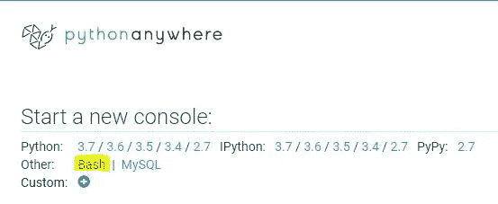

6.进入*网页*菜单页面，点击*重新加载*按钮。

现在你的 Flask app 应该在[*https://yourusername.pythonanywhere.com 上运行了。*](https://yourusername.pythonanywhere.com.) 如果你面临任何问题，只需检查你的错误日志文件。

[**启动 App**](http://amalm7.pythonanywhere.com/)

 [## 总结

### 大家好，我是 Amal，数据科学工程师，具有 ICT 工程、计算机和网络安全专业背景…

amalm7.pythonanywhere.com](http://amalm7.pythonanywhere.com/) 

# 下一步是什么？

自动文本摘要是一个热门的研究课题，在本文中，我们仅仅介绍了这个课题的基本和简单的技巧。下一次，我们将探索深度学习发挥重要作用的抽象文本摘要技术。此外，我们还可以研究以下任务:

**总结的具体算法:**

*   使用 RNNs 和 LSTM 的文本摘要
*   使用生成对抗网络的文本摘要

**增加更多招数:**

*   计算课文中的单词数
*   计算总结课文的时间

**前端设计:**

*   改善我们的应用程序的前端设计，以更具吸引力

# 结论

我认为 flask 是一个非常好的框架，特别是对于那些在这个领域刚刚起步的人。我真的希望这篇文章能帮助你理解构建和部署文本摘要的概念。

我将在以后的文章中介绍抽象文本摘要技术。同时，请随时使用下面的评论部分让我知道你的想法，或者问你对这篇文章的任何问题。

***快乐阅读，快乐学习，快乐编码。***

# 在你走之前

相应的源代码可以在[这里](https://github.com/AmalM7/flask-summary-app)找到。

 [## Amal M7/烧瓶-摘要-应用程序

### 此时您不能执行该操作。您已使用另一个标签页或窗口登录。您已在另一个选项卡中注销，或者…

github.com](https://github.com/AmalM7/flask-summary-app)