# 使用 Flask、Vue JS 和 Bootstrap 4 的 Twitter 情感分析仪表板

> 原文：<https://medium.com/analytics-vidhya/build-sentiment-analysis-application-with-flask-and-vuejs-b607dc1f3604?source=collection_archive---------1----------------------->

## 我将与你分享我在学习自然语言处理时建立一个“练习”项目的经验。我尝试使用 Flask 作为后端，VueJS 作为前端，开发一个情感分析仪表板。

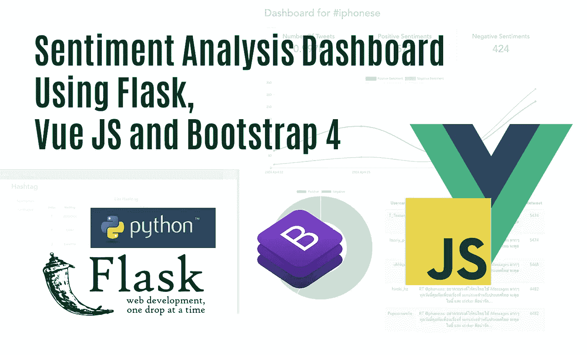

Flask 和 VueJs 被全球很多开发者广为人知。Flask 是流行的 Python 框架，而 Vue 是流行的 Javascript 框架。正如我之前提到的后端和前端，基本上我构建了一个由两个子应用程序组成的应用程序，后端和前端。我使用 Flask 作为构建后端应用程序的工具，使用 Vue 构建前端应用程序。

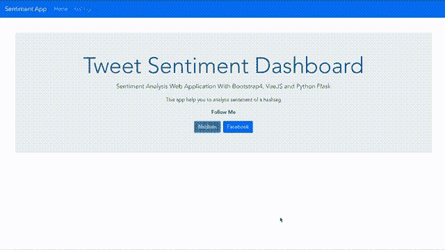

情感应用程序

这个应用程序的主要目的是通过标签抓取推文，确定情绪，并在仪表板上显示出来。

下面是我在构建这个应用程序时执行的步骤。

1.  建立一个情感分析模型。
2.  使用 Flask Python 框架构建后端应用程序。
3.  使用 Vue Javascript 框架构建前端应用程序。

我使用 Python 3.6 和 Vue 2.0 来构建我们的应用程序。

**现在，让我们开始编码。**

# A.构建情感分析模型

我使用 Jupyter Notebook 作为开发模型的工具，它在预处理训练数据和建立分类模型时帮助了我很多。我使用**朴素贝叶斯**，因为这是对一条推文的情感进行分类的更简单的方法。

你可以从[https://www.kaggle.com/c/twitter-sentiment-analysis2/data](https://www.kaggle.com/c/twitter-sentiment-analysis2/data)下载 train.csv 作为训练数据

首先，我制作了一个名为 Preparing.ipynb 的笔记本来准备 tweets 数据，然后导入我们需要的 Python 库，然后读取 CSV train 数据。

我使用 pandas 来处理数据帧，还使用 nltk 来帮助我预处理和清理 tweets 数据。要检查数据，是否加载，我一般用 tweet_df.head()来检查。


我只使用情绪和情感文本列来训练数据。我忽略 itemID，因为我觉得这对我没什么用。基于我们训练数据的下载来源，情绪值 **0 表示负面情绪，1 表示正面情绪**。

## **数据清理和预处理**

我使用否定列表将 NOT_ 添加到每一个否定之后的文本，直到下面的标点符号基于我在这个文档中读到的**(**[**https://web.stanford.edu/class/cs124/lec/sentiment.pdf**](https://web.stanford.edu/class/cs124/lec/sentiment.pdf)**)**

预处理 Tweet 函数的第 7 行到第 11 行用于小写 tweet，从否定中删除标点，删除 web URL，删除用户提及，然后删除 hashtag。下一步是阻止 tweet 中的每个单词，添加 NOT_ 如上所述，然后删除停用词。

使用此语法在我们的数据帧中应用预处理 Tweets 函数。使用 head()函数检查包含预处理 tweets 的新列(clean_text)。

以上语法将根据我们的硬件规格运行一段时间，将其保存在一个新的 CSV 文件中，因此我们不需要再次运行预处理函数。

## **训练分类模型**

现在，让我们使用朴素贝叶斯分类算法来训练模型。我用 Scikit-Learn 来训练数据。

我用了不同的笔记本来训练模型。我将其命名为 modeling.ipynb。当然，这个新笔记本的第一步是导入我们稍后需要的所有库。

加载预处理过的推文。

我不知道您是否会遇到数据类型错误，但是如果您遇到了，您可以使用这个语法将对象转换为字符串/Unicode。

然后我做了一个自动化训练过程的管道。该管道用于创建单词包模型，然后训练分类器。

将数据分为训练集和测试集，我只使用 70:30 的比例进行分割，然后使用我之前制作的管道来训练数据。打印分类报告，了解我们模型的准确性、召回率和精确度。

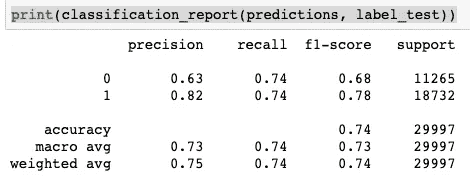

我尝试优化模型。在 train.csv 上进一步看，我发现情绪积极的推文比消极的多得多。因此，我抛出了一些积极的情绪数据，以使两种情绪在数量上相等(50:50)。

接下来是分类报告。

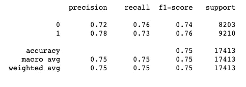

比以前稍微好一点；可能你知道怎么优化模型，所以分数比我高。

转储管道模型，以便我可以在我的应用程序中使用它。

# B.使用 Flask 构建后端应用程序

在为分类任务建立模型之后，我创建了后端应用程序来处理我的 web 应用程序的服务器端工作。这个后端的目的是管理数据库，抓取 tweets，并处理分类任务。我是 Python 新手，如有错误请指正(我是 PHP 开发人员)。

这个后端是一个 REST 服务器，它为我们的前端提供 API 和服务，所以在我们的应用程序中除了 JSON 形式的数据之外，不会有任何花哨的输出。

首先，我为我的项目创建一个虚拟环境。我听说 Python 虚拟环境是使用 Python 开发应用程序的最佳实践。虚拟环境将隔离项目环境，因此它不会干扰其他项目。

 [## 使用 pip 和虚拟环境安装软件包——Python 打包用户指南

### 本指南讨论了如何使用和虚拟环境管理器安装软件包:Python 3 或 virtualenv…

packaging.python.org](https://packaging.python.org/guides/installing-using-pip-and-virtual-environments/) 

阅读上面的官方网站来安装、创建和激活虚拟环境。

我的虚拟环境命名为 be-情操-app，你想怎么叫都行。

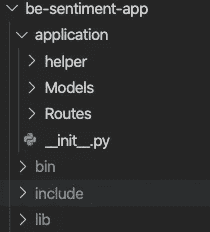

这是我的后台文件夹结构。我有一个应用程序文件夹，其中包含三个文件夹(helper、Models、Routes)和一个 Python 文件 __init__.py。其他文件夹(bin、include、lib)是在创建虚拟环境时自动创建的。

使用 pip 安装我们稍后需要的 Python 包。我不确定这个列表是否完整。如果有丢失的包，您可以稍后添加。

1.  Flask (Python Web 框架)。
2.  烧瓶 cors(手柄 cors)。
3.  Flask-SQLAlchemy(处理 ORM 数据库连接)。
4.  nltk(处理文字处理)。
5.  PyMySQL(MySQL 的连接器)。
6.  请求(处理请求)。
7.  tweepy(Python 的 Twitter API 库)。
8.  *还有其他的(有错误可以补充)*

这是我在后端使用的 SQL 脚本。我使用 MySQL(实际上是 MariaDB)作为数据库，因为它安装在我的电脑上。我把它命名为数据库感悟 _app。

我将之前从 Jupyter 笔记本(model_pipeline.pkl)中转储的模型复制到 helper 文件夹中，因为我以后要使用它。之后，我在 helper 文件夹内创建了 encoder.py 和 TweetClassifier.py。

**应用程序/助手/编码器. py**

编码器. py

py 是一个定制的编码器，用于将使用 SQL Alchemy 获取的数据转储为 JSON 格式(我是在 StackOverflow 上获得的)。

**应用程序/助手/TweetClassifier.py**

TweetClassifier.py

Tweet 分类器类用于预处理和预测 tweet 的情感。如果你看到，有一些我们在 Preparing.ipynb 中使用的代码相似性。

回到应用程序的根目录，我创建了这 4 个 Python 文件。

**。环境**

。包封/包围（动词 envelop 的简写）

我使用 dotenv 文件来存储凭证和数据库连接配置。根据您的 Twitter API 凭证更改凭证，并根据您当前的数据库 URI 更改数据库 URI。

**config.py**

配置. py

这个配置文件用于从我们的 dotenv 设置 flask 和 SQL alchemy 配置。

**wsgi.py**

wsgi.py

**start.sh，**

start.sh

这两个文件用于稍后运行我们的应用程序。

这个后端应用程序的入口脚本在 __init__ 中。应用程序文件夹中的 py。该文件确定每个请求必须使用的路由。

**应用/__init__。py**

__init__。巴拉圭

我对应用程序/模型文件夹中的每个表使用一个模型。对于 SQL Alchemy 用来执行数据库操作任务的数据库中的表来说，这些模型是抽象的。

**应用/模型/Hashtag.py**

Hashtag.py

**应用/模型/Tweet.py**

推特. py

我还为每个型号使用一条路线，以便于使用。我在应用程序/路由文件夹中创建了路由文件。

**应用程序/路线/散列路线. py**

HashtagRoutes.py

**应用/路线/TweetRoutes.py**

TweetRoutes.py

这两个路由文件用于在后端执行逻辑；它处理请求并决定之后做什么。

TweetRoutes.py 上的 crawlTweet()函数从第 69 行开始，用于根据前端传递的 hashtag 参数抓取 Tweet 数据。对于每一条抓取的 tweet，这个函数使用 helper/TwitterClassifier.py 文件(第 160–162 行)的帮助来完成分类任务，然后将其保存到数据库中

我在 crawlTweet 的单个请求中只抓取了 300 条 Tweet，如果你愿意，可以更改 maxTweets 的数量。

这是 be-情操-app 完整的文件夹结构

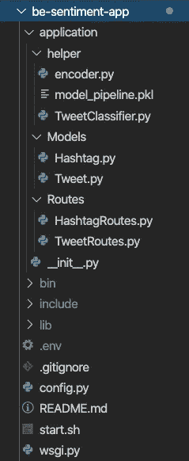

我从一些教程中得到这个文件夹结构，并编辑成 Yii2 (PHP 框架)文件夹结构样式。

我们的后端应用程序没有模板或视图(就 PHP 而言)，因为我们不需要这些。这个应用程序输出只是一个 JSON 格式，将由前端应用程序使用，而不是最终用户。

运行 start.sh 文件启动后端应用程序。

```
sh start.sh
```

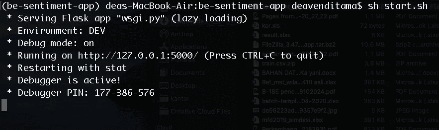

要测试该应用程序，我们可以访问

[http://127 . 0 . 0 . 1:5000/推特/all？hashtag=iphonese & page=1](http://127.0.0.1:5000/tweet/all?hashtag=iphonese&page=1)

如果你这样做，当然，你会得到空的 JSON，因为你没有包含 iphonese 标签的 Tweet。但是如果你已经使用 iphonese 标签抓取了这条推文，它会像这样显示。

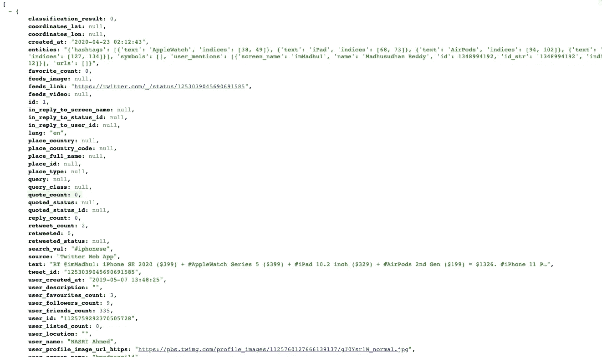

这是我们用来为前端应用程序提供服务的 URL 列表。

1.  /tweet/all？hast hag = { hashtag } & page = { page }(**GET**方法)
2.  /推文/计数？hasthag={hashtag} ( **GET** 方法)
3.  /推文/细节？id={id} ( **获取**方法)
4.  /推文/感悟？hast hag = { hashtag }(**GET**method)
5.  /tweet/toptweet？hast hag = { hashtag }(**GET**method)
6.  /tweet/daytoday？hast hag = { hashtag }(**GET**method)
7.  /推文/抓取？hast hag = { hashtag }(**POST**方法)
8.  /hashtag/all ( **获取**方法)
9.  /hashtag/insert ( **POST** 方法)
10.  /hashtag/delete ( **POST** 方法)

# C.使用 Vue 构建前端应用程序

> 我为什么用 Vue Js？为什么我不使用 Flask 标准模板？

答案是我想学习更多关于 Vue JS 的知识，因为有很多工作需要像 React 或 Vue 这样的 JS 框架。

要安装 Vue JS，可以在[https://vuejs.org/v2/guide/installation.html](https://vuejs.org/v2/guide/installation.html)上阅读。

我使用 vue-cli 创建 vue 项目

```
vue create fe-sentiment-app
```

安装时，我提示检查一些预置，我选择手动，然后选择巴别塔，林特，路由器。

这是我完成安装过程后的文件夹结构。

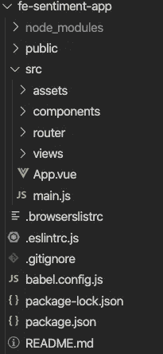

我安装 bootstrap-vue 是为了美化用户界面。BootstrapVue 是一个基于 Vue JS 和 Bootstrap 4 的 CSS 框架，所以我不需要在我的 Vue 项目上手动实现 Bootstrap。

要安装，请在您的 Vue 项目文件夹中运行以下语法。

```
npm install vue bootstrap-vue bootstrap
```

你可以在这个[链接(bootstrap-vue 文档)](https://bootstrap-vue.org/docs)上阅读更多关于 bootstrap-vue 的内容。

为了实现 bootstrap-vue，我将 src 文件夹中的 main.js 修改成这样:

**src/main.js**

主页. js

我想在我的应用程序上添加导航条，所以我将 App.vue 文件更改为如下所示:

**src/App.vue**

App.vue

我还没有 navbar 组件，所以我必须在 src/components/NavBar.vue 中创建一个

**src/components/navbar . vue**

导航条. vue

NavBar 组件中有两个链接菜单，Home 和 Hashtag。Home 是包含应用程序信息的页面，Hashtag 是包含 hashtag CRUD 菜单和仪表板的页面。

以下是我在 Fe-情操-app 中使用的视图。

**src/views/Dashboard.vue**

仪表板. vue

Dashboard.vue 是一个视图，包含一个标签的情感分类统计。

**src/views/Hashtag.vue**

Hashtag.vue

Hashtag.vue 是一个包含 Hashtag 的 CRUD 和 Dashboard 菜单的视图。

**src/views/Home.vue**

Home.vue

**src/views/Tweets.vue**

Tweets.vue

Tweets.vue 是一个包含标签 Tweets 的视图。

在上面的视图文件中，有一些我使用的组件。以下是我使用的所有组件。

**src/components/list hash tag . vue**

ListHashtag.vue

vue 是一个组件，包含一个 hashtag 的表格列表。

**src/components/submenuhashtag . vue**

SubMenuHashtag.vue

SubMenuHashtag.vue 是一个在 Hashtag 视图中包含子菜单的组件。

**src/components/formnewhashtag . vue**

FormNewHashtag.vue

vue 是一个组件，它包含一个用于输入和编辑 Hashtag 的表单。

**src/components/top tweets . vue**

TopTweets.vue

TopTweets.vue 是一个组件，它在一个 hashtag 中包含了 10 个转发量最大的 tweets 列表。该组件在仪表板中使用。

在仪表板视图中，我使用饼图和折线图来制作一个漂亮的图表。我用 vue-chartjs 来画图表。要安装 vue-chartjs，请在项目文件夹中运行此命令

```
npm install vue-chartjs chart.js --save
```

要了解更多关于 vue-chartjs 的信息，您可以阅读此链接上的文档 [(vue chart js 指南和文档)](https://vue-chartjs.org/guide/#introduction)

**src/components/line chart . vue**

LineChart.vue

**src/components/piechart . vue**

PieChart.vue

这是 src/router 文件夹中的 my index.js，它定义了应该向用户显示什么视图。

**src/router/index.js**

索引. js

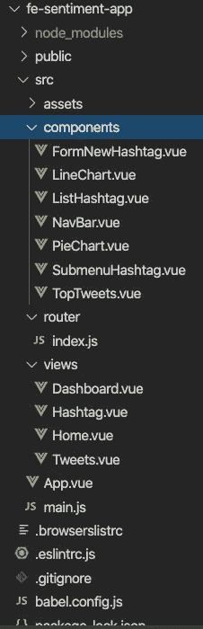

Fe-情操-app 的最终文件夹结构

这是我申请的最终结果。要启动 Vue 应用程序，请运行以下语法

```
npm run server
```

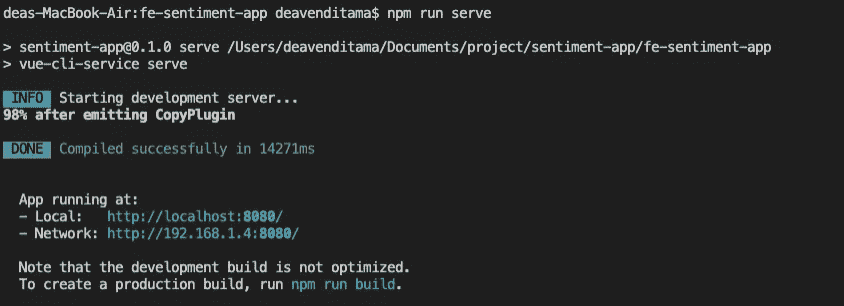

运行 vue 应用程序

我的申请的主页

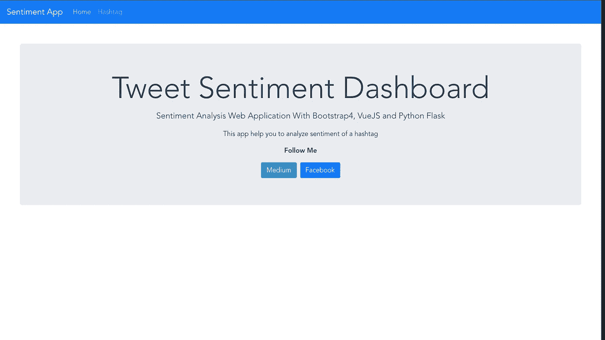

推特情绪仪表板

标签视图


Hashtag 的默认视图是 List Hashtag Meny。你可以看到每个标签中有五个按钮。

第一个是获取数据按钮，这个按钮用于根据给定的 hashtag 获取 tweet。

当点击这个按钮时，应用程序将抓取一个标签的最后 300 条推文。你可以在 be-情操-app 上编辑这个行为来改变最大数量，或者你可以添加**流**功能来实时获取推文数据。

新的标签和编辑菜单共享同一个组件。

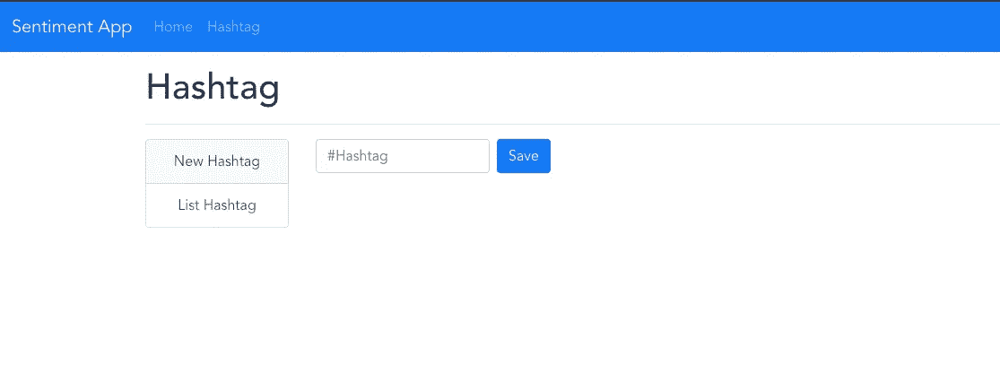

标签表单

“查看推文”按钮用于查看标签的推文。

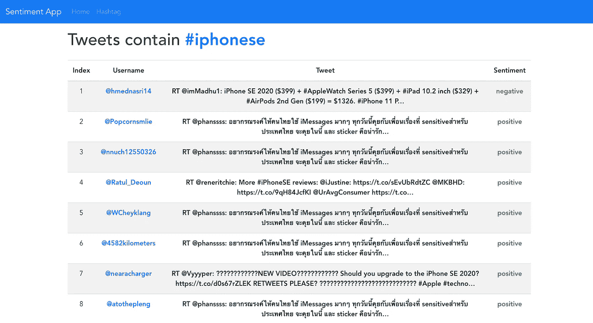

你可以看到许多推文使用的是非英语语言。也许您可以优化模型或更改爬行配置来处理非英语推文。

**删除按钮**是删除标签。

**仪表板按钮**用于显示仪表板视图。

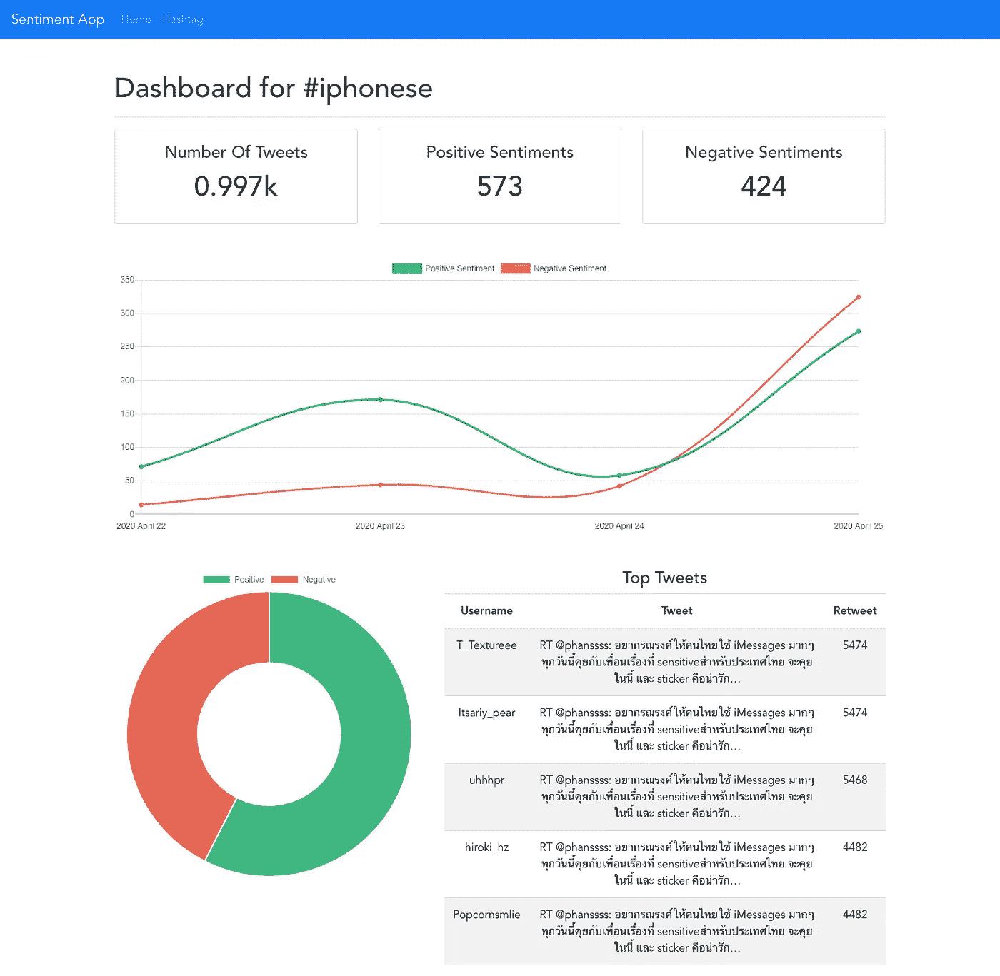

情绪分析仪表板

在仪表板中，我显示了一个标签的 tweets 数量、正面情绪和负面情绪。有一个折线图显示了每天的情绪数量。你可以在饼状图中看到观点的比例，也可以看到标签中转发量最高的推文。

本教程到此为止。希望它对我们所有人都有用。

你可以通过下面的 GitHub 链接获得我所有的源代码:

1.  [感悟-app-模型(Jupyter 笔记本)](https://github.com/DeaVenditama/sentiment-app-model)
2.  [be-情操-app](https://github.com/DeaVenditama/be-sentiment-app)
3.  [Fe-情操-app](https://github.com/DeaVenditama/fe-sentiment-app)

谢谢你，❤️❤️👍👍