# 使用 AWS lambda 和 Docker 构建 Tesseract 无服务器 API

> 原文：<https://medium.com/analytics-vidhya/build-tesseract-serverless-api-using-aws-lambda-and-docker-in-minutes-dd97a79b589b?source=collection_archive---------1----------------------->

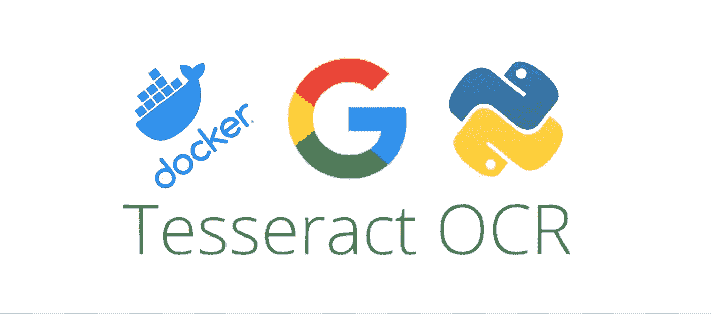

# 动机

本教程帮助使用 Docker 创建一个高度可扩展/低成本的 Tesseract 4 API 服务，并由 python 库运行。对于那些想要建立一个负担得起的演示服务(在 Web 应用程序中使用 REST API)或者想要直接转换到高度可伸缩的产品服务的人来说，这是一个很好的起点。

我将介绍如何创建一个 REST API，它将一个编码图像(和一些 Tesseract 参数)作为输入，并将结果文本作为响应返回。

## 更新:

1.  改进的 python 图层安装程序
2.  github.io 中托管的新的简单 webapp 演示(下面的链接)

*注 1:由于成本原因，演示 Api 的请求数量有限*

*注 2:我们在本教程中使用 python3.7。如果您使用不同的版本，请在 docker 文件中进行更改。*

# 1.基本要求

我们需要 AWS 帐户来访问控制台服务(我们将使用 AWS lambda & API 网关)。

所需工具:

*   Docker(用于设置你的 lambda 层)
*   饭桶
*   测试 API 的邮递员(可选)

*注:在 linux 个人电脑上测试。对于 Windows 或 MacOS，bash 脚本中可能应用的更改很少。*

# 2.设置

## 2.1.创建λ层

开始之前，小点了解一下 lambdas。对于 python environment lambda，重要的是只安装需要的东西，这将提高服务的性能并降低成本。

在这里检查λ限制。

让我们开始，准备…开始！

克隆[回购](https://github.com/amtam0/lambda-tesseract-api)

如果你想立刻安装这些层，运行下面的命令，然后进入**2.2。**进行下一步操作。

```
cd [lambda-tesseract-api/;](https://github.com/hazimora33d/lambda-tesseract-api.git) sudo bash build_all.sh
```

否则，请查看下面的详细信息。

## 2.1.1.构建宇宙魔方λ层

[bweigel](https://github.com/bweigel) 在为宇宙魔方 4.0.0 构建 lambda 层方面做了大量工作。我添加了 ***tessconfigs*** 文件夹和**。Dockerfile 文件中的 trainedata** 文件。如果你想使用一些高级的镶嵌函数(例如检测文本框…)。

在 *Dockerfile-tess4* :

*   如果您想更改第二语言语料库，请编辑#line 15(默认为 *fra* )。
*   编辑第 16 行，指定使用哪个数据文件(默认使用*标准*)。语料库越好，Ocr 结果越慢。

要构建图层，请键入以下命令(需要一些时间):

```
sudo bash buildtesseract/build_tesseract4.sh
```

## 2.1.2.构建 Python 库λ层

我们将使用 python 3.7，并将这些库安装在 lambda 层中:pytesserac/Pillow(包含)/ Opencv(可选)。

PyTesseractt 是一个 python 包装器，用于调用 tesserac 引擎。Pillow & OpenCV 可用于图像加载、处理和保存。

运行 cmd 来构建 python 层:

```
sudo bash buildpy/build_py37_pkgs.sh
```

现在你有一些 ***。压缩将出现在您的文件夹中的文件。你的 lambda 层已经可以上传到 AWS 控制台了。**

## 2.2.在 AWS lambda 控制台中上传图层

简单一步，只需进入 ***lambda >图层*** 选项卡，逐个上传 zip 包即可。下图中加载 Pytesseract 的示例

**注意**:您需要为所有层选择兼容运行时的 *Python 3.7*

*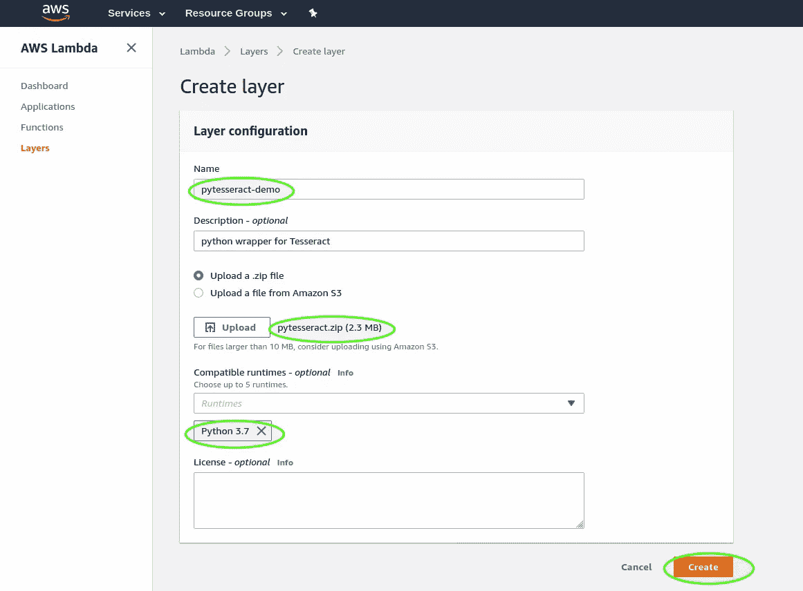*

## *2.3.创建 lambda 函数*

*转到 lambda 中的函数选项卡并创建一个新函数，详情请查看下图。*

*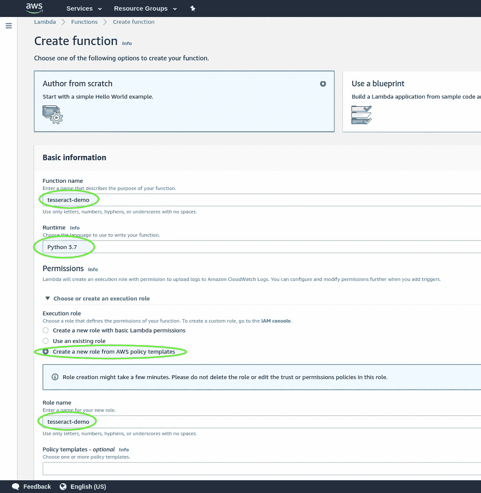*

## *2.4.设置λ函数*

*在设计器部分点击 ***图层>添加图层*** ，然后添加所有已经上传的图层并点击保存(查看下图)*

*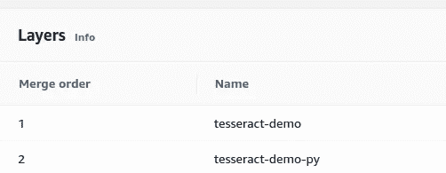*

*现在在 ***设计器的*** 部分再次点击λ名 ***【宇宙魔方】-demo*** 。就在它下面，你可以访问 ***函数代码*** ，c/p 下面的代码在 *lambda_handler 函数里面。**

*这个函数很简单，它从 json 主体中提取对象，解码/保存图像，应用 Ocr 并返回它。*

*在 ***基本设置*** *，*增加内存和超时。对于 Tesseract，内存越多，API 响应越快(需要测试)。出于安全考虑，您可以设置 1 分钟(用于包含大量文本的图像)和 500 MB(参见下图进行设置)。*

*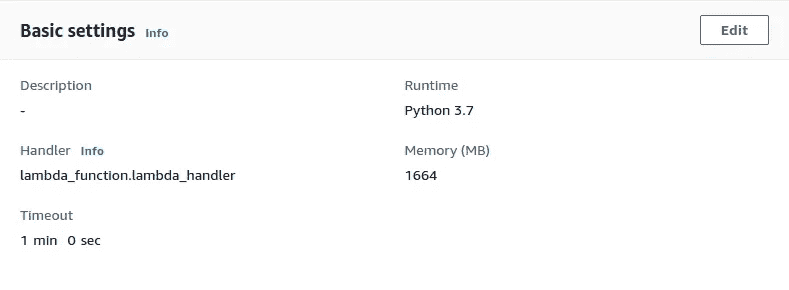*

*单击保存。是时候测试我们的 lambda 并检查一切是否正常了！*

## *2.5.测试λ函数*

*我将要测试的图像(下面的解码版本)放在一个. json 文件中，其中包含一些 Tesseract 参数。*

*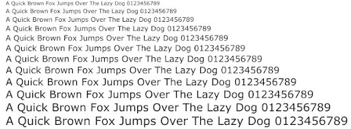*

*用于测试的图像*

*用于此 lambda 函数的输入 json 主体*

*json 主体架构包含编码的图像和 Tesseract 参数。如果你想了解更多关于宇宙魔方*参数*的信息，请查看此[链接](https://tesseract-ocr.github.io/tessdoc/ImproveQuality)。*

*现在创建一个测试事件 c/p 上面的 JSON 主体并保存，您会得到如下结果:*

*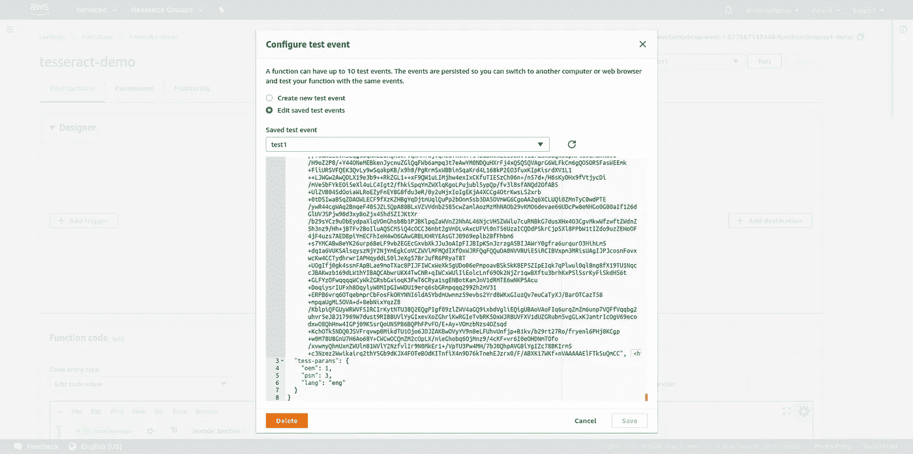*

*保存后。当您测试您的 lambda 时，响应应该是成功的。*

## *2.6.创建 API*

*创建一个 ***Rest API*** 如下所示*

*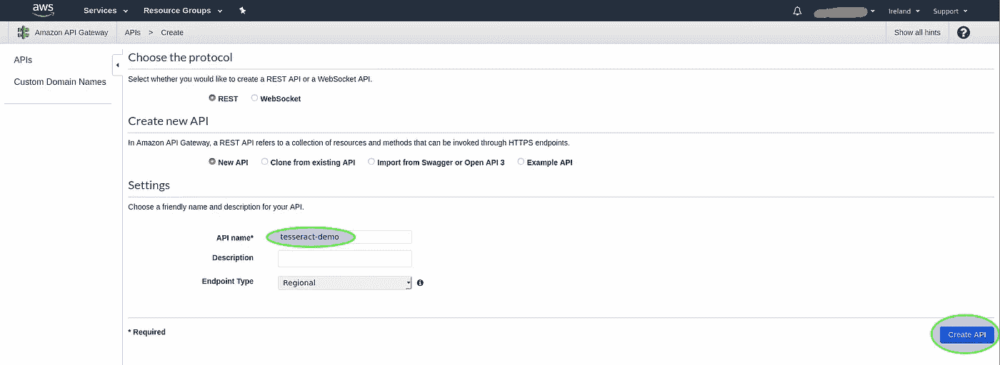*

***动作*创建方法*动作***

*指定相应的 lambda 函数。无需切换代理集成*

*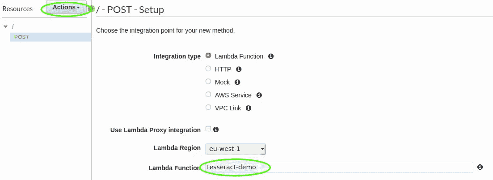*

*创建发布方法后，点击 ***动作>启用 CORS*** 启用 CORS*

## *2.7.测试 API*

*对于控制台测试:单击 POST 方法，然后单击 ***测试*** 按钮(如下所示)*

*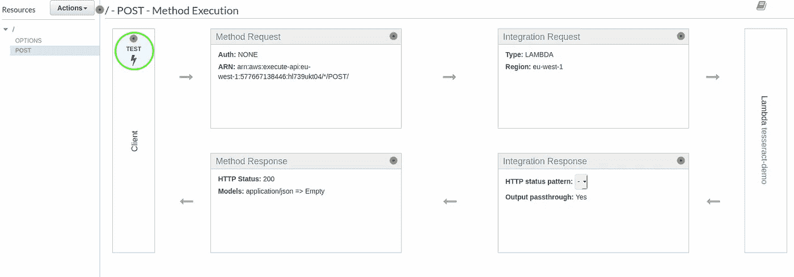*

*在请求体中添加 *json* (同样用于 lambda 测试)并点击 *Test* 。你应该得到一个 200 状态响应。*

*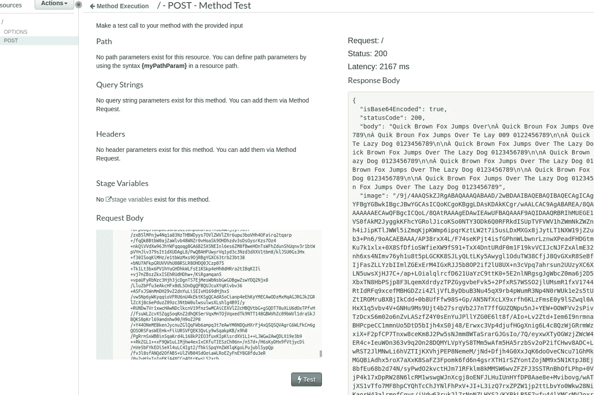*

*如果您得到与上面类似的响应，那么是时候部署您的 API 了:*

*点击 ***动作>部署*** :然后复制**调用 Url** 的链接。您也可以从 lambda 函数控制台(在 API 块中)获取 API URL。*

*打开 Postman，创建新的 POST 方法，在请求体中粘贴 URL 和 c/p json，点击发送。你应该得到一个 200 状态响应。*

## *2.8.好处:在 Web 应用程序中使用无服务器 Api*

*一个简单的无服务器 web 应用程序演示 [**这里的**](https://amtam0.github.io/lambda-tesseract-api/webapp/app.html) 展示了一切是如何工作的(代码在 [**回购**](https://github.com/amtam0/lambda-tesseract-api) )*

*搞定了。*

*不确定这是否是设置一切的最干净的方法，但它确实有效！你应该看看其他的框架，比如 ***无服务器*** ，如果你想自动化安装并使其更加模块化，这可能是一个很好的选择。但是，您可以根据自己的需要随意调整脚本和 docker 文件。如果我们可以用 ***宇宙魔方*** 来完成它，你应该可以用它来完成几乎任何类型的转换图像的任务(例如计算机视觉和/或深度学习……)。最好来！*

# *如果你喜欢这个故事，请点击👏按钮并分享，帮助其他人找到它！欢迎在下方留言评论。*

# *参考资料:*

*【Ocr 图层】[https://github.com/bweigel/aws-lambda-tesseract-layer](https://github.com/bweigel/aws-lambda-tesseract-layer)*