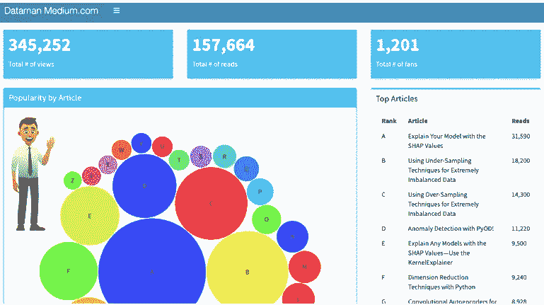

# 用 R Shiny 构建我的中型仪表板

> 原文：<https://medium.com/analytics-vidhya/build-the-medium-dashboard-with-r-shiny-618263243393?source=collection_archive---------8----------------------->

这篇文章的目的很简单:向您展示在 R shiny 中构建仪表板有多快。在一个美好的下午，在一个小时的工作时间内(我确实给我的咖啡杯加满了两次)，上面的仪表盘就完成了。你可能会问我为什么要用 medium.com 的数据？我只是觉得 medium.com 的默认仪表板可以添加一些颜色和可视化。这篇文章肯定不是 medium.com 的最终仪表板。这篇文章是…