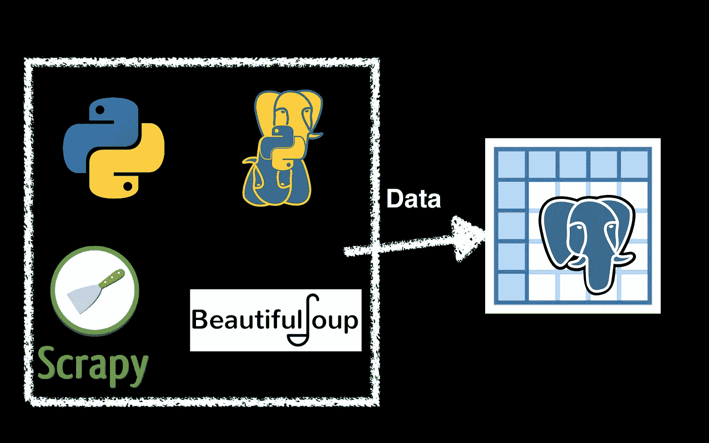

# 用 Express.js、Scrapy、PostgreSQL 和 Heroku 构建一个简单的后端——Scrapy

> 原文：<https://medium.com/analytics-vidhya/build-up-a-simple-backend-with-express-js-scrapy-postgresql-and-heroku-scrapy-8c347c7814a6?source=collection_archive---------6----------------------->

到目前为止，我们已经在 PostgreSQL 数据库中创建了一个空数据表。我们要解决的下一个挑战是将一些数据放入数据手册。有几种方法可以将数据放入数据库。在本节中，我选择使用 Python 和 Scrapy 框架来抓取数据并插入到数据表中。