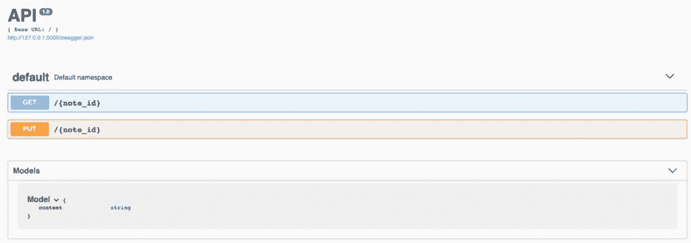

# 使用 Python 轻松构建 Web APIs

> 原文：<https://medium.com/analytics-vidhya/build-web-apis-easily-with-python-c558dd5b3ccc?source=collection_archive---------20----------------------->


照片由[克里斯里德](https://unsplash.com/@cdr6934?utm_source=unsplash&utm_medium=referral&utm_content=creditCopyText)在 [Unsplash](https://unsplash.com/s/photos/programming?utm_source=unsplash&utm_medium=referral&utm_content=creditCopyText) 拍摄

最近我一直在为不同的机器学习和计算机视觉任务开发 Web API(REST)。通过使用这种 API，我们可以在本地或云环境中快速部署新算法，这些算法可以集成到广泛的应用程序中(网站、移动应用程序、本地应用程序等)。通过简单的 API 调用，我们可以以高效和可扩展的方式执行机器学习任务，例如检测图像中的人或交通灯。

在 Python 中，我们可以通过使用两个伟大的框架轻松创建一个完整的文档化 REST API:[Flask](https://flask.readthedocs.io)和 [RESTPlus](https://flask-restplus.readthedocs.io/en/stable/) 。Flask 是一个轻量级 web 应用程序框架，旨在快速开发 web 应用程序，并允许扩展到更复杂的解决方案。只用几行代码就可以创建并启动一个简单的 Flask Web 应用程序:

```
from flask import Flaskapp = Flask(__name__)@app.route("/")
def hello(): 
  return "Hello World!"$ env FLASK_APP=hello.py flask run 
 * Serving Flask app "hello" 
 * Running on http://127.0.0.1:5000/ (Press CTRL+C to quit)
```

对 Flask 的扩展中的 RESTPlus 增加了对开发 REST APIs 的支持。它提供输入验证，自动生成文档(使用 [Swagger UI](https://swagger.io) ，以及其他有用的特性。

我们应该了解的关于 RESTPlus 的第一个构建块是*资源*。有了*资源*，我们可以在 Python 中定义当发出 HTTP 请求(比如 GET、POST 或 PUT 请求)时将被调用的函数。笔记应用程序的基本资源可以这样编码:

```
from flask import Flask, request
from flask_restplus import Resource, Api

app = Flask(__name__)
api = Api(app)

notes = {}

@api.route('/<string:note_id>')
class BasicNotes(Resource):
    def get(self, note_id):
        return {note_id: notes[note_id]}

    def put(self, note_id):
        notes[note_id] = request.json['content']
        return {note_id: notes[note_id]}

if __name__ == '__main__':
    app.run()
```

`@api.route()`定义了用于该资源的 URL。

RESTPlus 的另一个伟大特性是它内置了对使用`reqparse`进行请求数据验证的支持。下面是可以在资源函数中使用的代码片段:

```
from flask_restplus import reqparse

parser = reqparse.RequestParser()
parser.add_argument('email', required=True)
parser.add_argument('password', required=True)
data = parser.parse_args()
```

使用这个解析器还会给出更易读的错误消息。当一个参数没有通过验证时，RESTPlus 将用一个 400 Bad 请求和一条描述错误的消息来响应。

我们也可以使用`fields`模块来定义*模型*来描述请求或响应的对象的结构。以下是使用该模块的笔记应用示例:

```
from flask import Flask, request
from flask_restplus import Resource, Api, fields

app = Flask(__name__)
api = Api(app)

model = api.model('Model', {'content': fields.String})

notes = {}

@api.route('/<string:note_id>')
class BasicNotes(Resource):
    def get(self, note_id):
        return {note_id: notes[note_id]}

    @api.expect(model)
    def put(self, note_id):
        notes[note_id] = request.json['content']
        return {note_id: notes[note_id]}

if __name__ == '__main__':
    app.run(debug=True)
```

最好的部分是它自动记录 API，并且它们在 *Swagger UI* 中可见(在本例中通过访问`http://127.0.0.1:5000/`):



*原载于 2019 年 12 月 7 日【https://vitorpedro.com】[](https://vitorpedro.com/build-web-apis-easily-with-python/)**。***