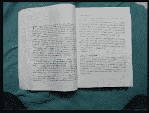
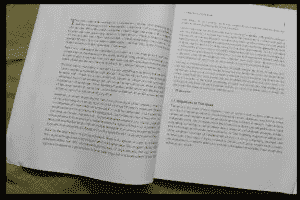

# 使用 Python 构建一个 Web 应用程序，将图像文档转换为扫描的 PDF 文档

> 原文：<https://medium.com/analytics-vidhya/build-working-web-app-for-image-documents-to-scanned-pdf-document-conversion-using-python-5badf2c1e4eb?source=collection_archive---------5----------------------->


图片鸣谢:21 壁纸:[https://d3n 32 ilufxuv D1 . cloudfront . net/5a 46 aa 90 c 9 CB eb0 b 048 db 35b/1404778/upload-70 Fe 63 fc-930d-4a D4-b79b-d75a 77084 CD 2 . jpg](https://d3n32ilufxuvd1.cloudfront.net/5a46aa90c9cbeb0b048db35b/1404778/upload-70fe63fc-930d-4ad4-b79b-d75a77084cd2.jpg)

这篇文章是关于将文本文档的多个图像转换为扫描的 PDF 文档，并使用 Python 中的 Flask 将该模型部署为 Web app。

# 为我们的项目设置虚拟环境

```
$ pip install virtualenv
```

创建虚拟环境，并将其命名为“imagetopdf”

```
$ virtualenv imagetopdf
```

激活我们的虚拟环境

```
$ source imagetopdf/bin/activate
```

移动到我们的项目文件夹“imagetopdf”并创建一个新文件夹“app”。
我们所有的文件都存放在这个目录下，路径为
"~/../imagetopdf/app/"

```
$ cd imagetopdf && mkdir app && cd app
```

现在安装所需的依赖项

```
$ pip install opencv-python
$ pip install PIL
$ pip install scikit-image
```

打开文本编辑器，创建一个名为“imagetopdf.py”的 python 文件

# 导入包

# 使用 cv2 加载图像并转换成二进制图像

用文件扩展名加载当前工作目录中的图像。jpeg，。png，。jpg
作为 cv2 数组，通常是“BGR”格式。通过从目录加载将所有图像插入列表。

**注意:** PDF 页面的构建顺序与从目录中读取图像的顺序相同。因此，名为' img_1 '，' img_2 '，…..理解图像的期望顺序。

为了更好的图像操作，将“RGB”图像转换为二进制图像。

```
img_gray=cv2.cvtColor(img,cv2.COLOR_BGR2GRAY)
```

将图像从“rgb”格式转换为“灰度”格式。

```
clahe=cv2.createCLAHE(clipLimit=4.0,tileGridSize=(16,16))
img_gray=clahe.apply(img_gray)
```

上述线条通过应用[“直方图均衡化”](https://docs.opencv.org/master/d5/daf/tutorial_py_histogram_equalization.html)来提高图像对比度

```
ret,th=cv2.threshold(img_gray,130,255,cv2.THRESH_BINARY)
thsh_images.append(th)
```

将图像阈值应用于 threshold_value=130 的灰度图像，并将二值图像存储在列表中。


# 在图像中查找轮廓并使最大面积轮廓适合图像

可能会出现只拍摄感兴趣区域的图像，即图像包含不需要的其他内容和背景，应该只缩放到单页。像下面的图像，其中包含背景和下一页的一些部分


为了从图像中只获取重要的内容，我们在 opencv 中使用轮廓提取我们感兴趣的区域。

由于我们感兴趣的区域是图像的最大区域，所以可以使用最大轮廓区域来识别它，该最大轮廓区域可以接近矩形形状。对于每幅图像，获得最大面积轮廓，这是我们的单页图像文件，并拟合图像的轮廓，就像在图像中画东西一样。

```
contours,_=cv2.findContours(img.copy(),cv2.RETR_TREE,cv2.CHAIN_APPROX_SIMPLE)
```

cv2。RETR 树方法在层次顺序和 cv2 中寻找轮廓。CHAIN_APPROX_SIMPLE 只适合描述整个轮廓的轮廓位置坐标，而不是占用更多空间的整个轮廓坐标。

```
area=cv2.contourArea(cnt)
if area > max_area:
   max_area=area
   max_ind=ind
```

检索每个轮廓的面积，并找到轮廓的最大面积，如下所示


# 绘制最接近最大轮廓的矩形形状，这通常描述一页 PDF

拟合轮廓可以是任何形状，但我们正在寻找矩形形状，这是桌面，智能手机正常屏幕的形状…

```
epsilon=0.02*cv2.arcLength(image_conts[ind[max_area_conts[ind]],True)
approx=cv2.approxPolyDP(image_conts[ind[max_area_conts[ind]],epsilon,True)
```

上面的线为我们拟合的最大面积轮廓找到最近的矩形点，如下所示


# 使用透视变换将矩形的四条边变换为图像的全坐标

我们最终得到一个矩形轮廓，这就是感兴趣的区域。现在放大或提取这个矩形形状，就像从 img1 到 img2



img1:带有不需要的背景的原始图像



img2:所有背景都在一定程度上被移除

# 使用 scikit-image 提高灰度图像对比度并保存图像

```
th=threshold_local(img_gray.copy(),101,offset=10,method=”gaussian”)
```

$ pip install guni corn
$ echo " web:guni corn-w4-b " 0 . 0 . 0 . 0:$ PORT " app:app ">procfile above scikit-image 的 threshold_local()函数增加低对比度图像非常高的对比度像下面从 img1 到 img2


img1:低对比度图像


img2:提高图像对比度

用图像的“数字化 _+原始名称”名称保存高对比度图像，这有助于查找要转换为 PDF 的图像。

# 使用 PIL 加载保存的高对比度图像并另存为 PDF

加载保存的图像前缀“数字化 _”与 PIL 图像，并保存为 PDF 文件。

# 使用 Flask 制作 Web 界面

安装烧瓶和 Werkzeug

```
$ pip install Flask
```

Flask 是一个轻量级框架，用于在 python 中构建简单的后端应用程序引擎。

烧瓶模型通常包含以下骨架。

```
from flask import Flask 

app = Flask(__name__) @app.route("/") 
def hello():     
    return "Hello World!" if __name__ == '__main__':     
    app.run(debug=True)
```

第一行从 flask 包中导入 Flask 类，
第二行用“__name__”为 Flask 类创建 app 对象，这是我们应用程序的主 url，
第三行定义了一个 decorator，它路由前缀为“/”的主 url 之后的任何名称，如 [http://home/，](http://home/,)
第四和第五行定义了一个必须为上述 decorator 执行的函数，
第七行运行我们的应用程序引擎，其中“debug=True”表示调试模式开启。
如果我们运行这个脚本，文件名保存为“app.py ”,如果没有错误，我们可以看到这样的屏幕


要测试我们的应用程序，打开浏览器并输入“localhost:5000”


现在，为了部署我们的模型，使用 HTML 对“app.py”文件进行更改，以添加从用户那里获取文件的接口

```
"index.html"<html>
    <head>
    </head>
    <body>   
        <!-- File Uploading-->  
        <form action='/uploadimages' method="POST"  
                       enctype="mutlipart/form-data>              
            <input type="file" name="files" multiple />   
            <input value="Upload">
        </form>
     </body>
</html>
```

在上面的代码片段中，在

为了处理 HTML 文件请求，我们必须将我们 HTML 文件保存在一个名为“templates”的单独文件夹中，该文件夹将由 Flask 识别，用于路由 HTML 页面。你可以添加更多的 CSS，JS，JQuery，Bootstrap 和媒体内容，如图像，视频等。，但所有这些文件必须保存在另一个名为“static”的文件夹中。

**注意:**通过添加名为“imagetopdf”的类来更改“imagetopdf.py”，该类的函数“convert()”包含了我们之前将图像转换为 pdf 的所有代码。

```
from flask import Flask,requests,render_template,send_from_directory
from imagetopdf import Imagetopdf
import osapp=Flask(__name__)@app.route('/uploadimages', methods=['POST','GET'])
def uploadimages():
    file_names=[]
    curr_path=os.getcwd() 
    files_in_dir=os.listdir()
    for file in file_names:
        if file.split('.')[-1] is in ['jpeg','png','jpg','pdf']:
            os.remove(file)
    uploaded_files=request.files.getlist("files") 
    for file in uploaded_files:  
        if file.filename.split('.')[-1] is in ['jpeg','png','jpg']:
            file.save(file.filename)
    imagetopdf_obj=imagetopdf.Imagetopdf()
    imagetopdf.convert()
    try:
        return send_from_directory(curr_path,'digitised_images.pdf',
                                             as_attachment=True)
    except Exception:
        abort(404) @app.route("/")
def index():
    render_template("index.html")if __name__ == "__main__":
    return app.run(debug=True)
```

在上面的代码片段中，我们通过添加文件请求处理例程来更改我们的“app.py”。我们首先删除任何以前的图像或 pdf 文件，然后保存上传的图像，使用我们的“imagetopdf.py”转换为 PDF。

# 使用 Heroku 免费主机部署到 web

使用命令安装 Heroku CLI

`$ sudo snap install --classic heroku`

在那之前在 [Heroku](https://www.heroku.com/) 创建一个账户

登录你的 Heroku 账户

```
$ heroku login -i
```

现在在 Heroku 中创建一个应用引擎

```
$ heroku create {name of your app}
```

转到我们的虚拟环境的项目目录“app ”,在那里我们的文件和其他子目录结构

```
app
--templates
--static
-app.py
-imagetopdf.py
```

用文本“web:guni corn-w4-b”0 . 0 . 0 . 0:$ PORT“app:app”创建一个“Procfile”。为此，首先安装“gunicorn”

```
$ pip install gunicorn
$ echo “web: gunicorn -w 4 -b “0.0.0.0:$PORT” app:app” > Procfile
```

由于我们的应用程序需要依赖项，Heroku 安装这些依赖项，如果在一个名为“requirements.txt”的单独文件中提供。使用命令“pip freeze”可以很容易地检索到这种依赖性，并将其保存到文件“requirements.txt”中

```
$ pip freeze > requirements.txt
```

**重要提示:** OpenCv 错误如
“无法导入共享库 libsm.co.6 ….”如果直接部署到 Heroku 可能会遭遇。这可以通过将“requirements.txt”文件中的
“opencv-python = = 4 . 1 . 1 . 26”改为“opencv-python-headless = = 4 . 1 . 1 . 26”来处理。这将 Opencv 使用 GPU 支持的状态更改为仅使用 CPU。

现在我们的文件结构看起来像这样

```
app
--templates
--static
-app.py
-imagetopdf.py
-Procfile
-requirements.txt
```

通过“git ”,我们可以很好地将我们的应用程序部署到 Heroku。

```
$ git init
$ heroku git:remote -a {name of your app}
$ git add . 
$ git commit -m “some message”
$ git push heroku master
```

检查 Heroku dashboard 中关于成功构建的日志。如果一切顺利，我们的应用程序现在已经部署到网络上，任何人都可以使用 URL
“https://{ nameofourapp } . heroku app . com/”来访问它

这里是我部署我的模型[https://imagetopts.herokuapp.com/imagetopdf](https://imagetopts.herokuapp.com/imagetopdf)的网站的链接(仅适用于 imagetopdf 功能)

**注意:**上传小尺寸图片，因为免费帐户可能会面临超时错误，并且
由于我们尚未订阅，从睡眠状态重新启动需要 20 秒。

也可以使用命令进行本地测试

```
$ heroku open
```

如果未启动或出现应用程序错误，请使用命令检查日志

```
$ heroku logs -t 
```

检查我的 Github 库，我添加了另外两个特性 Imagetotext 和 Imagetospeech。

 [## santhalakshminarayana/图像-pdf-文本-语音

github.com](https://github.com/santhalakshminarayana/image-to-pdf-text-speech) 

随意连接
[Linkedin](https://www.linkedin.com/in/santhalakshminarayana/)[Github](https://github.com/santhalakshminarayana)