# 使用 scikit-learn 构建您的第一个机器学习管道！

> 原文：<https://medium.com/analytics-vidhya/build-your-first-machine-learning-pipeline-using-scikit-learn-12e0889172cb?source=collection_archive---------11----------------------->

对于建立任何机器学习模型来说，拥有足够数量的数据来训练模型是非常重要的。数据通常是从各种资源中收集的，并且可能以不同的格式提供。由于这个原因，数据清洗和预处理成为机器学习项目中的关键步骤。

每当向现有数据添加新数据点时，我们都需要再次执行相同的预处理步骤，然后才能使用模型进行预测。这变成了一个乏味和耗时的过程！

另一种方法是创建一个机器学习管道，以完全相同的顺序记住完整的预处理步骤。以便每当引入任何新的数据点时，机器学习流水线执行所定义的步骤，并使用该模型来预测目标变量。

这正是我们将在本文中涵盖的内容——设计一个机器学习管道，并自动化迭代处理步骤。

# 理解问题陈述

为了使文章更直观，我们将学习所有的概念，同时处理真实世界的数据— [BigMart 销售预测](https://datahack.analyticsvidhya.com/contest/practice-problem-big-mart-sales-iii/)。

作为这个问题的一部分，我们被提供了关于商店(位置、大小等)、产品(重量、类别、价格等)和历史销售数据的信息。利用这些信息，我们必须预测商店中产品的销售情况。

你可以在这里阅读详细的问题陈述并从[下载数据集。以下是该数据中的完整特征集。这里的目标变量是 *Item_Outlet_Sales* 。](https://datahack.analyticsvidhya.com/contest/practice-problem-big-mart-sales-iii/)

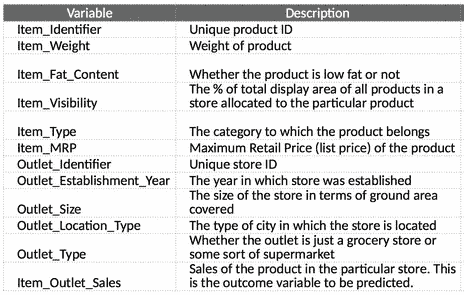

我鼓励您在进入下一部分之前浏览一遍问题陈述和数据描述，以便对数据中的特性有一个合理的理解。

# 构建原型模型

要建立一个机器学习管道，第一个要求是定义管道的结构。换句话说，我们必须列出进入机器学习管道的确切步骤。

为了做到这一点，在创建管道之前，我们将在现有数据上构建一个原型模型。构建原型背后的主要思想是在模型构建过程之前理解数据和必要的预处理步骤。基于我们对原型模型的学习，我们将设计一个涵盖所有必要预处理步骤的机器学习管道。

这一部分的重点是构建一个原型，它将帮助我们为销售预测项目定义实际的机器学习流水线。我们开始吧！

# 数据探索和预处理

当您获得数据集时，您做的第一件事是什么？您将探索数据，检查各个变量，并清理数据，为模型构建过程做好准备。

这正是我们在这里要做的。我们将研究这些变量，并找出给定数据所需的强制性预处理步骤。让我们从检查数据中是否有缺失值开始。我们将使用 *isnull()。这里的 sum()* 函数

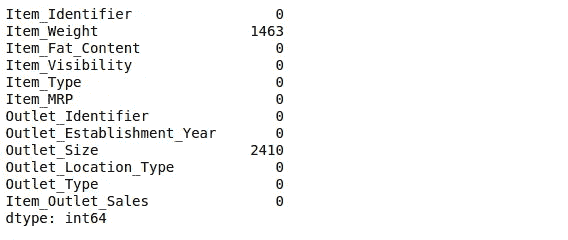

只有两个变量有缺失值— ***Item_Weight*** 和 ***Outlet_Size*** 。

由于 *Item_Weight* 是一个连续变量，我们可以使用均值或中值来估算缺失值。另一方面， *Outlet_Size* 是一个分类变量，因此我们将用列的模式替换缺失的值。您也可以尝试不同的方法来估算缺失值。

你以前建立过机器学习模型吗？如果是，那么您应该知道大多数 ML 模型不能自己处理缺失值。因此，输入缺失值成为必要的预处理步骤。

此外，ML 模型也不能处理分类(字符串)数据，特别是 scikit-learn。在建立机器学习模型之前，我们需要将分类变量转换为数字类型。让我们这样做吧。

## 对分类变量进行编码

要检查数据中的分类变量，可以使用 *train_data.dtypes()* 函数。这将为您提供每个变量的数据类型列表。对于 BigMart 销售数据，我们有以下分类变量-

*   Item _ Fat _ 内容
*   项目类型，出口标识
*   插座尺寸、插座位置类型和
*   出口类型

有许多方法可以将这些类别转换成数值。你可以在这篇文章中读到同样的内容— [处理分类变量的简单方法](https://www.analyticsvidhya.com/blog/2015/11/easy-methods-deal-categorical-variables-predictive-modeling/)。我们将使用*categorial _ encoders*库来将变量转换成二进制列。

*注意，在这个例子中，我不打算对 Item_Identifier 进行编码，因为这会将特征的数量增加到 1500。这个特性可以用在其他方面(* [*此处读*](https://www.analyticsvidhya.com/blog/2016/02/bigmart-sales-solution-top-20/) *)，但是为了保持模型简单，我在这里就不使用这个特性了。*

## 缩放数据:

到目前为止，我们已经处理了数据中缺失的值和分类(字符串)变量。接下来我们将处理连续变量。数据中的连续变量通常具有不同的范围，例如，一个变量 V1 的范围可以从 0 到 1，而另一个变量的范围可以从 0 到 1000。

根据您正在构建的模型类型，您必须以所有变量的范围几乎相似的方式对数据进行规范化。在 python 中，使用 *StandardScaler* 函数可以很容易地做到这一点。

# 模型结构

现在我们已经完成了基本的预处理步骤，我们可以继续在这些数据上建立简单的机器学习模型。这里我们将尝试两种模型—线性回归和随机森林回归来预测销售额。

为了比较模型的性能，我们将创建一个验证集(或测试集)。这里，我使用 *train_test_split()* 函数将数据随机分成两部分，这样验证集拥有 25%的数据点，而训练集拥有 75%

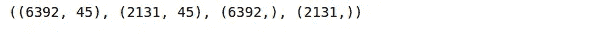

很好，我们已经准备好了训练和验证集。让我们根据这些数据训练一个线性回归模型，并在验证集上检查它的性能。为了检查模型性能，我们使用 [RMSE 作为评估指标](https://www.analyticsvidhya.com/blog/2019/08/11-important-model-evaluation-error-metrics/)。

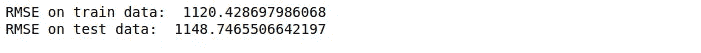

线性回归模型在训练和验证数据上都具有非常高的 RMSE 值。让我们看看基于树的模型在这种情况下是否表现得更好。在这里，我们将训练一个随机森林，并检查我们是否在训练和验证错误方面有所改进。

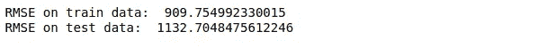

如你所见，RMSE 值有了显著的提高。您可以训练更复杂的模型，如梯度增强和 XGBoost，并进一步提高 RMSE 值的 see。

随机森林算法的一个非常有趣的特性是，它为数据中的所有变量提供了'*特性重要性'*。让我们看看如何利用这个属性使我们的模型更简单更好！

# 特征重要性

在预处理和编码步骤之后，我们总共有 45 个特征，但并不是所有这些特征都有助于销售预测。或者，我们可以选择前 5 名或前 7 名特征，它们在预测销售价值方面做出了重大贡献。

如果在两种情况下模型性能相似，即使用 45 个特征和使用 5–7 个特征，那么我们应该只使用前 7 个特征，以保持模型更简单和有效。

> *我们的想法是在不影响整体模型性能的情况下简化模型。*

下面是绘制随机森林模型的 n 个最重要特征的代码片段。

查看[要点](https://gist.github.com/lakshay-arora/e6dcf58cb27296067e1a46f50cfda984)上的代码。

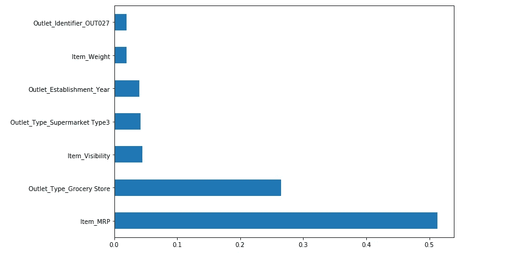

现在，我们将仅使用这 7 个特征来训练相同的随机森林模型，并观察训练和验证集的 RMSE 值的变化。

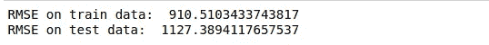

现在，这太神奇了！仅使用 7 个特性就可以获得与之前使用 45 个特性的模型几乎相同的性能。让我们确定我们需要的最终特性集，以及每个特性的预处理步骤。

# 识别构建 ML 管道的特征

正如最初所讨论的，设计机器学习流水线最重要的部分是定义它的结构，我们就快做到了！

我们现在已经熟悉了数据，我们已经执行了所需的预处理步骤，并在数据上建立了机器学习模型。在这一阶段，我们必须列出机器学习管道中要使用的最终特征集和必要的预处理步骤(针对每一个)。

## 选定的功能和预处理步骤

1.  **Item_MRP:** 它保存产品的价格。在预处理步骤中，我们使用标准的定标器来定标这些值。
2.  **Outlet _ Type _ 杂货店:**一个二进制列，表示 Outlet 类型是否为杂货店。为了在模型构建过程中使用这些信息，我们将在现有数据中添加一个包含 1(如果商店类型是杂货店)和 0(如果商店类型是其他类型)的二进制要素。
3.  **Item_Visibility:** 表示产品在商店中的可见性。因为这个变量的取值范围很小并且没有丢失值，所以我们没有对这个变量应用任何预处理步骤。
4.  **奥特莱斯 _ 类型 _ 超市 _ 类型 3:** 另一个二进制列，指示奥特莱斯类型是否为“超市 _ 类型 _3”。为了获取这些信息，我们将创建存储 1(如果商店类型是 supermarket_type_3)和 0(否则)的二元特征。
5.  **Outlet _ Identifier _ OUT027:**该功能指定插座标识符是否为“out 027”。与上一个示例类似，我们将创建一个单独的列，其中包含 1(如果出口类型是杂货店)和 0(否则)。
6.  **奥特莱斯 _ 成立 _ 年份:***奥特莱斯 _ 成立 _ 年份*描述店铺成立的年份。因为我们没有对这个列中的值执行任何转换，所以我们也不会在管道中对它进行预处理。
7.  **Item_Weight:** 在预处理步骤中，我们发现 *Item_Weight* 有缺失值。这些缺失值使用列的平均值进行估算。在构建机器学习管道时，必须考虑到这一点。

除了这 7 列之外，我们将删除其余的列，因为我们不会使用它们来定型模型。让我们继续设计我们的 ML 管道吧！

# 管道设计

在上一节中，我们构建了一个原型来理解数据的预处理需求。现在是时候根据我们从上一节学到的知识来形成管道设计了。我们将分三个阶段定义我们的渠道:

1.  创建所需的二进制特征
2.  执行所需的数据预处理和转换
3.  建立一个模型来预测销售额

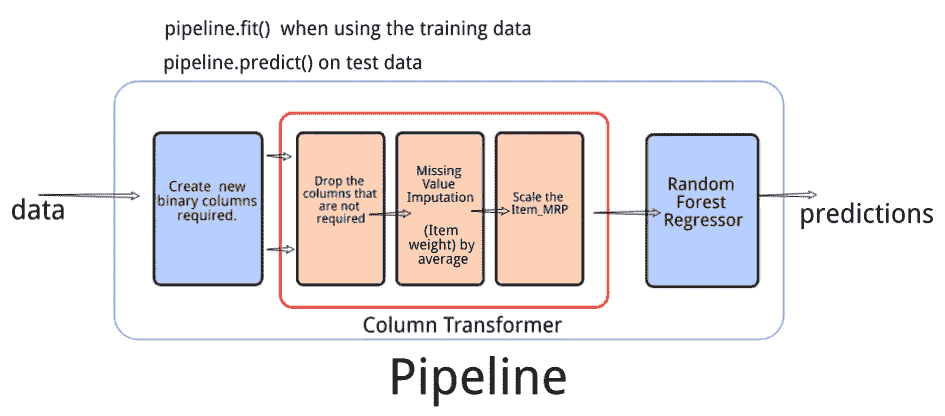

## 1.创建所需的二进制特征

我们将创建一个自定义转换器，向现有数据添加 3 个新的二进制列。

*   奥特莱斯 _ 类型:杂货店
*   Outlet_Type:超市类型 3
*   Outlet_Identifier_OUT027

## 2.数据预处理和转换。

我们将使用一个 *ColumnTransformer* 来完成所需的转换。它将包含 3 个步骤。

1.  删除模型定型不需要的列
2.  使用平均值估算列 *Item_Weight* 中的缺失值
3.  使用 *StandardScaler()* 缩放列 *Item_MRP*

## 3.使用模型来预测清理数据上的目标

这将是管道中的最后一步。在最后两步中，我们对数据进行了预处理，为模型构建过程做好了准备。最后，我们将使用这些数据并建立一个机器学习模型来预测*项目 Outlet 销售*。

让我们对 BigMart 销售数据的每一步进行编码。

# 建筑管道

首先，我们将读取数据集，并从训练数据集中分离出自变量和目标变量。你可以从[这里](https://datahack.analyticsvidhya.com/contest/practice-problem-big-mart-sales-iii/)下载数据集。

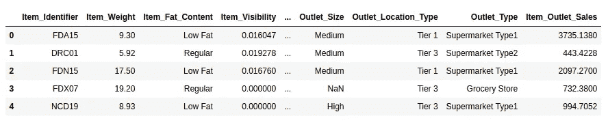

现在，作为第一步，我们需要使用自定义转换器创建 3 个新的二进制列。下面是我们创建定制转换器需要遵循的步骤。

1.  定义一个类 **OutletTypeEncoder**
2.  定义类时添加参数 **BaseEstimator**
3.  该类必须包含拟合和转换方法

在转换方法中，我们将在 ML 管道的第一阶段之后定义我们想要的所有 3 列。

接下来，我们将定义模型构建过程之前所需的预处理步骤。

1.  删除列— **项目 _ 标识符**、**网点 _ 标识符**、**项目 _ 脂肪 _ 含量、项目 _ 类型、网点 _ 标识符、网点 _ 大小、网点 _ 位置 _ 类型**和**网点 _ 建立 _ 年份**
2.  用平均值估算列 **Item_Weight** 中的缺失值
3.  使用 S *tandardScaler()* 缩放列 **Item_MRP** 。

这将是我们机器学习管道的第二步。在这一步之后，数据就可以被模型用来进行预测了。

# 预测目标

这将是机器学习流水线的最后一块——为流水线对象按顺序 定义步骤 ***！正如您在下面的代码中看到的，我们指定了三个步骤—创建二进制列、预处理数据、训练模型。***

当我们对管道对象使用 *fit* ()函数时，这三个步骤都会被执行。在模型训练过程之后，我们使用 *predict()* 函数，该函数使用经过训练的模型来生成预测。

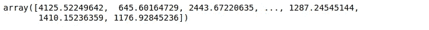

现在，我们将读取测试数据集，并且我们只在管道对象上调用预测函数来对测试数据进行预测。

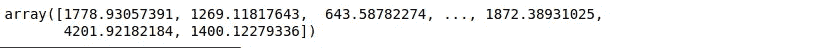

# 实时编码窗口

请前往[页面](https://www.analyticsvidhya.com/blog/2020/01/build-your-first-machine-learning-pipeline-using-scikit-learn/?utm_source=av&utm_medium=feed-articles&utm_campaign=feed)尝试现场编码窗口。

# 结束注释

在执行任何任务之前有一个定义良好的结构通常有助于任务的有效执行。即使在建立机器学习模型的情况下也是如此。一旦你在数据集上建立了一个模型，你就可以很容易地分解这些步骤，并定义一个结构化的机器学习管道。

在本文中，我介绍了构建端到端机器学习管道的过程，并在 BigMart 销售数据集上实现了相同的过程。如果你有更多的想法或反馈，欢迎在下面的评论区联系我。

*原载于 2020 年 1 月 28 日 https://www.analyticsvidhya.com***。**