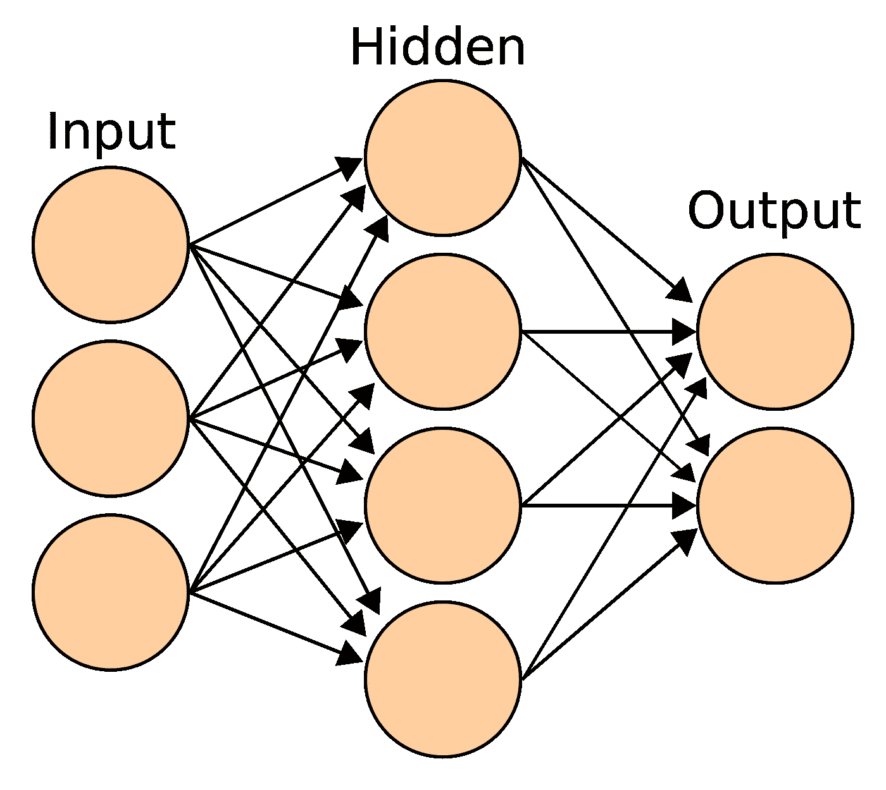
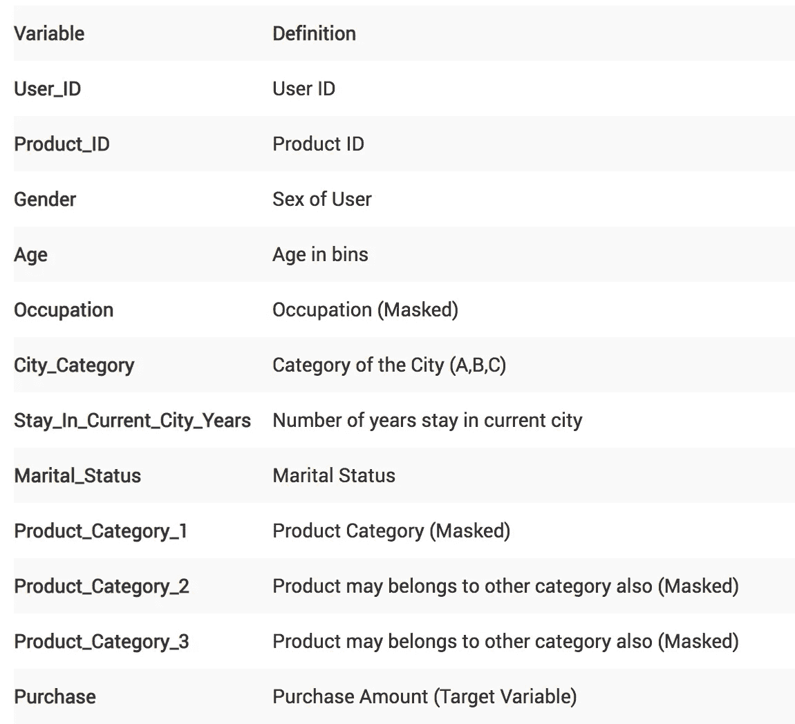
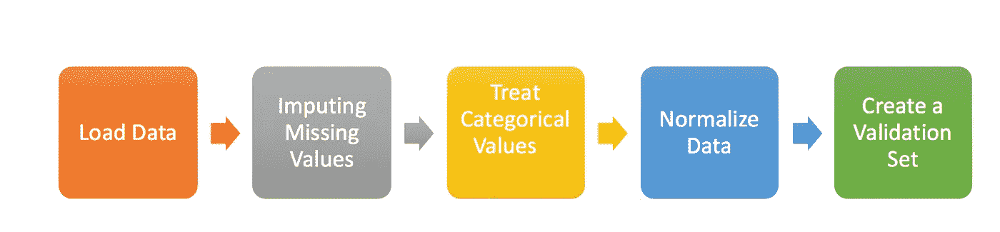
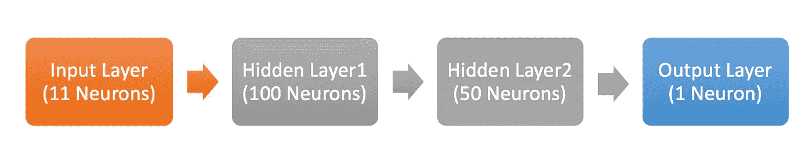
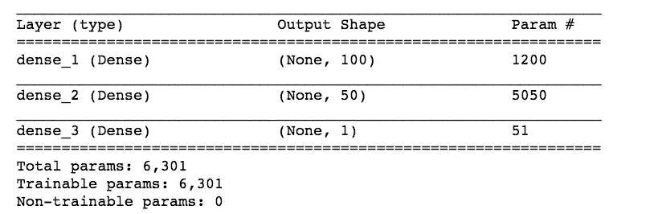
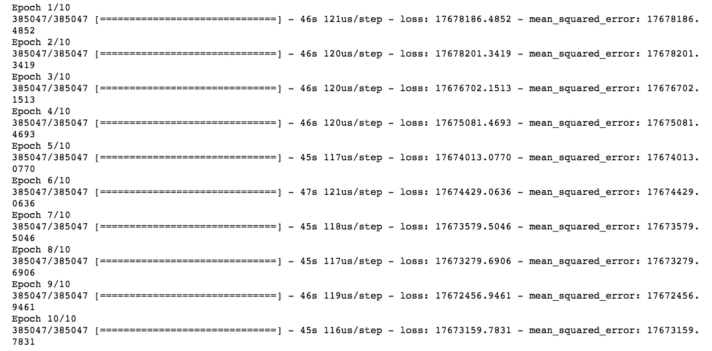

# 在结构化数据集上构建第一个神经网络(使用 Keras)

> 原文：<https://medium.com/analytics-vidhya/build-your-first-neural-network-model-on-a-structured-dataset-using-keras-d9e7de5c6724?source=collection_archive---------0----------------------->

# **简介**

你曾经在结构化数据集上应用过[神经网络](https://courses.analyticsvidhya.com/courses/computer-vision-using-deep-learning-version2?utm_source=medium&utm_medium=FirstNeuralNetworkOnStructuredData)模型吗？如果答案是否定的，以下哪些原因适用于您？

1.  应用起来非常复杂
2.  神经网络适用于图像、音频和文本等非结构化数据集，但不适用于结构化数据集
3.  这不像使用 scikit-learn/caret 构建模型那么简单
4.  训练时间太长
5.  需要高计算能力

在本文中，我将重点介绍前三个原因，并展示如何使用流行的高级库“keras”轻松地将神经网络模型应用于结构化数据集。



# **理解问题陈述**

在本文中，我们将处理[黑色星期五](https://datahack.analyticsvidhya.com/contest/black-friday/)数据集。这是一个回归挑战，我们需要预测客户对各种产品的购买量。我们已经获得了有关客户人口统计(年龄、性别、婚姻状况、城市类型、当前居住城市)和产品详细信息(产品 id 和产品类别)的各种信息。下面是数据字典:



这项挑战的评估标准是均方根误差(RMSE)。

# **先决条件**

在本文中，我将使用 scikit-learn 的随机森林(RF)模型和 keras 的基本神经网络(NN)模型来解决这个黑色星期五挑战。本文的想法是展示我们可以多么容易地在结构化数据集上构建 NN 模型(它类似于使用 scikit-learn 库构建 RF 模型)。本文假设您具有构建机器学习模型、scikit-learn 和神经网络基础知识的良好背景。如果您对这些概念不太熟悉，我建议您先阅读下面的文章:

1.  [简介-深度学习-基础-神经网络](https://www.analyticsvidhya.com/blog/2016/03/introduction-deep-learning-fundamentals-neural-networks/)
2.  [用 python 从零开始理解和编码神经网络](/analytics-vidhya/understanding-and-coding-neural-networks-from-scratch-in-python-and-r-b8c760f0ad1c)
3.  [常见的机器学习算法](https://www.analyticsvidhya.com/blog/2017/09/common-machine-learning-algorithms/)

# **利用机器(深度)学习解决问题的方法**

我将把我的方法大致分为四个部分:

1.  数据准备
2.  模型构建(随机森林和神经网络)
3.  估价
4.  预言；预测；预告

## **数据准备**

在这一节中，我将重点介绍基本的数据准备步骤，如加载数据集、输入缺失值、处理分类变量、规范化数据和创建验证集。对于随机森林和我们的神经网络模型，我将遵循相同的步骤。



*   **加载数据:**在这里，我将导入必要的库来加载数据集，将训练和测试结合在一起执行预处理，并为其创建一个标志。

```
#Importing Libraries for data preparation
import pandas as pd
import numpy as np#Read Necessary files
train = pd.read_csv("train_black_friday.csv")
test = pd.read_csv("test_black_friday.csv")#Combined both Train and Test Data set to do preprocessing together # and set flag for both as well
train['Type'] = 'Train' 
test['Type'] = 'Test'
fullData = pd.concat([train,test],axis=0)
```

*   **估算缺失值:**处理分类变量和连续变量缺失值的方法会有所不同。
    因此，我们的第一步是识别 ID 列、目标变量、分类变量和连续自变量。
    发布此消息后，我们将为缺失值创建虚拟标志。为什么要这么做？因为有时缺失值本身可以携带大量信息。最后，我们将使用该列的平均值估算连续变量的缺失值，对于分类变量，我们将创建一个新的级别。

```
#Identifying ID, Categorical
ID_col = ['User_ID','Product_ID']
flag_col= ['Type']
target_col = ["Purchase"]
cat_cols= ['Gender','Age','City_Category','Stay_In_Current_City_Years']
num_cols= list(set(list(fullData.columns))-set(cat_cols)-set(ID_col)-set(target_col)-set(flag_col))# Combined numerical and Categorical variables
num_cat_cols = num_cols+cat_cols#Create a new variable for each variable having missing value with VariableName_NA 
# and flag missing value with 1 and other with 0for var in num_cat_cols:
    if fullData[var].isnull().any()==True:
        fullData[var+'_NA']=fullData[var].isnull()*1#Impute numerical missing values with mean
fullData[num_cols] = fullData[num_cols].fillna(fullData[num_cols].mean())#Impute categorical missing values with -9999
fullData[cat_cols] = fullData[cat_cols].fillna(value = -9999)
```

*   **处理分类值:**我们将为分类变量创建一个标签编码器。

```
#create label encoders for categorical features
from sklearn.preprocessing import LabelEncoderfor var in cat_cols:
    number = LabelEncoder()
    fullData[var] = number.fit_transform(fullData[var].astype('str'))
```

*   **归一化数据:**在 0 和 1 之间缩放(归一化)自变量。这将有助于我们相对更快地收敛。

```
features = list(set(list(fullData.columns))-set(ID_col)-set(target_col))
fullData[features] = fullData[features]/fullData[features].max()
```

*   **创建一个验证集:**这里，我们将从完整的数据集中分离出训练测试，并从特性列表中删除训练测试标志。在构建我们的模型时，我们只有训练数据集的目标值，因此我们将从这个训练数据集创建一个验证集来评估模型的性能。这里，我使用 *train_test_split* 以 70:30 的比例划分训练和验证中的训练数据集。

```
#Creata a validation set
from sklearn.model_selection import train_test_splittrain=fullData[fullData['Type']==1]
test=fullData[fullData['Type']==0]
features=list(set(list(fullData.columns))-set(ID_col)-set(target_col)-set(flag_col))X = train[features].values
y = train[target_col].valuesX_train, X_valid, y_train, y_valid = train_test_split(X, y, test_size=0.30, random_state=42)
```

## **使用随机森林建立模型**

这一部分相当简单，我以前也多次写过。如果你还想回顾随机森林算法及其参数，我会推荐你浏览这篇文章:[基于树的算法教程](https://www.analyticsvidhya.com/blog/2016/04/complete-tutorial-tree-based-modeling-scratch-in-python/)。

```
#import necessary libraries to build modelimport random
from sklearn.ensemble import RandomForestRegressorrandom.seed(42)
rf = RandomForestRegressor(n_estimators=10)
rf.fit(X_train, y_train)
```

## 使用深度学习模型(Keras)建立模型

在这里，我将重点介绍构建基本深度学习模型的步骤。这将有助于初学者将来创建自己的模型。做到这一点的步骤是:


*   **定义模型:**为了建立深度学习模型，我们需要定义层(输入、隐藏和输出)。这里，我们将继续使用顺序模型，这意味着我们将按顺序定义层。此外，我们将继续建设一个完全连接的网络。
    **1。**首先，我们将关注定义输入层的**。这可以在用*输入尺寸*参数创建第一层时指定，并将其设置为 11 个独立变量的 11。
    **2。**接下来，**定义隐藏层的数量**以及神经元和激活函数的数量。通过多次迭代可以获得正确的数字。数字越大，模型越复杂。首先，我简单地使用了两个隐藏层。一个有 100 个神经元，另一个有 50 个，具有相同的激活功能——“relu”。
    **3。**最后我们需要**用 1 个神经元定义输出层**来预测购买量。手头的问题是回归挑战，因此我们可以在输出层进行线性转换。所以不需要提什么激活函数(默认是线性的)。**

```
# Define model
model = Sequential()
model.add(Dense(100, input_dim=11, activation= "relu"))
model.add(Dense(50, activation= "relu"))
model.add(Dense(1))
model.summary() #Print model Summary
```

********

*   ****编译模型:**在这个阶段，我们将配置模型进行训练。我们将设置优化器来改变权重和偏差，以及损失函数和度量来评估模型的性能。这里，我们将使用“adam”作为优化器，“均方差”作为损失度量。根据我们正在解决的问题的类型，我们可以改变我们的损失和指标。对于二元分类，我们使用“二元交叉熵”作为损失函数。**

```
# Compile model
model.compile(loss= "mean_squared_error" , optimizer="adam", metrics=["mean_squared_error"])
```

*   ****拟合模型:**现在，模型构建的最后一步是在训练数据集(实际上是整个数据集的 70%)上拟合模型。我们需要提供自变量和因变量以及训练迭代的次数，即时期。这里，我们取了 10 个纪元。**

```
# Fit Model
model.fit(X_train, y_train, epochs=10)
```

****

## ****评估****

**现在我们已经使用随机森林和神经网络技术构建了模型，下一步是评估这两个模型在验证数据集上的性能。**

*   ****随机森林模型评估:**我们将获得验证数据集的预测，并使用实际目标值(y_valid)进行评估。我们得到均方根误差约为 3106。**

```
from sklearn.metrics import mean_squared_error
pred=rf.predict(X_valid)
score = np.sqrt(mean_squared_error(y_valid,pred))
print (score)
3106.5008973291074# Evaluation while fitting the model
model.fit(X_train, y_train, epochs=10, validation_data=(X_valid, y_valid))
```

*   ****神经网络模型评估:**同样，我们将使用神经网络模型获得验证数据集的预测，并计算均方根误差。RMSE 用一个基本的神经网络模型出来是~4214。这是一个相当基本的模型，你可以继续调整超参数，以建立一个更复杂的网络。*在拟合神经网络模型时，您可以将验证数据作为参数传递，也可以在每个时期后查看验证分数。***

```
pred= model.predict(X_valid)
score = np.sqrt(mean_squared_error(y_valid,pred))
print (score)
4213.954523194906
```

## **预言；预测；预告**

**在评估模型并最终确定模型参数后，我们可以继续对测试数据进行预测。下面是使用随机森林和神经网络模型来实现这一点的代码。**

```
#Select the independent variables for test dataset
X_test = test[features].values#Prediction using Random Forest 
y_test_rf = rf.predict(X_test)#Prediction using Neural Network
y_test_nn = model.predict(X_test)
```

# ****接下来是什么****

**本文的目的是展示在结构化数据集上构建神经网络模型是多么容易，因此我们没有关注改善模型预测的其他方面。下面是我的想法列表，你可以应用它们来构建神经网络:**

*   **查看变量与变量的关系后，估算缺失值**
*   **特征工程(产品 id 可能包含一些关于购买金额的信息)**
*   **选择正确的超参数**
*   **通过添加更多隐藏层来构建更复杂的网络**
*   **使用正则化**
*   **训练更多次数的纪元**
*   **用神经网络模型对两种 RF 进行集成**

****总结****

**在本文中，我们讨论了模型构建的不同阶段，如数据准备、模型构建、评估和最终预测。我们还研究了如何使用 keras 在结构化数据集上应用神经网络模型。**

**我们进一步了解了 keras 中模型构建的不同步骤，如定义、编译和拟合模型。一个简单的神经网络模型的性能令人印象深刻，我们可以在将它变成一个更复杂的网络后对其进行改进。在下一篇文章中，我们将看看如何在时间序列挑战中应用 RNN 模型。**

**如果你有任何问题或建议，请在下面的评论区联系我。**